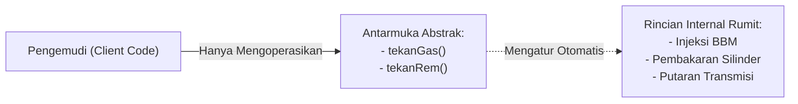

# Minggu 7: Abstraction (Abstract Class, Interface & Backed Enum) di PHP 8+

## 🎯 Capaian Pembelajaran (Sub-CPMK 3)
Setelah menyelesaikan materi pada bab ini, mahasiswa diharapkan mampu:
1. Memahami filosofi fundamental **Abstraction (Abstraksi)** sebagai pilar ke-4 OOP, konsep *Separation of Interface and Implementation*, serta *Design by Contract (DbC)*.
2. Mendeklarasikan dan menerapkan **Abstract Class** serta **Abstract Method** menggunakan kata kunci `abstract` dan merancang pola *Template Method Pattern*.
3. Merancang kontrak antarmuka murni menggunakan **Interface**, kata kunci `implements`, serta pewarisan antar-interface (**Interface Inheritance**).
4. Mengimplementasikan **Multiple Interfaces** pada sebuah Class untuk mengatasi keterbatasan pewarisan tunggal.
5. Membedakan secara tajam kapan harus menggunakan **Abstract Class (IS-A)** vs **Interface (CAN-DO)** dalam arsitektur perangkat lunak skala enterprise.
6. Mengintegrasikan fitur modern **Backed Enum (PHP 8.1+)** dengan method fungsional dan *pattern matching* (`match`) untuk manajemen status yang *type-safe*.

> [!TIP]
> 📽️ **Slide Presentasi Perkuliahan:** Anda dapat melihat dan memutar [Slide Interaktif Pertemuan 7 PHP](/presentasi/pertemuan-7-php) atau [Buka Layar Penuh (Tab Baru)](/Perkuliahan/presentasi/pertemuan-7-interface-abstract-php.html){target="_blank"}.

---

## 1. Filosofi dan Fondasi Teoretis Abstraksi



### A. Hakikat Abstraksi dalam Komputasi
Dalam rekayasa perangkat lunak, **Abstraksi (Abstraction)** adalah proses menyederhanakan kompleksitas sistem dengan hanya menampilkan karakteristik dan antarmuka penting kepada dunia luar, seraya menyembunyikan mekanisme teknis internal yang rumit.

Sebagai analogi dunia nyata, ketika seseorang mengemudikan mobil, ia hanya perlu memahami cara menginjak pedal gas, pedal rem, dan memutar roda kemudi. Pengemudi tidak perlu mengetahui secara mikroskopis rasio kompresi bahan bakar di dalam ruang silinder atau perpindahan fluida transmisi hidrolik. Antarmuka pedal menyederhanakan kompleksitas mesin tersebut.

Dalam bahasa PHP modern, pilar abstraksi diwujudkan melalui dua konstruksi utama:
1. **Abstract Class** $\rightarrow$ Kerangka dasar setengah jadi untuk hierarki keluarga erat (*IS-A*).
2. **Interface** $\rightarrow$ Kontrak perilaku murni untuk kemampuan lintas modul (*CAN-DO*).

---

## 2. Abstract Class & Template Method Pattern

**Abstract Class** adalah class induk yang **tidak dapat diinstansiasi langsung** menggunakan operator `new`. Class ini memuat gabungan antara:
- **Concrete Method:** Method yang sudah memiliki kode fungsional teruji yang diwariskan ke semua anak.
- **Abstract Method:** Method tanpa kurung kurawal `{}` yang **wajib** dibuatkan implementasinya oleh subclass turunan.

### A. Pola Desain Template Method Pattern:
Pola ini mengunci alur kerja utama (*master workflow*) pada parent class menggunakan kata kunci `final`, sementara langkah-langkah detailnya diserahkan kepada subclass melalui `abstract method`:

```php
<?php
declare(strict_types=1);

namespace App\Laporan;

// Abstract Superclass
abstract class TemplateLaporanAkademik
{
    public function __construct(
        protected string $judulLaporan,
        protected string $semester
    ) {}

    // 1. Concrete Method: Kop Surat Standar Universitas
    public function cetakKopSurat(): void
    {
        echo "========================================================\n";
        echo "UNIVERSITAS UBUDIYAH INDONESIA\n";
        echo "FAKULTAS SAINS DAN TEKNOLOGI - PROGRAM STUDI INFORMATIKA\n";
        echo "Judul Laporan : {$this->judulLaporan}\n";
        echo "Semester      : {$this->semester}\n";
        echo "Tanggal Cetak : " . date('d F Y') . "\n";
        echo "--------------------------------------------------------\n";
    }

    // 2. Abstract Methods: Wajib disediakan oleh subclass
    abstract protected function ambilSumberData(): array;
    abstract protected function susunBadanLaporan(array $data): string;
    abstract public function exportFormat(): string;

    // 3. Template Method (Final): Alur kerja utama terkunci aman
    final public function generateDokumen(): void
    {
        $this->cetakKopSurat();
        $data = $this->ambilSumberData();
        $konten = $this->susunBadanLaporan($data);
        echo $konten . "\n";
        echo "Format Keluaran: " . $this->exportFormat() . "\n";
        echo "========================================================\n";
    }
}

// Subclass Konkrit: Laporan Indeks Prestasi Mahasiswa
class LaporanIpMahasiswa extends TemplateLaporanAkademik
{
    protected function ambilSumberData(): array
    {
        return [
            ['nim' => '240101', 'nama' => 'Cut Meurah Intan', 'ipk' => 3.92],
            ['nim' => '240102', 'nama' => 'Teuku Rayhan', 'ipk' => 3.85]
        ];
    }

    protected function susunBadanLaporan(array $data): string
    {
        $out = "REKAPITULASI IPK MAHASISWA:\n";
        foreach ($data as $mhs) {
            $out .= sprintf("• [%s] %-20s : IPK %.2f\n", $mhs['nim'], $mhs['nama'], $mhs['ipk']);
        }
        return $out;
    }

    public function exportFormat(): string
    {
        return "Dokumen Portabel (PDF A4 Landscape)";
    }
}

// Eksekusi
$lap = new LaporanIpMahasiswa("Laporan Prestasi Akademik", "Ganjil 2024/2025");
$lap->generateDokumen();
```

---

## 3. Interface: Kontrak Murni Perilaku (*CAN-DO*)

**Interface** adalah kontrak murni tanpa properti data dan tanpa implementasi method. Seluruh method yang dideklarasikan di dalam interface otomatis bersifat `public abstract`.

### A. Deklarasi Interface & Multiple Implementation:
```php
<?php
declare(strict_types=1);

namespace App\Kontrak;

interface ExportablePdfInterface
{
    public function renderPdf(): string;
}

interface KirimEmailInterface
{
    public function kirimEmail(string $alamatTujuan): bool;
}

interface AuditLoggableInterface
{
    public function catatAktivitas(string $pesan): void;
}

// Class ini mengimplementasikan 3 Interface sekaligus:
class BerkasTranskripNilai implements ExportablePdfInterface, KirimEmailInterface, AuditLoggableInterface
{
    public function __construct(
        public readonly string $nim,
        public readonly string $namaMahasiswa
    ) {}

    public function renderPdf(): string
    {
        return "[PDF-BINARY] Transkrip Resmi {$this->namaMahasiswa} ({$this->nim}) berhasil digenerate.";
    }

    public function kirimEmail(string $alamatTujuan): bool
    {
        echo "📧 Mengirim transkrip PDF ke: <{$alamatTujuan}>... Berhasil!\n";
        $this->catatAktivitas("Transkrip dikirim ke {$alamatTujuan}");
        return true;
    }

    public function catatAktivitas(string $pesan): void
    {
        $waktu = date('Y-m-d H:i:s');
        echo "📝 [LOG {$waktu}] {$pesan}\n";
    }
}
```

### B. Pewarisan Antar-Interface (*Interface Inheritance*):
Interface dapat mewarisi satu atau beberapa interface lain menggunakan kata kunci `extends`:
```php
<?php
interface ReaderInterface { public function read(): string; }
interface WriterInterface { public function write(string $data): void; }

// Interface Gabungan:
interface ReadWriteInterface extends ReaderInterface, WriterInterface
{
    public function flush(): void;
}
```

---

## 4. Matriks Komparasi: Abstract Class vs Interface

| Parameter Analisis | Abstract Class | Interface |
| :--- | :--- | :--- |
| **Kata Kunci** | `abstract class` + `extends` | `interface` + `implements` |
| **Relasi Konseptual** | **IS-A** (Identitas hubungan keluarga erat) | **CAN-DO** (Kontrak kemampuan/perilaku) |
| **Pewarisan Ganda** | ❌ Dilarang (Single Inheritance) | ✅ Ya (Dapat `implements` banyak interface) |
| **Properti / State** | ✅ Boleh (`public`, `protected`, `private`) | ❌ Dilarang (Hanya konstanta `const`) |
| **Implementasi Method** | Campuran (Bisa konkret + abstract method) | Murni deklarasi signature tanpa kurung `{}` |
| **Constructor** | ✅ Bisa memiliki `__construct()` | ❌ Tidak boleh memiliki constructor |
| **Standar Penggunaan** | Menyediakan fungsionalitas dasar terbagi | Kontrak antarmuka publik & Dependency Injection |

---

## 5. Backed Enum di PHP 8.1+

PHP 8.1 memperkenalkan **Backed Enum** (tipe data enumerasi yang nilainya terikat pada string atau integer). Backed Enum sangat ideal dipadukan dengan Interface dan Abstract Class untuk mengelola status sistem secara *type-safe*:

```php
<?php
declare(strict_types=1);

namespace App\Enums;

interface LabelledEnumInterface
{
    public function getLabel(): string;
    public function getBadgeColor(): string;
}

enum StatusKelulusan: string implements LabelledEnumInterface
{
    case LULUS_CUMLAUDE  = 'CUMLAUDE';
    case LULUS_MEMUASKAN = 'MEMUASKAN';
    case BERSYARAT       = 'BERSYARAT';
    case MENGULANG       = 'MENGULANG';

    public function getLabel(): string
    {
        return match($this) {
            self::LULUS_CUMLAUDE  => 'Lulus dengan Pujian (Cum Laude)',
            self::LULUS_MEMUASKAN => 'Lulus Sangat Memuaskan',
            self::BERSYARAT       => 'Lulus Bersyarat (Revisi Skripsi)',
            self::MENGULANG       => 'Wajib Mengulang Sidang',
        };
    }

    public function getBadgeColor(): string
    {
        return match($this) {
            self::LULUS_CUMLAUDE  => '#10B981', // Hijau Zamrud
            self::LULUS_MEMUASKAN => '#3B82F6', // Biru
            self::BERSYARAT       => '#F59E0B', // Kuning/Amber
            self::MENGULANG       => '#EF4444', // Merah
        };
    }
}

// Penggunaan Type-Safe Backed Enum:
$status = StatusKelulusan::from('CUMLAUDE');
echo "Predikat: " . $status->getLabel() . "\n";
echo "Warna Tag: " . $status->getBadgeColor() . "\n";
```

---

## 💻 6. Praktikum Terbimbing: Sistem Manajemen Sidang Skripsi

```php
<?php
declare(strict_types=1);

// 1. Enum Status Nilai
enum HurufMutu: string
{
    case A = 'A';
    case B = 'B';
    case C = 'C';
    case D = 'D';
    case E = 'E';

    public static function dariNilai(float $angka): self
    {
        return match(true) {
            $angka >= 85.0 => self::A,
            $angka >= 70.0 => self::B,
            $angka >= 55.0 => self::C,
            $angka >= 40.0 => self::D,
            default        => self::E
        };
    }
}

// 2. Interface Otorisasi Sidang
interface SidangEvaluasiInterface
{
    public function evaluasiSidang(float $nilaiPenguji1, float $nilaiPenguji2, float $nilaiPembimbing): HurufMutu;
}

// 3. Implementasi Layanan Sidang
class SidangSkripsiService implements SidangEvaluasiInterface
{
    public function evaluasiSidang(float $p1, float $p2, float $pemb): HurufMutu
    {
        $nilaiAkhir = ($p1 * 0.35) + ($p2 * 0.35) + ($pemb * 0.30);
        $grade = HurufMutu::dariNilai($nilaiAkhir);
        
        echo "========================================\n";
        echo "HASIL SIDANG SKRIPSI AKADEMIK\n";
        echo sprintf("Rata-rata Nilai: %.2f | Huruf Mutu: %s\n", $nilaiAkhir, $grade->value);
        echo "Status: " . ($grade !== HurufMutu::E ? "✅ LULUS" : "❌ TIDAK LULUS") . "\n";
        echo "========================================\n";
        
        return $grade;
    }
}

$sidang = new SidangSkripsiService();
$sidang->evaluasiSidang(88.0, 84.5, 90.0);
```

---

## 📝 Evaluasi & Tugas Praktikum Mandiri

1. **Rancanglah Arsitektur Payment Gateway Terstruktur:**
   - Buat interface `PaymentGatewayInterface` dengan method `charge(float $amount): bool` dan `refund(string $transactionId): bool`.
   - Buat abstract class `BasePaymentGateway` yang mengimplementasikan `PaymentGatewayInterface` serta memuat method helper `logTransaction(string $msg)`.
   - Buat 2 concrete class: `MidtransGateway` dan `XenditGateway`.
2. **Implementasi Backed Enum Status Pengiriman:**
   - Buat backed enum `StatusPengiriman` dengan nilai string: `PENDING`, `DIKEMAS`, `DIKIRIM`, `SELESAI`, `BATAL`.
   - Tambahkan method `isFinal(): bool` yang mengembalikan `true` jika status adalah `SELESAI` atau `BATAL`.
3. **Analisis Reflektif:**
   - Mengapa para arsitek perangkat lunak lebih menyarankan *"Program to an Interface, not an Implementation"*?
