# Minggu 14-15: Studi Kasus Capstone Mini Project — Sistem Point of Sale (POS) Terpadu

## 🎯 Capaian Pembelajaran (Sub-CPMK 6)
Setelah menyelesaikan proyek terpadu pada bab ini, mahasiswa diharapkan mampu:
1. Mengintegrasikan seluruh 14 bab materi: **4 Pilar OOP**, **Backed Enum**, **First-Class Collections**, **Rich Exceptions**, **File I/O Stream dengan Locking**, dan **Prinsip SOLID**.
2. Menerapkan arsitektur **Model-Service-Repository** (*Clean Architecture*) dengan pemisahan lapisan yang tegas dan kepatuhan mutlak pada *Dependency Rule*.
3. Mengembangkan modul transaksi kasir retail berbasis CLI interaktif dengan kalkulasi multi-diskon (*Strategy Pattern*) dan multi-metode pembayaran.
4. Menghasilkan kode program yang memenuhi standar **PSR-4 Autoloading**, **PSR-12 Coding Style**, serta aman dari *Race Condition* pada persistensi data.

> [!IMPORTANT]
> 🏆 **Tujuan Capstone Project:** Proyek ini berfungsi sebagai sintesis menyeluruh yang menguji kemampuan analisis dan implementasi berorientasi objek mahasiswa sebelum menempuh Evaluasi Akhir Semester.

---

## 1. Arsitektur dan Desain Sistem POS

```mermaid
flowchart TD
    subgraph UI["Presentation Layer (CLI)"]
        KasirCLI["POS CLI Controller (bin/pos.php)"]
    end

    subgraph AppService["Application Service Layer"]
        KasirSvc["KasirService"]
    end

    subgraph Domain["Domain Layer (Entities, Value Objects, Contracts)"]
        Prod["ItemProduk (Entity)"]
        Cart["KeranjangCollection (First-Class Collection)"]
        Trx["Transaksi (Aggregate Root)"]
        KatEnum["KategoriProduk (Backed Enum)"]
        DiskonInt["interface DiskonStrategyInterface"]
        PayInt["interface PaymentProcessorInterface"]
        ProdRepoInt["interface ProdukRepositoryInterface"]
        TrxRepoInt["interface TransaksiRepositoryInterface"]
        Ex["Domain Exceptions"]
    end

    subgraph Infra["Infrastructure Layer (Persistence)"]
        JsonProdRepo["JsonProdukRepository"]
        JsonTrxRepo["JsonTransaksiRepository"]
        QrisPay["QrisPaymentProcessor"]
        CashPay["TunaiPaymentProcessor"]
        DBProd[("data/produk.json")]
        DBTrx[("data/transaksi.json")]
    end

    KasirCLI --> KasirSvc
    KasirSvc --> ProdRepoInt
    KasirSvc --> TrxRepoInt
    KasirSvc --> DiskonInt
    KasirSvc --> PayInt
    KasirSvc --> Cart
    KasirSvc --> Trx

    JsonProdRepo .->|implements| ProdRepoInt
    JsonTrxRepo .->|implements| TrxRepoInt
    JsonProdRepo --> DBProd
    JsonTrxRepo --> DBTrx

    QrisPay .->|implements| PayInt
    CashPay .->|implements| PayInt
```



---

## 2. Struktur Direktori Proyek Terstandar PSR-4

```
pos-enterprise/
├── composer.json
├── data/
│   ├── produk.json
│   └── transaksi.json
├── src/
│   ├── Domain/
│   │   ├── Model/
│   │   │   ├── KategoriProduk.php
│   │   │   ├── ItemProduk.php
│   │   │   ├── ItemKeranjang.php
│   │   │   ├── KeranjangCollection.php
│   │   │   └── Transaksi.php
│   │   ├── Diskon/
│   │   │   ├── DiskonStrategyInterface.php
│   │   │   ├── TanpaDiskon.php
│   │   │   ├── DiskonPersentase.php
│   │   │   └── DiskonNominalFlat.php
│   │   ├── Pembayaran/
│   │   │   ├── PaymentProcessorInterface.php
│   │   │   ├── TunaiPaymentProcessor.php
│   │   │   └── QrisPaymentProcessor.php
│   │   ├── Exception/
│   │   │   ├── StokTidakCukupException.php
│   │   │   ├── ProdukNotFoundException.php
│   │   │   └── PembayaranKurangException.php
│   │   └── Repository/
│   │       ├── ProdukRepositoryInterface.php
│   │       └── TransaksiRepositoryInterface.php
│   ├── Application/
│   │   └── Service/
│   │       └── KasirService.php
│   └── Infrastructure/
│       └── Persistence/
│           ├── JsonProdukRepository.php
│           └── JsonTransaksiRepository.php
└── bin/
    └── pos.php
```

---

## 3. Konfigurasi `composer.json`

```json
{
    "name": "uui/pos-enterprise",
    "description": "Sistem Point of Sale Modern berbasis OOP PHP 8+",
    "type": "project",
    "autoload": {
        "psr-4": {
            "App\\": "src/"
        }
    },
    "require": {
        "php": ">=8.1"
    }
}
```

---

## 4. Implementasi Lapisan Domain (Entities & Contracts)

### A. Backed Enum Kategori Produk
```php
<?php
declare(strict_types=1);

namespace App\Domain\Model;

enum KategoriProduk: string
{
    case Makanan    = 'Makanan';
    case Minuman    = 'Minuman';
    case Elektronik = 'Elektronik';
    case Pakaian    = 'Pakaian';
}
```

### B. Entity `ItemProduk` dengan Enkapsulasi Invariant
```php
<?php
declare(strict_types=1);

namespace App\Domain\Model;

use App\Domain\Exception\StokTidakCukupException;

class ItemProduk
{
    public function __construct(
        public readonly string $sku,
        public readonly string $nama,
        public readonly float $harga,
        private int $stok,
        public readonly KategoriProduk $kategori
    ) {
        if ($harga <= 0) {
            throw new \InvalidArgumentException("Harga produk harus lebih besar dari 0!");
        }
        if ($stok < 0) {
            throw new \InvalidArgumentException("Stok awal tidak boleh negatif!");
        }
    }

    public function getStok(): int { return $this->stok; }

    public function kurangiStok(int $qty): void
    {
        if ($qty <= 0) {
            throw new \InvalidArgumentException("Kuantitas pengurangan harus positif.");
        }
        if ($qty > $this->stok) {
            throw new StokTidakCukupException($this->sku, $this->stok, $qty);
        }
        $this->stok -= $qty;
    }

    public function tambahStok(int $qty): void
    {
        if ($qty <= 0) {
            throw new \InvalidArgumentException("Kuantitas penambahan harus positif.");
        }
        $this->stok += $qty;
    }
}
```

### C. First-Class Collection: `KeranjangCollection`
```php
<?php
declare(strict_types=1);

namespace App\Domain\Model;

use Countable;
use IteratorAggregate;
use ArrayIterator;
use Traversable;

class ItemKeranjang
{
    public function __construct(
        public readonly ItemProduk $produk,
        public readonly int $kuantitas
    ) {}

    public function getSubtotal(): float
    {
        return $this->produk->harga * $this->kuantitas;
    }
}

class KeranjangCollection implements Countable, IteratorAggregate
{
    /** @var array<string, ItemKeranjang> */
    private array $items = [];

    public function tambah(ItemProduk $produk, int $qty): void
    {
        if (isset($this->items[$produk->sku])) {
            $qtyLama = $this->items[$produk->sku]->kuantitas;
            $this->items[$produk->sku] = new ItemKeranjang($produk, $qtyLama + $qty);
        } else {
            $this->items[$produk->sku] = new ItemKeranjang($produk, $qty);
        }
    }

    public function hitungTotalBruto(): float
    {
        return array_reduce($this->items, fn(float $sum, ItemKeranjang $i) => $sum + $i->getSubtotal(), 0.0);
    }

    public function count(): int { return count($this->items); }
    public function getIterator(): Traversable { return new ArrayIterator($this->items); }
    public function isEmpty(): bool { return empty($this->items); }
}
```

### D. Kontrak Strategi Diskon & Pembayaran
```php
<?php
declare(strict_types=1);

namespace App\Domain\Diskon;

interface DiskonStrategyInterface
{
    public function hitungDiskon(float $subtotal): float;
    public function getNama(): string;
}

class DiskonPersentase implements DiskonStrategyInterface
{
    public function __construct(public readonly float $persen) {}
    public function hitungDiskon(float $subtotal): float { return $subtotal * ($this->persen / 100); }
    public function getNama(): string { return "Diskon {$this->persen}%"; }
}

class TanpaDiskon implements DiskonStrategyInterface
{
    public function hitungDiskon(float $subtotal): float { return 0.0; }
    public function getNama(): string { return "Tanpa Diskon"; }
}
```

```php
<?php
declare(strict_types=1);

namespace App\Domain\Pembayaran;

interface PaymentProcessorInterface
{
    public function prosesBayar(float $totalBayar, float $nominalDiberikan): bool;
    public function getMetode(): string;
}

class TunaiPaymentProcessor implements PaymentProcessorInterface
{
    public function prosesBayar(float $totalBayar, float $nominalDiberikan): bool
    {
        if ($nominalDiberikan < $totalBayar) {
            throw new \App\Domain\Exception\PembayaranKurangException($totalBayar, $nominalDiberikan);
        }
        return true;
    }
    public function getMetode(): string { return "TUNAI / CASH"; }
}

class QrisPaymentProcessor implements PaymentProcessorInterface
{
    public function prosesBayar(float $totalBayar, float $nominalDiberikan): bool
    {
        // Pembayaran QRIS otomatis sesuai nominal tepat
        return true;
    }
    public function getMetode(): string { return "QRIS DINAMIS"; }
}
```

---

## 5. Lapisan Application Service: `KasirService`

```php
<?php
declare(strict_types=1);

namespace App\Application\Service;

use App\Domain\Model\KeranjangCollection;
use App\Domain\Model\Transaksi;
use App\Domain\Diskon\DiskonStrategyInterface;
use App\Domain\Pembayaran\PaymentProcessorInterface;
use App\Domain\Repository\ProdukRepositoryInterface;
use App\Domain\Repository\TransaksiRepositoryInterface;
use App\Domain\Exception\ProdukNotFoundException;

class KasirService
{
    public function __construct(
        private ProdukRepositoryInterface $produkRepo,
        private TransaksiRepositoryInterface $transaksiRepo
    ) {}

    public function checkout(
        KeranjangCollection $keranjang,
        DiskonStrategyInterface $diskon,
        PaymentProcessorInterface $payment,
        float $nominalBayar
    ): array {
        if ($keranjang->isEmpty()) {
            throw new \RuntimeException("Keranjang belanja masih kosong!");
        }

        $subtotal = $keranjang->hitungTotalBruto();
        $potongan = $diskon->hitungDiskon($subtotal);
        $totalAkhir = max(0.0, $subtotal - $potongan);

        // 1. Validasi Pembayaran
        $payment->prosesBayar($totalAkhir, $nominalBayar);
        $kembalian = max(0.0, $nominalBayar - $totalAkhir);

        // 2. Pemotongan Stok Invariant
        foreach ($keranjang as $item) {
            $item->produk->kurangiStok($item->kuantitas);
            $this->produkRepo->simpan($item->produk);
        }

        // 3. Rekam Riwayat Transaksi Persisten
        $trxId = "TRX-" . date('YmdHis') . "-" . rand(100, 999);
        $dataTrx = [
            'id'             => $trxId,
            'waktu'          => date('Y-m-d H:i:s'),
            'subtotal'       => $subtotal,
            'diskon'         => $potongan,
            'total_akhir'    => $totalAkhir,
            'metode_bayar'   => $payment->getMetode(),
            'nominal_bayar'  => $nominalBayar,
            'kembalian'      => $kembalian
        ];
        $this->transaksiRepo->simpan($dataTrx);

        return $dataTrx;
    }
}
```

---

## 6. Lapisan Infrastructure: Persistence Berbasis File JSON

```php
<?php
declare(strict_types=1);

namespace App\Infrastructure\Persistence;

use App\Domain\Model\ItemProduk;
use App\Domain\Model\KategoriProduk;
use App\Domain\Repository\ProdukRepositoryInterface;

class JsonProdukRepository implements ProdukRepositoryInterface
{
    public function __construct(private string $filePath)
    {
        if (!file_exists($this->filePath)) {
            $initial = [
                ['sku' => 'SKU-01', 'nama' => 'Buku Pemrograman PHP 8+', 'harga' => 125000, 'stok' => 15, 'kategori' => 'Pendidikan'],
                ['sku' => 'SKU-02', 'nama' => 'Mouse Wireless Ergonomis', 'harga' => 250000, 'stok' => 8, 'kategori' => 'Elektronik'],
                ['sku' => 'SKU-03', 'nama' => 'Kopi Arabika Gayo 250g', 'harga' => 85000, 'stok' => 20, 'kategori' => 'Minuman']
            ];
            file_put_contents($this->filePath, json_encode($initial, JSON_PRETTY_PRINT), LOCK_EX);
        }
    }

    public function ambilSemua(): array
    {
        $json = file_get_contents($this->filePath);
        $data = json_decode($json, true, 512, JSON_THROW_ON_ERROR);

        $result = [];
        foreach ($data as $d) {
            $kat = KategoriProduk::tryFrom($d['kategori']) ?? KategoriProduk::Makanan;
            $result[$d['sku']] = new ItemProduk($d['sku'], $d['nama'], (float)$d['harga'], (int)$d['stok'], $kat);
        }
        return $result;
    }

    public function cariBySku(string $sku): ?ItemProduk
    {
        $all = $this->ambilSemua();
        return $all[$sku] ?? null;
    }

    public function simpan(ItemProduk $produk): void
    {
        $all = $this->ambilSemua();
        $all[$produk->sku] = $produk;

        $arrayData = array_map(fn(ItemProduk $p) => [
            'sku'      => $p->sku,
            'nama'     => $p->nama,
            'harga'    => $p->harga,
            'stok'     => $p->getStok(),
            'kategori' => $p->kategori->value
        ], array_values($all));

        file_put_contents($this->filePath, json_encode($arrayData, JSON_PRETTY_PRINT | JSON_THROW_ON_ERROR), LOCK_EX);
    }
}
```

---

## 💻 7. Program Utama CLI: `bin/pos.php`

```php
<?php
declare(strict_types=1);

require_once __DIR__ . '/../vendor/autoload.php';

use App\Domain\Model\KeranjangCollection;
use App\Domain\Diskon\DiskonPersentase;
use App\Domain\Diskon\TanpaDiskon;
use App\Domain\Pembayaran\TunaiPaymentProcessor;
use App\Domain\Pembayaran\QrisPaymentProcessor;
use App\Infrastructure\Persistence\JsonProdukRepository;
use App\Infrastructure\Persistence\JsonTransaksiRepository;
use App\Application\Service\KasirService;

$prodRepo = new JsonProdukRepository(__DIR__ . '/../data/produk.json');
$trxRepo = new JsonTransaksiRepository(__DIR__ . '/../data/transaksi.json');
$kasirService = new KasirService($prodRepo, $trxRepo);

echo "========================================================\n";
echo "🏪 SISTEM KASIR POINT OF SALE (POS) ENTERPRISE CLI\n";
echo "========================================================\n";

$keranjang = new KeranjangCollection();

// Simulasi Pembelian
$p1 = $prodRepo->cariBySku("SKU-01");
$p2 = $prodRepo->cariBySku("SKU-03");

if ($p1 && $p2) {
    $keranjang->tambah($p1, 2); // Beli 2 Buku PHP
    $keranjang->tambah($p2, 1); // Beli 1 Kopi Gayo
}

echo "Daftar Belanja Pelanggan:\n";
foreach ($keranjang as $item) {
    echo sprintf(" - %-30s x %d = Rp %s\n",
        $item->produk->nama,
        $item->kuantitas,
        number_format($item->getSubtotal(), 0, ',', '.')
    );
}
echo "--------------------------------------------------------\n";
echo "Subtotal Bruto : Rp " . number_format($keranjang->hitungTotalBruto(), 0, ',', '.') . "\n";

// Eksekusi Checkout dengan Diskon 10% dan Pembayaran Tunai Rp 400.000
try {
    $hasil = $kasirService->checkout(
        $keranjang,
        new DiskonPersentase(10.0),
        new TunaiPaymentProcessor(),
        400_000.0
    );

    echo "✅ TRANSAKSI BERHASIL DICATAT!\n";
    echo "Nomor Struk   : " . $hasil['id'] . "\n";
    echo "Diskon (10%)  : Rp " . number_format($hasil['diskon'], 0, ',', '.') . "\n";
    echo "Total Akhir   : Rp " . number_format($hasil['total_akhir'], 0, ',', '.') . "\n";
    echo "Tunai Diterima: Rp " . number_format($hasil['nominal_bayar'], 0, ',', '.') . "\n";
    echo "Kembalian     : Rp " . number_format($hasil['kembalian'], 0, ',', '.') . "\n";
} catch (\Throwable $e) {
    echo "❌ Transaksi Gagal: " . $e->getMessage() . "\n";
}
echo "========================================================\n";
```

---

## 📊 Rubrik Penilaian Capstone Mini Project

| Kategori Penilaian | Bobot | Indikator Keberhasilan |
| :--- | :---: | :--- |
| **Arsitektur & Clean Code** | 25% | Penerapan Model-Service-Repository, PSR-4 Autoloading, dan kepatuhan *Dependency Rule*. |
| **Pilar OOP & SOLID** | 25% | Pemanfaatan Encapsulation Invariant, Strategy Pattern, Polymorphism, dan DIP. |
| **Robustness & Error Safety** | 20% | Hirarki Custom Exceptions, *Fail-Fast*, dan penjaminan *File Locking (`LOCK_EX`)* saat I/O. |
| **Kelengkapan Fitur POS** | 15% | Manajemen inventaris, keranjang belanja, kalkulasi multi-diskon, struk persisten. |
| **Dokumentasi & Presentasi** | 15% | Diagram UML (Class & Flowchart), manual instalasi, dan demonstrasi CLI interaktif. |
