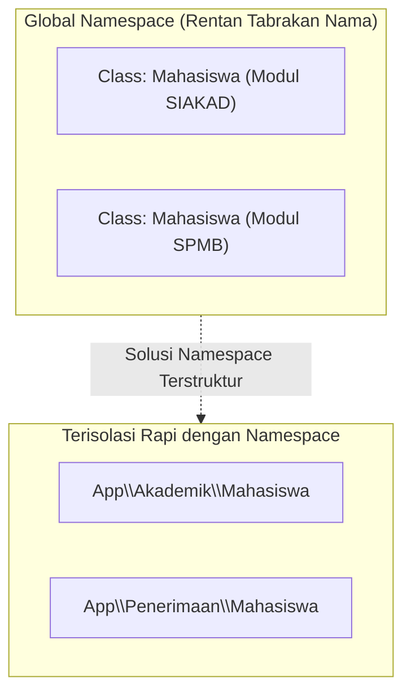
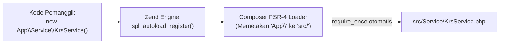

# Minggu 8: Namespace, Standar PSR-4 & Composer Autoloading di PHP 8+

## 🎯 Capaian Pembelajaran (Sub-CPMK 4)
Setelah menyelesaikan materi pada bab ini, mahasiswa diharapkan mampu:
1. Memahami urgensi dan filosofi **Namespace** untuk mencegah polusi ruang lingkup global (*Global Namespace Pollution*) dan tabrakan nama class (*Name Collision*).
2. Menguasai sintaks deklarasi `namespace`, aturan resolusi nama simbol (*Fully Qualified*, *Qualified*, *Unqualified*), serta penggunaan instruksi **`use`**, **aliasing (`as`)**, dan **Group Use**.
3. Memahami evolusi mekanisme *Autoloading* di PHP dari era `require_once`, `spl_autoload_register()`, hingga standar industri modern **PSR-4 (PHP Standards Recommendation)**.
4. Mengonfigurasi berkas **`composer.json`** untuk mengelola pemetaan namespace aplikasi (`autoload.psr-4`) dan lingkungan pengujian (`autoload-dev.psr-4`).
5. Menguasai teknik optimasi performa *ClassLoader* pada server produksi (`composer dump-autoload -o` dan `--classmap-authoritative`).
6. Menyusun struktur direktori proyek PHP skala besar berstandar arsitektur industri (*Clean / Layered Architecture*).

> [!NOTE]
> 💡 **Standar Industri PSR-4:** Autoloading berbasis PSR-4 adalah fondasi mutlak seluruh framework PHP modern seperti Laravel, Symfony, Yii, dan Laminas.

---

## 1. Filosofi Namespace: Mengatasi Polusi Lingkup Global



### A. Latar Belakang Masalah di Era PHP Klasik
Pada masa awal PHP (sebelum versi 5.3), seluruh class, fungsi, dan konstanta yang dideklarasikan akan ditempatkan di dalam satu wadah global yang sama (*Global Scope*). Hal ini menimbulkan masalah kritis ketika dua pustaka berbeda mendefinisikan nama class yang sama:

```php
// Pustaka A mendefinisikan class Mahasiswa
class Mahasiswa { /* ... */ }

// Pustaka B juga mendefinisikan class Mahasiswa
class Mahasiswa { /* ... */ }
// ❌ FATAL ERROR: Cannot redeclare class Mahasiswa
```

Untuk menghindari bentrok nama tersebut, para pengembang zaman dahulu terpaksa memberi awalan nama class yang sangat panjang (misalnya `Zend_Service_Amazon_Ec2_Instance_Configuration`). 

### B. Solusi Namespace
**Namespace** menyediakan mekanisme pembungkus virtual (*virtual packaging*) hierarkis yang mengisolasi simbol-simbol kode ke dalam ruang nama masing-masing, mirip dengan analogi struktur direktori di dalam sistem operasi komputer. Dua berkas dengan nama `Laporan.php` dapat hidup berdampingan secara damai asalkan berada di folder yang berbeda (`Dokumen/Keuangan/Laporan.php` dan `Dokumen/Akademik/Laporan.php`).

---

## 2. Anatomi Deklarasi dan Resolusi Simbol Namespace

### A. Tiga Tingkatan Penulisan Nama (Resolusi Simbol)
PHP mengenali tiga cara penulisan nama class/simbol:
1. **Fully Qualified Name (FQN):** Dimulai dengan garis miring terbalik (`\`), menunjuk langsung dari akar namespace global (contoh: `\App\Domain\Model\Mahasiswa`).
2. **Qualified Name:** Mengandung garis miring terbalik di tengah namun tidak diawali `\` (contoh: `Model\Mahasiswa`).
3. **Unqualified Name:** Hanya menuliskan nama class secara langsung tanpa garis miring terbalik (contoh: `Mahasiswa`).

```php
<?php
declare(strict_types=1);

namespace App\Akademik;

// Deklarasi Class di dalam Namespace App\Akademik
class Mahasiswa
{
    public function __construct(
        public readonly string $nim,
        public string $nama
    ) {}

    public function cetakProfil(): void
    {
        echo "[SIAKAD] Mahasiswa: {$this->nama} (NIM: {$this->nim})\n";
    }
}
```

### B. Penggunaan `use`, Aliasing (`as`), dan Group Use Statements
Untuk menggunakan class dari namespace lain tanpa harus mengetikkan FQN yang panjang berulang-ulang, gunakan instruksi `use`:

```php
<?php
declare(strict_types=1);

namespace App\Controller;

// 1. Mengimpor Class Tunggal
use App\Akademik\Mahasiswa as MahasiswaAkademik;
use App\Penerimaan\Mahasiswa as MahasiswaPendaftar;

// 2. Mengimpor Fungsi dan Konstanta Spesifik
use function App\Helper\formatMataUang;
use const App\Config\MAX_SKS_SEMESTER;

// 3. Group Use Statements (Mengimpor banyak class dari vendor yang sama)
use App\Services\{
    RegistrasiKrsService,
    ValidasiSyaratYudisiumService,
    AuditLogService
};

// 4. Mengakses Global PHP Built-in Classes (Awali dengan backslash atau use)
use DateTimeImmutable;
use InvalidArgumentException;

class PendaftaranController
{
    public function proses(): void
    {
        // Menggunakan Alias untuk menghindari tabrakan nama dalam 1 berkas:
        $mhsBaru = new MahasiswaPendaftar("REG-2025-001", "Cut Meurah");
        $mhsAktif = new MahasiswaAkademik("240101001", "Teuku Iskandar");

        $waktuDaftar = new DateTimeImmutable();
        echo "Waktu Proses: " . $waktuDaftar->format('Y-m-d H:i:s') . "\n";
    }
}
```

---

## 3. Standar Autoloading: Dari `require` ke Standar PSR-4



### A. Masalah *Spaghetti Includes* di Masa Lalu
Dahulu, setiap kali sebuah class dibutuhkan, pengembang harus menyertakan berkas fisiknya secara manual:
```php
require_once __DIR__ . '/Model/Mahasiswa.php';
require_once __DIR__ . '/Model/Dosen.php';
require_once __DIR__ . '/Service/KrsService.php';
// ❌ Kode membengkak dan membebani I/O disk server
```

### B. Mekanisme `spl_autoload_register()`
PHP menyediakan fungsi `spl_autoload_register()` yang mendaftarkan fungsi penangkap (*callback*). Ketika sebuah class dipanggil namun belum dimuat di memori, Zend Engine akan otomatis memicu fungsi ini sebelum memunculkan Fatal Error.

### C. Standar PSR-4 (PHP-FIG)
Standar **PSR-4** mendefinisikan aturan pemetaan matematis antara Namespace terstruktur dengan direktori fisik di server:
- Namespace Prefix: `App\` $\rightarrow$ Folder Dasar: `src/`
- Sub-namespace `App\Domain\Model\Mahasiswa` $\rightarrow$ File Fisik: `src/Domain/Model/Mahasiswa.php`
- Nama class harus persis sama (*case-sensitive*) dengan nama file (`.php`).

---

## 4. Konfigurasi Autoloading Menggunakan Composer

Composer adalah *Dependency & Package Manager* resmi untuk ekosistem PHP modern yang mengimplementasikan PSR-4 secara otomatis.

### A. Struktur Berkas `composer.json`:
```json
{
    "name": "uui/sistem-informasi-akademik",
    "description": "Sistem Informasi Akademik Berbasis OOP PHP 8+",
    "type": "project",
    "license": "MIT",
    "authors": [
        {
            "name": "Mahendar Dwi Payana, M.T.",
            "email": "mahendar@uui.ac.id"
        }
    ],
    "require": {
        "php": "^8.1"
    },
    "require-dev": {
        "phpunit/phpunit": "^10.0"
    },
    "autoload": {
        "psr-4": {
            "App\\": "src/"
        },
        "files": [
            "src/Helper/GlobalFunctions.php"
        ]
    },
    "autoload-dev": {
        "psr-4": {
            "Tests\\": "tests/"
        }
    }
}
```

### B. Perintah Kunci Composer:
```bash
# 1. Menghasilkan file autoload vendor pertama kali
composer dump-autoload

# 2. Optimasi Tingkat 1 untuk Lingkungan Produksi (Membuat Classmap Hash Table)
composer dump-autoload --optimize

# 3. Optimasi Tingkat 2 Super Cepat (Melarang pencarian filesystem dinamis)
composer dump-autoload --classmap-authoritative
```

---

## 5. Struktur Standar Proyek PHP Skala Enterprise (Clean Architecture)

```
sistem-akademik/
├── composer.json
├── composer.lock
├── vendor/                      # Direktori pustaka luar & autoloader
│   └── autoload.php
├── src/                         # Seluruh kode inti aplikasi (Namespace: App\)
│   ├── Domain/
│   │   ├── Model/
│   │   │   ├── Mahasiswa.php    # App\Domain\Model\Mahasiswa
│   │   │   └── MataKuliah.php   # App\Domain\Model\MataKuliah
│   │   └── Repository/
│   │       └── MahasiswaRepoInterface.php
│   ├── Infrastructure/
│   │   └── Persistence/
│   │       └── JsonMahasiswaRepository.php
│   ├── Service/
│   │   └── RegistrasiKrsService.php
│   └── Helper/
│       └── FormatRupiah.php
├── tests/                       # Unit Test (Namespace: Tests\)
│   └── Domain/
│       └── MahasiswaTest.php
└── public/
    └── index.php                # Single Entry Point Aplikasi
```

### Berkas Titik Masuk Tunggal (`public/index.php`):
```php
<?php
declare(strict_types=1);

// Cukup muat 1 baris ini untuk memuat seluruh class di project:
require_once __DIR__ . '/../vendor/autoload.php';

use App\Domain\Model\Mahasiswa;
use App\Infrastructure\Persistence\JsonMahasiswaRepository;
use App\Service\RegistrasiKrsService;

// Instansiasi langsung tanpa perlu require file satu-persatu:
$repo = new JsonMahasiswaRepository(__DIR__ . '/../data/mahasiswa.json');
$service = new RegistrasiKrsService($repo);

$mhs = new Mahasiswa("240101", "Cut Nyak Dhien", 3.95);
echo "Sistem Siap! Berhasil memuat class via PSR-4 Autoloader.\n";
```

---

## 💻 6. Praktikum Terbimbing: Membangun Multi-Tier Architecture

```php
<?php
// File: src/Domain/Model/Mahasiswa.php
namespace App\Domain\Model;

class Mahasiswa
{
    public function __construct(
        public readonly string $nim,
        public string $nama,
        public float $ipk
    ) {}
}

// File: src/Service/KrsEngineService.php
namespace App\Service;

use App\Domain\Model\Mahasiswa;

class KrsEngineService
{
    public function hitungMaksimalSks(Mahasiswa $mhs): int
    {
        return match(true) {
            $mhs->ipk >= 3.50 => 24,
            $mhs->ipk >= 3.00 => 22,
            $mhs->ipk >= 2.50 => 20,
            default           => 18
        };
    }
}
```

---

## 📝 Evaluasi & Tugas Praktikum Mandiri

1. **Inisialisasi Proyek Composer Mandiri:**
   - Jalankan `composer init` di komputer lokal Anda.
   - Konfigurasikan pemetaan PSR-4 untuk namespace `Universitas\Akademik\` yang mengarah ke folder `src/`.
2. **Implementasi Domain Layer & Service Layer:**
   - Buat class `Dosen` dan `MataKuliah` di dalam namespace `Universitas\Akademik\Entity`.
   - Buat class `JadwalKuliahService` di dalam `Universitas\Akademik\Service`.
   - Hubungkan seluruh class melalui `public/index.php` dan cetak jadwal kuliah mahasiswa!
3. **Analisis Reflektif:**
   - Mengapa penggunaan `composer dump-autoload --classmap-authoritative` sangat direkomendasikan pada server produksi (*Production Environment*)? Apa pengaruhnya terhadap performa response time API?
