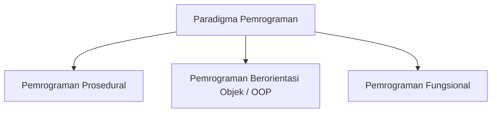
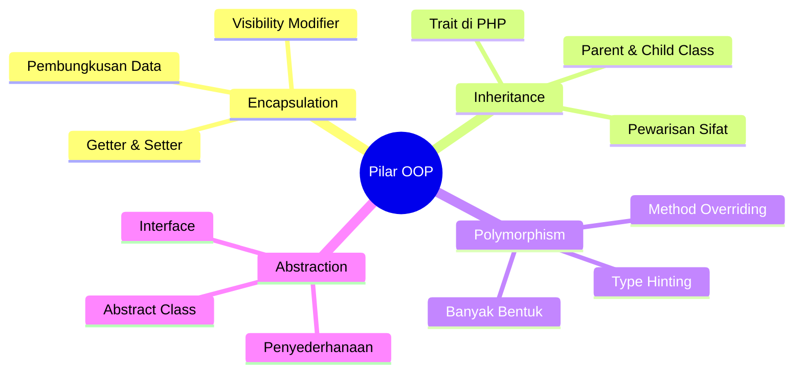

# Minggu 1: Pengantar Pemrograman Berorientasi Objek (OOP) dengan PHP

## 🎯 Capaian Pembelajaran (Sub-CPMK 1)
Setelah menyelesaikan materi ini, mahasiswa mampu:
1. Menjelaskan konsep dan definisi *Object-Oriented Programming* (OOP).
2. Membandingkan paradigma pemrograman prosedural dengan paradigma berorientasi objek.
3. Mengidentifikasi kelebihan OOP dalam pengembangan aplikasi web modern.
4. Menyiapkan lingkungan pengembangan PHP 8+.

> [!TIP]
> 📽️ **Slide Presentasi Perkuliahan:** Anda dapat melihat dan memutar [Slide Interaktif Pertemuan 1 PHP](/presentasi/pertemuan-1-php) atau [Buka Layar Penuh (Tab Baru)](/Perkuliahan/presentasi/pertemuan-1-pengantar-oop-php.html){target="_blank"}.

---

## 1. Apa itu Paradigma Pemrograman?

Paradigma pemrograman adalah cara pandang atau pendekatan fundamental dalam menstrukturkan dan menyelesaikan masalah komputasi menggunakan kode program.



### A. Pemrograman Prosedural
Pada pendekatan prosedural, program terdiri dari kumpulan fungsi yang dipanggil secara berurutan. Data dan fungsi terpisah — data mengalir bebas di antara fungsi.

```php
<?php
// Contoh Prosedural: Menghitung luas persegi panjang
function hitungLuas(float $panjang, float $lebar): float {
    return $panjang * $lebar;
}

$panjang = 10;
$lebar = 5;
echo "Luas: " . hitungLuas($panjang, $lebar); // Output: Luas: 50
```

### B. Pemrograman Berorientasi Objek (OOP)
OOP memandang program sebagai kumpulan **Objek** mandiri yang saling berinteraksi. Data (properti) dan fungsi pengolah data (method) dibungkus menjadi satu kesatuan utuh.

```php
<?php
// Contoh OOP: Menghitung luas persegi panjang
class PersegiPanjang {
    public function __construct(
        private float $panjang,
        private float $lebar
    ) {}

    public function hitungLuas(): float {
        return $this->panjang * $this->lebar;
    }
}

$bangun = new PersegiPanjang(10, 5);
echo "Luas: " . $bangun->hitungLuas(); // Output: Luas: 50
```

---

## 2. Perbandingan: Prosedural vs OOP

| Aspek | Pemrograman Prosedural | Pemrograman OOP |
| :--- | :--- | :--- |
| **Pusat Pendekatan** | Fungsi / Prosedur | Objek (Data + Perilaku) |
| **Struktur Program** | Top-Down, fungsi-fungsi | Bottom-Up, Class & Objek |
| **Keamanan Data** | Data rentan dimodifikasi | Data dilindungi (*Encapsulation*) |
| **Reusability** | Terbatas | Sangat tinggi (Inheritance) |
| **Skalabilitas** | Sulit pada proyek besar | Sangat cocok untuk proyek besar |
| **Contoh di PHP** | Script PHP tradisional | Framework: Laravel, Symfony |

---

## 3. Empat Pilar Utama OOP



1. **Encapsulation:** Mengikat data dan method menjadi satu unit serta menyembunyikan detail internal.
2. **Inheritance:** Class baru mewarisi properti dan method dari class yang sudah ada.
3. **Polymorphism:** Satu method dapat berperilaku berbeda tergantung objek yang menjalankannya.
4. **Abstraction:** Menyembunyikan implementasi internal yang rumit, hanya menampilkan antarmuka yang penting.

---

## 4. Mengapa OOP di PHP?

PHP modern (versi 7.4+ dan 8.x) telah berevolusi menjadi bahasa yang sangat mendukung OOP:

| Fitur PHP Modern | Versi | Manfaat |
| :--- | :---: | :--- |
| **Typed Properties** | 7.4 | Deklarasi tipe data pada properti class |
| **Constructor Promotion** | 8.0 | Deklarasi properti langsung di parameter constructor |
| **Union Types** | 8.0 | Parameter bisa menerima lebih dari satu tipe data |
| **Enums** | 8.1 | Tipe data enumerasi bawaan |
| **Readonly Properties** | 8.1 | Properti yang hanya bisa di-set sekali |
| **Interface Constants** | 8.2 | Konstanta di interface |

---

## 5. Analogi Dunia Nyata: Mobil sebagai Objek

```php
<?php
class Mobil {
    private int $kecepatan = 0;

    public function __construct(
        private string $merk,
        private string $warna
    ) {}

    public function gas(int $akselerasi): void {
        $this->kecepatan += $akselerasi;
        echo "{$this->merk} melaju {$this->kecepatan} km/jam\n";
    }

    public function rem(): void {
        $this->kecepatan = 0;
        echo "{$this->merk} berhenti.\n";
    }
}

// Pemakaian
$mobil = new Mobil("Toyota", "Merah");
$mobil->gas(60);  // Toyota melaju 60 km/jam
$mobil->gas(40);  // Toyota melaju 100 km/jam
$mobil->rem();    // Toyota berhenti.
```

---

## 📝 Latihan & Persiapan

1. **Setup Environment:** Pasang PHP 8.1+ dan Composer di komputer Anda. Gunakan [XAMPP](https://www.apachefriends.org/), [Laragon](https://laragon.org/), atau `php -S localhost:8000`.
2. **Analisis:** Sebutkan 3 entitas di lingkungan kampus (misal: Perpustakaan, SIAKAD) dan tentukan properti serta method-nya jika dimodelkan dalam OOP PHP.
3. **Eksplorasi:** Coba jalankan contoh kode class `Mobil` di atas menggunakan terminal: `php nama_file.php`.
