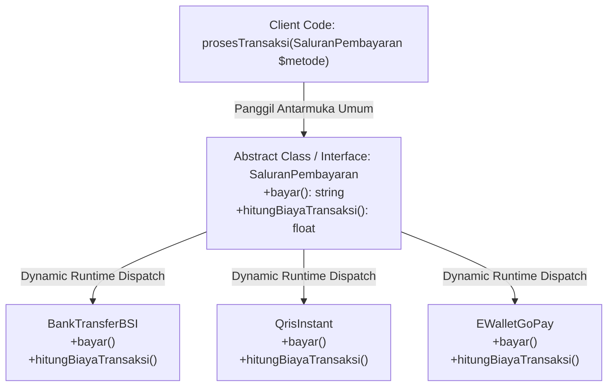

# Minggu 6: Polymorphism (Polimorfisme) & Dynamic Dispatch di PHP 8+

## 🎯 Capaian Pembelajaran (Sub-CPMK 3)
Setelah menyelesaikan materi pada bab ini, mahasiswa diharapkan mampu:
1. Memahami filosofi fundamental **Polymorphism (Polimorfisme)**, taksonomi teori tipe Cardelli & Wegner, serta prinsip *"Satu Antarmuka, Banyak Perilaku"*.
2. Memahami mekanisme eksekusi **Dynamic Method Dispatch** pada Zend Engine runtime PHP.
3. Mengimplementasikan **Polymorphic Type Hinting** dan memproses **Koleksi Objek Polimorfik (*Polymorphic Collections*)**.
4. Membedakan secara analitis **Polimorfisme berbasis Pewarisan Class (*Class Inheritance*)** vs **Polimorfisme berbasis Kontrak (*Interface-based Polymorphism*)**.
5. Menggunakan operator **`instanceof`** secara tepat untuk *Type Narrowing* seraya menghindari *Anti-pattern Type Checking*.
6. Merancang arsitektur perangkat lunak yang mematuhi **Open/Closed Principle (OCP)** dan **Liskov Substitution Principle (LSP)**.

> [!TIP]
> 📽️ **Slide Presentasi Perkuliahan:** Anda dapat melihat dan memutar [Slide Interaktif Pertemuan 6 PHP](/presentasi/pertemuan-6-php) atau [Buka Layar Penuh (Tab Baru)](/Perkuliahan/presentasi/pertemuan-6-polymorphism-php.html){target="_blank"}.

---

## 1. Filosofi dan Fondasi Teoretis Polimorfisme



### A. Hakikat Polimorfisme
Secara etimologi bahasa Yunani, **Polimorfisme** berasal dari kata *poly* (banyak) dan *morph* (bentuk atau rupa). Dalam ilmu rekayasa perangkat lunak berorientasi objek, polimorfisme adalah prinsip kemampuan objek-objek dari berbagai class turunan yang berbeda untuk merespons pemanggilan pesan atau method yang sama dengan cara/implementasi unik mereka masing-masing.

Kekuatan utama polimorfisme terletak pada pemisahan antara:
- **"Apa yang harus dilakukan" (*What to do*)** → Didefinisikan pada antarmuka umum / superclass.
- **"Bagaimana cara melakukannya" (*How to do it*)** → Didefinisikan secara spesifik oleh masing-masing subclass.

### B. Taksonomi Teori Polimorfisme (Cardelli & Wegner, 1985)
Dalam literatur ilmu komputer klasik, Luca Cardelli dan Peter Wegner membagi polimorfisme ke dalam empat klasifikasi utama:
1. **Subtyping / Inclusion Polymorphism (Fokus Utama OOP):** Kemampuan suatu variabel tipe dasar untuk menampung objek dari subclass mana pun dan mengeksekusi perilaku yang tepat di runtime.
2. **Parametric Polymorphism:** Kemampuan fungsi atau struktur data untuk mengeksekusi logika generik tanpa terikat tipe data konkrit (dikenal sebagai *Generics*).
3. **Overloading / Ad-hoc Polymorphism:** Penggunaan nama fungsi yang sama untuk beberapa parameter bertipe data berbeda.
4. **Coercion Polymorphism:** Operasi konversi otomatis antar tipe data oleh compiler/interpreter.

---

## 2. Mekanisme Dynamic Method Dispatch pada PHP Runtime

Di dalam PHP 8+, resolusi pemanggilan method (`$objek->eksekusi()`) berlangsung secara dinamis pada saat program berjalan (*runtime*). Ketika sebuah method dipanggil melalui tipe induk, Zend Engine melakukan langkah-langkah berikut:
1. Memeriksa tabel simbol memori (*Zend Class Entry*) dari objek riil yang sedang ditunjuk oleh variabel.
2. Mencari implementasi method `eksekusi()` pada class objek riil tersebut.
3. Jika ditemukan di subclass, eksekusi method subclass (*Overridden Method*). Jika tidak, telusuri rantai hierarki ke parent class.

### Contoh Dynamic Method Dispatch:
```php
<?php
declare(strict_types=1);

namespace App\Pembayaran;

// Superclass
abstract class SaluranPembayaran
{
    public function __construct(
        protected float $totalTagihan
    ) {}

    abstract public function bayar(): string;
    abstract public function hitungBiayaAdmin(): float;
}

// Subclass 1: Transfer Bank
class TransferBank extends SaluranPembayaran
{
    public function __construct(
        float $total,
        private string $namaBank,
        private string $nomorRekening
    ) {
        parent::__construct($total);
    }

    public function hitungBiayaAdmin(): float
    {
        return 4_000.0; // Biaya kliring antar bank
    }

    public function bayar(): string
    {
        $totalBayar = $this->totalTagihan + $this->hitungBiayaAdmin();
        return "🏦 [TRANSFER BANK] Bank {$this->namaBank} ({$this->nomorRekening}) | Total: Rp " . 
               number_format($totalBayar, 0, ',', '.') . " (Termasuk Biaya Admin: Rp 4.000)";
    }
}

// Subclass 2: QRIS Instant
class QrisInstant extends SaluranPembayaran
{
    public function __construct(
        float $total,
        private string $merchantNMID
    ) {
        parent::__construct($total);
    }

    public function hitungBiayaAdmin(): float
    {
        return $this->totalTagihan * 0.007; // MDR QRIS 0.7%
    }

    public function bayar(): string
    {
        $totalBayar = $this->totalTagihan + $this->hitungBiayaAdmin();
        return "📱 [QRIS INSTANT] NMID: {$this->merchantNMID} | Total: Rp " . 
               number_format($totalBayar, 0, ',', '.') . " [LUNAS REALTIME]";
    }
}

// Subclass 3: Dompet Digital (E-Wallet)
class EWalletGoPay extends SaluranPembayaran
{
    public function __construct(
        float $total,
        private string $nomorHp
    ) {
        parent::__construct($total);
    }

    public function hitungBiayaAdmin(): float
    {
        return 1_000.0; // Biaya platform flat
    }

    public function bayar(): string
    {
        $totalBayar = $this->totalTagihan + $this->hitungBiayaAdmin();
        return "💳 [E-WALLET GOPAY] Akun {$this->nomorHp} terdebet Rp " . 
               number_format($totalBayar, 0, ',', '.') . " [SUKSES]";
    }
}
```

---

## 3. Polymorphic Type Hinting & Koleksi Polimorfik

Melalui **Polymorphic Type Hinting**, kode pemanggil (*Client Code*) cukup menerima tipe acuan superclass `SaluranPembayaran`. Fungsi ini otomatis dapat memproses metode pembayaran apa pun (termasuk metode pembayaran baru di masa depan) tanpa perlu diubah sebaris pun:

```php
<?php

// Fungsi Konsumen yang Mematuhi Open/Closed Principle
function prosesTransaksiKasir(SaluranPembayaran $saluran): void
{
    echo "Menghubungkan ke payment gateway...\n";
    $struk = $saluran->bayar(); // Dynamic Dispatch mengeksekusi method child yang sesuai
    echo $struk . "\n";
    echo "Biaya Administrasi: Rp " . number_format($saluran->hitungBiayaAdmin(), 0, ',', '.') . "\n";
    echo "--------------------------------------------------------\n";
}

// Koleksi Polimorfik: Berisi kumpulan ragam subclass dalam satu array homogen secara tipe induk
/** @var SaluranPembayaran[] $antreanPembayaran */
$antreanPembayaran = [
    new TransferBank(500_000.0, "Bank Syariah Indonesia (BSI)", "7123456789"),
    new QrisInstant(25_000.0, "ID1020304050"),
    new EWalletGoPay(75_000.0, "081269001122"),
    new QrisInstant(150_000.0, "ID1020304050")
];

// Pemrosesan Massal Polimorfik
foreach ($antreanPembayaran as $transaksi) {
    prosesTransaksiKasir($transaksi);
}
```

---

## 4. Dua Pendekatan Polimorfisme di PHP

| Parameter Analisis | Polimorfisme Berbasis Pewarisan Class (`extends`) | Polimorfisme Berbasis Kontrak Interface (`implements`) |
| :--- | :--- | :--- |
| **Karakteristik Hubungan** | Hubungan taksonomi keluarga ketat (*Is-A*). | Hubungan kemampuan perilaku (*Can-Do*). |
| **Pewarisan Kode/State** | Mewarisi kode method konkrit dan properti data. | Murni kontrak tanpa membawa state data internal. |
| **Batasan Arsitektur** | Terikat aturan *Single Inheritance* (hanya 1 parent). | Bebas diimplementasikan oleh banyak class lintas rumpun (*Multiple Implementation*). |
| **Rekomendasi Industri** | Cocok untuk hierarki entitas domain yang memiliki state bersama. | Standar arsitektur *Clean Code* & *Dependency Injection*. |

---

## 5. Type Narrowing Menggunakan Operator `instanceof`

Operator `instanceof` digunakan untuk memverifikasi apakah suatu objek merupakan instansi dari class atau interface tertentu sebelum melakukan operasi spesifik:

```php
<?php

class LaporanAuditor
{
    public function audit(SaluranPembayaran $saluran): void
    {
        echo "Mengaudit transaksi: " . $saluran->bayar() . "\n";

        // Type Narrowing:
        if ($saluran instanceof QrisInstant) {
            echo "ℹ️ Catatan Audit: Verifikasi tanda tangan digital QRIS dengan Bank Indonesia.\n";
        } elseif ($saluran instanceof TransferBank) {
            echo "ℹ️ Catatan Audit: Cocokkan mutasi rekening koran bank penerima.\n";
        }
    }
}
```

> [!WARNING]
> **Anti-Pattern Code Smell:** Hindari penggunaan `if ($obj instanceof X)` yang berlebihan di dalam alur logika bisnis utama. Jika Anda mendapati diri Anda menulis puluhan baris `if-elseif-instanceof`, itu pertanda bahwa logika tersebut seharusnya dipindahkan ke dalam *polymorphic method* milik masing-masing subclass!

---

## 💻 6. Praktikum Terbimbing: Sistem Multi-Kanal Notifikasi

```php
<?php
declare(strict_types=1);

namespace App\Notifikasi;

interface NotifikasiInterface
{
    public function kirim(string $penerima, string $pesan): bool;
}

class EmailNotifikasi implements NotifikasiInterface
{
    public function kirim(string $penerima, string $pesan): bool
    {
        echo "📧 [EMAIL DISPATCH] Mengirim ke <{$penerima}>\n";
        echo "   Isi Email: \"{$pesan}\"\n";
        return true;
    }
}

class WhatsAppNotifikasi implements NotifikasiInterface
{
    public function kirim(string $penerima, string $pesan): bool
    {
        echo "📱 [WHATSAPP API] Mengirim via Cloud API ke {$penerima}\n";
        echo "   Pesan WA: \"{$pesan}\"\n";
        return true;
    }
}

class PushNotifikasiFCM implements NotifikasiInterface
{
    public function kirim(string $penerima, string $pesan): bool
    {
        echo "🔔 [FCM PUSH] Mengirim push notification ke Device Token [{$penerima}]\n";
        echo "   Payload: \"{$pesan}\"\n";
        return true;
    }
}

// Service Pengirim Notifikasi yang Modular (Dependency Injection)
class NotifikasiManager
{
    /** @var NotifikasiInterface[] */
    private array $saluranAktif = [];

    public function daftarkanSaluran(NotifikasiInterface $saluran): self
    {
        $this->saluranAktif[] = $saluran;
        return $this;
    }

    public function broadcastPesan(string $tujuan, string $pesan): void
    {
        echo "\n📢 MEMULAI BROADCAST NOTIFIKASI POLIMORFIK...\n";
        foreach ($this->saluranAktif as $saluran) {
            $saluran->kirim($tujuan, $pesan);
        }
        echo "✅ Broadcast selesai dikirim ke seluruh saluran terdaftar.\n";
    }
}

// Eksekusi Sistem Notifikasi
$manager = new NotifikasiManager();
$manager->daftarkanSaluran(new EmailNotifikasi())
        ->daftarkanSaluran(new WhatsAppNotifikasi())
        ->daftarkanSaluran(new PushNotifikasiFCM());

$manager->broadcastPesan("mahendar@uui.ac.id", "Pemberitahuan: Jadwal perkuliahan OOP PHP 8+ dimulai pukul 08.30 WIB.");
```

---

## 📝 Evaluasi & Tugas Praktikum Mandiri

1. **Rancang Sistem Kalkulasi Bangun Datar Polimorfik:**
   - Buat abstract class / interface `BangunDatar` dengan method `hitungLuas(): float` dan `hitungKeliling(): float`.
   - Buat class `Persegi`, `PersegiPanjang`, `SegitigaSikuSiku`, dan `Lingkaran`.
   - Buat fungsi `hitungTotalAkumulasiLuas(array $koleksiBangun): float` yang menjumlahkan seluruh luas bangun datar tanpa mempedulikan bentuk fisiknya.
2. **Studi Kasus Ekspor Data Polimorfik:**
   - Buat interface `DokumenExporterInterface` dengan method `export(array $dataMahasiswa): string`.
   - Buat 3 implementor: `CsvExporter`, `JsonExporter`, dan `XmlExporter`.
3. **Analisis Reflektif:**
   - Jelaskan bagaimana polimorfisme mendukung prinsip *Open/Closed Principle (OCP)* ketika perusahaan Anda ingin menambah metode pembayaran *Cryptocurrency* tanpa mengubah kode kasir yang sudah ada!
