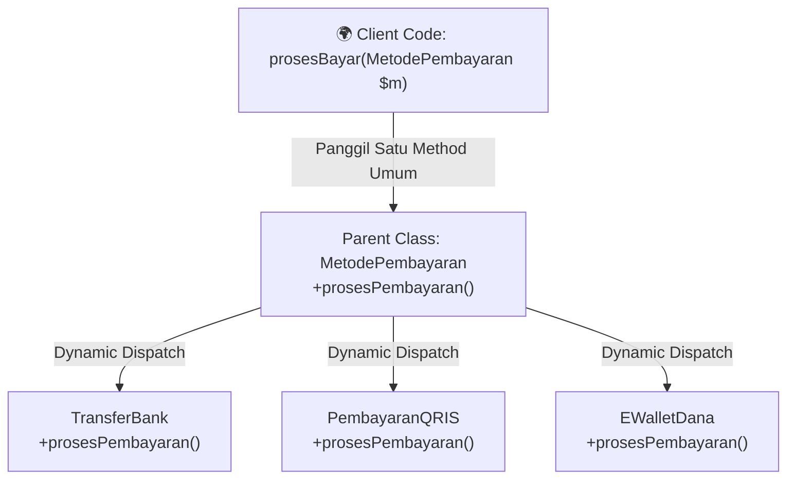

# Minggu 6: Polymorphism (Polimorfisme) di PHP 8+

## 🎯 Capaian Pembelajaran (Sub-CPMK 3)
Setelah menyelesaikan materi ini, mahasiswa mampu:
1. Memahami prinsip fundamental **Polymorphism** (Satu Antarmuka, Banyak Implementasi / *Dynamic Dispatch*).
2. Menerapkan **Method Overriding** untuk mendefinisikan perilaku spesifik di Subclass.
3. Menggunakan **Polymorphic Type Hinting** pada parameter fungsi/method.
4. Memanfaatkan operator **`instanceof`** untuk *Type Checking* dan *Type Safety*.
5. Merancang arsitektur sistem berbasis *Open-Closed Principle* menggunakan polimorfisme.

> [!TIP]
> 📽️ **Slide Presentasi Perkuliahan:** Anda dapat melihat dan memutar [Slide Interaktif Pertemuan 6 PHP](/presentasi/pertemuan-6-php) atau [Buka Layar Penuh (Tab Baru)](/Perkuliahan/presentasi/pertemuan-6-polymorphism-php.html){target="_blank"}.

---

## 1. Konsep Dasar Polymorphism



**Polymorphism (Banyak Rupa)** adalah kemampuan objek dari berbagai class turunan yang berbeda untuk merespons pemanggilan method yang sama dengan cara/perilaku unik mereka masing-masing.

---

## 2. Dynamic Method Dispatch & Type Hinting

Di PHP, pemanggilan method objek diselesaikan secara dinamis pada saat *runtime* berdasarkan objek aktual yang diinstansiasi:

```php
<?php
declare(strict_types=1);

// Parent Class
class Hewan
{
    public function bersuara(): string
    {
        return "Hewan mengeluarkan suara umum...";
    }
}

class Kucing extends Hewan
{
    public function bersuara(): string
    {
        return "🐱 Kucing: Meong... meong!";
    }
}

class Anjing extends Hewan
{
    public function bersuara(): string
    {
        return "🐶 Anjing: Guk... guk!";
    }
}

class Burung extends Hewan
{
    public function bersuara(): string
    {
        return "🐦 Burung: Cicit... cuit!";
    }
}

// Fungsi dengan Type Hinting Polymorphic
function periksaSuara(Hewan $hewan): void
{
    echo $hewan->bersuara() . "\n";
}

// Array Polimorfik
$daftarHewan = [
    new Kucing(),
    new Anjing(),
    new Burung(),
    new Kucing()
];

foreach ($daftarHewan as $h) {
    periksaSuara($h);
}
```

---

## 3. Operator `instanceof` untuk Type Checking

Gunakan `instanceof` jika Anda perlu memeriksa tipe objek spesifik sebelum melakukan operasi khusus:

```php
<?php

class DokterHewan
{
    public function rawat(Hewan $h): void
    {
        echo "Memeriksa pasien: " . $h->bersuara() . "\n";

        if ($h instanceof Kucing) {
            echo "💉 Berikan vaksin rabies khusus kucing.\n";
        } elseif ($h instanceof Burung) {
            echo "🌾 Berikan pakan biji-bijian bernutrisi.\n";
        }
    }
}
```

---

## 💻 Praktikum Terbimbing: Payment Gateway Multi-Vendor

```php
<?php
declare(strict_types=1);

abstract class MetodePembayaran
{
    public function __construct(
        protected float $jumlah
    ) {}

    abstract public function bayar(): string;
}

class TransferBank extends MetodePembayaran
{
    public function __construct(
        float $jumlah,
        private string $nomorRekening,
        private string $bank
    ) {
        parent::__construct($jumlah);
    }

    public function bayar(): string
    {
        return "🏦 Transfer Bank {$this->bank} ({$this->nomorRekening}): Rp " . 
               number_format($this->jumlah, 0, ',', '.') . " [BERHASIL]";
    }
}

class PembayaranQRIS extends MetodePembayaran
{
    public function __construct(
        float $jumlah,
        private string $merchantId
    ) {
        parent::__construct($jumlah);
    }

    public function bayar(): string
    {
        return "📱 Scan QRIS Merchant {$this->merchantId}: Rp " . 
               number_format($this->jumlah, 0, ',', '.') . " [LUNAS INSTAN]";
    }
}

class EWalletGoPay extends MetodePembayaran
{
    public function __construct(
        float $jumlah,
        private string $nomorHp
    ) {
        parent::__construct($jumlah);
    }

    public function bayar(): string
    {
        return "💳 Saldo GoPay ({$this->nomorHp}) dipotong Rp " . 
               number_format($this->jumlah, 0, ',', '.') . " [SUKSES]";
    }
}

// Simulasi Checkout E-Commerce
class KasirOnline
{
    public function checkout(MetodePembayaran $metode): void
    {
        echo "================================================\n";
        echo $metode->bayar() . "\n";
        echo "================================================\n";
    }
}

$kasir = new KasirOnline();
$kasir->checkout(new TransferBank(750_000, "123-456-789", "BCA"));
$kasir->checkout(new PembayaranQRIS(45_000, "Kantin-UUI-01"));
$kasir->checkout(new EWalletGoPay(120_000, "081234567890"));
```

---

## 📝 Tugas Praktikum Mandiri

1. Buat parent class `AkunBank` dengan properti protected `$nomorRekening` dan `$saldo`, serta method `hitungBungaBulanan(): float`.
2. Buat 3 subclass:
   - `TabunganReguler` (Bunga 1% per tahun $\rightarrow$ saldo $\times 0.01 / 12$).
   - `Deposito` (Bunga 5.5% per tahun $\rightarrow$ saldo $\times 0.055 / 12$).
   - `TabunganSyariah` (Nisbah bagi hasil Rp 50.000 tetap jika saldo $> 1.000.000$).
3. Buat file `main.php` yang menyimpan ketiga akun dalam array polimorfik `$daftarAkun` dan cetak estimasi bunga bulanan masing-masing menggunakan perulangan!
