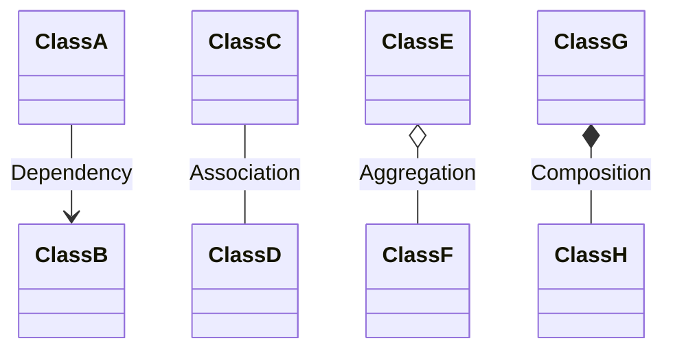

# Minggu 13: Dasar SOLID Principle dan Desain Class

## 🎯 Capaian Pembelajaran (Sub-CPMK 5)
Setelah menyelesaikan materi ini, mahasiswa mampu:
1. Memahami relasi antar class (*Association, Aggregation, Composition, Dependency*).
2. Mengenal dan menerapkan 5 prinsip desain **SOLID** di PHP.

---

## 1. Relasi Antar Class



---

## 2. Prinsip SOLID

### S — Single Responsibility Principle

✅ **Penerapan SRP:**
```php
<?php
class Pegawai {
    public function __construct(
        public string $nama,
        public float $gaji
    ) {}
}

class KalkulatorGaji {
    public function hitung(Pegawai $p): float { return $p->gaji; }
}

class LaporanPrinter {
    public function cetak(Pegawai $p): void { echo "Slip: {$p->nama}\n"; }
}
```

### O — Open/Closed Principle

```php
<?php
interface Diskon {
    public function hitungDiskon(float $total): float;
}

class DiskonMember implements Diskon {
    public function hitungDiskon(float $total): float { return $total * 0.10; }
}

class DiskonNatal implements Diskon {
    public function hitungDiskon(float $total): float { return $total * 0.20; }
}

// Cukup buat class baru tanpa ubah KasirService!
class KasirService {
    public function checkout(float $total, Diskon $diskon): float {
        return $total - $diskon->hitungDiskon($total);
    }
}
```

### I — Interface Segregation Principle

```php
<?php
interface BisaCetak { public function cetakDokumen(): void; }
interface BisaScan { public function scanDokumen(): void; }

class PrinterBiasa implements BisaCetak {
    public function cetakDokumen(): void { echo "Mencetak...\n"; }
}

class PrinterMultifungsi implements BisaCetak, BisaScan {
    public function cetakDokumen(): void { echo "Mencetak...\n"; }
    public function scanDokumen(): void { echo "Memindai...\n"; }
}
```

### D — Dependency Inversion Principle

```php
<?php
interface Notifier {
    public function send(string $recipient, string $message): void;
}

class EmailNotifier implements Notifier {
    public function send(string $email, string $msg): void {
        echo "Email ke {$email}: {$msg}\n";
    }
}

// Bergantung pada abstraksi (Notifier), bukan implementasi konkrit
class OrderService {
    public function __construct(private Notifier $notifier) {}

    public function processOrder(): void {
        $this->notifier->send("user@mail.com", "Pesanan berhasil!");
    }
}

// Dependency Injection
$service = new OrderService(new EmailNotifier());
$service->processOrder();
```

---

## 📝 Diskusi & Latihan

1. Analisis kode proyek Anda: Apakah ada class yang melanggar SRP?
2. Rancang sistem notifikasi (Email, SMS, WhatsApp) yang mematuhi OCP dan DIP.
