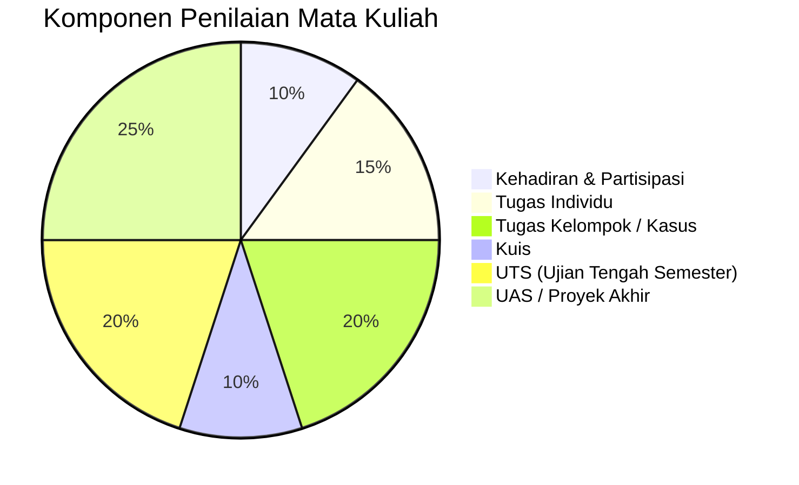

# Rencana Pembelajaran Semester (RPS)
**Mata Kuliah: Pemrograman Berorientasi Objek (Java) - IFR 214**

---

## 🏛️ Informasi Umum

| Komponen | Keterangan |
| :--- | :--- |
| **Perguruan Tinggi** | Universitas Ubudiyah Indonesia |
| **Fakultas** | Fakultas Sains dan Teknologi |
| **Program Studi** | Sistem Informasi |
| **Mata Kuliah** | Pemrograman Berorientasi Objek (Java) |
| **Kode MK / Bobot** | IFR 214 / 3 SKS (T=2, P=1) |
| **Semester / Rumpun** | 3 / Mata Kuliah Wajib Prodi |
| **Dosen Pengembang RPS** | Mahendar Dwi Payana, S.ST., M.T. |
| **Koordinator RMK** | Rizka Albar, S.Kom., M.T. |
| **Ketua Program Studi** | Juanda Nurgaza, S.Kom., M.T. |

---

## 🎯 Capaian Pembelajaran

### CPL-PRODI yang Dibebankan pada MK
- **CPL-P1**: Menguasai konsep, paradigma, prinsip, dan teknik pemrograman berorientasi objek dalam pengembangan perangkat lunak.
- **CPL-KU1**: Mampu berpikir logis, sistematis, kritis, dan kreatif dalam merancang solusi perangkat lunak berbasis objek.
- **CPL-KK1**: Mampu merancang, mengimplementasikan, menguji, dan mendokumentasikan aplikasi menggunakan paradigma pemrograman berorientasi objek.
- **CPL-S1**: Menunjukkan sikap profesional, bertanggung jawab, mampu bekerja sama, dan menjunjung etika akademik dalam pengembangan perangkat lunak.

### Capaian Pembelajaran Mata Kuliah (CPMK)
1. **CPMK-1**: Menjelaskan konsep dasar paradigma pemrograman berorientasi objek dan perbedaannya dengan pemrograman prosedural.
2. **CPMK-2**: Mengimplementasikan class, object, constructor, method, dan package dalam aplikasi sederhana.
3. **CPMK-3**: Menerapkan prinsip OOP meliputi encapsulation, inheritance, polymorphism, abstraction, interface, dan abstract class.
4. **CPMK-4**: Mengembangkan aplikasi menggunakan exception handling, collection, file handling, dan konsep OOP lainnya.
5. **CPMK-5**: Menganalisis serta menerapkan prinsip desain program berorientasi objek yang baik.
6. **CPMK-6**: Mengembangkan aplikasi berbasis objek secara individu maupun kelompok sesuai studi kasus.

### Kemampuan Akhir Tiap Tahapan Belajar (Sub-CPMK)
- **Sub-CPMK 1**: Menjelaskan konsep OOP, paradigma OOP, dan kelebihan OOP.
- **Sub-CPMK 2**: Membuat Class, Object, Constructor, dan Method.
- **Sub-CPMK 3**: Mengimplementasikan Encapsulation, Inheritance, Polymorphism, Interface, dan Abstract Class.
- **Sub-CPMK 4**: Menggunakan Exception Handling, Collection, File Handling, dan Package.
- **Sub-CPMK 5**: Menganalisis desain class, menyusun relasi antar class, dan menggunakan prinsip dasar SOLID.
- **Sub-CPMK 6**: Mengembangkan aplikasi OOP, melakukan pengujian aplikasi, menyusun dokumentasi, dan mempresentasikan proyek.

---

## 📖 Deskripsi Singkat Mata Kuliah

Mata kuliah **Pemrograman Berorientasi Objek** membahas konsep, prinsip, dan implementasi paradigma *Object-Oriented Programming* (OOP) dalam pengembangan perangkat lunak menggunakan bahasa pemrograman berorientasi objek (**Java**). Mahasiswa mempelajari konsep *class, object, constructor, method, encapsulation, inheritance, polymorphism, abstraction, interface, abstract class, exception handling, collection framework, file handling*, serta perancangan aplikasi berbasis objek. 

Pembelajaran dilakukan melalui pendekatan **Outcome-Based Education (OBE)** dengan **Project-Based Learning (PjBL)**, **Case-Based Learning (CBL)**, praktikum, dan proyek pengembangan aplikasi sederhana sehingga mahasiswa mampu membangun perangkat lunak yang modular, reusable, dan mudah dipelihara.

---

## 📊 Matriks Rencana Pembelajaran Mingguan

| Mg | Kemampuan Akhir (Sub-CPMK) | Materi Pembelajaran | Metode & Bentuk Pembelajaran | Penilaian / Indikator | Bobot (%) |
|:--:| :--- | :--- | :--- | :--- |:--:|
| **1** | Memahami konsep dasar OOP | Kontrak Kuliah, Pengantar Paradigma OOP, Perbedaan OOP vs Prosedural | Ceramah, Diskusi, Video | Keaktifan & Observasi | 3% |
| **2** | Mampu membuat class dan object | Class, Object, Field/Atribut, Instance Method | Praktikum, LMS | Praktik Pembuatan Class & Object | 4% |
| **3** | Mampu menggunakan constructor dan method | Constructor (Default & Parameterized), Method Overloading, Return Value | Praktikum Terbimbing | Praktik Implementasi Constructor & Method | 4% |
| **4** | Mampu menerapkan encapsulation | Information Hiding, Access Modifiers (public, private, protected), Getter & Setter | Praktikum, Diskusi | Praktik Keamanan & Pembatasan Akses Data | 5% |
| **5** | Mampu menerapkan inheritance | Pewarisan (Single, Multilevel, Hierarchical), keyword `extends`, keyword `super` | Praktikum, Video Tutorial | Praktik Relasi Parent & Child Class | 5% |
| **6** | Mampu menerapkan polymorphism | Polymorphism Dinamis (Method Overriding) & Statis (Method Overloading) | Praktikum, Kuis | Praktik & Kuis Konsep Polymorphism | 6% |
| **7** | Mampu menerapkan abstraction | Abstract Class, Abstract Method, Interface, Multiple Interface Implementation | Praktikum Terbimbing | Penilaian Praktik Interface & Abstraksi | 6% |
| **8** | **Ujian Tengah Semester (UTS)** | Evaluasi Materi Minggu 1–7 (Teori & Praktik) | Ujian Tertulis & Coding UTS | Ketepatan Logika & Implementasi OOP | 20% |
| **9** | Mampu menggunakan package | Modularitas, Package Management, Subpackage, Access Level Package | Praktikum, Studi Kasus | Pengorganisasian Struktur Project | 5% |
| **10** | Mampu menangani exception | Exception Handling (`try-catch-finally`), keyword `throw` dan `throws`, Custom Exception | Praktikum, Video | Praktik Robust Error Handling | 5% |
| **11** | Mampu menggunakan collection | Java Collections Framework (`List`, `ArrayList`, `LinkedList`, `Map`, `Set`, `Iterator`) | Praktikum, Studi Kasus | Praktik Manipulasi Data Dinamis | 6% |
| **12** | Mampu mengelola file (File I/O) | File Handling, File Streams, FileReader, FileWriter, BufferedReader, Serialization | Praktikum Terbimbing | Praktik Penyimpanan & Pembacaan Berkas Data | 8% |
| **13** | Memahami prinsip desain OOP | Desain Class yang Baik, Relasi Class (Association, Aggregation, Composition), Pengantar SOLID Principle | Studi Kasus, Diskusi | Presentasi & Diskusi Desain Class | 8% |
| **14** | Mampu mengembangkan aplikasi OOP | Arsitektur Aplikasi (Layering / Model-View-Controller Sederhana), Integrasi Fitur | Praktikum Terbimbing | Penugasan Integrasi Kode Aplikasi | 5% |
| **15** | Mampu menyelesaikan mini project | Pengembangan Aplikasi Berbasis Objek Berdasarkan Kasus Riil | PjBL / Konsultasi Proyek | Penilaian Progres Mini Project | 5% |
| **16** | **Ujian Akhir Semester (UAS)** | Evaluasi Keseluruhan Materi & Presentasi Proyek Akhir | Presentasi & Demo Proyek | Kualitas Aplikasi, Clean Code, Presentasi | 10% |

---

## ⚖️ Komponen & Bobot Penilaian

- **Kehadiran dan Partisipasi**: 10%
- **Tugas Individu**: 15%
- **Tugas Kelompok / Studi Kasus**: 20%
- **Kuis**: 10%
- **Ujian Tengah Semester (UTS)**: 20%
- **Ujian Akhir Semester (UAS) / Proyek**: 25%
- **Total**: 100%

---

## 📚 Daftar Pustaka

### Pustaka Utama
1. Deitel, P., & Deitel, H. *Java: How to Program (Early Objects)*. Pearson.
2. Schildt, H. *Java: The Complete Reference*. McGraw-Hill.
3. Eckel, B. *Thinking in Java*. Prentice Hall.
4. Sierra, K., & Bates, B. *Head First Java*. O'Reilly Media.

### Pustaka Pendukung
1. Martin, R. C. (2008). *Clean Code: A Handbook of Agile Software Craftsmanship*. Pearson.
2. Martin, R. C. (2002). *Agile Software Development: Principles, Patterns, and Practices*. Pearson.
3. Gamma, E., Helm, R., Johnson, R., & Vlissides, J. *Design Patterns: Elements of Reusable Object-Oriented Software*. Addison-Wesley.
4. Rosa, A. S., & Shalahuddin, M. *Rekayasa Perangkat Lunak Terstruktur dan Berorientasi Objek*. Informatika.
