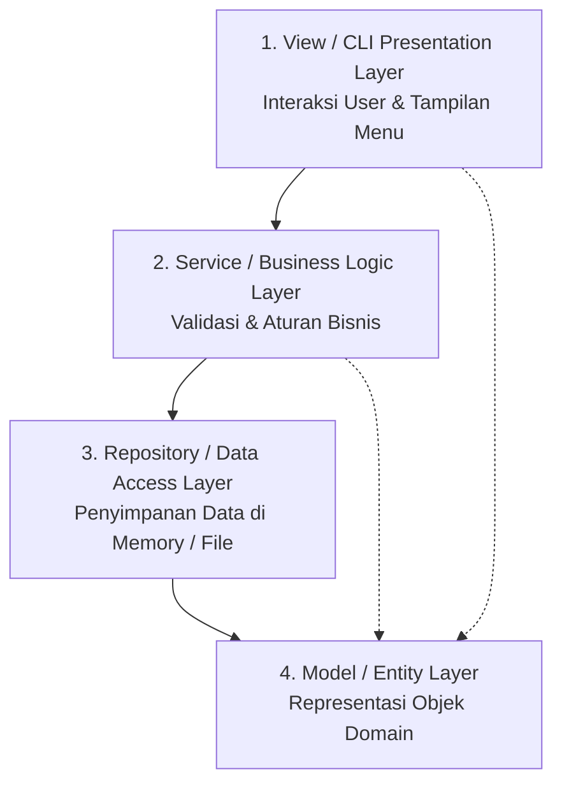

# Minggu 14: Implementasi dan Arsitektur Aplikasi OOP

## 🎯 Capaian Pembelajaran (Sub-CPMK 6)
Setelah menyelesaikan materi ini, mahasiswa mampu:
1. Mengintegrasikan seluruh konsep OOP (Class, Encapsulation, Inheritance, Polymorphism, Abstraction, Exception, File Handling, Collection) ke dalam sebuah aplikasi konsol/desktop yang utuh.
2. Memahami pola arsitektur **Model-View-Controller (MVC)** atau **Layered Architecture (Entity-Service-Repository-UI)**.
3. Menulis kode yang bersih, terdokumentasi dengan baik, dan mudah diuji (*testable*).

---

## 1. Arsitektur Berlapis (Layered Architecture)

Untuk membangun aplikasi yang profesional, pisahkan tanggung jawab kode ke dalam lapisan-lapisan:



---

## 2. Studi Kasus Proyek Utuh: Sistem Manajemen Perpustakaan Mini

Berikut adalah implementasi sistem perpustakaan sederhana namun terstruktur rapi:

### A. Model Entity: `Buku.java`
```java
package com.perpus.model;

public class Buku {
    private String isbn;
    private String judul;
    private String pengarang;
    private boolean isDipinjam;

    public Buku(String isbn, String judul, String pengarang) {
        this.isbn = isbn;
        this.judul = judul;
        this.pengarang = pengarang;
        this.isDipinjam = false;
    }

    public String getIsbn() { return isbn; }
    public String getJudul() { return judul; }
    public String getPengarang() { return pengarang; }
    public boolean isDipinjam() { return isDipinjam; }
    public void setDipinjam(boolean dipinjam) { isDipinjam = dipinjam; }

    @Override
    public String toString() {
        return "[" + isbn + "] " + judul + " - " + pengarang + " (" + (isDipinjam ? "Dipinjam" : "Tersedia") + ")";
    }
}
```

### B. Custom Exception: `PerpustakaanException.java`
```java
package com.perpus.exception;

public class PerpustakaanException extends Exception {
    public PerpustakaanException(String message) {
        super(message);
    }
}
```

### C. Service / Logic Layer: `PerpustakaanService.java`
```java
package com.perpus.service;

import com.perpus.exception.PerpustakaanException;
import com.perpus.model.Buku;
import java.util.ArrayList;
import java.util.List;

public class PerpustakaanService {
    private List<Buku> koleksiBuku = new ArrayList<>();

    public void tambahBuku(Buku buku) throws PerpustakaanException {
        for (Buku b : koleksiBuku) {
            if (b.getIsbn().equalsIgnoreCase(buku.getIsbn())) {
                throw new PerpustakaanException("Buku dengan ISBN " + buku.getIsbn() + " sudah terdaftar!");
            }
        }
        koleksiBuku.add(buku);
    }

    public List<Buku> getSemuaBuku() {
        return koleksiBuku;
    }

    public void pinjamBuku(String isbn) throws PerpustakaanException {
        for (Buku b : koleksiBuku) {
            if (b.getIsbn().equalsIgnoreCase(isbn)) {
                if (b.isDipinjam()) {
                    throw new PerpustakaanException("Buku sedang dipinjam orang lain!");
                }
                b.setDipinjam(true);
                return;
            }
        }
        throw new PerpustakaanException("Buku dengan ISBN " + isbn + " tidak ditemukan.");
    }
}
```

### D. User Interface / Main Class: `PerpustakaanApp.java`
```java
package com.perpus;

import com.perpus.exception.PerpustakaanException;
import com.perpus.model.Buku;
import com.perpus.service.PerpustakaanService;
import java.util.Scanner;

public class PerpustakaanApp {
    private static PerpustakaanService service = new PerpustakaanService();
    private static Scanner scanner = new Scanner(System.in);

    public static void main(String[] args) {
        // Data inisial
        try {
            service.tambahBuku(new Buku("B01", "Pemrograman Java", "Deitel"));
            service.tambahBuku(new Buku("B02", "Clean Code", "Uncle Bob"));
        } catch (Exception ignored) {}

        boolean running = true;
        while (running) {
            System.out.println("\n=== SISTEM PERPUSTAKAAN ===");
            System.out.println("1. Lihat Daftar Buku");
            System.out.println("2. Tambah Buku Baru");
            System.out.println("3. Pinjam Buku");
            System.out.println("4. Keluar");
            System.out.print("Pilih opsi: ");
            String opsi = scanner.nextLine();

            switch (opsi) {
                case "1":
                    System.out.println("\n--- DAFTAR BUKU ---");
                    for (Buku b : service.getSemuaBuku()) {
                        System.out.println(b);
                    }
                    break;
                case "2":
                    System.out.print("Masukkan ISBN: ");
                    String isbn = scanner.nextLine();
                    System.out.print("Masukkan Judul: ");
                    String judul = scanner.nextLine();
                    System.out.print("Masukkan Pengarang: ");
                    String pengarang = scanner.nextLine();
                    try {
                        service.tambahBuku(new Buku(isbn, judul, pengarang));
                        System.out.println("✅ Buku berhasil ditambahkan!");
                    } catch (PerpustakaanException e) {
                        System.out.println("❌ " + e.getMessage());
                    }
                    break;
                case "3":
                    System.out.print("Masukkan ISBN buku yang ingin dipinjam: ");
                    String pinjamIsbn = scanner.nextLine();
                    try {
                        service.pinjamBuku(pinjamIsbn);
                        System.out.println("✅ Buku berhasil dipinjam!");
                    } catch (PerpustakaanException e) {
                        System.out.println("❌ " + e.getMessage());
                    }
                    break;
                case "4":
                    running = false;
                    System.out.println("Terima kasih telah menggunakan sistem perpustakaan.");
                    break;
                default:
                    System.out.println("Pilihan tidak valid!");
            }
        }
    }
}
```

---

## 📝 Tugas Pengembangan

Tambahkan fitur:
1. **Pengembalian Buku:** Method `kembalikanBuku(String isbn)`.
2. **Pencarian Buku:** Cari berdasarkan kata kunci judul.
3. **Persistensi Data:** Simpan koleksi buku ke file CSV dan muat otomatis saat aplikasi dijalankan kembali.
