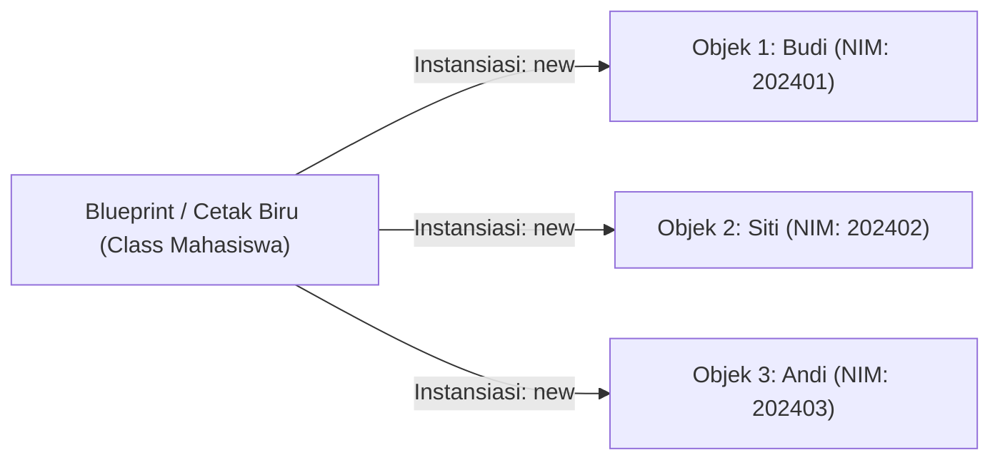
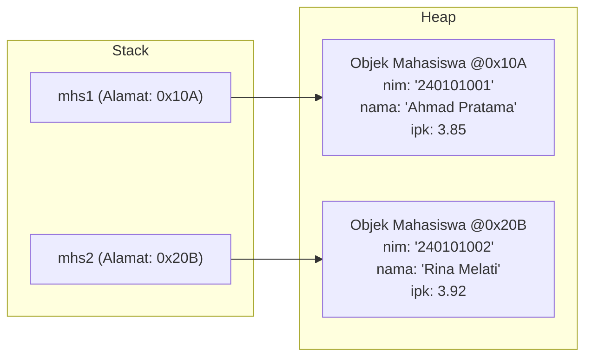

# Minggu 2: Class dan Object

## 🎯 Capaian Pembelajaran (Sub-CPMK 2)
Setelah menyelesaikan materi ini, mahasiswa mampu:
1. Memahami konsep fundamental mengenai **Class** sebagai cetak biru (*blueprint*) dan **Object** sebagai wujud nyata (*instance*).
2. Mendefinisikan atribut (*fields/properties*) dan perilaku (*methods*) di dalam class Java.
3. Melakukan instansiasi objek menggunakan kata kunci `new` dan mengakses member-membernya.

---

## 1. Konsep Class dan Object



- **Class**: Cetak biru (*blueprint*), template, atau rancangan yang mendefinisikan variabel (atribut) dan fungsi (method) umum yang dimiliki oleh suatu entitas.
- **Object**: Wujud konkret (instansiasi) dari suatu class yang memiliki alokasi memori tersendiri dan memiliki nilai (*state*) khusus pada atribut-atributnya.

---

## 2. Struktur Dasar Class di Java

Sebuah class pada Java umumnya terdiri dari:
1. **Nama Class** (menggunakan konvensi *PascalCase*, misal: `Mahasiswa`, `RekeningBank`).
2. **Atribut / State / Variabel Instans**.
3. **Method / Behavior / Operasi**.

```java
// File: Mahasiswa.java
public class Mahasiswa {
    // 1. Deklarasi Atribut / Variabel
    String nim;
    String nama;
    String jurusan;
    double ipk;

    // 2. Deklarasi Method
    void belajar() {
        System.out.println(nama + " sedang belajar pemrograman Java.");
    }

    void cetakInfo() {
        System.out.println("=== DATA MAHASISWA ===");
        System.out.println("NIM     : " + nim);
        System.out.println("Nama    : " + nama);
        System.out.println("Jurusan : " + jurusan);
        System.out.println("IPK     : " + ipk);
    }
}
```

---

## 3. Membuat Objek (Instansiasi dengan `new`)

Untuk membuat objek nyata dari class `Mahasiswa`, kita gunakan operator `new`:

```java
// File: Main.java
public class Main {
    public static void main(String[] args) {
        // 1. Instansiasi Objek 1
        Mahasiswa mhs1 = new Mahasiswa();
        mhs1.nim = "240101001";
        mhs1.nama = "Ahmad Pratama";
        mhs1.jurusan = "Sistem Informasi";
        mhs1.ipk = 3.85;

        // 2. Instansiasi Objek 2
        Mahasiswa mhs2 = new Mahasiswa();
        mhs2.nim = "240101002";
        mhs2.nama = "Rina Melati";
        mhs2.jurusan = "Informatika";
        mhs2.ipk = 3.92;

        // 3. Memanggil method dari masing-masing objek
        mhs1.cetakInfo();
        mhs1.belajar();

        System.out.println(); // Spasi pemisah

        mhs2.cetakInfo();
        mhs2.belajar();
    }
}
```

### Output Eksekusi:
```text
=== DATA MAHASISWA ===
NIM     : 240101001
Nama    : Ahmad Pratama
Jurusan : Sistem Informasi
IPK     : 3.85
Ahmad Pratama sedang belajar pemrograman Java.

=== DATA MAHASISWA ===
NIM     : 240101002
Nama    : Rina Melati
Jurusan : Informatika
IPK     : 3.92
Rina Melati sedang belajar pemrograman Java.
```

---

## 4. Alokasi Memori: Stack vs Heap

Di dalam Java Virtual Machine (JVM):
- **Stack Memory:** Menyimpan variabel referensi objek (`mhs1`, `mhs2`) dan eksekusi method lokal.
- **Heap Memory:** Menyimpan objek nyata beserta nilai-nilai atributnya yang dialokasikan oleh kata kunci `new`.



---

## 5. Keyword `this`

Kata kunci `this` digunakan untuk merujuk pada objek saat ini (*current instance*) di dalam class. Kata kunci ini sering digunakan untuk membedakan antara variabel instans dan parameter method yang memiliki nama yang sama.

```java
public class Buku {
    String judul;
    String penulis;

    void setInfo(String judul, String penulis) {
        // this.judul merujuk pada atribut class
        // judul (tanpa this) merujuk pada parameter method
        this.judul = judul;
        this.penulis = penulis;
    }
}
```

---

## 💻 Praktikum Terbimbing: Sistem Kasir Toko

Buat class `Barang` dengan atribut:
- `kodeBarang` (String)
- `namaBarang` (String)
- `harga` (double)
- `stok` (int)

Dan method:
- `tambahStok(int jumlah)`
- `kurangiStok(int jumlah)`
- `tampilkanDetail()`

```java
public class Barang {
    String kodeBarang;
    String namaBarang;
    double harga;
    int stok;

    void tambahStok(int jumlah) {
        stok += jumlah;
        System.out.println(jumlah + " unit berhasil ditambahkan ke " + namaBarang);
    }

    void kurangiStok(int jumlah) {
        if (stok >= jumlah) {
            stok -= jumlah;
            System.out.println(jumlah + " unit berhasil dibeli dari " + namaBarang);
        } else {
            System.out.println("Stok " + namaBarang + " tidak mencukupi!");
        }
    }

    void tampilkanDetail() {
        System.out.println("-------------------------");
        System.out.println("Kode  : " + kodeBarang);
        System.out.println("Nama  : " + namaBarang);
        System.out.println("Harga : Rp " + harga);
        System.out.println("Stok  : " + stok + " pcs");
        System.out.println("-------------------------");
    }
}
```

---

## 📝 Tugas Praktikum

1. Buat class `Karyawan` dengan atribut: `idKaryawan`, `nama`, `divisi`, dan `gajiPokok`.
2. Tambahkan method `hitungTunjangan()` yang mengembalikan 10% dari gaji pokok.
3. Tambahkan method `cetakSlipGaji()` yang menampilkan total gaji (`gajiPokok` + tunjangan).
4. Buat file `MainKaryawan.java` untuk membuat minimal 2 objek karyawan dan cetak slip gajinya.
