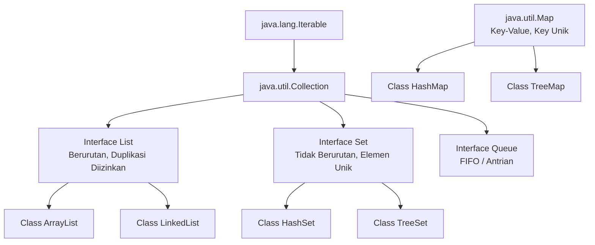

# Minggu 11: Java Collections Framework

## 🎯 Capaian Pembelajaran (Sub-CPMK 4)
Setelah menyelesaikan materi ini, mahasiswa mampu:
1. Memahami arsitektur dan kegunaan **Java Collections Framework (JCF)**.
2. Menggunakan tipe koleksi `List` (`ArrayList`, `LinkedList`).
3. Menggunakan tipe koleksi `Set` (`HashSet`, `TreeSet`) untuk data unik.
4. Menggunakan tipe koleksi `Map` (`HashMap`, `TreeMap`) untuk pasangan *Key-Value*.
5. Melakukan manipulasi objek koleksi dengan Generics `<T>` dan *Enhanced For-Loop / Iterator*.

---

## 1. Apa itu Java Collections Framework?

**Java Collections Framework (JCF)** adalah sekumpulan antarmuka (*interface*) dan class siap pakai untuk menyimpan, memanipulasi, mencari, dan mengurutkan kumpulan objek secara dinamis (tidak seperti Array biasa yang berukuran tetap).



---

## 2. Interface List: `ArrayList`

`ArrayList` adalah array dinamis yang secara otomatis membesar ukurannya saat elemen baru ditambahkan.

### Contoh Manipulasi Objek Mahasiswa:
```java
import java.util.ArrayList;
import java.util.List;

class Mahasiswa {
    private String nim;
    private String nama;
    private double ipk;

    public Mahasiswa(String nim, String nama, double ipk) {
        this.nim = nim;
        this.nama = nama;
        this.ipk = ipk;
    }

    public String getNim() { return nim; }
    public String getNama() { return nama; }
    public double getIpk() { return ipk; }

    @Override
    public String toString() {
        return nim + " - " + nama + " (IPK: " + ipk + ")";
    }
}

public class MainArrayList {
    public static void main(String[] args) {
        // Deklarasi ArrayList dengan Generics <Mahasiswa>
        List<Mahasiswa> daftarMhs = new ArrayList<>();

        // 1. Menambahkan elemen (add)
        daftarMhs.add(new Mahasiswa("2401", "Budi Santoso", 3.75));
        daftarMhs.add(new Mahasiswa("2402", "Siti Aminah", 3.90));
        daftarMhs.add(new Mahasiswa("2403", "Andi Wijaya", 3.60));

        // 2. Menampilkan jumlah elemen (size)
        System.out.println("Total mahasiswa: " + daftarMhs.size());

        // 3. Iterasi dengan Enhanced For Loop
        System.out.println("\n--- Daftar Mahasiswa ---");
        for (Mahasiswa mhs : daftarMhs) {
            System.out.println(mhs);
        }

        // 4. Menghapus elemen berdasarkan indeks (remove)
        daftarMhs.remove(0); // Menghapus Budi

        // 5. Mengakses elemen tertentu (get)
        System.out.println("\nMahasiswa pertama sekarang: " + daftarMhs.get(0).getNama());
    }
}
```

---

## 3. Interface Set: `HashSet`

`Set` digunakan untuk menyimpan kumpulan data **tanpa duplikasi**. Jika kita memasukkan data yang sama, data tersebut akan diabaikan.

```java
import java.util.HashSet;
import java.util.Set;

public class MainSet {
    public static void main(String[] args) {
        Set<String> hobi = new HashSet<>();

        hobi.add("Membaca");
        hobi.add("Koding");
        hobi.add("Berenang");
        hobi.add("Koding"); // Duplikat: Tidak akan ditambahkan lagi

        System.out.println("Daftar Hobi: " + hobi); // Output: [Membaca, Koding, Berenang]
        System.out.println("Apakah suka Koding? " + hobi.contains("Koding"));
    }
}
```

---

## 4. Interface Map: `HashMap` (Key-Value)

`Map` menyimpan data dalam bentuk pasangan **Kunci (Key)** dan **Nilai (Value)**. Key bersifat unik.

```java
import java.util.HashMap;
import java.util.Map;

public class MainHashMap {
    public static void main(String[] args) {
        // Map dengan Key: NIM (String), Value: Nama Mahasiswa (String)
        Map<String, String> dataMhs = new HashMap<>();

        // 1. Menambahkan pasangan key-value (put)
        dataMhs.put("2401001", "Rian Hidayat");
        dataMhs.put("2401002", "Dewi Sartika");
        dataMhs.put("2401003", "Bambang Pamungkas");

        // 2. Mengambil data berdasarkan Key (get)
        String nama = dataMhs.get("2401002");
        System.out.println("NIM 2401002 adalah: " + nama);

        // 3. Iterasi seluruh Key dan Value
        System.out.println("\n--- Seluruh Data di Map ---");
        for (Map.Entry<String, String> entry : dataMhs.entrySet()) {
            System.out.println("NIM: " + entry.getKey() + " => Nama: " + entry.getValue());
        }
    }
}
```

---

## 5. Ringkasan Perbandingan Collection

| Tipe Collection | Karakteristik Utama | Contoh Implementasi |
| :--- | :--- | :--- |
| **List** | Berurutan (*ordered*), bisa diakses dengan index, boleh duplikat. | `ArrayList`, `LinkedList` |
| **Set** | Tidak berurutan, elemen unik (*no duplicate*). | `HashSet`, `TreeSet` |
| **Map** | Pasangan Key-Value, Key harus unik, akses cepat via Key. | `HashMap`, `TreeMap` |

---

## 📝 Tugas Praktikum

1. Buat class `Produk` dengan atribut `id`, `nama`, `harga`, dan `kategori`.
2. Buat program inventaris toko menggunakan `ArrayList<Produk>`.
3. Sediakan fitur menu:
   - Tambah Produk
   - Tampilkan Seluruh Produk
   - Cari Produk berdasarkan ID
   - Hitung Total Nilai Stok Seluruh Produk
