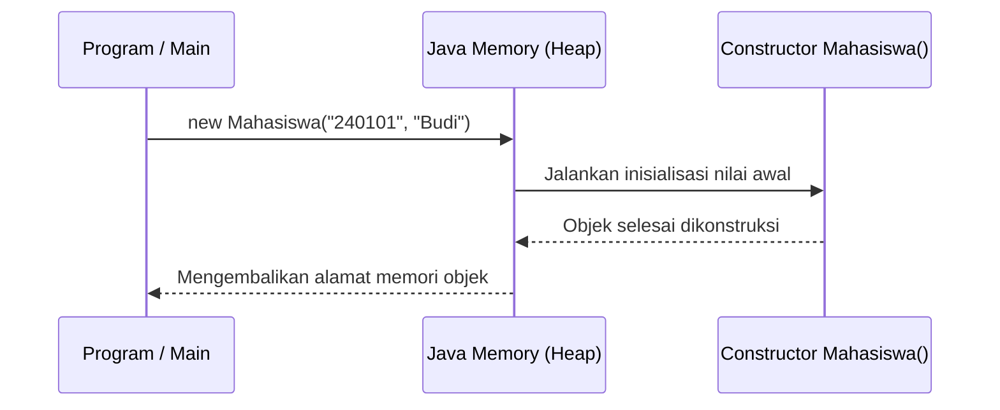

# Minggu 3: Constructor dan Method

## 🎯 Capaian Pembelajaran (Sub-CPMK 2)
Setelah menyelesaikan materi ini, mahasiswa mampu:
1. Memahami fungsi dan mekanisme kerja **Constructor** dalam inisialisasi objek.
2. Membuat **Default Constructor** dan **Parameterized Constructor**.
3. Menerapkan konsep **Constructor Overloading** dan **Method Overloading**.
4. Mengimplementasikan method dengan *return value* dan *parameter*.

---

## 1. Apa itu Constructor?

**Constructor** adalah method khusus yang dieksekusi secara otomatis saat sebuah objek diinstansiasi (dibuat dengan kata kunci `new`).

### Ciri-ciri Constructor:
1. Nama constructor **wajib persis sama** dengan nama Class.
2. **Tidak memiliki return type** (bahkan tidak menggunakan `void`).
3. Berfungsi utama untuk menginisialisasi atribut/nilai awal dari objek.



---

## 2. Jenis-Jenis Constructor

### A. Default Constructor (Tanpa Parameter)
Jika kita tidak mendefinisikan constructor sama sekali, Java akan menyediakan constructor kosong secara otomatis. Namun, kita juga bisa membuatnya secara eksplisit:

```java
public class Mobil {
    String merk;
    int kecepatanMaksimal;

    // Default constructor
    public Mobil() {
        this.merk = "Tanpa Merk";
        this.kecepatanMaksimal = 100;
        System.out.println("Objek Mobil default berhasil dibuat.");
    }
}
```

### B. Parameterized Constructor (Dengan Parameter)
Memungkinkan kita memberikan nilai atribut secara langsung saat objek dibuat:

```java
public class Mobil {
    String merk;
    int kecepatanMaksimal;

    // Parameterized constructor
    public Mobil(String merk, int kecepatanMaksimal) {
        this.merk = merk;
        this.kecepatanMaksimal = kecepatanMaksimal;
    }
}
```

### C. Constructor Overloading
Sebuah class dapat memiliki lebih dari satu constructor dengan jumlah atau tipe parameter yang berbeda:

```java
public class RekeningBank {
    String nomorRekening;
    String pemilik;
    double saldo;

    // Constructor 1: Tanpa setoran awal
    public RekeningBank(String nomorRekening, String pemilik) {
        this.nomorRekening = nomorRekening;
        this.pemilik = pemilik;
        this.saldo = 0.0;
    }

    // Constructor 2: Dengan setoran awal
    public RekeningBank(String nomorRekening, String pemilik, double saldoAwal) {
        this.nomorRekening = nomorRekening;
        this.pemilik = pemilik;
        this.saldo = saldoAwal;
    }

    // Memanggil constructor lain dalam class yang sama menggunakan this()
    public RekeningBank() {
        this("000000", "Anonim", 0.0);
    }
}
```

---

## 3. Jenis dan Struktur Method

Method adalah blok kode yang melakukan tugas tertentu (*behavior*).

```java
[Access_Modifier] [Return_Type] [Nama_Method]([Daftar_Parameter]) {
    // Body / Logika method
    return [Nilai]; // Wajib jika return type bukan void
}
```

### 1. Method Void (Tanpa Return Value)
Hanya menjalankan instruksi tanpa mengembalikan data ke pemanggilnya:
```java
public void tampilkanSalam(String nama) {
    System.out.println("Halo, selamat datang " + nama + "!");
}
```

### 2. Method Non-Void (Dengan Return Value)
Mengembalikan nilai dengan tipe data tertentu (`int`, `double`, `String`, atau Objek):
```java
public double hitungLuasPersegiPanjang(double panjang, double lebar) {
    double luas = panjang * lebar;
    return luas;
}
```

---

## 4. Method Overloading

**Method Overloading** adalah kemampuan mendefinisikan beberapa method dengan **nama yang sama** di dalam satu class, asalkan **daftar parameternya berbeda** (baik dari segi jumlah parameter maupun tipe datanya).

> [!NOTE]
> Perbedaan *return type* saja tidak cukup untuk overloading. Daftar parameternya harus berbeda!

```java
public class Kalkulator {

    // 1. Menjumlahkan 2 bilangan bulat
    public int tambah(int a, int b) {
        return a + b;
    }

    // 2. Menjumlahkan 3 bilangan bulat (Overload: beda jumlah parameter)
    public int tambah(int a, int b, int c) {
        return a + b + c;
    }

    // 3. Menjumlahkan 2 bilangan desimal (Overload: beda tipe parameter)
    public double tambah(double a, double b) {
        return a + b;
    }
}
```

### Pengujian di Main:
```java
public class MainKalkulator {
    public static void main(String[] args) {
        Kalkulator calc = new Kalkulator();

        System.out.println("2 + 3 = " + calc.tambah(2, 3));              // Memanggil method 1
        System.out.println("2 + 3 + 4 = " + calc.tambah(2, 3, 4));        // Memanggil method 2
        System.out.println("2.5 + 4.1 = " + calc.tambah(2.5, 4.1));      // Memanggil method 3
    }
}
```

---

## 5. Keyword `static`: Method & Variabel

- **Instance Variable / Method:** Milik masing-masing objek. Harus diakses lewat objek (`objek.method()`).
- **Static Variable / Method:** Milik Class secara keseluruhan. Bisa diakses langsung lewat nama class tanpa perlu membuat objek (`NamaClass.method()`).

```java
public class KonversiSuhu {
    // Variabel static (konstanta)
    public static final double FAKTOR_REAMUR = 0.8;

    // Method static
    public static double celciusKeFahrenheit(double celcius) {
        return (celcius * 9.0 / 5.0) + 32;
    }
}

// Cara penggunaan:
double fahrenheit = KonversiSuhu.celciusKeFahrenheit(100); // 212.0
```

---

## 📝 Tugas & Praktikum

1. Buat class `AkunPengguna` yang memiliki atribut: `username`, `email`, `statusAktif` (boolean), dan `role` (Admin/User).
2. Sediakan 2 constructor:
   - Constructor 1: Menerima `username` dan `email` (default `statusAktif` = `true`, `role` = `"User"`).
   - Constructor 2: Menerima `username`, `email`, `statusAktif`, dan `role`.
3. Buat method overloading `ubahPassword`:
   - `ubahPassword(String passwordLama, String passwordBaru)`
   - `ubahPassword(String pinOtentikasi, int kodeOtp, String passwordBaru)`
4. Tulis program `Main` untuk menguji fungsionalitas tersebut.
