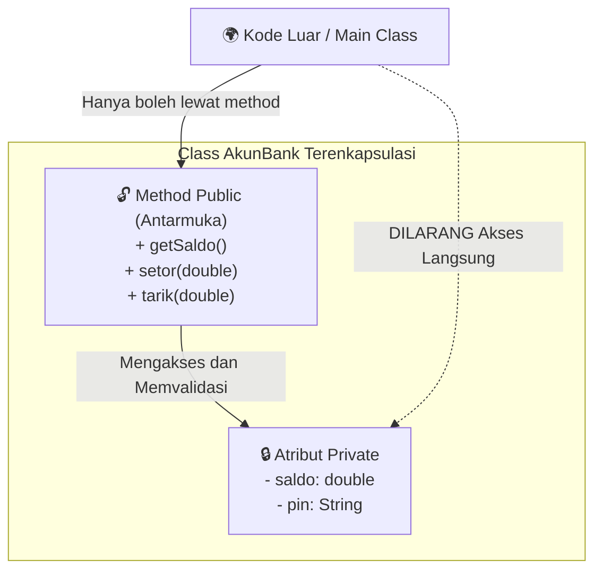

# Minggu 4: Encapsulation & Access Modifiers

## 🎯 Capaian Pembelajaran (Sub-CPMK 3)
Setelah menyelesaikan materi ini, mahasiswa mampu:
1. Memahami prinsip **Encapsulation (Pembungkusan)** dan **Information Hiding**.
2. Menggunakan 4 jenis **Access Modifiers** di Java (`private`, *default*, `protected`, `public`).
3. Mengimplementasikan metode **Getter** (*Accessor*) dan **Setter** (*Mutator*) dengan validasi data.

---

## 1. Apa itu Encapsulation?

**Encapsulation** adalah teknik membungkus data (atribut) dan kode yang memanipulasinya (method) menjadi satu kesatuan tertutup di dalam class, serta menyembunyikan detail internal objek dari intervensi langsung luar (*information hiding*).



### Mengapa Encapsulation Penting?
1. **Integritas Data:** Mencegah atribut diisi dengan nilai yang tidak valid (misal: saldo minus, umur < 0).
2. **Fleksibilitas:** Developer bebas mengubah implementasi internal class tanpa merusak kode pihak lain yang menggunakannya.
3. **Read-Only / Write-Only:** Kita dapat membuat atribut hanya bisa dibaca (*read-only*) tanpa setter, atau hanya bisa ditulis (*write-only*).

---

## 2. Access Modifiers di Java

Tingkat akses (*visibility*) menentukan dari mana sebuah atribut, method, atau class dapat diakses:

| Access Modifier | Class yang Sama | Package yang Sama | Subclass (Turunan) | Luar Package (Global) |
| :--- | :---: | :---: | :---: | :---: |
| `public` | ✅ Ya | ✅ Ya | ✅ Ya | ✅ Ya |
| `protected` | ✅ Ya | ✅ Ya | ✅ Ya | ❌ Tidak |
| *default* (tanpa keyword) | ✅ Ya | ✅ Ya | ❌ Tidak | ❌ Tidak |
| `private` | ✅ Ya | ❌ Tidak | ❌ Tidak | ❌ Tidak |

---

## 3. Implementasi Getter dan Setter

Standar konvensi di Java (*JavaBeans*):
- Jadikan semua atribut bertipe **`private`**.
- Sediakan method **`public getNamaAtribut()`** untuk membaca data.
- Sediakan method **`public setNamaAtribut(TipeData nilai)`** untuk mengubah data (disertai validasi logika).

```java
public class Pasien {
    // 1. Atribut disembunyikan (private)
    private String nama;
    private int umur;
    private double beratBadan;

    // 2. Constructor
    public Pasien(String nama, int umur, double beratBadan) {
        this.nama = nama;
        setUmur(umur); // Gunakan setter agar tervalidasi
        setBeratBadan(beratBadan);
    }

    // 3. Getter & Setter untuk Nama
    public String getNama() {
        return nama;
    }

    public void setNama(String nama) {
        if (nama != null && !nama.trim().isEmpty()) {
            this.nama = nama;
        } else {
            System.out.println("Error: Nama tidak boleh kosong!");
        }
    }

    // 4. Getter & Setter untuk Umur dengan Validasi
    public int getUmur() {
        return umur;
    }

    public void setUmur(int umur) {
        if (umur >= 0 && umur <= 150) {
            this.umur = umur;
        } else {
            System.out.println("Error: Nilai umur tidak logis (" + umur + ")");
            this.umur = 0;
        }
    }

    // 5. Getter & Setter untuk Berat Badan
    public double getBeratBadan() {
        return beratBadan;
    }

    public void setBeratBadan(double beratBadan) {
        if (beratBadan > 0) {
            this.beratBadan = beratBadan;
        } else {
            System.out.println("Error: Berat badan harus bernilai positif!");
        }
    }
}
```

---

## 4. Studi Kasus Lengkap: Dompet Digital (*E-Wallet*)

Mari kita buat class `DompetDigital` yang aman:

```java
public class DompetDigital {
    private String nomorPonsel;
    private double saldo;
    private String pin;

    public DompetDigital(String nomorPonsel, String pinAwal, double saldoAwal) {
        this.nomorPonsel = nomorPonsel;
        this.pin = pinAwal;
        this.saldo = (saldoAwal >= 0) ? saldoAwal : 0;
    }

    // Getter untuk saldo (hanya bisa dilihat, tidak ada setSaldo langsung)
    public double getSaldo() {
        return saldo;
    }

    public String getNomorPonsel() {
        return nomorPonsel;
    }

    // Method transaksi setor saldo
    public void topUp(double jumlah) {
        if (jumlah >= 10000) {
            saldo += jumlah;
            System.out.println("Top-up berhasil: Rp " + jumlah + ". Saldo sekarang: Rp " + saldo);
        } else {
            System.out.println("Gagal Top-up: Minimal pengisian adalah Rp 10.000");
        }
    }

    // Method transaksi transfer dengan validasi PIN dan kecukupan saldo
    public boolean transfer(String pinInput, double jumlah, String nomorTujuan) {
        if (!this.pin.equals(pinInput)) {
            System.out.println("Transfer gagal: PIN salah!");
            return false;
        }

        if (jumlah <= 0) {
            System.out.println("Transfer gagal: Jumlah transfer tidak valid!");
            return false;
        }

        if (saldo < jumlah) {
            System.out.println("Transfer gagal: Saldo tidak mencukupi!");
            return false;
        }

        saldo -= jumlah;
        System.out.println("Transfer Rp " + jumlah + " ke " + nomorTujuan + " berhasil!");
        System.out.println("Sisa saldo Anda: Rp " + saldo);
        return true;
    }
}
```

### Main Class Pengujian:
```java
public class MainDompet {
    public static void main(String[] args) {
        DompetDigital ewallet = new DompetDigital("081234567890", "123456", 50000);

        // ewallet.saldo = 1000000000; // ❌ ERROR COMPILE: saldo has private access

        System.out.println("Saldo awal: Rp " + ewallet.getSaldo());

        ewallet.topUp(50000); // Saldo jadi 100.000
        ewallet.transfer("999999", 30000, "089876543210"); // Gagal (PIN salah)
        ewallet.transfer("123456", 30000, "089876543210"); // Berhasil (Sisa: 70.000)
    }
}
```

---

## 📝 Tugas Mandiri

1. Buat class `NilaiAkademik` dengan atribut private: `nilaiTugas`, `nilaiUTS`, `nilaiUAS`.
2. Pasang validasi pada setter: Nilai harus berada dalam rentang `0` sampai `100`.
3. Tambahkan method getter `hitungNilaiAkhir()` dengan bobot:
   - Tugas: 30%
   - UTS: 30%
   - UAS: 40%
4. Tambahkan method `getGrade()` yang mengembalikan huruf mutu:
   - Nilai $\ge 85$: 'A'
   - Nilai $\ge 70$: 'B'
   - Nilai $\ge 55$: 'C'
   - Nilai $\ge 40$: 'D'
   - Nilai $< 40$: 'E'
