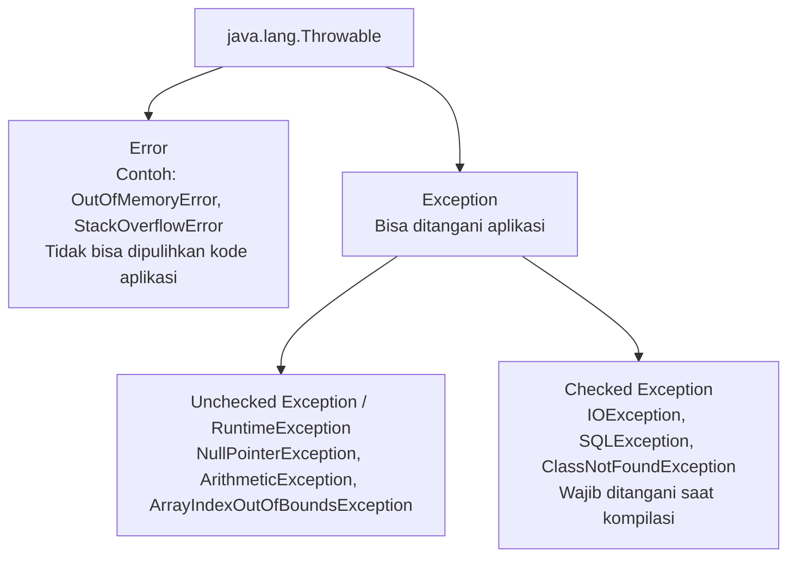

# Minggu 10: Exception Handling

## 🎯 Capaian Pembelajaran (Sub-CPMK 4)
Setelah menyelesaikan materi ini, mahasiswa mampu:
1. Memahami konsep **Exception** dan perbedaannya dengan Error / Bug logis.
2. Menerapkan blok **`try`**, **`catch`**, dan **`finally`** untuk menangani kesalahan runtime secara elegan.
3. Menggunakan kata kunci **`throw`** dan **`throws`** untuk propagasi error.
4. Membuat dan mengimplementasikan **Custom Exception** sesuai kebutuhan domain aplikasi.

---

## 1. Apa itu Exception?

**Exception** adalah kondisi abnormal atau kesalahan yang terjadi saat program sedang berjalan (*runtime*), yang dapat mengganggu jalannya alur instruksi normal jika tidak ditangani (*crash*).



---

## 2. Blok `try-catch-finally`

### Struktur Dasar:
```java
try {
    // Kode berpotensi menghasilkan exception
} catch (TipeException e) {
    // Penanganan saat terjadi exception
} finally {
    // Blok yang PASTI SELALU dieksekusi (baik terjadi exception maupun tidak)
    // Biasanya untuk menutup koneksi database atau file stream
}
```

### Contoh Praktis:
```java
import java.util.Scanner;

public class ContohException {
    public static void main(String[] args) {
        Scanner input = new Scanner(System.in);

        try {
            System.out.print("Masukkan angka pembilang: ");
            int a = input.nextInt();

            System.out.print("Masukkan angka penyebut: ");
            int b = input.nextInt();

            int hasil = a / b; // Berpotensi ArithmeticException jika b == 0
            System.out.println("Hasil pembagian: " + hasil);

        } catch (ArithmeticException e) {
            System.out.println("❌ Terjadi Error: Tidak dapat membagi angka dengan nol!");
        } catch (Exception e) {
            System.out.println("❌ Terjadi kesalahan input: " + e.getMessage());
        } finally {
            System.out.println("ℹ️ Program selesai dieksekusi.");
            input.close();
        }
    }
}
```

---

## 3. Keyword `throw` vs `throws`

- **`throw`**: Digunakan untuk **melempar exception secara eksplisit** di dalam kode method.
- **`throws`**: Digunakan pada **deklarasi method** untuk memberitahukan pemanggil bahwa method ini berpotensi melempar exception tertentu.

```java
public class ValidasiUmur {
    // throws memberitahu pemanggil bahwa method ini melempar IllegalArgumentException
    public static void cekKelayakanSIM(int umur) throws IllegalArgumentException {
        if (umur < 17) {
            // Melempar exception secara manual
            throw new IllegalArgumentException("Umur minimal untuk pembuatan SIM adalah 17 tahun!");
        }
        System.out.println("Syarat usia terpenuhi. Silakan lanjut ke tes mengemudi.");
    }

    public static void main(String[] args) {
        try {
            cekKelayakanSIM(15);
        } catch (IllegalArgumentException e) {
            System.out.println("Peringatan: " + e.getMessage());
        }
    }
}
```

---

## 4. Membuat Custom Exception (Exception Buatan Sendiri)

Kita bisa membuat class turunan dari `Exception` (untuk checked exception) atau `RuntimeException` (untuk unchecked exception):

```java
// Definisi Custom Exception
public class SaldoKurangException extends Exception {
    private double saldoSekarang;
    private double jumlahTarik;

    public SaldoKurangException(double saldoSekarang, double jumlahTarik) {
        super("Saldo tidak cukup! Saldo: Rp " + saldoSekarang + ", Penarikan: Rp " + jumlahTarik);
        this.saldoSekarang = saldoSekarang;
        this.jumlahTarik = jumlahTarik;
    }
}
```

### Penerapan pada Class Akun:
```java
public class AkunBank {
    private double saldo;

    public AkunBank(double saldoAwal) {
        this.saldo = saldoAwal;
    }

    public void tarik(double jumlah) throws SaldoKurangException {
        if (jumlah > saldo) {
            throw new SaldoKurangException(saldo, jumlah);
        }
        saldo -= jumlah;
        System.out.println("Penarikan Rp " + jumlah + " berhasil. Sisa saldo: Rp " + saldo);
    }
}
```

---

## 📝 Tugas Praktikum

1. Buat custom exception bernama `BatasKreditException`.
2. Buat class `KartuKredit` dengan atribut `limitKredit` dan `totalPemakaian`.
3. Buat method `gesek(double nominal)` yang akan melempar `BatasKreditException` jika total pemakaian melebihi limit.
4. Buat program pengujian dengan blok `try-catch-finally` untuk memastikan aplikasi tidak crash saat exception terjadi.
