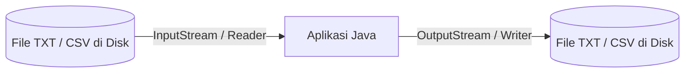

# Minggu 12: File Handling (I/O Streams)

## 🎯 Capaian Pembelajaran (Sub-CPMK 4)
Setelah menyelesaikan materi ini, mahasiswa mampu:
1. Memahami konsep **I/O Streams** dan manipulasi berkas (*File*) di Java.
2. Membaca (*Read*) dan menulis (*Write*) berkas teks menggunakan `FileWriter`, `FileReader`, `BufferedWriter`, dan `BufferedReader`.
3. Menerapkan fitur **`try-with-resources`** (Java 7+) untuk manajemen penutupan resource otomatis.
4. Menyimpan data objek ke dalam format berkas terstruktur (seperti CSV atau TXT) untuk persistensi data sederhana.

---

## 1. Konsep File I/O di Java

Aplikasi sering kali membutuhkan penyimpanan data yang persisten (tidak hilang saat program ditutup). File I/O memungkinkan aplikasi membaca data dari disk atau menulis hasil proses ke disk.



---

## 2. Menulis File Teks (File Writing)

Gunakan `FileWriter` dan `BufferedWriter` untuk menulis data baris per baris secara efisien:

```java
import java.io.BufferedWriter;
import java.io.FileWriter;
import java.io.IOException;

public class TulisFile {
    public static void main(String[] args) {
        String namaFile = "mahasiswa.txt";

        // try-with-resources: resource otomatis ditutup setelah blok selesai
        try (BufferedWriter writer = new BufferedWriter(new FileWriter(namaFile, false))) {
            // parameter true: append mode, false: overwrite mode
            writer.write("NIM,Nama,IPK");
            writer.newLine();
            writer.write("240101,Budi Santoso,3.85");
            writer.newLine();
            writer.write("240102,Siti Aminah,3.90");
            writer.newLine();
            writer.write("240103,Rian Ardianto,3.70");

            System.out.println("✅ Data berhasil disimpan ke " + namaFile);
        } catch (IOException e) {
            System.err.println("❌ Gagal menulis berkas: " + e.getMessage());
        }
    }
}
```

---

## 3. Membaca File Teks (File Reading)

Gunakan `BufferedReader` dan `FileReader` untuk membaca teks baris demi baris:

```java
import java.io.BufferedReader;
import java.io.FileReader;
import java.io.IOException;

public class BacaFile {
    public static void main(String[] args) {
        String namaFile = "mahasiswa.txt";

        try (BufferedReader reader = new BufferedReader(new FileReader(namaFile))) {
            String baris;
            System.out.println("=== ISI BERKAS: " + namaFile + " ===");

            while ((baris = reader.readLine()) != null) {
                System.out.println(baris);
            }
        } catch (IOException e) {
            System.err.println("❌ Gagal membaca berkas: " + e.getMessage());
        }
    }
}
```

---

## 4. Studi Kasus: Parsing File CSV ke Objek Java

Mari kita membaca data dari file CSV dan mengubahnya kembali menjadi objek `Mahasiswa`:

```java
import java.io.BufferedReader;
import java.io.FileReader;
import java.io.IOException;
import java.util.ArrayList;
import java.util.List;

class Mahasiswa {
    String nim;
    String nama;
    double ipk;

    public Mahasiswa(String nim, String nama, double ipk) {
        this.nim = nim;
        this.nama = nama;
        this.ipk = ipk;
    }

    public void info() {
        System.out.println(nim + " | " + nama + " | IPK: " + ipk);
    }
}

public class ParserCSV {
    public static void main(String[] args) {
        List<Mahasiswa> listMhs = new ArrayList<>();

        try (BufferedReader br = new BufferedReader(new FileReader("mahasiswa.txt"))) {
            String line = br.readLine(); // Lewati header CSV

            while ((line = br.readLine()) != null) {
                // Pisahkan string berdasarkan tanda koma (,)
                String[] data = line.split(",");
                if (data.length == 3) {
                    String nim = data[0].trim();
                    String nama = data[1].trim();
                    double ipk = Double.parseDouble(data[2].trim());

                    // Buat objek Mahasiswa dan masukkan ke list
                    listMhs.add(new Mahasiswa(nim, nama, ipk));
                }
            }

            System.out.println("--- Hasil Konversi CSV ke Objek Java ---");
            for (Mahasiswa m : listMhs) {
                m.info();
            }
        } catch (IOException e) {
            System.out.println("Error IO: " + e.getMessage());
        }
    }
}
```

---

## 📝 Tugas Praktikum

1. Buat program catatan harian (*Simple Diary Logger*).
2. Program menerima input tanggal dan isi catatan dari pengguna melalui terminal.
3. Simpan setiap catatan baru ke dalam file `catatan.txt` (menggunakan mode *append* agar catatan lama tidak terhapus).
4. Sediakan opsi menu untuk melihat semua riwayat catatan yang pernah disimpan.
