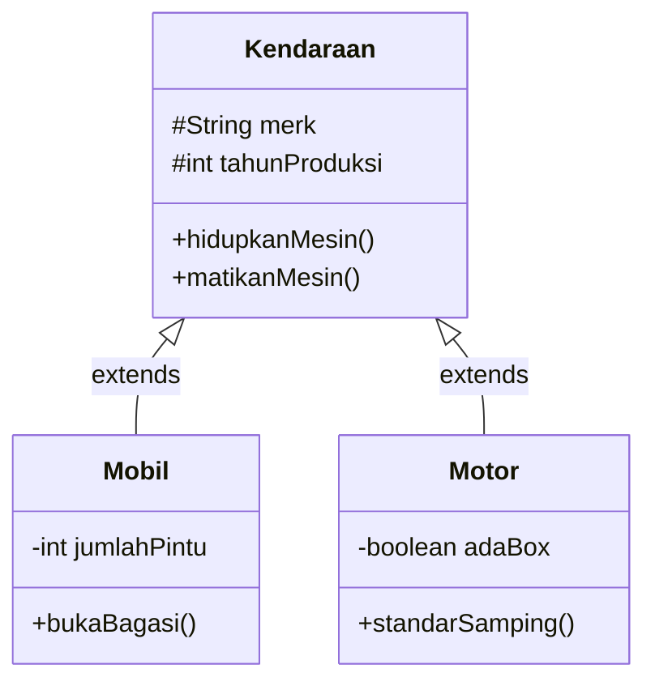
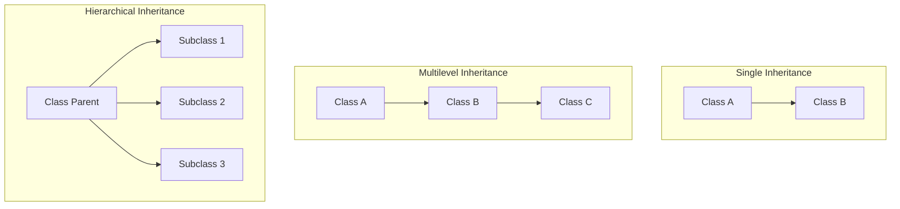

# Minggu 5: Inheritance (Pewarisan)

## 🎯 Capaian Pembelajaran (Sub-CPMK 3)
Setelah menyelesaikan materi ini, mahasiswa mampu:
1. Memahami konsep **Inheritance** (Superclass dan Subclass) dalam relasi *IS-A*.
2. Menerapkan kata kunci **`extends`** untuk menurunkan class.
3. Memanfaatkan kata kunci **`super`** untuk memanggil constructor dan method milik parent class.
4. Membedakan jenis-jenis pewarisan (*Single, Multilevel, Hierarchical*).

---

## 1. Apa itu Inheritance?

**Inheritance (Pewarisan)** adalah mekanisme OOP di mana suatu class baru (*child class / subclass / derived class*) dapat mewarisi atribut dan method dari class yang sudah ada (*parent class / superclass / base class*).



### Keuntungan Utama:
- **Prinsip DRY (Don't Repeat Yourself):** Menghindari penulisan ulang kode yang sama.
- **Hierarki yang Jelas:** Memodelkan relasi dunia nyata dengan hubungan **"IS-A"** (Mobil *is a* Kendaraan).
- **Extensibility:** Mempermudah penambahan fungsionalitas baru tanpa merombak superclass.

---

## 2. Penggunaan Kata Kunci `extends`

Di Java, pewarisan menggunakan kata kunci `extends`.

> [!WARNING]
> Java **tidak mendukung Multiple Inheritance pada class** (sebuah class tidak bisa meng-`extends` lebih dari satu superclass secara langsung). Untuk mengatasinya, Java menggunakan *Interface*.

### Contoh Superclass:
```java
// Superclass (Induk)
public class Kendaraan {
    protected String merk;
    protected int tahunProduksi;

    public Kendaraan(String merk, int tahunProduksi) {
        this.merk = merk;
        this.tahunProduksi = tahunProduksi;
    }

    public void infoKendaraan() {
        System.out.println("Merk: " + merk + " | Tahun: " + tahunProduksi);
    }

    public void klakson() {
        System.out.println("Tin tin!");
    }
}
```

### Contoh Subclass (Menggunakan `super`):
```java
// Subclass 1: Mobil
public class Mobil extends Kendaraan {
    private int jumlahPintu;

    // Constructor Subclass
    public Mobil(String merk, int tahunProduksi, int jumlahPintu) {
        // Memanggil constructor superclass dengan keyword super()
        super(merk, tahunProduksi);
        this.jumlahPintu = jumlahPintu;
    }

    // Method khusus yang hanya dimiliki Mobil
    public void nyalakanAC() {
        System.out.println("AC Mobil " + merk + " dinyalakan.");
    }

    // Override infoKendaraan untuk menambah info pintu
    @Override
    public void infoKendaraan() {
        super.infoKendaraan(); // Panggil method milik induk
        System.out.println("Jumlah Pintu: " + jumlahPintu);
    }
}
```

---

## 3. Fungsi Kata Kunci `super`

`super` adalah variabel referensi yang digunakan untuk merujuk langsung ke objek superclass terdekat:

1. **`super()`:** Memanggil constructor milik superclass (harus diletakkan di **baris pertama** di dalam constructor subclass).
2. **`super.namaMethod()`:** Memanggil method milik superclass yang mungkin sudah dioverride di subclass.
3. **`super.namaAtribut`:** Mengakses atribut milik superclass jika terjadi penamaan yang sama (*shadowing*).

---

## 4. Hirarki Tipe Pewarisan di Java



1. **Single Inheritance:** Satu subclass hanya mewarisi satu superclass (e.g. `Mobil extends Kendaraan`).
2. **Multilevel Inheritance:** Pewarisan berantai (e.g. `Pegawai` $\rightarrow$ `Manager` $\rightarrow$ `DirekturUtama`).
3. **Hierarchical Inheritance:** Satu superclass diwarisi oleh banyak subclass sekaligus (e.g. `Kendaraan` diwarisi oleh `Mobil`, `Motor`, dan `Truk`).

---

## 5. Studi Kasus: Hirarki Karyawan Perusahaan

```java
// Base Class
public class Karyawan {
    protected String nip;
    protected String nama;
    protected double gajiPokok;

    public Karyawan(String nip, String nama, double gajiPokok) {
        this.nip = nip;
        this.nama = nama;
        this.gajiPokok = gajiPokok;
    }

    public double hitungTotalGaji() {
        return gajiPokok;
    }

    public void tampilkanProfil() {
        System.out.println("NIP  : " + nip);
        System.out.println("Nama : " + nama);
        System.out.println("Total Pendapatan : Rp " + hitungTotalGaji());
    }
}

// Subclass 1: Manager (Mendapat Tunjangan Jabatan)
public class Manager extends Karyawan {
    private double tunjanganJabatan;

    public Manager(String nip, String nama, double gajiPokok, double tunjanganJabatan) {
        super(nip, nama, gajiPokok);
        this.tunjanganJabatan = tunjanganJabatan;
    }

    @Override
    public double hitungTotalGaji() {
        return gajiPokok + tunjanganJabatan;
    }
}

// Subclass 2: Programmer (Mendapat Bonus Lembur & Proyek)
public class Programmer extends Karyawan {
    private double bonusProyek;

    public Programmer(String nip, String nama, double gajiPokok, double bonusProyek) {
        super(nip, nama, gajiPokok);
        this.bonusProyek = bonusProyek;
    }

    @Override
    public double hitungTotalGaji() {
        return gajiPokok + bonusProyek;
    }
}
```

---

## 📝 Tugas Praktikum

1. Buat class induk `Bentuk` yang memiliki atribut `warna` dan method `hitungLuas()` serta `hitungKeliling()`.
2. Buat subclass `Persegi` yang meng-`extends` `Bentuk` dengan atribut `sisi`.
3. Buat subclass `Lingkaran` yang meng-`extends` `Bentuk` dengan atribut `jariJari`.
4. Uji semua class di program utama `MainBentuk.java` dengan membuat objek dari masing-masing bangun datar dan tampilkan luas serta kelilingnya.
