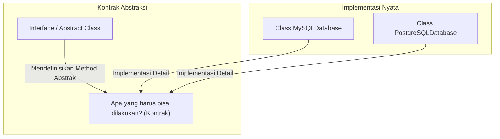
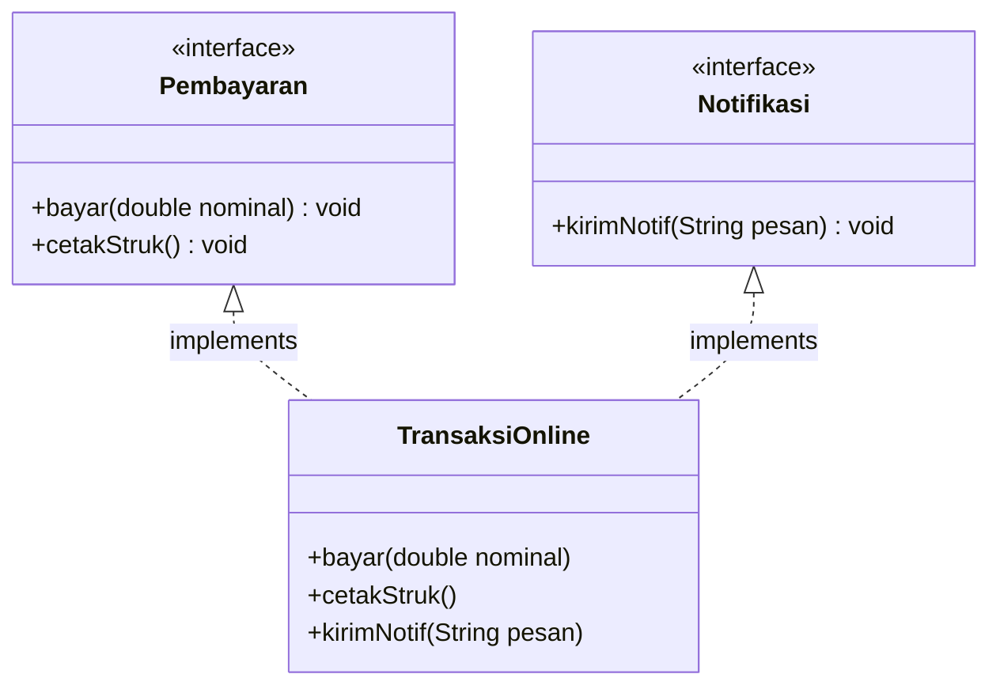

# Minggu 7: Abstraction (Interface dan Abstract Class)

## 🎯 Capaian Pembelajaran (Sub-CPMK 3)
Setelah menyelesaikan materi ini, mahasiswa mampu:
1. Memahami konsep **Abstraction (Abstraksi)** sebagai pemisahan antara "apa yang dilakukan" (*what to do*) dan "bagaimana melakukannya" (*how to do it*).
2. Mendefinisikan dan menerapkan **Abstract Class** serta **Abstract Method**.
3. Mendefinisikan dan mengimplementasikan **Interface** menggunakan kata kunci `implements`.
4. Membedakan karakteristik, kelebihan, dan skenario penggunaan antara *Abstract Class* vs *Interface*.

---

## 1. Apa itu Abstraction?

**Abstraction (Abstraksi)** adalah proses menyembunyikan detail implementasi yang kompleks dari pengguna dan hanya mengekspos fungsi pentingnya saja.



---

## 2. Abstract Class dan Abstract Method

**Abstract Class** adalah class yang tidak dapat diinstansiasi secara langsung menjadi objek (tidak bisa `new AbstractClass()`). Class ini berfungsi sebagai template induk (*incomplete class*) bagi subclass-subclass turunannya.

### Ciri-ciri:
1. Dideklarasikan dengan kata kunci **`abstract`**.
2. Dapat memiliki **abstract method** (method tanpa body/kurung kurawal) dan juga **concrete method** (method biasa yang memiliki isi).
3. Subclass turunan pertama yang bukan abstract **wajib** mengimplementasikan semua abstract method induknya.

```java
// Abstract Superclass
public abstract class BangunDatar {
    protected String nama;

    public BangunDatar(String nama) {
        this.nama = nama;
    }

    // Method biasa (Concrete)
    public void info() {
        System.out.println("Bangun datar: " + nama);
    }

    // Abstract Method: Subclass WAJIB menyediakan implementasi rumusnya
    public abstract double hitungLuas();
    public abstract double hitungKeliling();
}
```

### Implementasi Subclass:
```java
public class Lingkaran extends BangunDatar {
    private double jariJari;

    public Lingkaran(double jariJari) {
        super("Lingkaran");
        this.jariJari = jariJari;
    }

    @Override
    public double hitungLuas() {
        return Math.PI * jariJari * jariJari;
    }

    @Override
    public double hitungKeliling() {
        return 2 * Math.PI * jariJari;
    }
}
```

---

## 3. Interface di Java

**Interface** adalah kontrak perilaku (*behavioral contract*) 100% murni yang hanya berisi deklarasi method tanpa implementasi (sebelum Java 8).

### Karakteristik Interface:
1. Didefinisikan dengan kata kunci **`interface`**, dan diimplementasikan dengan **`implements`**.
2. Semua atribut di interface otomatis bersifat **`public static final`** (konstanta).
3. Semua method di interface otomatis bersifat **`public abstract`**.
4. Sebuah class dapat mengimplementasikan **banyak interface sekaligus** (*Multiple Interface Implementation*), menyelesaikan limitasi single inheritance Java!



### Contoh Deklarasi Interface:
```java
// Interface 1: Pembayaran
public interface Pembayaran {
    void bayar(double nominal);
    void cetakBuktiTransaksi();
}

// Interface 2: Notifikasi
public interface NotifikasiSMS {
    void kirimSMS(String nomorHp, String pesan);
}
```

### Multiple Implementation di Class:
```java
public class TransaksiECommerce implements Pembayaran, NotifikasiSMS {
    private String idPesanan;

    public TransaksiECommerce(String idPesanan) {
        this.idPesanan = idPesanan;
    }

    @Override
    public void bayar(double nominal) {
        System.out.println("Pesanan " + idPesanan + " berhasil dibayar sebesar Rp " + nominal);
    }

    @Override
    public void cetakBuktiTransaksi() {
        System.out.println("Struk bukti bayar diterbitkan untuk order: " + idPesanan);
    }

    @Override
    public void kirimSMS(String nomorHp, String pesan) {
        System.out.println("SMS terkirim ke " + nomorHp + ": " + pesan);
    }
}
```

---

## 4. Perbandingan: Abstract Class vs Interface

| Kriteria | Abstract Class | Interface |
| :--- | :--- | :--- |
| **Kata Kunci** | `abstract class` & `extends` | `interface` & `implements` |
| **Pewarisan Ganda** | ❌ Tidak bisa (Hanya 1 superclass) | ✅ Bisa (Bisa implement banyak interface) |
| **Atribut** | Bebas (bisa `private`, `protected`, dsb) | Hanya konstanta (`public static final`) |
| **Metode** | Campuran (Abstract & Concrete) | Mayoritas Abstract (atau `default` sejak Java 8) |
| **Tujuan Desain** | Berbagi kode dan hierarki objek sejenis (*IS-A*) | Mendefinisikan kapabilitas/kontrak perilaku (*CAN-DO*) |

---

## 📝 Tugas Praktikum

1. Buat interface `BisaBicara` dengan method `bicara()`.
2. Buat interface `BisaTerbang` dengan method `terbang()`.
3. Buat abstract class `Hewan` dengan atribut `nama` dan abstract method `makan()`.
4. Buat class `BurungElang` yang meng-`extends` `Hewan` serta meng-`implements` `BisaTerbang`.
5. Buat class `RobotPintar` yang hanya meng-`implements` `BisaBicara`.
6. Tunjukkan bahwa interface dapat digunakan secara fleksibel pada class yang tidak berada dalam hierarki keluarga yang sama!
