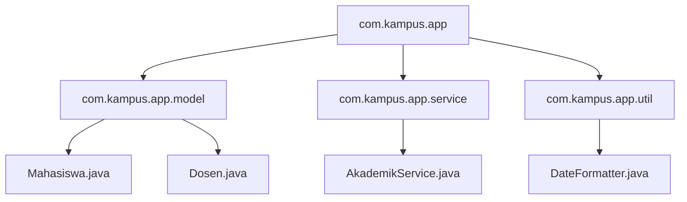

# Minggu 9: Package dan Modularitas Project

## 🎯 Capaian Pembelajaran (Sub-CPMK 4)
Setelah menyelesaikan materi ini, mahasiswa mampu:
1. Memahami konsep **Package** sebagai namespace dan pengelompokan class di Java.
2. Menggunakan statement **`package`** dan **`import`**.
3. Menyusun struktur folder project Java yang rapi dan modular.
4. Memahami visibilitas level package (*default / package-private*).

---

## 1. Apa itu Package?

**Package** dalam Java adalah mekanisme untuk mengelompokkan class, interface, enum, dan subpackage yang saling terkait ke dalam satu direktori kerja (namespace).



### Manfaat Package:
1. **Mencegah Bentrok Nama (Name Collisions):** Dua class dengan nama yang sama (misal `Date`) bisa berada dalam package yang berbeda (`java.util.Date` vs `java.sql.Date`).
2. **Kontrol Akses yang Lebih Baik:** Memberikan batasan akses package-level (*package-private*).
3. **Kemudahan Navigasi & Maintainability:** Mempermudah anggota tim menemukan file dalam project besar.

---

## 2. Aturan Penamaan Konvensi Package

Konvensi penamaan package di Java menggunakan **domain internet terbalik** dalam huruf kecil semua:
- Format: `[tld].[nama_perusahaan/institusi].[nama_project].[nama_modul]`
- Contoh:
  - `id.ac.uui.siak.model`
  - `com.google.gson`
  - `org.apache.commons`

---

## 3. Mendeklarasikan dan Mengimpor Package

### A. Deklarasi Package
Statement `package` wajib diletakkan di **baris paling pertama** pada file sumber Java:

```java
// Lokasi file: src/id/ac/uui/model/Mahasiswa.java
package id.ac.uui.model;

public class Mahasiswa {
    private String nim;
    private String nama;

    public Mahasiswa(String nim, String nama) {
        this.nim = nim;
        this.nama = nama;
    }

    public void tampilkan() {
        System.out.println(nim + " - " + nama);
    }
}
```

### B. Menggunakan Statement `import`
Ketika class berada di package lain, kita harus mengimpornya:

```java
// Lokasi file: src/id/ac/uui/Main.java
package id.ac.uui;

// Import spesifik
import id.ac.uui.model.Mahasiswa;

// Atau import seluruh class di dalam package (menggunakan *)
// import id.ac.uui.model.*;

public class Main {
    public static void main(String[] args) {
        Mahasiswa m = new Mahasiswa("240101", "Fajar");
        m.tampilkan();
    }
}
```

---

## 4. Struktur Arsitektur Paket Standar (Layered Architecture)

Dalam proyek profesional, kode umumnya dipecah menjadi beberapa layer:

```
src/
└── com/
    └── myapp/
        ├── model/          # Representasi data / entity (Mahasiswa, Produk)
        ├── repository/     # Akses data / query database
        ├── service/        # Logika bisnis aplikasi
        ├── controller/     # Interaksi pengguna / antarmuka GUI / API
        └── util/           # Fungsi pembantu (Validator, Formatting)
```

---

## 📝 Latihan Praktik

1. Buat struktur folder proyek:
   - `com.sisteminformasi.entity.Buku`
   - `com.sisteminformasi.service.PeminjamanService`
   - `com.sisteminformasi.AppMain`
2. Hubungkan class-class tersebut menggunakan kata kunci `package` dan `import` yang tepat, lalu jalankan programnya.
