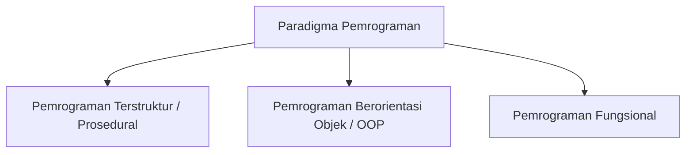
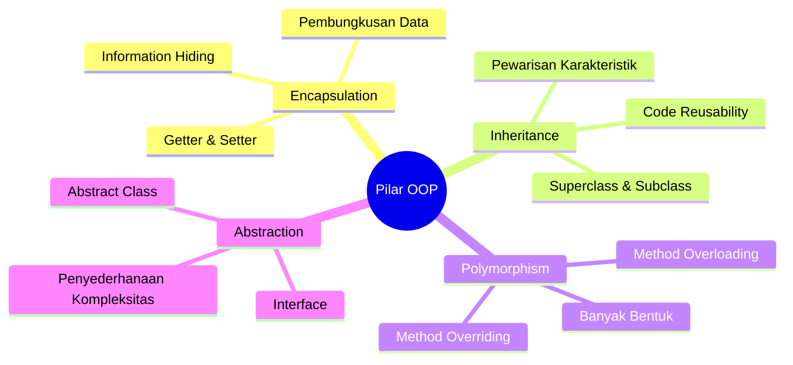

# Minggu 1: Pengantar Pemrograman Berorientasi Objek (OOP)

## 🎯 Capaian Pembelajaran (Sub-CPMK 1)
Setelah menyelesaikan materi ini, mahasiswa mampu:
1. Menjelaskan konsep dan definisi *Object-Oriented Programming* (OOP).
2. Membandingkan paradigma pemrograman prosedural (terstruktur) dengan paradigma berorientasi objek.
3. Mengidentifikasi kelebihan dan manfaat penerapan OOP dalam rekayasa perangkat lunak modern.

---

## 1. Apa itu Paradigma Pemrograman?

Paradigma pemrograman adalah cara pandang atau pendekatan fundamental dalam menstrukturkan dan menyelesaikan masalah komputasi menggunakan kode program.



### A. Pemrograman Prosedural / Terstruktur
Pada pendekatan prosedural (seperti C atau Pascal dasar), program dibagi menjadi fungsi/prosedur yang beroperasi pada data global atau lokal.
- **Fokus utama:** Langkah demi langkah aksi (*verbs* / algoritma).
- **Karakteristik:** Data dan fungsi terpisah. Data mengalir bebas di antara fungsi, sehingga pada aplikasi skala besar, perubahan struktur data dapat merusak banyak fungsi sekaligus.

### B. Pemrograman Berorientasi Objek (OOP)
OOP memandang program sebagai kumpulan **Objek** mandiri yang saling berinteraksi dan berkomunikasi dengan cara mengirimkan pesan.
- **Fokus utama:** Entitas dan tanggung jawab objek (*nouns* / objek nyata).
- **Karakteristik:** Data (atribut) dan fungsi pengolah data (method) dibungkus menjadi satu kesatuan utuh.

---

## 2. Perbandingan: Prosedural vs OOP

| Aspek | Pemrograman Prosedural | Pemrograman Berorientasi Objek (OOP) |
| :--- | :--- | :--- |
| **Pusat Pendekatan** | Fungsi / Prosedur / Algoritma | Objek yang memuat Data & Perilaku |
| **Struktur Program** | Terbagi dalam fungsi-fungsi (*Top-Down*) | Terbagi dalam Class dan Objek (*Bottom-Up*) |
| **Keamanan Data** | Data rentan termodifikasi fungsi lain | Data dilindungi melalui Encapsulation (*private*) |
| **Kemudahan Maintenance** | Sulit pada skala besar (efek domino) | Sangat modular, mudah dirawat & diekstrak |
| **Reusability** | Terbatas pada pemanggilan fungsi | Sangat tinggi via Inheritance & Polymorphism |
| **Representasi Masalah** | Alur proses instruksi matematis/logika | Model objek dunia nyata (e.g. Mahasiswa, AkunBank) |

---

## 3. Empat Pilar Utama OOP

Konsep OOP ditopang oleh 4 pilar fundamental:



1. **Encapsulation (Pembungkusan):** Mengikat data dan method menjadi satu unit serta menyembunyikan detail internal dari akses luar yang tidak sah.
2. **Inheritance (Pewarisan):** Mekanisme di mana class baru mewarisi atribut dan method dari class yang sudah ada untuk menghindari duplikasi kode.
3. **Polymorphism (Banyak Bentuk):** Kemampuan suatu objek atau method untuk merespons dengan cara yang berbeda tergantung konteksnya saat runtime atau compile-time.
4. **Abstraction (Abstraksi):** Menyembunyikan implementasi internal yang rumit dan hanya menampilkan fitur antarmuka yang penting bagi pengguna objek.

---

## 4. Analogi Dunia Nyata: Mobil sebagai Objek

Bayangkan sebuah **Mobil**:
- **Atribut (State/Data):** Warna, merk, kecepatan saat ini, kapasitas tangki, jumlah roda.
- **Method (Behavior/Fungsi):** `gas()`, `rem()`, `belokKiri()`, `isiBensin()`.
- **Encapsulation:** Pengemudi tidak perlu menyentuh putaran piston mesin secara langsung, cukup injak pedal gas.
- **Abstraction:** Pengemudi berinteraksi lewat setir dan pedal, tanpa perlu tahu detail rumus kimia pembakaran bahan bakar di mesin.

```java
// Contoh analogi class Mobil sederhana di Java
public class Mobil {
    // 1. Atribut (State)
    private String merk;
    private int kecepatan;

    // 2. Constructor
    public Mobil(String merk) {
        this.merk = merk;
        this.kecepatan = 0;
    }

    // 3. Method (Behavior)
    public void tambahKecepatan(int akselerasi) {
        this.kecepatan += akselerasi;
        System.out.println(merk + " melaju dengan kecepatan: " + kecepatan + " km/jam");
    }

    public void rem() {
        this.kecepatan = 0;
        System.out.println(merk + " berhenti.");
    }
}
```

---

## 5. Keuntungan Menggunakan OOP

1. **Modularitas (Modularity):** Kode terbagi ke dalam class-class mandiri yang mudah ditest dan diperbaiki secara terisolasi.
2. **Dapat Digunakan Kembali (Code Reusability):** Pewarisan dan komponen OOP memungkinkan penggunaan ulang kode tanpa menulis ulang dari awal.
3. **Kemudahan Pemeliharaan (Maintainability):** Perubahan internal class tidak akan merusak sistem lain selama antarmuka (*interface*) tetap konsisten.
4. **Skalabilitas (Scalability):** Sangat cocok untuk proyek perangkat lunak berskala besar yang dikerjakan oleh tim *software engineer*.
5. **Fleksibilitas (Flexibility):** Dukungan polymorphism membuat aplikasi mudah diekstensikan dengan fitur baru di masa depan.

---

## 📝 Latihan & Diskusi

1. **Analisis Masalah:** Sebutkan 3 entitas di lingkungan kampus (misal: Perpustakaan, SIAKAD) dan tentukan atribut serta perilakunya jika dimodelkan dalam OOP!
2. **Studi Kasus:** Mengapa sistem perbankan lebih aman dan stabil dibangun dengan paradigma OOP dibanding prosedural murni? Jelaskan ditinjau dari pilar *Encapsulation*.
3. **Eksplorasi:** Pasang JDK (Java Development Kit) versi 17+ atau 21 LTS dan siapkan IDE pilihan Anda (VS Code, IntelliJ IDEA, atau Eclipse).
