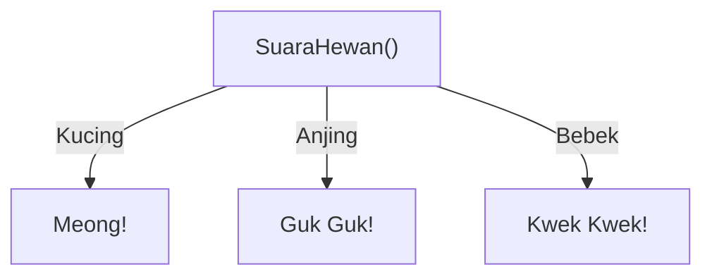
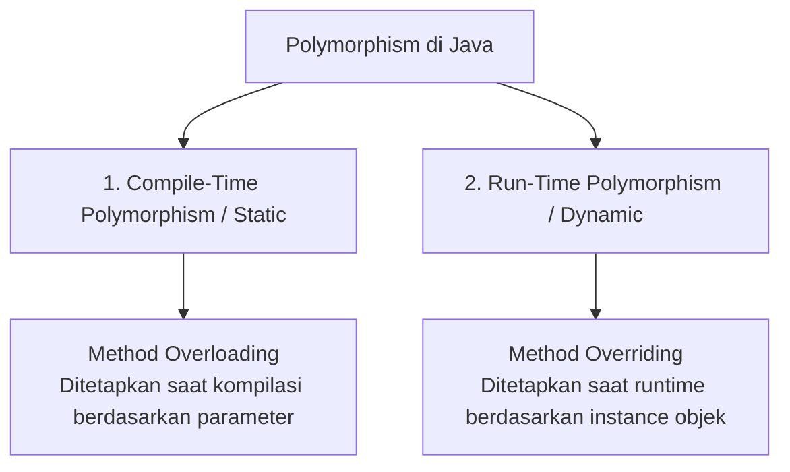

# Minggu 6: Polymorphism (Polimorfisme)

## 🎯 Capaian Pembelajaran (Sub-CPMK 3)
Setelah menyelesaikan materi ini, mahasiswa mampu:
1. Memahami esensi **Polymorphism** ("banyak bentuk") dalam pemrograman berorientasi objek.
2. Membedakan **Compile-Time Polymorphism (Static Binding)** dan **Run-Time Polymorphism (Dynamic Binding)**.
3. Menerapkan **Method Overloading** dan **Method Overriding** disertai anotasi `@Override`.
4. Menggunakan konsep *Upcasting* dan operator `instanceof` untuk fleksibilitas kode.

---

## 1. Apa itu Polymorphism?

**Polymorphism** berasal dari bahasa Yunani: *Poly* (banyak) dan *Morph* (bentuk). Dalam OOP, polymorphism adalah kemampuan satu entitas (seperti method atau objek referensi) untuk memiliki perilaku yang berbeda sesuai dengan tipe objek yang menjalankannya saat program dieksekusi.



---

## 2. Dua Jenis Polymorphism



### Perbandingan Overloading vs Overriding

| Fitur | Method Overloading (Static) | Method Overriding (Dynamic) |
| :--- | :--- | :--- |
| **Lokasi** | Terjadi di dalam **satu class yang sama** | Terjadi antara **Superclass dan Subclass** |
| **Nama Method** | Wajib Sama | Wajib Sama |
| **Parameter** | **Wajib Berbeda** (jumlah/tipe data) | **Wajib Sama Persis** |
| **Return Type** | Boleh sama atau berbeda | Wajib sama (atau subtype/kovarian) |
| **Binding Time** | Compile-Time (Early Binding) | Run-Time (Late Binding) |

---

## 3. Dynamic Polymorphism (Method Overriding)

Method overriding terjadi ketika subclass menyediakan implementasi spesifik dari method yang sudah didefinisikan di superclass.

```java
// Superclass
public class Hewan {
    public void bersuara() {
        System.out.println("Hewan mengeluarkan suara umum...");
    }
}

// Subclass 1
public class Kucing extends Hewan {
    @Override
    public void bersuara() {
        System.out.println("Kucing: Meong... meong...");
    }
}

// Subclass 2
public class Anjing extends Hewan {
    @Override
    public void bersuara() {
        System.out.println("Anjing: Guk... guk!");
    }
}

// Subclass 3
public class Burung extends Hewan {
    @Override
    public void bersuara() {
        System.out.println("Burung: Cicit cuit...");
    }
}
```

---

## 4. Upcasting & Array Polimorfik

Kekuatan utama polymorphism terlihat ketika kita menggunakan **referensi superclass untuk menampung berbagai objek subclass**:

```java
public class MainPolymorphism {
    public static void main(String[] args) {
        // Upcasting: Tipe Hewan menampung objek Kucing, Anjing, Burung
        Hewan h1 = new Kucing();
        Hewan h2 = new Anjing();
        Hewan h3 = new Burung();

        // JVM akan secara cerdas memanggil method milik objek asli saat runtime!
        h1.bersuara(); // Output: Kucing: Meong... meong...
        h2.bersuara(); // Output: Anjing: Guk... guk!
        h3.bersuara(); // Output: Burung: Cicit cuit...

        System.out.println("\n--- Polimorfisme Menggunakan Array ---");
        Hewan[] kebunBinatang = { new Kucing(), new Anjing(), new Burung(), new Kucing() };

        for (Hewan h : kebunBinatang) {
            h.bersuara(); // Loop generik yang memproses beragam turunan hewan
        }
    }
}
```

---

## 5. Operator `instanceof` dan Downcasting

Jika kita ingin memanggil method spesifik yang hanya ada di subclass saat menggunakan referensi superclass, kita perlu melakukan pemeriksaan tipe dengan `instanceof` lalu melakukan *downcasting*:

```java
public class DokterHewan {
    public void obati(Hewan h) {
        System.out.println("Dokter mulai memeriksa pasien...");
        h.bersuara();

        if (h instanceof Kucing) {
            System.out.println("-> Berikan vaksin khusus kucing & makanan basah.");
        } else if (h instanceof Anjing) {
            System.out.println("-> Cek rabies & kebersihan telinga anjing.");
        }
    }
}
```

---

## 6. Studi Kasus Nyata: Sistem Pembayaran Toko Online

```java
// Parent Class
public class MetodePembayaran {
    protected double jumlah;

    public MetodePembayaran(double jumlah) {
        this.jumlah = jumlah;
    }

    public void prosesPembayaran() {
        System.out.println("Memproses pembayaran standar senilai: Rp " + jumlah);
    }
}

// Subclass: Transfer Bank
public class TransferBank extends MetodePembayaran {
    private String nomorRekening;

    public TransferBank(double jumlah, String nomorRekening) {
        super(jumlah);
        this.nomorRekening = nomorRekening;
    }

    @Override
    public void prosesPembayaran() {
        System.out.println("Verifikasi transfer ke rekening " + nomorRekening + " senilai Rp " + jumlah + " [SUKSES]");
    }
}

// Subclass: E-Wallet
public class PembayaranQris extends MetodePembayaran {
    private String idTransaksi;

    public PembayaranQris(double jumlah, String idTransaksi) {
        super(jumlah);
        this.idTransaksi = idTransaksi;
    }

    @Override
    public void prosesPembayaran() {
        System.out.println("QRIS Terverifikasi! Transaksi " + idTransaksi + " lunas sebesar Rp " + jumlah);
    }
}
```

---

## 📝 Tugas Praktikum

1. Buat superclass `AkunBank` dengan method `hitungBungaBulanan()`.
2. Buat subclass `TabunganBiasa` (bunga 1% per tahun), `Deposito` (bunga 5% per tahun), dan `TabunganSyariah` (nisbah bagi hasil).
3. Buat program utama yang menyimpan ketiga jenis akun tersebut dalam array polimorfik `AkunBank[]` dan cetak total bunga/bagi hasil bulanan masing-masing.
