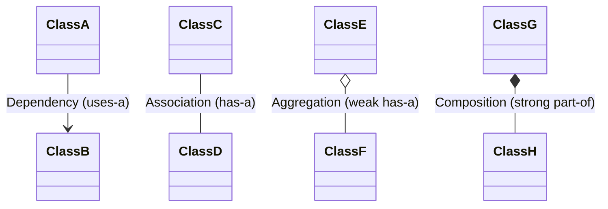
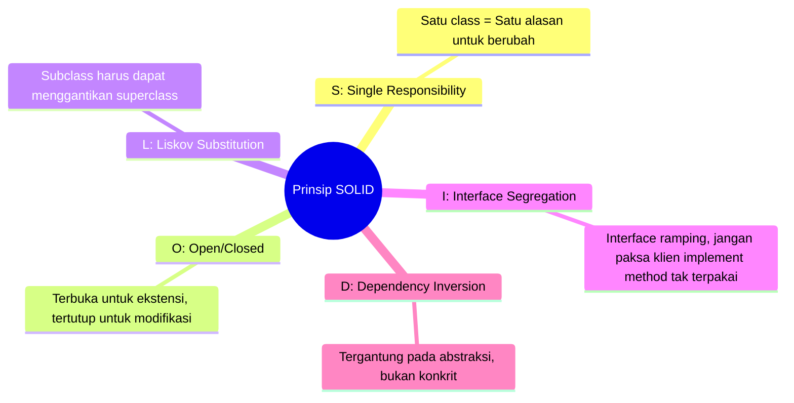

# Minggu 13: Dasar SOLID Principle dan Desain Class

## 🎯 Capaian Pembelajaran (Sub-CPMK 5)
Setelah menyelesaikan materi ini, mahasiswa mampu:
1. Memahami relasi antar class (*Association, Aggregation, Composition, Dependency*).
2. Memahami pentingnya arsitektur perangkat lunak yang bersih (*Clean Architecture*).
3. Mengenal dan menerapkan 5 prinsip desain berorientasi objek **SOLID** (Robert C. Martin / Uncle Bob).
4. Menganalisis *code smell* dan merancang class yang *maintainable* dan *loosely coupled*.

---

## 1. Relasi Antar Class dalam OOP

Selain pewarisan (*Inheritance / IS-A*), objek dalam dunia nyata saling terhubung dengan berbagai pola relasi:



1. **Dependency (Ketergantungan):** Suatu class menggunakan class lain sebagai parameter sementara di suatu method.
2. **Association (Asosiasi):** Hubungan dua arah di mana kedua objek independen dan memiliki siklus hidup masing-masing (e.g. `Dokter` dan `Pasien`).
3. **Aggregation (Agregasi):** Relasi "has-a" yang longgar. Jika parent dihancurkan, child tetap bisa hidup mandiri (e.g. `Departemen` memiliki kumpulan `Dosen`).
4. **Composition (Komposisi):** Relasi bagian kepemilikan mutlak (*part-of*). Jika parent dihancurkan, child ikut hancur (e.g. `Mobil` memiliki `Mesin`).

---

## 2. Pengenalan Prinsip SOLID

**SOLID** adalah akronim dari lima prinsip desain berorientasi objek yang membuat perangkat lunak lebih mudah dipahami, fleksibel, dan mudah dikembangkan dalam jangka panjang.



---

## 3. Penjelasan Masing-Masing Prinsip SOLID

### S — Single Responsibility Principle (SRP)
> *"A class should have one, and only one, reason to change."*
> Sebuah class hanya boleh memiliki satu tanggung jawab tunggal.

❌ **Pelanggaran SRP:**
```java
// Melakukan kalkulasi gaji, cetak laporan, dan simpan ke database dalam 1 class!
public class Pegawai {
    public void hitungGaji() { /* ... */ }
    public void cetakSlipKePrinter() { /* ... */ }
    public void simpanKeDatabase() { /* ... */ }
}
```

✅ **Penerapan SRP:**
```java
public class Pegawai {
    private String nama;
    private double gaji;
    // getter, setter
}

public class KalkulatorGaji {
    public double hitung(Pegawai p) { return p.getGaji(); }
}

public class LaporanGajiPrinter {
    public void cetak(Pegawai p) { /* Logika cetak */ }
}

public class PegawaiRepository {
    public void simpan(Pegawai p) { /* Logika database */ }
}
```

---

### O — Open/Closed Principle (OCP)
> *"Software entities should be open for extension, but closed for modification."*
> Kode harus mudah ditambah fitur baru tanpa perlu membongkar atau mengubah kode lama yang sudah teruji.

✅ **Penerapan OCP dengan Polimorfisme:**
```java
public interface Diskon {
    double hitungDiskon(double totalBelanja);
}

public class DiskonMember implements Diskon {
    public double hitungDiskon(double total) { return total * 0.10; }
}

public class DiskonNatal implements Diskon {
    public double hitungDiskon(double total) { return total * 0.20; }
}

// Jika ada promo baru, cukup buat class baru tanpa ubah KasirService!
public class KasirService {
    public double checkout(double total, Diskon diskon) {
        return total - diskon.hitungDiskon(total);
    }
}
```

---

### L — Liskov Substitution Principle (LSP)
> *"Subtypes must be substitutable for their base types without altering the correctness of the program."*
> Subclass harus selalu dapat menggantikan superclass-nya tanpa menyebabkan perilaku program menjadi aneh atau error.

---

### I — Interface Segregation Principle (ISP)
> *"Clients should not be forced to depend upon interfaces that they do not use."*
> Buat banyak interface kecil dan spesifik daripada satu interface raksasa (*Fat Interface*).

```java
// Hindari 1 interface raksasa:
// interface AlatElektronik { void cetak(); void scan(); void fax(); }

// Gunakan interface modular:
public interface BisaCetak { void cetakDokumen(); }
public interface BisaScan { void scanDokumen(); }

public class PrinterBiasa implements BisaCetak {
    public void cetakDokumen() { System.out.println("Mencetak kertas..."); }
}
```

---

### D — Dependency Inversion Principle (DIP)
> *"High-level modules should not depend on low-level modules. Both should depend on abstractions."*
> Modul tingkat tinggi (logika bisnis) tidak boleh bergantung langsung pada modul tingkat rendah (misal: driver database langsung), melainkan bergantung pada interface/abstraksi.

```java
public interface Notifier {
    void send(String recipient, String message);
}

public class EmailNotifier implements Notifier {
    public void send(String email, String msg) { /* Kirim email */ }
}

// OrderService bergantung pada interface Notifier, bukan EmailNotifier konkrit!
public class OrderService {
    private Notifier notifier;

    public OrderService(Notifier notifier) {
        this.notifier = notifier;
    }

    public void processOrder() {
        // ... proses order
        notifier.send("user@mail.com", "Pesanan Anda berhasil!");
    }
}
```

---

## 📝 Diskusi & Latihan

1. Analisis kode di proyek tugas Anda: Apakah ada class yang melanggar *Single Responsibility Principle*?
2. Bagaimana cara merefaktor sebuah sistem notifikasi (Email, SMS, WhatsApp) agar mematuhi *Open/Closed Principle*?
