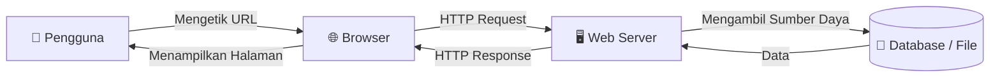
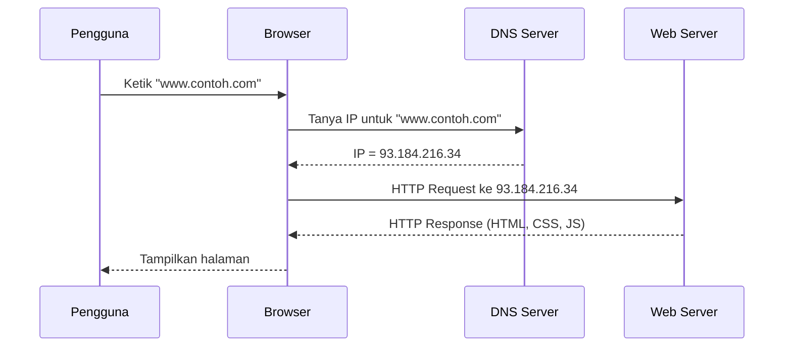
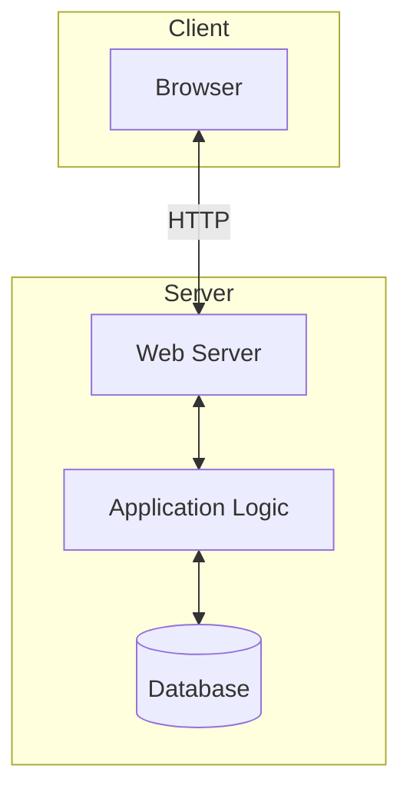
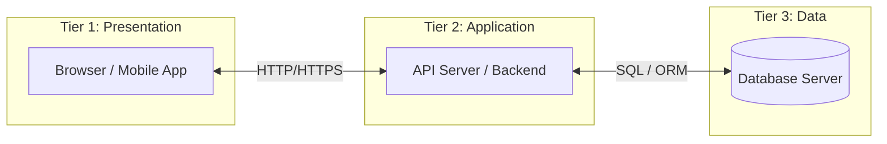

# Minggu 1 — Pengenalan Web & Arsitektur Client-Server

## Tujuan Pembelajaran

Setelah mempelajari materi ini, mahasiswa dapat:
- Menjelaskan cara kerja internet dan web secara umum
- Membedakan peran **Client** dan **Server** dalam arsitektur web
- Memahami protokol **HTTP/HTTPS** dan siklus *request-response*
- Mengenal komponen-komponen dalam ekosistem web

---

## 1. Apa itu Web?

**World Wide Web (WWW)** adalah sistem pengiriman dokumen *hypertext* yang saling terhubung dan dapat diakses melalui internet menggunakan browser.



### Komponen Utama Web

| Komponen | Peran | Contoh |
|----------|-------|--------|
| **Client** | Meminta dan menampilkan konten | Browser (Chrome, Firefox) |
| **Server** | Menerima permintaan, memproses, dan mengembalikan respons | Apache, Nginx, Node.js |
| **Database** | Menyimpan data secara persisten | MySQL, PostgreSQL, MongoDB |
| **DNS** | Menerjemahkan nama domain ke alamat IP | Cloudflare DNS, Google DNS |

---

## 2. Cara Kerja Internet

Internet adalah jaringan komputer global yang menggunakan protokol **TCP/IP** untuk mengidentifikasi dan mengirim data.

### Alamat IP

Setiap perangkat di internet memiliki alamat unik:
- **IPv4**: `192.168.1.1` (32-bit, ~4 miliar alamat)
- **IPv6**: `2001:db8::1` (128-bit, hampir tak terbatas)

### Domain Name System (DNS)



---

## 3. Protokol HTTP & HTTPS

**HTTP (HyperText Transfer Protocol)** adalah protokol komunikasi antara client dan server.

**HTTPS** = HTTP + **TLS/SSL** (enkripsi), ditandai dengan ikon gembok di browser.

### Metode HTTP

| Metode | Fungsi | Contoh Penggunaan |
|--------|--------|-------------------|
| `GET` | Meminta data dari server | Membuka halaman web, mencari data |
| `POST` | Mengirim data baru ke server | Submit form registrasi |
| `PUT` | Memperbarui data secara keseluruhan | Update profil pengguna |
| `PATCH` | Memperbarui sebagian data | Ubah hanya satu field |
| `DELETE` | Menghapus data | Hapus akun pengguna |

### Kode Status HTTP (HTTP Status Codes)

```
2xx → Sukses
    200 OK           → Permintaan berhasil
    201 Created      → Data baru berhasil dibuat

3xx → Redirect
    301 Moved Permanently → URL telah pindah permanen
    302 Found             → URL sementara pindah

4xx → Kesalahan Client
    400 Bad Request  → Permintaan tidak valid
    401 Unauthorized → Belum login
    403 Forbidden    → Tidak punya izin
    404 Not Found    → Halaman tidak ditemukan

5xx → Kesalahan Server
    500 Internal Server Error → Kesalahan di server
    503 Service Unavailable   → Server sibuk/down
```

### Struktur HTTP Request

```http
GET /artikel/pemrograman-web HTTP/1.1
Host: www.contoh.com
User-Agent: Mozilla/5.0
Accept: text/html
Accept-Language: id-ID
Connection: keep-alive
```

### Struktur HTTP Response

```http
HTTP/1.1 200 OK
Content-Type: text/html; charset=UTF-8
Content-Length: 1542
Date: Mon, 23 Feb 2026 08:00:00 GMT

<!DOCTYPE html>
<html>
  <head><title>Contoh</title></head>
  <body><h1>Halo Dunia!</h1></body>
</html>
```

---

## 4. Arsitektur Client-Server

### Model Client-Server Tradisional (Monolith)



### Model 3-Tier (Modern)



---

## 5. Teknologi Web: Frontend vs Backend

### Frontend (Sisi Client)

Teknologi yang berjalan di **browser pengguna**:

```
HTML  → Struktur & konten halaman
CSS   → Tampilan & tata letak (styling)
JavaScript → Interaktivitas & logika sisi client
```

### Backend (Sisi Server)

Teknologi yang berjalan di **server**:

| Bahasa / Runtime | Framework Populer |
|-----------------|-------------------|
| PHP | Laravel, CodeIgniter, Symfony |
| JavaScript (Node.js) | Express.js, NestJS, Next.js |
| Python | Django, Flask, FastAPI |
| Java | Spring Boot |
| Ruby | Ruby on Rails |

### Full-Stack

Developer yang menguasai **keduanya** (Frontend + Backend) disebut **Full-Stack Developer**.

---

## 6. Web Server

**Web Server** adalah perangkat lunak yang menerima permintaan HTTP dan mengirimkan respons.

### Web Server Populer

- **Apache HTTP Server** — Paling banyak digunakan, fleksibel, open-source
- **Nginx** — Performa tinggi, cocok untuk traffic besar
- **LiteSpeed** — Cepat, sering digunakan di shared hosting
- **Node.js (built-in)** — Web server sekaligus runtime JavaScript

### Instalasi Lingkungan Pengembangan

Untuk pengembangan lokal, gunakan paket **XAMPP** (Windows/Linux/macOS):

```bash
# XAMPP menyediakan:
# - Apache Web Server
# - MySQL Database Server  
# - PHP Interpreter
# - phpMyAdmin (GUI Database)
```

---

## 7. URL & URI

**URL (Uniform Resource Locator)** adalah alamat lengkap sebuah sumber daya web.

```
https://www.contoh.com:443/artikel/web?id=1&lang=id#komentar
─────┬── ──────────┬─────── ─┬── ─────────┬───────── ──┬───
  protokol       host      port    path      query    fragment
```

| Bagian | Keterangan | Contoh |
|--------|-----------|--------|
| `https` | Protokol | http, https, ftp |
| `www.contoh.com` | Host / Domain | |
| `443` | Port (opsional) | 80 (HTTP), 443 (HTTPS) |
| `/artikel/web` | Path | Lokasi sumber daya |
| `?id=1&lang=id` | Query String | Parameter tambahan |
| `#komentar` | Fragment | Bagian halaman |

---

## 🏋️ Latihan

1. Buka browser, tekan `F12` untuk membuka DevTools → Network. Buka sebuah website dan amati request/response HTTP yang terjadi.
2. Identifikasi metode HTTP, status code, dan header dari 3 request berbeda.
3. Jelaskan perbedaan antara `http://` dan `https://` dalam konteks keamanan.
4. Gambarlah diagram alur (flowchart) dari saat pengguna mengetik URL hingga halaman tampil di browser.

---

## 📚 Referensi

- [MDN Web Docs — HTTP Overview](https://developer.mozilla.org/en-US/docs/Web/HTTP/Overview)
- [MDN Web Docs — How the Web Works](https://developer.mozilla.org/en-US/docs/Learn/Getting_started_with_the_web/How_the_Web_works)
- Duckett, J. (2014). *HTML and CSS: Design and Build Websites*. Wiley. — Bab 1
