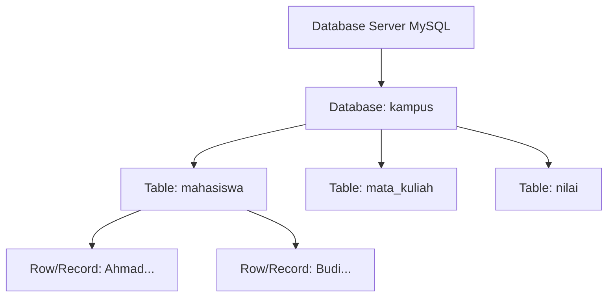
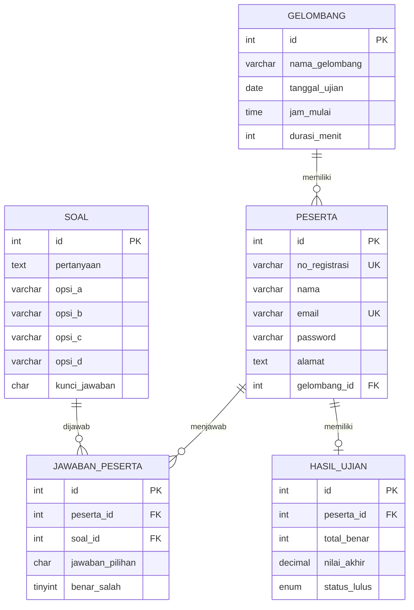

# Minggu 11-12 — Basis Data & CRUD dengan MySQL

## Tujuan Pembelajaran

Setelah mempelajari materi ini, mahasiswa dapat:
- Memahami konsep basis data relasional dan **MySQL**
- Menulis query SQL untuk operasi **CRUD** (Create, Read, Update, Delete)
- Mengintegrasikan MySQL dengan PHP menggunakan **PDO**
- Membangun sistem manajemen data sederhana
- Mencegah SQL Injection

---

## 1. Pengenalan MySQL & SQL

**MySQL** adalah sistem manajemen basis data relasional (RDBMS) open-source yang paling populer di web.

### Komponen Utama



### Membuat Database & Tabel

```sql
-- Membuat database
CREATE DATABASE kampus
  CHARACTER SET utf8mb4
  COLLATE utf8mb4_unicode_ci;

USE kampus;

-- Membuat tabel mahasiswa
CREATE TABLE mahasiswa (
    id      INT UNSIGNED AUTO_INCREMENT PRIMARY KEY,
    nim     VARCHAR(12)  NOT NULL UNIQUE,
    nama    VARCHAR(100) NOT NULL,
    email   VARCHAR(100) NOT NULL UNIQUE,
    prodi   ENUM('IF', 'SI', 'TK') NOT NULL DEFAULT 'IF',
    ipk     DECIMAL(3,2) DEFAULT 0.00,
    foto    VARCHAR(255) NULL,
    aktif   TINYINT(1)   NOT NULL DEFAULT 1,
    dibuat  TIMESTAMP    DEFAULT CURRENT_TIMESTAMP,
    diubah  TIMESTAMP    DEFAULT CURRENT_TIMESTAMP ON UPDATE CURRENT_TIMESTAMP,

    INDEX idx_prodi (prodi),
    INDEX idx_aktif (aktif)
);

-- Membuat tabel mata_kuliah
CREATE TABLE mata_kuliah (
    id     INT UNSIGNED AUTO_INCREMENT PRIMARY KEY,
    kode   VARCHAR(10)  NOT NULL UNIQUE,
    nama   VARCHAR(100) NOT NULL,
    sks    TINYINT      NOT NULL DEFAULT 2,
    semester TINYINT    NOT NULL
);

-- Membuat tabel nilai (relasi many-to-many)
CREATE TABLE nilai (
    id             INT UNSIGNED AUTO_INCREMENT PRIMARY KEY,
    mahasiswa_id   INT UNSIGNED NOT NULL,
    matkul_id      INT UNSIGNED NOT NULL,
    nilai_angka    DECIMAL(4,1),
    nilai_huruf    CHAR(2),
    semester       VARCHAR(10),

    FOREIGN KEY (mahasiswa_id) REFERENCES mahasiswa(id) ON DELETE CASCADE,
    FOREIGN KEY (matkul_id)    REFERENCES mata_kuliah(id) ON DELETE RESTRICT,
    UNIQUE KEY uk_mhs_mk (mahasiswa_id, matkul_id, semester)
);
```

### Tipe Data MySQL

| Tipe | Kegunaan | Contoh |
|------|---------|--------|
| `INT` | Bilangan bulat | ID, umur |
| `DECIMAL(p,s)` | Angka presisi tinggi | IPK (3,2), harga |
| `VARCHAR(n)` | Teks variabel, maks n karakter | Nama, email |
| `TEXT` | Teks panjang | Deskripsi, konten |
| `ENUM(...)` | Salah satu dari pilihan | Status, prodi |
| `TINYINT(1)` | Boolean (0/1) | Aktif/tidak |
| `DATE` | Tanggal | Tanggal lahir |
| `TIMESTAMP` | Tanggal & waktu | Dibuat, diubah |

---

## 2. Operasi CRUD dengan SQL Murni

### CREATE — INSERT

```sql
-- Sisipkan satu data
INSERT INTO mahasiswa (nim, nama, email, prodi, ipk)
VALUES ('21001234', 'Ahmad Fauzi', 'ahmad@email.com', 'IF', 3.75);

-- Sisipkan banyak data sekaligus
INSERT INTO mahasiswa (nim, nama, email, prodi, ipk) VALUES
  ('21001235', 'Budi Santoso',  'budi@email.com',  'SI', 3.20),
  ('21001236', 'Citra Dewi',    'citra@email.com', 'IF', 3.90),
  ('21001237', 'Dedi Kurniawan','dedi@email.com',  'TK', 2.85);
```

### READ — SELECT

```sql
-- Ambil semua data
SELECT * FROM mahasiswa;

-- Kolom tertentu
SELECT nim, nama, ipk FROM mahasiswa;

-- Dengan kondisi
SELECT * FROM mahasiswa WHERE prodi = 'IF';
SELECT * FROM mahasiswa WHERE ipk >= 3.5;
SELECT * FROM mahasiswa WHERE nama LIKE '%Ahmad%'; -- mengandung "Ahmad"

-- Urutkan
SELECT * FROM mahasiswa ORDER BY ipk DESC;
SELECT * FROM mahasiswa ORDER BY nama ASC;

-- Batasi jumlah
SELECT * FROM mahasiswa LIMIT 10;
SELECT * FROM mahasiswa LIMIT 10 OFFSET 20; -- halaman 3 (index 20-29)

-- Agregasi
SELECT COUNT(*)           AS total       FROM mahasiswa;
SELECT AVG(ipk)           AS rata_ipk    FROM mahasiswa;
SELECT MAX(ipk)           AS ipk_max     FROM mahasiswa;
SELECT prodi, COUNT(*) AS jumlah   
  FROM mahasiswa 
  GROUP BY prodi;

-- JOIN — gabungkan tabel
SELECT m.nama, mk.nama AS matkul, n.nilai_angka
  FROM nilai n
  JOIN mahasiswa   m  ON n.mahasiswa_id = m.id
  JOIN mata_kuliah mk ON n.matkul_id    = mk.id
  WHERE m.nim = '21001234';
```

### UPDATE

```sql
-- Update satu kolom
UPDATE mahasiswa SET ipk = 3.80 WHERE nim = '21001234';

-- Update banyak kolom
UPDATE mahasiswa 
  SET ipk = 3.85, aktif = 1
  WHERE id = 1;

-- ⚠️ SELALU pakai WHERE! Tanpa WHERE → semua baris terupdate
```

### DELETE

```sql
-- Hapus berdasarkan kondisi
DELETE FROM mahasiswa WHERE nim = '21001234';

-- ⚠️ SELALU pakai WHERE! Tanpa WHERE → semua data terhapus
-- Untuk keamanan: gunakan soft delete (update aktif = 0)
UPDATE mahasiswa SET aktif = 0 WHERE id = 1;
```

---

## 3. PHP PDO — Koneksi & Query Aman

**PDO (PHP Data Objects)** adalah interface abstrak untuk mengakses berbagai database dengan cara yang seragam.

### Koneksi Database (db.php)

```php
<?php
// db.php — File koneksi yang di-include di setiap halaman

define('DB_HOST', 'localhost');
define('DB_NAME', 'kampus');
define('DB_USER', 'root');
define('DB_PASS', '');  // Ganti dengan password Anda
define('DB_CHAR', 'utf8mb4');

function buatKoneksi(): PDO {
    $dsn = "mysql:host=" . DB_HOST . ";dbname=" . DB_NAME . ";charset=" . DB_CHAR;
    
    $opsi = [
        PDO::ATTR_ERRMODE            => PDO::ERRMODE_EXCEPTION,
        PDO::ATTR_DEFAULT_FETCH_MODE => PDO::FETCH_ASSOC,
        PDO::ATTR_EMULATE_PREPARES   => false,
    ];
    
    try {
        return new PDO($dsn, DB_USER, DB_PASS, $opsi);
    } catch (PDOException $e) {
        // Di produksi: log error, jangan tampilkan ke user!
        error_log("Koneksi gagal: " . $e->getMessage());
        die("Tidak dapat terhubung ke database.");
    }
}

$db = buatKoneksi();
```

### READ — Menampilkan Data

```php
<?php
// index.php — Daftar mahasiswa
require_once "db.php";

// Ambil semua mahasiswa aktif
$stmt = $db->prepare("SELECT * FROM mahasiswa WHERE aktif = 1 ORDER BY nama ASC");
$stmt->execute();
$mahasiswa = $stmt->fetchAll();

// Dengan filter pencarian
$cari = $_GET["cari"] ?? "";
$prodi = $_GET["prodi"] ?? "";

$sql = "SELECT * FROM mahasiswa WHERE aktif = 1";
$params = [];

if ($cari) {
    $sql .= " AND (nama LIKE :cari OR nim LIKE :cari)";
    $params[":cari"] = "%$cari%";
}
if ($prodi) {
    $sql .= " AND prodi = :prodi";
    $params[":prodi"] = $prodi;
}
$sql .= " ORDER BY nama ASC";

$stmt = $db->prepare($sql);
$stmt->execute($params);
$mahasiswa = $stmt->fetchAll();
?>

<!DOCTYPE html>
<html lang="id">
<head>
  <meta charset="UTF-8">
  <title>Daftar Mahasiswa</title>
</head>
<body>
  <h1>Daftar Mahasiswa</h1>
  
  <form method="GET">
    <input type="text" name="cari" value="<?= htmlspecialchars($cari) ?>" placeholder="Cari nama/NIM...">
    <select name="prodi">
      <option value="">Semua Prodi</option>
      <option value="IF" <?= $prodi === 'IF' ? 'selected' : '' ?>>Informatika</option>
      <option value="SI" <?= $prodi === 'SI' ? 'selected' : '' ?>>Sistem Informasi</option>
    </select>
    <button type="submit">Cari</button>
    <a href="index.php">Reset</a>
  </form>
  
  <p>Total: <?= count($mahasiswa) ?> mahasiswa</p>
  <a href="tambah.php">+ Tambah Mahasiswa</a>
  
  <table border="1" cellpadding="8">
    <thead>
      <tr><th>NIM</th><th>Nama</th><th>Email</th><th>Prodi</th><th>IPK</th><th>Aksi</th></tr>
    </thead>
    <tbody>
      <?php if (empty($mahasiswa)): ?>
        <tr><td colspan="6">Tidak ada data.</td></tr>
      <?php else: ?>
        <?php foreach ($mahasiswa as $mhs): ?>
        <tr>
          <td><?= htmlspecialchars($mhs["nim"]) ?></td>
          <td><?= htmlspecialchars($mhs["nama"]) ?></td>
          <td><?= htmlspecialchars($mhs["email"]) ?></td>
          <td><?= htmlspecialchars($mhs["prodi"]) ?></td>
          <td><?= number_format($mhs["ipk"], 2) ?></td>
          <td>
            <a href="edit.php?id=<?= $mhs["id"] ?>">Edit</a> |
            <a href="hapus.php?id=<?= $mhs["id"] ?>" onclick="return confirm('Yakin hapus?')">Hapus</a>
          </td>
        </tr>
        <?php endforeach; ?>
      <?php endif; ?>
    </tbody>
  </table>
</body>
</html>
```

### CREATE — Tambah Data

```php
<?php
// tambah.php
require_once "db.php";

$error = [];
$data = ["nim" => "", "nama" => "", "email" => "", "prodi" => "IF", "ipk" => ""];

if ($_SERVER["REQUEST_METHOD"] === "POST") {
    $data = [
        "nim"   => trim($_POST["nim"]   ?? ""),
        "nama"  => trim($_POST["nama"]  ?? ""),
        "email" => trim($_POST["email"] ?? ""),
        "prodi" => trim($_POST["prodi"] ?? ""),
        "ipk"   => floatval($_POST["ipk"] ?? 0),
    ];

    // Validasi
    if (!preg_match('/^\d{8,12}$/', $data["nim"]))
        $error[] = "NIM harus 8-12 digit angka.";
    if (strlen($data["nama"]) < 3)
        $error[] = "Nama minimal 3 karakter.";
    if (!filter_var($data["email"], FILTER_VALIDATE_EMAIL))
        $error[] = "Email tidak valid.";
    if ($data["ipk"] < 0 || $data["ipk"] > 4)
        $error[] = "IPK antara 0 dan 4.";

    // Cek duplikasi NIM
    if (empty($error)) {
        $cek = $db->prepare("SELECT id FROM mahasiswa WHERE nim = ?");
        $cek->execute([$data["nim"]]);
        if ($cek->fetch()) $error[] = "NIM sudah terdaftar.";
    }

    // Simpan jika tidak ada error
    if (empty($error)) {
        $sql = "INSERT INTO mahasiswa (nim, nama, email, prodi, ipk) VALUES (?, ?, ?, ?, ?)";
        $stmt = $db->prepare($sql);
        $stmt->execute([$data["nim"], $data["nama"], $data["email"], $data["prodi"], $data["ipk"]]);
        
        header("Location: index.php?sukses=1");
        exit;
    }
}
?>
<!-- Form HTML di sini... -->
```

### UPDATE & DELETE

```php
<?php
// hapus.php — Soft delete
require_once "db.php";

$id = filter_input(INPUT_GET, "id", FILTER_VALIDATE_INT);
if (!$id) die("ID tidak valid.");

$stmt = $db->prepare("UPDATE mahasiswa SET aktif = 0 WHERE id = ?");
$stmt->execute([$id]);

header("Location: index.php?hapus=1");
exit;
```

---

## 4. SQL Injection & Pencegahan

### Apa itu SQL Injection?

**SQL Injection** adalah serangan di mana penyerang menyisipkan kode SQL berbahaya melalui input pengguna.

```php
// ❌ SANGAT BERBAHAYA — rentan SQL Injection
$nim = $_GET["nim"];
$sql = "SELECT * FROM mahasiswa WHERE nim = '$nim'";
// Jika nim = "' OR '1'='1" → query bocor semua data!
// Jika nim = "'; DROP TABLE mahasiswa;--" → tabel terhapus!

// ✅ AMAN — Prepared Statement dengan PDO
$nim = $_GET["nim"];
$stmt = $db->prepare("SELECT * FROM mahasiswa WHERE nim = ?");
$stmt->execute([$nim]);
$data = $stmt->fetch();
```

### Prinsip Keamanan Database

1. **Selalu gunakan Prepared Statements** — jangan interpolasi variabel langsung ke SQL
2. **Validasi input** sebelum memproses
3. **Sanitasi output** dengan `htmlspecialchars()` saat menampilkan ke HTML
4. **Hak akses minimal** — user database hanya diberi akses yang diperlukan
5. **Jangan tampilkan pesan error detail** ke pengguna di produksi

---

## 🔍 Studi Kasus Nyata: Basis Data Sistem Ujian Online (Penerimaan Mahasiswa Baru)

Sebagai contoh implementasi di dunia nyata, kita akan mengambil referensi dari penelitian berjudul **"Sistem Ujian Online Tes Masuk Universitas Ubudiyah Indonesia (UUI) Bagi Calon Mahasiswa Baru Berbasis Web"**. 

Sistem ini memiliki dua aktor utama (**Admin** dan **Calon Mahasiswa**) dengan fitur pengelolaan bank soal acak (random), manajemen jadwal/gelombang ujian, pemetaan peserta, serta penentuan kelulusan ujian.

### 1. Perancangan Skema Database (MySQL)

Berdasarkan analisis kebutuhan sistem pada penelitian tersebut, berikut adalah rancangan tabel database relasional yang dibutuhkan:



#### SQL DDL untuk Pembuatan Tabel
```sql
-- 1. Tabel Gelombang Ujian
CREATE TABLE gelombang (
    id INT UNSIGNED AUTO_INCREMENT PRIMARY KEY,
    nama_gelombang VARCHAR(50) NOT NULL,
    tanggal_ujian DATE NOT NULL,
    jam_mulai TIME NOT NULL,
    durasi_menit INT NOT NULL
);

-- 2. Tabel Peserta (Calon Mahasiswa)
CREATE TABLE peserta (
    id INT UNSIGNED AUTO_INCREMENT PRIMARY KEY,
    no_registrasi VARCHAR(20) NOT NULL UNIQUE,
    nama VARCHAR(100) NOT NULL,
    email VARCHAR(100) NOT NULL UNIQUE,
    password VARCHAR(255) NOT NULL,
    alamat TEXT,
    gelombang_id INT UNSIGNED,
    FOREIGN KEY (gelombang_id) REFERENCES gelombang(id) ON DELETE SET NULL
);

-- 3. Tabel Bank Soal
CREATE TABLE soal (
    id INT UNSIGNED AUTO_INCREMENT PRIMARY KEY,
    pertanyaan TEXT NOT NULL,
    opsi_a VARCHAR(255) NOT NULL,
    opsi_b VARCHAR(255) NOT NULL,
    opsi_c VARCHAR(255) NOT NULL,
    opsi_d VARCHAR(255) NOT NULL,
    kunci_jawaban CHAR(1) NOT NULL -- 'A', 'B', 'C', atau 'D'
);

-- 4. Tabel Jawaban Peserta (untuk menyimpan hasil submit ujian per soal)
CREATE TABLE jawaban_peserta (
    id INT UNSIGNED AUTO_INCREMENT PRIMARY KEY,
    peserta_id INT UNSIGNED NOT NULL,
    soal_id INT UNSIGNED NOT NULL,
    jawaban_pilihan CHAR(1),
    benar_salah TINYINT(1) DEFAULT 0, -- 0 = salah, 1 = benar
    FOREIGN KEY (peserta_id) REFERENCES peserta(id) ON DELETE CASCADE,
    FOREIGN KEY (soal_id) REFERENCES soal(id) ON DELETE CASCADE,
    UNIQUE KEY uk_peserta_soal (peserta_id, soal_id)
);

-- 5. Tabel Hasil Akhir Ujian
CREATE TABLE hasil_ujian (
    id INT UNSIGNED AUTO_INCREMENT PRIMARY KEY,
    peserta_id INT UNSIGNED NOT NULL UNIQUE,
    total_benar INT UNSIGNED NOT NULL DEFAULT 0,
    nilai_akhir DECIMAL(5,2) NOT NULL DEFAULT 0.00,
    status_lulus ENUM('LULUS', 'TIDAK LULUS') DEFAULT 'TIDAK LULUS',
    FOREIGN KEY (peserta_id) REFERENCES peserta(id) ON DELETE CASCADE
);
```

### 2. Contoh Implementasi Query CRUD pada Ujian Online

Berikut adalah implementasi query SQL relasional yang digunakan untuk mendukung fitur utama aplikasi ujian online tersebut:

#### A. CREATE (Pendaftaran Calon Mahasiswa & Input Bank Soal)
```sql
-- Pendaftaran peserta baru
INSERT INTO peserta (no_registrasi, nama, email, password, alamat, gelombang_id)
VALUES ('UUI0219-17', 'Yusrina Dewi', 'yusrina99@email.com', '$2y$10$xyz...', 'Dusun I, Aceh Barat Daya', 1);

-- Input soal baru ke bank soal
INSERT INTO soal (pertanyaan, opsi_a, opsi_b, opsi_c, opsi_d, kunci_jawaban)
VALUES ('Manakah yang merupakan komponen server local yang memaketkan Apache, MySQL, dan PHP?', 'Composer', 'XAMPP', 'Git', 'Vite', 'B');
```

#### B. READ (Ujian Acak / Random & Monitoring Hasil)
```sql
-- 1. Mengambil soal secara acak (random) sebanyak 10 soal untuk peserta ujian
-- Fitur acak ini krusial agar meminimalisir kecurangan antar peserta.
SELECT id, pertanyaan, opsi_a, opsi_b, opsi_c, opsi_d 
FROM soal 
ORDER BY RAND() 
LIMIT 10;

-- 2. Menampilkan daftar peserta beserta jadwal gelombang ujian mereka
SELECT p.no_registrasi, p.nama, g.nama_gelombang, g.tanggal_ujian, g.jam_mulai
FROM peserta p
JOIN gelombang g ON p.gelombang_id = g.id
ORDER BY g.tanggal_ujian ASC, p.nama ASC;
```

#### C. UPDATE (Menyimpan Jawaban & Penentuan Kelulusan)
```sql
-- 1. Menyimpan atau memperbarui jawaban peserta (jika jawaban diubah sebelum submit selesai)
INSERT INTO jawaban_peserta (peserta_id, soal_id, jawaban_pilihan, benar_salah)
VALUES (1, 12, 'B', 1)
ON DUPLICATE KEY UPDATE jawaban_pilihan = 'B', benar_salah = 1;

-- 2. Update status kelulusan peserta berdasarkan hasil pemeriksaan panitia/sistem
UPDATE hasil_ujian 
SET status_lulus = 'LULUS' 
WHERE peserta_id = 1;
```

#### D. DELETE (Pembatalan Peserta / Penghapusan Gelombang)
```sql
-- Menghapus gelombang ujian
-- (Karena menggunakan ON DELETE SET NULL pada tabel peserta, peserta yang terdaftar 
-- di gelombang ini tidak akan terhapus, melainkan status gelombangnya menjadi NULL untuk dijadwalkan ulang)
DELETE FROM gelombang WHERE id = 2;
```

---

## 🏗️ Proyek Praktikum: Sistem Manajemen Mahasiswa CRUD

Buat aplikasi CRUD lengkap dengan fitur:
- ✅ Daftar mahasiswa dengan pencarian & filter prodi
- ✅ Tambah mahasiswa (dengan validasi)
- ✅ Edit data mahasiswa
- ✅ Hapus mahasiswa (soft delete)
- ✅ Pagination (10 data per halaman)
- ✅ Ekspor ke CSV (bonus)

**Struktur File**:
```
crud-mahasiswa/
├── db.php          ← Koneksi database
├── index.php       ← Daftar (Read)
├── tambah.php      ← Form tambah (Create)
├── proses-tambah.php
├── edit.php        ← Form edit (Update)
├── proses-edit.php
├── hapus.php       ← Hapus (Delete)
└── style.css
```

---

## 🏋️ Latihan

1. Tambahkan fitur **pagination** pada daftar mahasiswa (10 data per halaman).
2. Buat query SQL untuk menghitung **rata-rata IPK per prodi**.
3. Tambahkan fitur **upload foto** profil mahasiswa.
4. Implementasikan **konfirmasi hapus** menggunakan modal dialog (HTML/CSS/JS murni).

---

## 📚 Referensi

- [MySQL Documentation](https://dev.mysql.com/doc/)
- [PHP Manual — PDO](https://www.php.net/manual/en/book.pdo.php)
- [OWASP SQL Injection Prevention](https://owasp.org/www-community/attacks/SQL_Injection)
- Nixon, R. (2021). *Learning PHP, MySQL & JavaScript*. O'Reilly. — Bab 8-10
