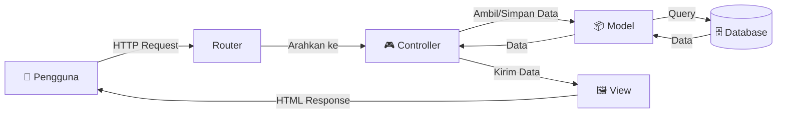

# Minggu 13-14 — Framework & Pola MVC (Laravel)

## Tujuan Pembelajaran

Setelah mempelajari materi ini, mahasiswa dapat:
- Memahami dan menerapkan pola desain **MVC (Model-View-Controller)**
- Menggunakan **Laravel** sebagai framework PHP modern
- Mengimplementasikan **Routing, Controller, View, dan ORM (Eloquent)**
- Memigrasi aplikasi CRUD sederhana ke pola MVC

---

## 1. Pola MVC

**MVC (Model-View-Controller)** adalah arsitektur perangkat lunak yang memisahkan aplikasi menjadi tiga komponen:



| Komponen | Tanggung Jawab | Contoh File |
|----------|---------------|-------------|
| **Model** | Data, logika bisnis, interaksi database | `app/Models/Mahasiswa.php` |
| **View** | Tampilan, template HTML | `resources/views/mahasiswa/index.blade.php` |
| **Controller** | Menerima request, koordinasi Model & View | `app/Http/Controllers/MahasiswaController.php` |
| **Router** | Memetakan URL ke Controller | `routes/web.php` |

### Tanpa MVC vs Dengan MVC

```php
// ❌ Tanpa MVC — semua campur dalam satu file
<?php
$db = new PDO(...);
$mhs = $db->query("SELECT * FROM mahasiswa")->fetchAll();
echo "<table>";
foreach ($mhs as $m) echo "<tr><td>{$m['nama']}</td></tr>";
echo "</table>";
?>

// ✅ Dengan MVC — setiap komponen terpisah
// routes/web.php: Route::get('/mahasiswa', [MahasiswaController::class, 'index']);
// MahasiswaController: public function index() { $data = Mahasiswa::all(); return view('mahasiswa.index', compact('data')); }
// mahasiswa/index.blade.php: <table>@foreach($data as $m)<tr><td>{{ $m->nama }}</td></tr>@endforeach</table>
```

---

## 2. Instalasi Laravel

### Prasyarat

```bash
# Cek versi PHP (min. 8.2)
php --version

# Cek Composer (dependency manager PHP)
composer --version

# Jika Composer belum ada:
curl -sS https://getcomposer.org/installer | php
sudo mv composer.phar /usr/local/bin/composer
```

### Membuat Proyek Laravel

```bash
# Buat proyek baru
composer create-project laravel/laravel sistem-kampus

# Masuk ke direktori
cd sistem-kampus

# Jalankan server development
php artisan serve
# Akses: http://localhost:8000
```

### Konfigurasi Database (.env)

```ini
DB_CONNECTION=mysql
DB_HOST=127.0.0.1
DB_PORT=3306
DB_DATABASE=kampus
DB_USERNAME=root
DB_PASSWORD=
```

### Struktur Direktori Laravel

```
sistem-kampus/
├── app/
│   ├── Http/
│   │   └── Controllers/    ← Controller
│   └── Models/             ← Model (Eloquent)
├── database/
│   ├── migrations/         ← Skema database
│   └── seeders/            ← Data dummy
├── resources/
│   └── views/              ← Template Blade (View)
├── routes/
│   └── web.php             ← Definisi route
├── public/                 ← Dokumen root (index.php, assets)
└── .env                    ← Konfigurasi lingkungan
```

---

## 3. Migration — Mendefinisikan Skema Database

```bash
# Buat file migration
php artisan make:migration create_mahasiswa_table
```

```php
<?php
// database/migrations/xxxx_create_mahasiswa_table.php
use Illuminate\Database\Migrations\Migration;
use Illuminate\Database\Schema\Blueprint;
use Illuminate\Support\Facades\Schema;

return new class extends Migration {
    
    public function up(): void {
        Schema::create('mahasiswa', function (Blueprint $table) {
            $table->id();
            $table->string('nim', 12)->unique();
            $table->string('nama', 100);
            $table->string('email', 100)->unique();
            $table->enum('prodi', ['IF', 'SI', 'TK'])->default('IF');
            $table->decimal('ipk', 3, 2)->default(0);
            $table->string('foto')->nullable();
            $table->boolean('aktif')->default(true);
            $table->timestamps();
        });
    }

    public function down(): void {
        Schema::dropIfExists('mahasiswa');
    }
};
```

```bash
# Jalankan semua migration
php artisan migrate

# Reset (hapus semua tabel & migrate ulang)
php artisan migrate:fresh --seed
```

---

## 4. Model — Eloquent ORM

```bash
php artisan make:model Mahasiswa
```

```php
<?php
// app/Models/Mahasiswa.php
namespace App\Models;

use Illuminate\Database\Eloquent\Model;
use Illuminate\Database\Eloquent\Factories\HasFactory;

class Mahasiswa extends Model {
    use HasFactory;

    // Kolom yang boleh diisi massal
    protected $fillable = ['nim', 'nama', 'email', 'prodi', 'ipk', 'foto', 'aktif'];

    // Kolom yang disembunyikan dari serialisasi JSON
    protected $hidden = [];

    // Cast tipe data otomatis
    protected $casts = [
        'ipk'   => 'decimal:2',
        'aktif' => 'boolean',
    ];

    // Scope — filter yang dapat digunakan ulang
    public function scopeAktif($query) {
        return $query->where('aktif', true);
    }

    public function scopeProdi($query, string $prodi) {
        return $query->where('prodi', $prodi);
    }
}
```

### Query dengan Eloquent

```php
// Ambil semua (Fluent API)
$semua = Mahasiswa::all();
$aktif = Mahasiswa::aktif()->get();

// Ambil dengan kondisi
$informatika = Mahasiswa::where('prodi', 'IF')
                        ->where('ipk', '>=', 3.0)
                        ->orderBy('nama')
                        ->get();

// Ambil satu data
$mhs = Mahasiswa::find(1);
$mhs = Mahasiswa::findOrFail(1);    // Lempar 404 jika tidak ada
$mhs = Mahasiswa::where('nim', '21001234')->firstOrFail();

// Buat data baru
$baru = Mahasiswa::create([
    'nim'   => '21001999',
    'nama'  => 'Ahmad Baru',
    'email' => 'baru@email.com',
    'prodi' => 'IF',
    'ipk'   => 3.5,
]);

// Update data
$mhs = Mahasiswa::find(1);
$mhs->update(['ipk' => 3.85]);

// Hapus
$mhs->delete();

// Pagination
$data = Mahasiswa::aktif()->paginate(10);
```

---

## 5. Controller — Logika Aplikasi

```bash
# Buat controller dengan semua method CRUD
php artisan make:controller MahasiswaController --resource --model=Mahasiswa
```

```php
<?php
// app/Http/Controllers/MahasiswaController.php
namespace App\Http\Controllers;

use App\Models\Mahasiswa;
use Illuminate\Http\Request;

class MahasiswaController extends Controller {

    // GET /mahasiswa — tampilkan daftar
    public function index(Request $request) {
        $query = Mahasiswa::aktif();
        
        if ($request->filled('cari')) {
            $cari = $request->cari;
            $query->where(function($q) use ($cari) {
                $q->where('nama', 'like', "%$cari%")
                  ->orWhere('nim', 'like', "%$cari%");
            });
        }
        
        if ($request->filled('prodi')) {
            $query->prodi($request->prodi);
        }
        
        $mahasiswa = $query->orderBy('nama')->paginate(10)->withQueryString();
        
        return view('mahasiswa.index', compact('mahasiswa'));
    }

    // GET /mahasiswa/create — tampilkan form tambah
    public function create() {
        return view('mahasiswa.create');
    }

    // POST /mahasiswa — simpan data baru
    public function store(Request $request) {
        $validated = $request->validate([
            'nim'   => 'required|string|size:8|unique:mahasiswa',
            'nama'  => 'required|string|min:3|max:100',
            'email' => 'required|email|unique:mahasiswa',
            'prodi' => 'required|in:IF,SI,TK',
            'ipk'   => 'required|numeric|between:0,4',
        ]);

        Mahasiswa::create($validated);

        return redirect()
            ->route('mahasiswa.index')
            ->with('sukses', 'Mahasiswa berhasil ditambahkan!');
    }

    // GET /mahasiswa/{id}/edit — tampilkan form edit
    public function edit(Mahasiswa $mahasiswa) {
        return view('mahasiswa.edit', compact('mahasiswa'));
    }

    // PUT /mahasiswa/{id} — perbarui data
    public function update(Request $request, Mahasiswa $mahasiswa) {
        $validated = $request->validate([
            'nim'   => "required|string|size:8|unique:mahasiswa,nim,{$mahasiswa->id}",
            'nama'  => 'required|string|min:3|max:100',
            'email' => "required|email|unique:mahasiswa,email,{$mahasiswa->id}",
            'prodi' => 'required|in:IF,SI,TK',
            'ipk'   => 'required|numeric|between:0,4',
        ]);

        $mahasiswa->update($validated);

        return redirect()
            ->route('mahasiswa.index')
            ->with('sukses', 'Data mahasiswa berhasil diperbarui!');
    }

    // DELETE /mahasiswa/{id} — hapus (soft delete)
    public function destroy(Mahasiswa $mahasiswa) {
        $mahasiswa->update(['aktif' => false]);
        return redirect()
            ->route('mahasiswa.index')
            ->with('sukses', 'Mahasiswa berhasil dihapus.');
    }
}
```

---

## 6. Routing

```php
<?php
// routes/web.php
use App\Http\Controllers\MahasiswaController;
use Illuminate\Support\Facades\Route;

Route::get('/', fn() => redirect()->route('mahasiswa.index'));

// Resource routes (7 route sekaligus)
Route::resource('mahasiswa', MahasiswaController::class);

// Ekuivalen dengan:
// GET    /mahasiswa           → index
// GET    /mahasiswa/create    → create
// POST   /mahasiswa           → store
// GET    /mahasiswa/{id}      → show
// GET    /mahasiswa/{id}/edit → edit
// PUT    /mahasiswa/{id}      → update
// DELETE /mahasiswa/{id}      → destroy
```

---

## 7. View — Blade Template

### Layout Utama

```html
{{-- resources/views/layouts/app.blade.php --}}
<!DOCTYPE html>
<html lang="id">
<head>
  <meta charset="UTF-8">
  <meta name="viewport" content="width=device-width, initial-scale=1.0">
  <title>@yield('judul', 'Sistem Kampus') — Laravel</title>
  <link href="https://cdn.jsdelivr.net/npm/bootstrap@5.3.0/dist/css/bootstrap.min.css" rel="stylesheet">
</head>
<body>
  <nav class="navbar navbar-expand-lg navbar-dark bg-primary">
    <div class="container">
      <a class="navbar-brand fw-bold" href="{{ route('mahasiswa.index') }}">🎓 Sistem Kampus</a>
    </div>
  </nav>

  <main class="container py-4">
    {{-- Flash message --}}
    @if (session('sukses'))
      <div class="alert alert-success alert-dismissible fade show">
        {{ session('sukses') }}
        <button type="button" class="btn-close" data-bs-dismiss="alert"></button>
      </div>
    @endif

    @yield('konten')
  </main>

  <script src="https://cdn.jsdelivr.net/npm/bootstrap@5.3.0/dist/js/bootstrap.bundle.min.js"></script>
  @stack('scripts')
</body>
</html>
```

### View: Daftar Mahasiswa

```html
{{-- resources/views/mahasiswa/index.blade.php --}}
@extends('layouts.app')

@section('judul', 'Daftar Mahasiswa')

@section('konten')
<div class="d-flex justify-content-between align-items-center mb-3">
  <h2>Daftar Mahasiswa</h2>
  <a href="{{ route('mahasiswa.create') }}" class="btn btn-primary">+ Tambah</a>
</div>

{{-- Form pencarian --}}
<form method="GET" class="row g-2 mb-3">
  <div class="col-md-5">
    <input type="text" name="cari" value="{{ request('cari') }}" 
           class="form-control" placeholder="Cari nama atau NIM...">
  </div>
  <div class="col-md-3">
    <select name="prodi" class="form-select">
      <option value="">Semua Prodi</option>
      @foreach(['IF' => 'Informatika', 'SI' => 'Sistem Informasi', 'TK' => 'Teknik Komputer'] as $kode => $nama)
        <option value="{{ $kode }}" {{ request('prodi') === $kode ? 'selected' : '' }}>{{ $nama }}</option>
      @endforeach
    </select>
  </div>
  <div class="col-auto">
    <button class="btn btn-outline-secondary">🔍 Cari</button>
    <a href="{{ route('mahasiswa.index') }}" class="btn btn-outline-secondary">Reset</a>
  </div>
</form>

<p class="text-muted">Menampilkan {{ $mahasiswa->count() }} dari {{ $mahasiswa->total() }} mahasiswa</p>

<div class="table-responsive">
  <table class="table table-hover table-bordered align-middle">
    <thead class="table-dark">
      <tr>
        <th>#</th><th>NIM</th><th>Nama</th><th>Email</th><th>Prodi</th><th>IPK</th><th>Aksi</th>
      </tr>
    </thead>
    <tbody>
      @forelse ($mahasiswa as $i => $mhs)
      <tr>
        <td>{{ $mahasiswa->firstItem() + $i }}</td>
        <td><code>{{ $mhs->nim }}</code></td>
        <td>{{ $mhs->nama }}</td>
        <td>{{ $mhs->email }}</td>
        <td><span class="badge bg-info text-dark">{{ $mhs->prodi }}</span></td>
        <td>
          <span class="fw-bold {{ $mhs->ipk >= 3.5 ? 'text-success' : '' }}">
            {{ number_format($mhs->ipk, 2) }}
          </span>
        </td>
        <td>
          <a href="{{ route('mahasiswa.edit', $mhs) }}" class="btn btn-sm btn-warning">Edit</a>
          <form method="POST" action="{{ route('mahasiswa.destroy', $mhs) }}" class="d-inline">
            @csrf @method('DELETE')
            <button class="btn btn-sm btn-danger" onclick="return confirm('Yakin hapus?')">Hapus</button>
          </form>
        </td>
      </tr>
      @empty
        <tr><td colspan="7" class="text-center text-muted py-4">Tidak ada data mahasiswa.</td></tr>
      @endforelse
    </tbody>
  </table>
</div>

{{-- Pagination --}}
<div class="d-flex justify-content-center">
  {{ $mahasiswa->links() }}
</div>
@endsection
```

---

## 8. Artisan Commands

```bash
# Buat komponen baru
php artisan make:model NamaModel -m  # Model + Migration
php artisan make:controller NamaController --resource --model=NamaModel
php artisan make:seeder NamaSeeder
php artisan make:middleware NamaMiddleware

# Database
php artisan migrate
php artisan migrate:rollback
php artisan migrate:fresh --seed

# Utilitas
php artisan route:list          # Lihat semua route
php artisan tinker              # REPL interaktif
php artisan storage:link        # Buat symlink storage
php artisan cache:clear         # Bersihkan cache
php artisan config:clear        # Bersihkan cache config
```

---

## 🏗️ Proyek Praktikum

Migrasi aplikasi CRUD dari Minggu 11-12 (PHP murni) ke Laravel:

1. Buat proyek Laravel baru
2. Buat Migration untuk tabel `mahasiswa`
3. Buat Model `Mahasiswa` dengan scope dan fillable
4. Buat Resource Controller `MahasiswaController`
5. Definisikan route resource
6. Buat Blade template (layout + index + create + edit)
7. Tambahkan validasi di Controller
8. Tambahkan flash message sukses/error

---

## 🏋️ Latihan

1. Tambahkan fitur **upload foto profil** mahasiswa menggunakan `Storage` Laravel.
2. Buat **relasi** `hasMany` antara Mahasiswa dan Nilai (tabel nilai).
3. Implementasikan **autentikasi** menggunakan `php artisan make:auth` atau Laravel Breeze.
4. Buat **API endpoint** menggunakan Route API (`routes/api.php`) yang mengembalikan data JSON.

---

## 📚 Referensi

- [Laravel Documentation](https://laravel.com/docs)
- [Laracasts](https://laracasts.com/) — Video tutorial Laravel
- [Laravel Eloquent ORM](https://laravel.com/docs/eloquent)
