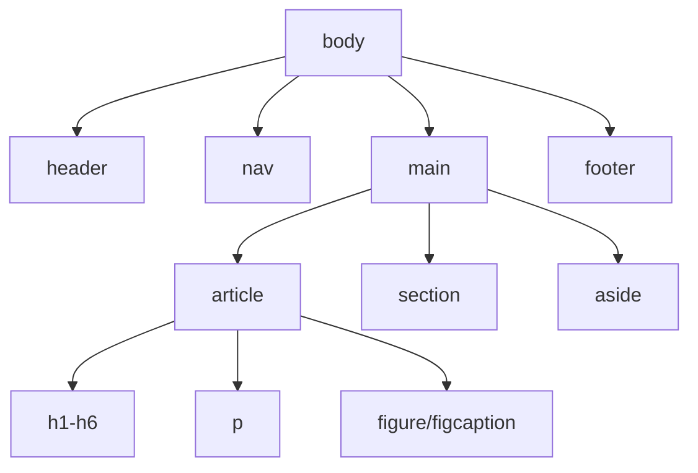

# Minggu 2-3 — HTML5 Semantik & CSS3 Responsif

## Tujuan Pembelajaran

Setelah mempelajari materi ini, mahasiswa dapat:
- Membangun struktur halaman web dengan **HTML5 Semantik**
- Membuat tata letak responsif menggunakan **CSS3 Flexbox dan Grid**
- Menerapkan konsep **Responsive Web Design (RWD)**
- Membuat halaman profil statis yang responsif

---

## Bagian A: HTML5

## 1. Pengenalan HTML

**HTML (HyperText Markup Language)** adalah bahasa markup standar untuk membangun struktur halaman web.

### Struktur Dasar Dokumen HTML5

```html
<!DOCTYPE html>
<html lang="id">
<head>
  <meta charset="UTF-8">
  <meta name="viewport" content="width=device-width, initial-scale=1.0">
  <meta name="description" content="Deskripsi halaman untuk SEO">
  <title>Judul Halaman</title>
  <link rel="stylesheet" href="style.css">
</head>
<body>
  <!-- Konten halaman -->
  <script src="script.js"></script>
</body>
</html>
```

### Elemen Penting di `<head>`

| Tag | Fungsi |
|-----|--------|
| `<meta charset="UTF-8">` | Dukungan karakter Unicode (huruf Indonesia, emoji, dll.) |
| `<meta name="viewport">` | Wajib untuk desain responsif di mobile |
| `<title>` | Judul tab browser & hasil pencarian |
| `<link rel="stylesheet">` | Menghubungkan file CSS eksternal |

---

## 2. HTML5 Semantik

**Elemen semantik** adalah tag HTML yang memiliki makna atau arti, bukan hanya sebagai wadah visual. Ini penting untuk **aksesibilitas** dan **SEO**.

### Perbandingan Non-Semantik vs Semantik

```html
<!-- ❌ Non-Semantik (lama) -->
<div id="header">...</div>
<div id="nav">...</div>
<div id="main">...</div>
<div id="footer">...</div>

<!-- ✅ Semantik HTML5 -->
<header>...</header>
<nav>...</nav>
<main>...</main>
<footer>...</footer>
```

### Elemen Semantik HTML5



| Elemen | Kegunaan |
|--------|---------|
| `<header>` | Kepala halaman atau seksi (logo, judul, nav) |
| `<nav>` | Navigasi utama |
| `<main>` | Konten utama halaman (hanya satu per halaman) |
| `<article>` | Konten mandiri (artikel blog, berita, postingan) |
| `<section>` | Pengelompokan konten yang terkait |
| `<aside>` | Konten sampingan (sidebar, iklan, info tambahan) |
| `<footer>` | Kaki halaman (hak cipta, tautan, kontak) |
| `<figure>` | Gambar dengan keterangan |
| `<figcaption>` | Keterangan gambar |
| `<time>` | Tanggal dan waktu yang machine-readable |

### Contoh Tata Letak Semantik Lengkap

```html
<!DOCTYPE html>
<html lang="id">
<head>
  <meta charset="UTF-8">
  <meta name="viewport" content="width=device-width, initial-scale=1.0">
  <title>Blog Saya</title>
</head>
<body>

  <header>
    <h1>Blog Mahasiswa</h1>
    <nav>
      <ul>
        <li><a href="/">Beranda</a></li>
        <li><a href="/artikel">Artikel</a></li>
        <li><a href="/tentang">Tentang Saya</a></li>
        <li><a href="/kontak">Kontak</a></li>
      </ul>
    </nav>
  </header>

  <main>
    <section id="terbaru">
      <h2>Artikel Terbaru</h2>

      <article>
        <header>
          <h3>Pengenalan HTML5</h3>
          <p>Oleh <strong>Mahendar</strong> pada <time datetime="2026-02-23">23 Februari 2026</time></p>
        </header>
        <p>HTML5 membawa banyak fitur baru yang memudahkan pembuatan web modern...</p>
        <figure>
          
          <figcaption>Logo resmi HTML5</figcaption>
        </figure>
        <footer>
          <a href="/artikel/html5">Baca selengkapnya →</a>
        </footer>
      </article>

    </section>

    <aside>
      <h3>Tentang Saya</h3>
      <p>Mahasiswa Informatika semester 4 yang antusias di bidang web development.</p>
    </aside>
  </main>

  <footer>
    <p>© 2026 Blog Mahasiswa. Dibuat dengan ❤️ menggunakan HTML5 & CSS3.</p>
  </footer>

</body>
</html>
```

---

## 3. Form & Input HTML5

HTML5 memperkenalkan banyak **tipe input baru** yang mempermudah validasi sisi client.

```html
<form action="/daftar" method="POST">

  <!-- Tipe input baru HTML5 -->
  <label for="email">Email:</label>
  <input type="email" id="email" name="email" required placeholder="anda@contoh.com">

  <label for="tanggal">Tanggal Lahir:</label>
  <input type="date" id="tanggal" name="tanggal" required>

  <label for="usia">Usia:</label>
  <input type="number" id="usia" name="usia" min="17" max="100">

  <label for="tel">Nomor Telepon:</label>
  <input type="tel" id="tel" name="tel" pattern="[0-9]{10,13}">

  <label for="web">Website:</label>
  <input type="url" id="web" name="web" placeholder="https://...">

  <label for="bio">Bio:</label>
  <textarea id="bio" name="bio" rows="4" maxlength="200"></textarea>

  <label for="jurusan">Jurusan:</label>
  <select id="jurusan" name="jurusan">
    <option value="">-- Pilih --</option>
    <option value="if">Informatika</option>
    <option value="si">Sistem Informasi</option>
  </select>

  <button type="submit">Daftar</button>
</form>
```

| Tipe Input | Kegunaan |
|-----------|---------|
| `email` | Validasi format email otomatis |
| `number` | Input angka dengan min/max |
| `date` | Picker tanggal |
| `tel` | Nomor telepon |
| `url` | Validasi URL |
| `range` | Slider nilai |
| `color` | Color picker |
| `search` | Kotak pencarian |

---

## Bagian B: CSS3

## 4. Pengenalan CSS3

**CSS (Cascading Style Sheets)** mengendalikan tampilan dan tata letak elemen HTML.

### Cara Penulisan CSS

```css
/* Selector { property: value; } */

/* 1. Element Selector */
h1 {
  color: #333333;
  font-size: 2rem;
}

/* 2. Class Selector */
.kartu {
  background-color: white;
  border-radius: 8px;
  padding: 16px;
  box-shadow: 0 2px 8px rgba(0, 0, 0, 0.1);
}

/* 3. ID Selector */
#header-utama {
  background-color: #2563eb;
  color: white;
}

/* 4. Pseudo-class */
a:hover {
  color: #1d4ed8;
  text-decoration: underline;
}

/* 5. Kombinasi */
nav ul li a {
  display: block;
  padding: 8px 16px;
}
```

### CSS Box Model

Setiap elemen HTML adalah sebuah **kotak (box)**:

```
┌─────────────────────────────────┐
│           MARGIN                │  ← Jarak luar
│  ┌───────────────────────────┐  │
│  │         BORDER            │  │  ← Garis tepi
│  │  ┌─────────────────────┐  │  │
│  │  │      PADDING        │  │  │  ← Jarak dalam
│  │  │  ┌───────────────┐  │  │  │
│  │  │  │    CONTENT    │  │  │  │  ← Konten
│  │  │  └───────────────┘  │  │  │
│  │  └─────────────────────┘  │  │
│  └───────────────────────────┘  │
└─────────────────────────────────┘
```

```css
.kotak {
  width: 300px;
  height: 150px;
  padding: 16px;          /* dalam: atas kanan bawah kiri */
  border: 2px solid #ccc;
  margin: 24px auto;      /* auto = tengah horizontal */
  box-sizing: border-box; /* ✅ Rekomendasi: lebar/tinggi sudah termasuk padding & border */
}
```

---

## 5. CSS Flexbox

**Flexbox** adalah metode tata letak satu dimensi (row atau column).

```css
.container {
  display: flex;
  flex-direction: row;        /* row | column | row-reverse | column-reverse */
  justify-content: center;    /* Sumbu utama: flex-start | flex-end | center | space-between | space-around */
  align-items: center;        /* Sumbu silang: flex-start | flex-end | center | stretch */
  flex-wrap: wrap;            /* Izinkan baris baru */
  gap: 16px;                  /* Jarak antar item */
}

.item {
  flex: 1;          /* Proporsi tumbuh: sama rata */
  flex: 0 0 200px;  /* flex-grow flex-shrink flex-basis */
}
```

### Contoh Praktis — Navbar dengan Flexbox

```html
<style>
  .navbar {
    display: flex;
    justify-content: space-between;
    align-items: center;
    padding: 16px 32px;
    background-color: #1e293b;
    color: white;
  }
  .navbar .logo { font-size: 1.5rem; font-weight: bold; }
  .navbar ul { display: flex; list-style: none; gap: 24px; margin: 0; padding: 0; }
  .navbar ul a { color: white; text-decoration: none; }
  .navbar ul a:hover { color: #60a5fa; }
</style>

<nav class="navbar">
  <span class="logo">WebDev</span>
  <ul>
    <li><a href="#">Beranda</a></li>
    <li><a href="#">Artikel</a></li>
    <li><a href="#">Kontak</a></li>
  </ul>
</nav>
```

### Contoh Praktis — Card Grid dengan Flexbox

```html
<style>
  .kartu-container {
    display: flex;
    flex-wrap: wrap;
    gap: 24px;
    padding: 32px;
    justify-content: center;
  }
  .kartu {
    flex: 0 0 280px;
    background: white;
    border-radius: 12px;
    padding: 24px;
    box-shadow: 0 4px 12px rgba(0,0,0,0.1);
  }
  .kartu h3 { margin-top: 0; color: #1e293b; }
  .kartu p  { color: #64748b; line-height: 1.6; }
</style>

<div class="kartu-container">
  <div class="kartu">
    <h3>HTML5</h3>
    <p>Bahasa markup untuk struktur halaman web modern.</p>
  </div>
  <div class="kartu">
    <h3>CSS3</h3>
    <p>Stylesheet untuk tampilan dan animasi.</p>
  </div>
  <div class="kartu">
    <h3>JavaScript</h3>
    <p>Bahasa pemrograman untuk interaktivitas web.</p>
  </div>
</div>
```

---

## 6. CSS Grid

**CSS Grid** adalah metode tata letak dua dimensi (baris dan kolom sekaligus).

```css
.grid-container {
  display: grid;
  grid-template-columns: 1fr 3fr 1fr;  /* 3 kolom: sidebar | konten | sidebar */
  grid-template-rows: auto 1fr auto;   /* 3 baris: header | main | footer */
  gap: 16px;
  min-height: 100vh;
}

/* Penempatan item secara eksplisit */
.header  { grid-column: 1 / -1; }   /* Membentang seluruh lebar */
.sidebar { grid-row: 2; }
.main    { grid-column: 2; grid-row: 2; }
.footer  { grid-column: 1 / -1; }
```

### Contoh Layout Halaman dengan Grid

```html
<style>
  * { box-sizing: border-box; margin: 0; padding: 0; }

  body {
    display: grid;
    grid-template-areas:
      "header  header  header"
      "sidebar konten  aside"
      "footer  footer  footer";
    grid-template-columns: 200px 1fr 180px;
    grid-template-rows: auto 1fr auto;
    min-height: 100vh;
    gap: 0;
  }

  header  { grid-area: header;  background: #1e293b; color: white; padding: 20px 32px; }
  .sidebar{ grid-area: sidebar; background: #f1f5f9; padding: 24px; }
  main    { grid-area: konten;  padding: 24px; }
  aside   { grid-area: aside;   background: #f8fafc; padding: 24px; }
  footer  { grid-area: footer;  background: #0f172a; color: white; text-align: center; padding: 16px; }
</style>

<header><h1>Website Saya</h1></header>
<nav class="sidebar"><h3>Menu</h3></nav>
<main><h2>Konten Utama</h2><p>Isi konten halaman...</p></main>
<aside><h3>Widget</h3></aside>
<footer><p>© 2026</p></footer>
```

---

## 7. Responsive Web Design (RWD)

**Responsive Web Design** memastikan tampilan web optimal di semua ukuran layar.

### Media Queries

```css
/* Mobile First (default: mobile) */
.container {
  padding: 16px;
}

/* Tablet (≥ 768px) */
@media (min-width: 768px) {
  .container {
    padding: 32px;
    max-width: 768px;
    margin: 0 auto;
  }
}

/* Desktop (≥ 1024px) */
@media (min-width: 1024px) {
  .container {
    max-width: 1280px;
    padding: 48px;
  }
}

/* Breakpoint umum */
/* xs:  < 576px  → Ponsel kecil   */
/* sm: >= 576px  → Ponsel besar   */
/* md: >= 768px  → Tablet         */
/* lg: >= 1024px → Laptop         */
/* xl: >= 1280px → Desktop        */
/* 2xl:>= 1536px → Layar besar    */
```

### Grid Responsif

```css
.grid-artikel {
  display: grid;
  grid-template-columns: 1fr;            /* Mobile: 1 kolom */
  gap: 24px;
  padding: 24px;
}

@media (min-width: 640px) {
  .grid-artikel {
    grid-template-columns: repeat(2, 1fr); /* Tablet: 2 kolom */
  }
}

@media (min-width: 1024px) {
  .grid-artikel {
    grid-template-columns: repeat(3, 1fr); /* Desktop: 3 kolom */
  }
}
```

---

## 8. CSS Variables & Modern Techniques

```css
/* Mendefinisikan variabel CSS */
:root {
  --warna-primer: #2563eb;
  --warna-sekunder: #64748b;
  --warna-teks: #1e293b;
  --warna-bg: #f8fafc;
  --radius: 8px;
  --shadow: 0 2px 8px rgba(0,0,0,0.1);
  --font-sans: 'Inter', system-ui, sans-serif;
}

/* Menggunakan variabel */
.tombol-primer {
  background-color: var(--warna-primer);
  border-radius: var(--radius);
  box-shadow: var(--shadow);
  color: white;
  padding: 12px 24px;
  border: none;
  cursor: pointer;
  font-family: var(--font-sans);
  transition: background-color 0.2s ease;
}

.tombol-primer:hover {
  background-color: #1d4ed8; /* Sedikit lebih gelap */
  transform: translateY(-1px);
}
```

---

## 🏗️ Proyek Praktikum: Halaman Profil Responsif

Buat halaman profil mahasiswa yang responsif dengan struktur berikut:

**Spesifikasi**:
- Header dengan nama dan foto profil
- Navigasi (Profil, Keahlian, Proyek, Kontak)
- Seksi tentang diri
- Grid keahlian (skill cards)
- Daftar proyek
- Form kontak
- Footer

**Kriteria Penilaian**:
- ✅ Menggunakan elemen semantik HTML5
- ✅ Tata letak dengan Flexbox/Grid
- ✅ Responsif di mobile, tablet, desktop
- ✅ CSS variables untuk warna dan ukuran
- ✅ Form dengan validasi HTML5

---

## 🏋️ Latihan

1. Buat navbar responsif yang berubah menjadi hamburger menu di layar mobile (hanya CSS, tanpa JavaScript).
2. Buat layout blog dengan kolom konten utama dan sidebar menggunakan CSS Grid.
3. Buat set kartu (card) yang berubah dari 1 kolom (mobile) → 2 kolom (tablet) → 4 kolom (desktop).
4. Rekayasa balik (reverse engineer) tampilan halaman login dari situs favorit Anda menggunakan HTML5 & CSS3.

---

## 📚 Referensi

- [MDN Web Docs — HTML](https://developer.mozilla.org/en-US/docs/Web/HTML)
- [MDN Web Docs — CSS Flexbox](https://developer.mozilla.org/en-US/docs/Web/CSS/CSS_flexible_box_layout)
- [MDN Web Docs — CSS Grid](https://developer.mozilla.org/en-US/docs/Web/CSS/CSS_grid_layout)
- [CSS-Tricks — A Complete Guide to Flexbox](https://css-tricks.com/snippets/css/a-guide-to-flexbox/)
- [CSS-Tricks — A Complete Guide to CSS Grid](https://css-tricks.com/snippets/css/complete-guide-grid/)
- Duckett, J. (2014). *HTML and CSS: Design and Build Websites*. Wiley.
