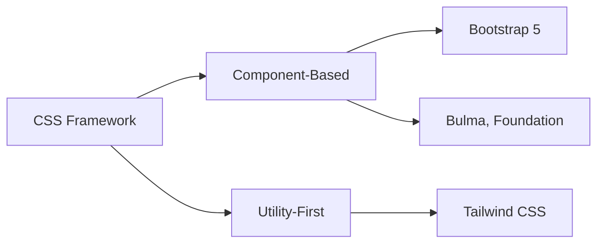

# Minggu 4 — CSS Framework: Tailwind CSS & Bootstrap

## Tujuan Pembelajaran

Setelah mempelajari materi ini, mahasiswa dapat:
- Memahami konsep dan keunggulan **CSS Framework**
- Menggunakan **Tailwind CSS** dengan pendekatan *utility-first*
- Menggunakan komponen siap pakai dari **Bootstrap 5**
- Mengonversi desain statis ke CSS Framework secara efisien

---

## 1. Mengapa CSS Framework?

Menulis CSS dari nol untuk setiap proyek membutuhkan waktu. CSS Framework menyediakan:

| Keunggulan | Keterangan |
|-----------|-----------|
| **Kecepatan** | Komponen & utility siap pakai |
| **Konsistensi** | Tampilan seragam di seluruh halaman |
| **Responsif** | Sistem grid responsif bawaan |
| **Cross-browser** | Mengatasi perbedaan antar browser |
| **Komunitas** | Dokumentasi lengkap & banyak contoh |

### Dua Pendekatan Populer



---

## 2. Tailwind CSS

**Tailwind CSS** adalah framework *utility-first* — tidak menyediakan komponen, melainkan class utilitas kecil yang digabungkan.

### Instalasi via CDN (untuk prototyping)

```html
<!DOCTYPE html>
<html lang="id">
<head>
  <meta charset="UTF-8">
  <meta name="viewport" content="width=device-width, initial-scale=1.0">
  <title>Tailwind CSS</title>
  <script src="https://cdn.tailwindcss.com"></script>
</head>
<body class="bg-gray-100 font-sans">
  <h1 class="text-3xl font-bold text-blue-600 text-center mt-8">
    Halo Tailwind!
  </h1>
</body>
</html>
```

### Instalasi via npm (untuk proyek nyata)

```bash
npm install -D tailwindcss
npx tailwindcss init

# Tambahkan ke tailwind.config.js:
# content: ["./src/**/*.{html,js}"]

# Buat src/input.css:
# @tailwind base;
# @tailwind components;
# @tailwind utilities;

# Build:
npx tailwindcss -i ./src/input.css -o ./dist/output.css --watch
```

### Cheatsheet Utility Tailwind

#### Spacing (Padding & Margin)
| Class | CSS |
|-------|-----|
| `p-4` | `padding: 1rem` |
| `px-6` | `padding-left: 1.5rem; padding-right: 1.5rem` |
| `py-2` | `padding-top: 0.5rem; padding-bottom: 0.5rem` |
| `mt-8` | `margin-top: 2rem` |
| `mx-auto` | `margin-left: auto; margin-right: auto` |

#### Flexbox
| Class | CSS |
|-------|-----|
| `flex` | `display: flex` |
| `justify-center` | `justify-content: center` |
| `items-center` | `align-items: center` |
| `gap-4` | `gap: 1rem` |
| `flex-wrap` | `flex-wrap: wrap` |

#### Grid
| Class | CSS |
|-------|-----|
| `grid` | `display: grid` |
| `grid-cols-3` | `grid-template-columns: repeat(3, 1fr)` |
| `col-span-2` | `grid-column: span 2` |

#### Responsive Prefix
```
sm:  → min-width: 640px
md:  → min-width: 768px
lg:  → min-width: 1024px
xl:  → min-width: 1280px
2xl: → min-width: 1536px
```

### Komponen Tailwind: Kartu Profil

```html
<div class="max-w-sm mx-auto bg-white rounded-2xl shadow-lg overflow-hidden">
  <!-- Gambar Header -->
  <div class="h-32 bg-gradient-to-r from-blue-500 to-purple-600"></div>
  
  <!-- Konten -->
  <div class="px-6 py-4 -mt-12">
    <!-- Avatar -->
    
    
    <!-- Info -->
    <div class="mt-4">
      <h2 class="text-xl font-bold text-gray-900">Ahmad Mahasiswa</h2>
      <p class="text-blue-600 font-medium">Teknik Informatika, Semester 4</p>
      <p class="mt-2 text-gray-600 text-sm">
        Antusias di bidang web development dan machine learning.
      </p>
    </div>
    
    <!-- Tags -->
    <div class="flex flex-wrap gap-2 mt-4">
      <span class="px-3 py-1 bg-blue-100 text-blue-800 text-xs rounded-full font-medium">HTML</span>
      <span class="px-3 py-1 bg-green-100 text-green-800 text-xs rounded-full font-medium">CSS</span>
      <span class="px-3 py-1 bg-yellow-100 text-yellow-800 text-xs rounded-full font-medium">JavaScript</span>
      <span class="px-3 py-1 bg-red-100 text-red-800 text-xs rounded-full font-medium">PHP</span>
    </div>
  </div>
  
  <!-- Tombol -->
  <div class="px-6 pb-6 flex gap-3">
    <button class="flex-1 bg-blue-600 hover:bg-blue-700 text-white font-semibold py-2 rounded-lg transition-colors">
      Follow
    </button>
    <button class="flex-1 border border-gray-300 hover:bg-gray-50 text-gray-700 font-semibold py-2 rounded-lg transition-colors">
      Pesan
    </button>
  </div>
</div>
```

### Komponen Tailwind: Navbar Responsif

```html
<nav class="bg-slate-900 text-white">
  <div class="max-w-7xl mx-auto px-4 sm:px-6 lg:px-8">
    <div class="flex items-center justify-between h-16">
      <!-- Logo -->
      <a href="/" class="text-xl font-bold text-blue-400">WebDev<span class="text-white">UUI</span></a>
      
      <!-- Menu Desktop -->
      <div class="hidden md:flex items-center gap-6">
        <a href="#" class="text-gray-300 hover:text-white transition-colors">Beranda</a>
        <a href="#" class="text-gray-300 hover:text-white transition-colors">Materi</a>
        <a href="#" class="text-gray-300 hover:text-white transition-colors">Praktikum</a>
        <a href="#" class="bg-blue-600 hover:bg-blue-700 px-4 py-2 rounded-lg transition-colors">Login</a>
      </div>
      
      <!-- Hamburger (Mobile) -->
      <button class="md:hidden p-2 rounded-md text-gray-400 hover:text-white hover:bg-slate-800">
        <svg class="h-6 w-6" fill="none" viewBox="0 0 24 24" stroke="currentColor">
          <path stroke-linecap="round" stroke-linejoin="round" stroke-width="2" d="M4 6h16M4 12h16M4 18h16"/>
        </svg>
      </button>
    </div>
  </div>
</nav>
```

---

## 3. Bootstrap 5

**Bootstrap** adalah framework *component-based* yang menyediakan komponen UI siap pakai.

### Instalasi via CDN

```html
<!DOCTYPE html>
<html lang="id">
<head>
  <meta charset="UTF-8">
  <meta name="viewport" content="width=device-width, initial-scale=1.0">
  <title>Bootstrap 5</title>
  <!-- CSS Bootstrap -->
  <link href="https://cdn.jsdelivr.net/npm/bootstrap@5.3.0/dist/css/bootstrap.min.css" rel="stylesheet">
  <!-- Bootstrap Icons (opsional) -->
  <link rel="stylesheet" href="https://cdn.jsdelivr.net/npm/bootstrap-icons@1.11.0/font/bootstrap-icons.css">
</head>
<body>
  <!-- Konten -->

  <!-- JavaScript Bootstrap (wajib untuk komponen interaktif) -->
  <script src="https://cdn.jsdelivr.net/npm/bootstrap@5.3.0/dist/js/bootstrap.bundle.min.js"></script>
</body>
</html>
```

### Sistem Grid Bootstrap

Bootstrap menggunakan sistem **12 kolom**:

```html
<div class="container">
  <div class="row g-3">
    <!-- Kolom responsif -->
    <div class="col-12 col-md-6 col-lg-4">
      <div class="card">Kolom 1</div>
    </div>
    <div class="col-12 col-md-6 col-lg-4">
      <div class="card">Kolom 2</div>
    </div>
    <div class="col-12 col-md-12 col-lg-4">
      <div class="card">Kolom 3</div>
    </div>
  </div>
</div>
```

| Kelas | Berlaku pada | Lebar Kolom |
|-------|-------------|-------------|
| `col-12` | Semua ukuran | 100% |
| `col-md-6` | ≥ 768px | 50% |
| `col-lg-4` | ≥ 992px | 33.33% |
| `col-xl-3` | ≥ 1200px | 25% |

### Komponen Bootstrap: Form Login

```html
<div class="container">
  <div class="row justify-content-center min-vh-100 align-items-center">
    <div class="col-12 col-md-6 col-lg-4">
      <div class="card shadow-lg border-0 rounded-4">
        <div class="card-body p-4">
          <h2 class="card-title text-center mb-4 fw-bold">Masuk</h2>
          
          <form>
            <div class="mb-3">
              <label for="email" class="form-label">Email</label>
              <div class="input-group">
                <span class="input-group-text"><i class="bi bi-envelope"></i></span>
                <input type="email" class="form-control" id="email" placeholder="anda@contoh.com" required>
              </div>
            </div>
            
            <div class="mb-3">
              <label for="password" class="form-label">Password</label>
              <div class="input-group">
                <span class="input-group-text"><i class="bi bi-lock"></i></span>
                <input type="password" class="form-control" id="password" placeholder="••••••••" required>
              </div>
            </div>
            
            <div class="d-flex justify-content-between align-items-center mb-4">
              <div class="form-check">
                <input class="form-check-input" type="checkbox" id="ingat">
                <label class="form-check-label" for="ingat">Ingat saya</label>
              </div>
              <a href="#" class="text-decoration-none">Lupa password?</a>
            </div>
            
            <button type="submit" class="btn btn-primary w-100">
              <i class="bi bi-box-arrow-in-right me-2"></i>Masuk
            </button>
          </form>
          
          <hr class="my-3">
          <p class="text-center mb-0">
            Belum punya akun? <a href="#" class="text-decoration-none">Daftar sekarang</a>
          </p>
        </div>
      </div>
    </div>
  </div>
</div>
```

### Komponen Bootstrap: Navbar dengan Dropdown

```html
<nav class="navbar navbar-expand-lg navbar-dark bg-dark sticky-top">
  <div class="container">
    <a class="navbar-brand fw-bold" href="#">🌐 WebDev UUI</a>
    
    <!-- Tombol Hamburger -->
    <button class="navbar-toggler" type="button" data-bs-toggle="collapse" data-bs-target="#navMenu">
      <span class="navbar-toggler-icon"></span>
    </button>
    
    <!-- Menu -->
    <div class="collapse navbar-collapse" id="navMenu">
      <ul class="navbar-nav ms-auto gap-1">
        <li class="nav-item">
          <a class="nav-link active" href="#">Beranda</a>
        </li>
        <li class="nav-item dropdown">
          <a class="nav-link dropdown-toggle" href="#" data-bs-toggle="dropdown">Materi</a>
          <ul class="dropdown-menu">
            <li><a class="dropdown-item" href="#">HTML & CSS</a></li>
            <li><a class="dropdown-item" href="#">JavaScript</a></li>
            <li><hr class="dropdown-divider"></li>
            <li><a class="dropdown-item" href="#">PHP & MySQL</a></li>
          </ul>
        </li>
        <li class="nav-item">
          <a class="nav-link btn btn-primary text-white px-3 ms-2" href="#">Login</a>
        </li>
      </ul>
    </div>
  </div>
</nav>
```

---

## 4. Tailwind vs Bootstrap: Kapan Digunakan?

| Kriteria | Tailwind CSS | Bootstrap 5 |
|---------|-------------|------------|
| **Pendekatan** | Utility-first | Component-based |
| **Fleksibilitas desain** | ⭐⭐⭐⭐⭐ | ⭐⭐⭐ |
| **Kecepatan awal** | ⭐⭐⭐ | ⭐⭐⭐⭐⭐ |
| **Ukuran CSS produksi** | Sangat kecil (purge) | Lebih besar |
| **Kurva belajar** | Sedang | Mudah |
| **Komponen UI bawaan** | Tidak ada | Banyak |
| **Cocok untuk** | Desain kustom unik | Prototype cepat |

---

## 🏗️ Proyek Praktikum

Konversi halaman profil yang dibuat di Minggu 2-3 ke salah satu framework:

**Pilihan A** — Tailwind CSS:
- Gunakan utility classes untuk semua styling
- Tambahkan animasi hover dengan `transition-` utilities
- Buat dark mode dengan class `dark:`

**Pilihan B** — Bootstrap 5:
- Gunakan sistem grid Bootstrap untuk layout
- Gunakan komponen Card, Button, Badge, Alert
- Tambahkan Navbar dengan toggle mobile

---

## 🏋️ Latihan

1. Buat halaman landing page sederhana menggunakan **Tailwind CSS** dengan bagian: hero, fitur (3 kartu), dan footer.
2. Buat halaman daftar mahasiswa menggunakan **Bootstrap** dengan tabel responsif dan badge status.
3. Bandingkan jumlah baris kode antara versi CSS murni dan versi framework untuk komponen yang sama.

---

## 📚 Referensi

- [Tailwind CSS Dokumentasi](https://tailwindcss.com/docs)
- [Bootstrap 5 Dokumentasi](https://getbootstrap.com/docs/5.3/)
- [Tailwind CSS Cheat Sheet](https://tailwindcomponents.com/cheatsheet/)
