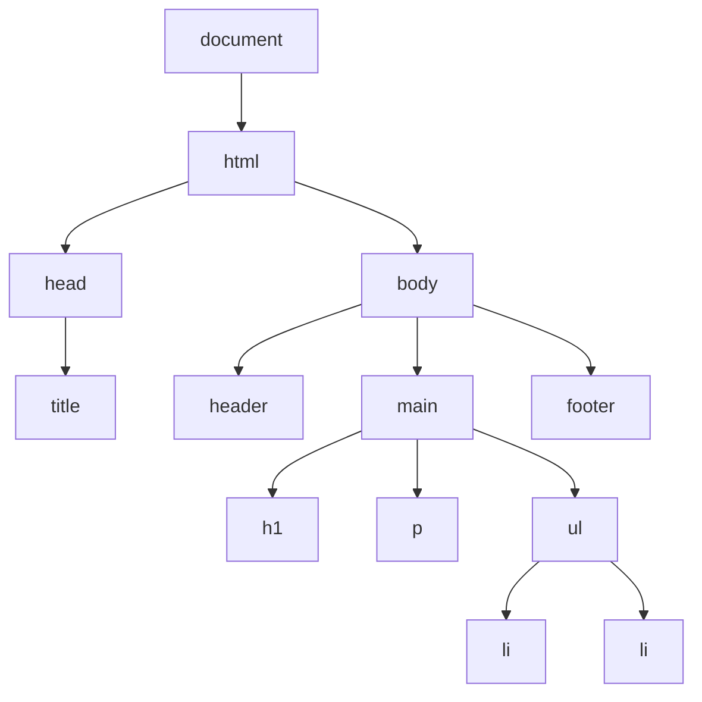

# Minggu 5-6 — JavaScript & DOM Manipulation

## Tujuan Pembelajaran

Setelah mempelajari materi ini, mahasiswa dapat:
- Memahami dasar-dasar **JavaScript** (variabel, tipe data, fungsi, OOP)
- Memanipulasi elemen HTML menggunakan **DOM API**
- Menangani interaksi pengguna dengan **Event Handling**
- Membuat validasi form dan elemen UI interaktif

---

## 1. Dasar JavaScript

### Cara Menyertakan JavaScript

```html
<!-- 1. Inline (tidak disarankan) -->
<button onclick="alert('Halo!')">Klik</button>

<!-- 2. Internal (di dalam file HTML) -->
<script>
  console.log("Halo dari internal script");
</script>

<!-- 3. Eksternal (direkomendasikan) -->
<script src="app.js" defer></script>
<!-- defer: tunggu HTML selesai di-parse sebelum eksekusi -->
```

### Variabel

```javascript
// var   → function-scoped, dapat di-redeclare (lama, hindari)
// let   → block-scoped, dapat diubah nilainya
// const → block-scoped, tidak dapat diubah (gunakan ini by default)

const nama = "Mahendar";
let usia = 25;
usia = 26; // ✅ OK untuk let

const PI = 3.14;
// PI = 3.15; // ❌ Error! const tidak bisa diubah
```

### Tipe Data

```javascript
// Primitif
const teks      = "Halo Dunia";         // String
const angka     = 42;                   // Number
const desimal   = 3.14;                 // Number (float)
const benar     = true;                 // Boolean
const kosong    = null;                 // Null (sengaja kosong)
let belumDiisi;                         // undefined

// Referensi
const siswa  = { nama: "Ahmad", ipk: 3.8 };  // Object
const nilai  = [90, 85, 78, 92];             // Array
const sapa   = (n) => `Halo, ${n}!`;        // Function
```

### Operator

```javascript
// Aritmetika
console.log(10 + 3);  // 13
console.log(10 - 3);  // 7
console.log(10 * 3);  // 30
console.log(10 / 3);  // 3.333...
console.log(10 % 3);  // 1  (sisa bagi)
console.log(2 ** 10); // 1024 (pangkat)

// Perbandingan (selalu gunakan === bukan ==)
console.log(5 === 5);   // true  (strict: nilai DAN tipe sama)
console.log(5 === "5"); // false (tipe berbeda)
console.log(5 !== 3);   // true
console.log(10 >= 10);  // true

// Logika
console.log(true && false); // false
console.log(true || false); // true
console.log(!true);         // false

// Nullish coalescing
const pengguna = null;
const nama = pengguna ?? "Tamu"; // "Tamu" (jika null/undefined)

// Optional chaining
const kota = pengguna?.alamat?.kota; // undefined (tidak error)
```

### Kontrol Alur

```javascript
// If-else
const nilai = 75;

if (nilai >= 80) {
  console.log("A");
} else if (nilai >= 70) {
  console.log("B");
} else if (nilai >= 60) {
  console.log("C");
} else {
  console.log("Tidak Lulus");
}

// Ternary
const status = nilai >= 60 ? "Lulus" : "Tidak Lulus";

// Switch
const hari = "Senin";
switch (hari) {
  case "Senin":
  case "Selasa":
    console.log("Hari kerja awal minggu"); break;
  case "Sabtu":
  case "Minggu":
    console.log("Weekend!"); break;
  default:
    console.log("Hari kerja");
}
```

### Perulangan

```javascript
const buah = ["Apel", "Mangga", "Pisang", "Nanas"];

// for klasik
for (let i = 0; i < buah.length; i++) {
  console.log(buah[i]);
}

// for...of (untuk array — paling sering digunakan)
for (const b of buah) {
  console.log(b);
}

// forEach
buah.forEach((b, index) => {
  console.log(`${index + 1}. ${b}`);
});

// while
let hitungan = 0;
while (hitungan < 5) {
  console.log(hitungan);
  hitungan++;
}
```

---

## 2. Fungsi

```javascript
// 1. Function Declaration
function tambah(a, b) {
  return a + b;
}

// 2. Function Expression
const kurang = function(a, b) {
  return a - b;
};

// 3. Arrow Function (modern, paling sering digunakan)
const kali = (a, b) => a * b;
const sapa = (nama) => `Halo, ${nama}!`;

// Default parameter
const buatSalam = (nama = "Tamu") => `Selamat datang, ${nama}!`;
console.log(buatSalam());         // "Selamat datang, Tamu!"
console.log(buatSalam("Ahmad"));  // "Selamat datang, Ahmad!"

// Rest parameter
const jumlahkan = (...angka) => angka.reduce((total, n) => total + n, 0);
console.log(jumlahkan(1, 2, 3, 4, 5)); // 15
```

---

## 3. Array Methods (Modern)

```javascript
const mahasiswa = [
  { nama: "Ahmad",  ipk: 3.8, lulus: true  },
  { nama: "Budi",   ipk: 2.9, lulus: false },
  { nama: "Citra",  ipk: 3.5, lulus: true  },
  { nama: "Dedi",   ipk: 3.1, lulus: true  },
];

// map → transformasi setiap elemen, hasilkan array baru
const namaSaja = mahasiswa.map(m => m.nama);
// ["Ahmad", "Budi", "Citra", "Dedi"]

// filter → seleksi elemen, hasilkan array baru
const mahasiswaLulus = mahasiswa.filter(m => m.lulus);
// [{Ahmad}, {Citra}, {Dedi}]

// find → cari satu elemen pertama yang cocok
const ahmad = mahasiswa.find(m => m.nama === "Ahmad");
// {nama: "Ahmad", ipk: 3.8, lulus: true}

// reduce → akumulasi menjadi satu nilai
const totalIpk = mahasiswa.reduce((total, m) => total + m.ipk, 0);
const rataIpk  = totalIpk / mahasiswa.length; // 3.325

// sort → urutkan (modifikasi array asli)
const terurut = [...mahasiswa].sort((a, b) => b.ipk - a.ipk);
// Urut berdasarkan IPK tertinggi

// Rangkaian (chaining)
const namaMahasiswaLulus = mahasiswa
  .filter(m => m.lulus)
  .sort((a, b) => b.ipk - a.ipk)
  .map(m => `${m.nama} (${m.ipk})`);
// ["Ahmad (3.8)", "Citra (3.5)", "Dedi (3.1)"]
```

---

## 4. DOM (Document Object Model)

**DOM** adalah representasi terstruktur (tree) dari dokumen HTML yang dapat diakses dan dimanipulasi dengan JavaScript.



### Memilih Elemen DOM

```javascript
// querySelector — pilih elemen pertama (paling sering digunakan)
const judul = document.querySelector("h1");
const tombol = document.querySelector("#tombol-kirim");
const kartu  = document.querySelector(".kartu");

// querySelectorAll — pilih semua elemen yang cocok (NodeList)
const semuaLink = document.querySelectorAll("nav a");
const semuaKartu = document.querySelectorAll(".kartu");

// Cara lama (masih valid)
const elemen = document.getElementById("navbar");
const items  = document.getElementsByClassName("item"); // HTMLCollection
const h2     = document.getElementsByTagName("h2");
```

### Mengubah Konten & Atribut

```javascript
const judul = document.querySelector("#judul");

// Membaca & mengubah teks
console.log(judul.textContent);      // Baca teks saja
judul.textContent = "Judul Baru";   // Ubah teks

// innerHTML — untuk HTML (hati-hati XSS!)
judul.innerHTML = "<strong>Judul</strong> dengan Bold";

// Atribut
const gambar = document.querySelector("img");
console.log(gambar.getAttribute("src"));
gambar.setAttribute("src", "foto-baru.jpg");
gambar.setAttribute("alt", "Foto baru");

// Properti khusus input
const input = document.querySelector("#nama");
console.log(input.value); // Baca nilai
input.value = "Ahmad";    // Ubah nilai
```

### Mengubah Gaya CSS

```javascript
const kotak = document.querySelector(".kotak");

// Style langsung (inline)
kotak.style.backgroundColor = "#3b82f6";
kotak.style.color = "white";
kotak.style.padding = "16px";

// Lebih baik: manipulasi class CSS
kotak.classList.add("aktif");
kotak.classList.remove("sembunyi");
kotak.classList.toggle("terpilih");     // tambah jika tidak ada, hapus jika ada
kotak.classList.contains("aktif");      // cek apakah class ada → true/false
```

### Membuat & Menghapus Elemen

```javascript
// Membuat elemen baru
const p = document.createElement("p");
p.textContent = "Teks baru dari JavaScript";
p.classList.add("info");

// Menyisipkan ke halaman
const main = document.querySelector("main");
main.appendChild(p);                    // Sisipkan di akhir
main.prepend(p);                        // Sisipkan di awal
main.insertBefore(p, main.firstChild);  // Sisipkan sebelum elemen tertentu

// Template literal untuk HTML kompleks
function buatKartuMahasiswa(mahasiswa) {
  const kartu = document.createElement("article");
  kartu.classList.add("kartu");
  kartu.innerHTML = `
    <h3>${mahasiswa.nama}</h3>
    <p>IPK: <strong>${mahasiswa.ipk}</strong></p>
    <span class="badge ${mahasiswa.lulus ? 'lulus' : 'tidak-lulus'}">
      ${mahasiswa.lulus ? "Lulus" : "Tidak Lulus"}
    </span>
  `;
  return kartu;
}

// Menghapus elemen
const elemen = document.querySelector(".hapus-ini");
elemen.remove(); // modern
```

---

## 5. Event Handling

**Event** adalah tindakan atau kejadian yang terjadi di halaman (klik, input, scroll, dll.).

```javascript
const tombol = document.querySelector("#tombol-kirim");

// Cara terbaik: addEventListener
tombol.addEventListener("click", function(event) {
  console.log("Tombol diklik!");
  console.log(event.target); // Elemen yang diklik
});

// Dengan arrow function
tombol.addEventListener("click", (e) => {
  e.preventDefault(); // Cegah aksi default (misal: submit form)
  console.log("Diklik!");
});
```

### Event Umum

| Event | Kapan Terjadi |
|-------|--------------|
| `click` | Klik tombol mouse |
| `dblclick` | Double klik |
| `mouseover` | Kursor masuk ke elemen |
| `mouseout` | Kursor keluar dari elemen |
| `keydown` | Tombol keyboard ditekan |
| `keyup` | Tombol keyboard dilepas |
| `input` | Nilai input berubah (real-time) |
| `change` | Nilai input selesai diubah |
| `submit` | Form dikirim |
| `focus` | Elemen mendapat fokus |
| `blur` | Elemen kehilangan fokus |
| `scroll` | Halaman/elemen digulir |
| `load` | Halaman/gambar selesai dimuat |
| `DOMContentLoaded` | HTML selesai di-parse |

### Event Delegation

Lebih efisien dari menambahkan event ke setiap elemen:

```javascript
// ❌ Tidak efisien — event listener per elemen
document.querySelectorAll(".tombol-hapus").forEach(btn => {
  btn.addEventListener("click", hapus);
});

// ✅ Event delegation — satu listener di parent
document.querySelector("#daftar-mahasiswa").addEventListener("click", (e) => {
  if (e.target.classList.contains("tombol-hapus")) {
    const baris = e.target.closest(".baris-mahasiswa");
    baris.remove();
  }
});
```

---

## 6. Proyek: Form Validasi Interaktif

```html
<!DOCTYPE html>
<html lang="id">
<head>
  <meta charset="UTF-8">
  <meta name="viewport" content="width=device-width, initial-scale=1.0">
  <title>Form Pendaftaran</title>
  <style>
    * { box-sizing: border-box; }
    body { font-family: system-ui, sans-serif; max-width: 500px; margin: 40px auto; padding: 0 16px; }
    .form-group { margin-bottom: 20px; }
    label { display: block; margin-bottom: 6px; font-weight: 600; color: #374151; }
    input { width: 100%; padding: 10px 14px; border: 2px solid #d1d5db; border-radius: 8px; font-size: 1rem; outline: none; transition: border-color 0.2s; }
    input:focus { border-color: #3b82f6; }
    input.valid   { border-color: #10b981; }
    input.invalid { border-color: #ef4444; }
    .pesan-error { font-size: 0.85rem; color: #ef4444; margin-top: 4px; display: none; }
    .pesan-error.tampil { display: block; }
    button[type="submit"] { width: 100%; padding: 12px; background: #3b82f6; color: white; border: none; border-radius: 8px; font-size: 1rem; font-weight: 600; cursor: pointer; transition: background 0.2s; }
    button[type="submit"]:hover { background: #2563eb; }
    #pesan-sukses { display: none; text-align: center; padding: 20px; background: #d1fae5; color: #065f46; border-radius: 8px; }
  </style>
</head>
<body>
  <h1>Form Pendaftaran</h1>

  <form id="form-daftar" novalidate>
    <div class="form-group">
      <label for="nama">Nama Lengkap</label>
      <input type="text" id="nama" name="nama" placeholder="Masukkan nama lengkap">
      <p class="pesan-error" id="error-nama">Nama minimal 3 karakter.</p>
    </div>
    <div class="form-group">
      <label for="email">Email</label>
      <input type="email" id="email" name="email" placeholder="anda@contoh.com">
      <p class="pesan-error" id="error-email">Masukkan email yang valid.</p>
    </div>
    <div class="form-group">
      <label for="password">Password</label>
      <input type="password" id="password" name="password" placeholder="Min. 8 karakter">
      <p class="pesan-error" id="error-password">Password minimal 8 karakter, harus ada huruf dan angka.</p>
    </div>
    <button type="submit">Daftar</button>
  </form>

  <div id="pesan-sukses">
    <h2>✅ Pendaftaran Berhasil!</h2>
    <p>Terima kasih telah mendaftar.</p>
  </div>

  <script>
    const form = document.getElementById("form-daftar");

    // Fungsi validasi
    const validasi = {
      nama: (v) => v.trim().length >= 3,
      email: (v) => /^[^\s@]+@[^\s@]+\.[^\s@]+$/.test(v),
      password: (v) => v.length >= 8 && /[a-zA-Z]/.test(v) && /[0-9]/.test(v),
    };

    // Validasi real-time per field
    ["nama", "email", "password"].forEach(field => {
      const input = document.getElementById(field);
      const error = document.getElementById(`error-${field}`);

      input.addEventListener("input", () => {
        const isValid = validasi[field](input.value);
        input.classList.toggle("valid", isValid);
        input.classList.toggle("invalid", !isValid);
        error.classList.toggle("tampil", !isValid);
      });
    });

    // Submit
    form.addEventListener("submit", (e) => {
      e.preventDefault();
      
      const fields = ["nama", "email", "password"];
      let semuaValid = true;

      fields.forEach(field => {
        const input = document.getElementById(field);
        const error = document.getElementById(`error-${field}`);
        const isValid = validasi[field](input.value);
        
        input.classList.toggle("valid", isValid);
        input.classList.toggle("invalid", !isValid);
        error.classList.toggle("tampil", !isValid);
        
        if (!isValid) semuaValid = false;
      });

      if (semuaValid) {
        form.style.display = "none";
        document.getElementById("pesan-sukses").style.display = "block";
      }
    });
  </script>
</body>
</html>
```

---

## 🏋️ Latihan

1. Buat **kalkulator sederhana** dengan tombol angka 0-9, operator (+, -, ×, ÷), dan tampilan layar.
2. Buat **daftar belanja (shopping list)** interaktif: tambah item, tandai selesai, hapus item, counter jumlah item.
3. Buat **tabs/accordion** tanpa library: klik tab untuk menampilkan konten yang sesuai.
4. Tambahkan **validasi real-time** pada form: tampilkan indikator kekuatan password (lemah/sedang/kuat).

---

## 📚 Referensi

- [MDN Web Docs — JavaScript](https://developer.mozilla.org/en-US/docs/Web/JavaScript)
- [MDN Web Docs — DOM Introduction](https://developer.mozilla.org/en-US/docs/Web/API/Document_Object_Model/Introduction)
- [javascript.info](https://javascript.info/) — Tutorial JavaScript lengkap dalam bahasa Inggris
