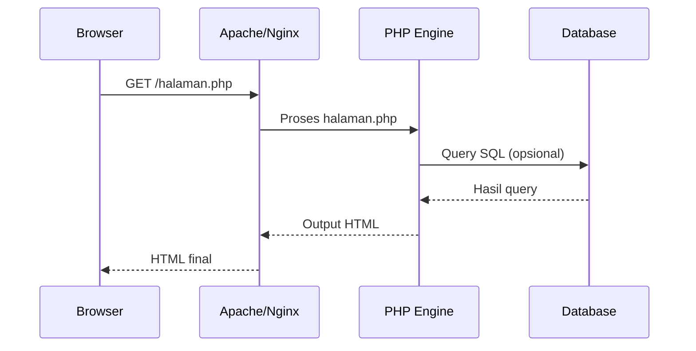

# Minggu 9-10 — Pemrograman Sisi Server dengan PHP

## Tujuan Pembelajaran

Setelah mempelajari materi ini, mahasiswa dapat:
- Memahami konsep dan cara kerja **PHP** sebagai bahasa server-side
- Menggunakan variabel, tipe data, operator, dan struktur kontrol PHP
- Membuat fungsi dan bekerja dengan array di PHP
- Membangun skrip pengolah data di server

---

## 1. Pengenalan PHP

**PHP (PHP: Hypertext Preprocessor)** adalah bahasa skrip server-side yang dirancang untuk pengembangan web.



### Setup Lingkungan (XAMPP)

```
1. Download XAMPP dari apachefriends.org
2. Install dan jalankan Apache + MySQL
3. Buat file PHP di: C:/xampp/htdocs/ (Windows)
                atau /opt/lampp/htdocs/ (Linux)
4. Akses via browser: http://localhost/namafile.php
```

### Hello World PHP

```php
<?php
// File: hello.php
echo "Halo Dunia!";
echo "<h1>Selamat Belajar PHP</h1>";

// Variasi output
echo "Ini echo<br>";
print "Ini print<br>";
printf("Halo, %s! Anda berusia %d tahun.<br>", "Ahmad", 20);
?>
```

---

## 2. Variabel & Tipe Data

```php
<?php
// Variabel diawali dengan $
$nama      = "Ahmad Mahasiswa";  // String
$usia      = 21;                 // Integer
$ipk       = 3.75;               // Float
$aktif     = true;               // Boolean
$alamat    = null;               // Null

// PHP adalah loosely typed (tipe dinamis)
$angka = "42";        // String
$angka = 42;          // Sekarang Integer
$angka = 42.5;        // Sekarang Float

// Konstanta
define("MAX_SKS", 24);
const NAMA_UNIVERSITAS = "Universitas Ubudiyah Indonesia";

// Cek tipe
echo gettype($nama);    // "string"
echo gettype($usia);    // "integer"
var_dump($ipk);         // float(3.75)
```

### String

```php
<?php
$nama  = "Mahendar";
$prodi = 'Informatika';   // Kutip tunggal: tidak ada interpolasi

// String Interpolation (hanya di kutip ganda)
echo "Halo, $nama!";               // Halo, Mahendar!
echo "Prodi: {$prodi}";            // Prodi: Informatika

// Concatenation
$kalimat = "Nama: " . $nama . ", Prodi: " . $prodi;

// Fungsi string penting
echo strlen("Halo");              // 4
echo strtoupper("halo");          // HALO
echo strtolower("HALO");          // halo
echo ucwords("halo dunia");       // Halo Dunia
echo str_replace("_", " ", "pemrograman_web");  // pemrograman web
echo trim("   spasi   ");         // "spasi"
echo substr("Informatika", 0, 5); // Infor
echo strpos("Informatika", "tika"); // 6

// Heredoc (multiline string)
$html = <<<HTML
<div class="profil">
  <h2>$nama</h2>
  <p>Prodi: $prodi</p>
</div>
HTML;
```

---

## 3. Operator

```php
<?php
// Aritmetika
echo 10 + 3;   // 13
echo 10 - 3;   // 7
echo 10 * 3;   // 30
echo 10 / 3;   // 3.333...
echo 10 % 3;   // 1
echo 2 ** 10;  // 1024
echo intdiv(10, 3); // 3 (pembagian bulat)

// Perbandingan
var_dump(5 == "5");   // true  (loose: hanya nilai)
var_dump(5 === "5");  // false (strict: nilai DAN tipe)
var_dump(5 !== "5");  // true
var_dump(10 <=> 5);   // 1 (spaceship: lebih besar)
var_dump(5 <=> 10);   // -1 (lebih kecil)

// Logika
var_dump(true && false); // false
var_dump(true || false); // true
var_dump(!true);         // false

// Null Coalescing
$pengguna = null;
$nama = $pengguna ?? "Tamu";   // "Tamu"

// Ternary
$status = ($ipk >= 3.0) ? "Cumlaude" : "Lulus";
```

---

## 4. Kontrol Alur

### If-Else

```php
<?php
$nilai = 78;

if ($nilai >= 85) {
    $huruf = "A";
} elseif ($nilai >= 75) {
    $huruf = "B";
} elseif ($nilai >= 65) {
    $huruf = "C";
} elseif ($nilai >= 55) {
    $huruf = "D";
} else {
    $huruf = "E";
}

echo "Nilai: $nilai → Huruf: $huruf";
```

### Switch

```php
<?php
$hari = "Senin";

switch ($hari) {
    case "Sabtu":
    case "Minggu":
        echo "Libur!";
        break;
    case "Senin":
        echo "Mulai semangat!";
        break;
    default:
        echo "Hari kerja";
}

// match (PHP 8+, lebih ketat dan ringkas)
$pesan = match($hari) {
    "Sabtu", "Minggu" => "Libur!",
    "Senin"           => "Mulai semangat!",
    default           => "Hari kerja"
};
```

### Perulangan

```php
<?php
// for
for ($i = 1; $i <= 10; $i++) {
    echo "$i ";
}
// 1 2 3 4 5 6 7 8 9 10

// while
$i = 1;
while ($i <= 5) {
    echo "Iterasi ke-$i<br>";
    $i++;
}

// foreach (untuk array)
$buah = ["Apel", "Mangga", "Pisang", "Nanas"];
foreach ($buah as $index => $item) {
    echo "$index: $item<br>";
}

// foreach untuk array asosiatif
$mahasiswa = ["nama" => "Ahmad", "nim" => "21001", "ipk" => 3.8];
foreach ($mahasiswa as $kunci => $nilai) {
    echo "$kunci: $nilai<br>";
}
```

---

## 5. Array

```php
<?php
// Array indeks (indexed)
$nama = ["Ahmad", "Budi", "Citra"];
echo $nama[0];       // Ahmad
echo count($nama);   // 3

// Array asosiatif (associative)
$mahasiswa = [
    "nama" => "Ahmad Fauzi",
    "nim"  => "21001234",
    "ipk"  => 3.75,
    "aktif" => true
];
echo $mahasiswa["nama"];  // Ahmad Fauzi

// Array multidimensi
$kelas = [
    ["nama" => "Ahmad", "nilai" => 88],
    ["nama" => "Budi",  "nilai" => 75],
    ["nama" => "Citra", "nilai" => 92],
];
echo $kelas[2]["nama"]; // Citra

// Fungsi array penting
$angka = [3, 1, 4, 1, 5, 9, 2, 6];
sort($angka);          // Urutkan ascending (modifikasi langsung)
rsort($angka);         // Urutkan descending

$a = [1, 2, 3];
$b = [4, 5, 6];
$gabung = array_merge($a, $b);   // [1,2,3,4,5,6]

$genap = array_filter($angka, fn($n) => $n % 2 === 0);
$kuadrat = array_map(fn($n) => $n ** 2, $angka);
$total = array_sum($angka);
$maks = max($angka);
$minn = min($angka);

// Spread operator (PHP 8.1+)
$semua = [...$a, ...$b];
```

---

## 6. Fungsi

```php
<?php
// Fungsi dasar
function sapa(string $nama): string {
    return "Halo, $nama!";
}
echo sapa("Ahmad");  // Halo, Ahmad!

// Parameter default
function hitungLingkaran(float $r, float $pi = 3.14159): float {
    return $pi * $r * $r;
}
echo hitungLingkaran(5);      // 78.53975
echo hitungLingkaran(5, M_PI); // 78.53981... (konstanta PHP)

// Variadic function
function jumlahkan(int ...$angka): int {
    return array_sum($angka);
}
echo jumlahkan(1, 2, 3, 4, 5); // 15

// Arrow function (PHP 7.4+)
$kali2 = fn($n) => $n * 2;
$hasil = array_map($kali2, [1, 2, 3, 4, 5]); // [2,4,6,8,10]

// Fungsi rekursif
function faktorial(int $n): int {
    if ($n <= 1) return 1;
    return $n * faktorial($n - 1);
}
echo faktorial(5); // 120
```

---

## 7. Formulir HTML & PHP

### Formulir (form.html)

```html
<!DOCTYPE html>
<html lang="id">
<head>
  <meta charset="UTF-8">
  <title>Form Mahasiswa</title>
</head>
<body>
  <h1>Data Mahasiswa</h1>
  <form action="proses.php" method="POST">
    <label>Nama:</label>
    <input type="text" name="nama" required><br>
    
    <label>NIM:</label>
    <input type="text" name="nim" required><br>
    
    <label>Email:</label>
    <input type="email" name="email" required><br>
    
    <label>Prodi:</label>
    <select name="prodi">
      <option value="IF">Informatika</option>
      <option value="SI">Sistem Informasi</option>
      <option value="TK">Teknik Komputer</option>
    </select><br>
    
    <label>IPK:</label>
    <input type="number" name="ipk" step="0.01" min="0" max="4"><br>
    
    <button type="submit">Simpan</button>
  </form>
</body>
</html>
```

### Proses Form (proses.php)

```php
<?php
// Validasi metode request
if ($_SERVER["REQUEST_METHOD"] !== "POST") {
    header("Location: form.html");
    exit;
}

// Fungsi sanitasi — WAJIB sebelum gunakan input pengguna!
function bersihkan(string $data): string {
    $data = trim($data);
    $data = stripslashes($data);
    $data = htmlspecialchars($data);
    return $data;
}

// Ambil dan bersihkan input
$nama  = bersihkan($_POST["nama"] ?? "");
$nim   = bersihkan($_POST["nim"]  ?? "");
$email = bersihkan($_POST["email"] ?? "");
$prodi = bersihkan($_POST["prodi"] ?? "");
$ipk   = filter_input(INPUT_POST, "ipk", FILTER_VALIDATE_FLOAT);

// Validasi
$error = [];

if (strlen($nama) < 3) {
    $error[] = "Nama minimal 3 karakter.";
}
if (!preg_match("/^\d{8,12}$/", $nim)) {
    $error[] = "NIM harus 8-12 digit angka.";
}
if (!filter_var($email, FILTER_VALIDATE_EMAIL)) {
    $error[] = "Format email tidak valid.";
}
if ($ipk === false || $ipk < 0 || $ipk > 4) {
    $error[] = "IPK harus antara 0 dan 4.";
}

// Tampilkan hasil
if (!empty($error)) {
    echo "<h2>❌ Terdapat Kesalahan:</h2>";
    echo "<ul>";
    foreach ($error as $e) {
        echo "<li>$e</li>";
    }
    echo "</ul>";
    echo "<a href='form.html'>← Kembali</a>";
} else {
    echo "<h2>✅ Data Berhasil Disimpan!</h2>";
    echo "<table border='1' cellpadding='8'>";
    echo "<tr><th>Field</th><th>Nilai</th></tr>";
    echo "<tr><td>Nama</td><td>$nama</td></tr>";
    echo "<tr><td>NIM</td><td>$nim</td></tr>";
    echo "<tr><td>Email</td><td>$email</td></tr>";
    echo "<tr><td>Prodi</td><td>$prodi</td></tr>";
    echo "<tr><td>IPK</td><td>$ipk</td></tr>";
    echo "</table>";
}
?>
```

---

## 8. Session & Cookie

```php
<?php
// ===== SESSION =====
session_start(); // Wajib di awal file yang menggunakan session

// Menyimpan data session (setelah login berhasil)
$_SESSION["user_id"]   = 1;
$_SESSION["user_nama"] = "Ahmad";
$_SESSION["login"]     = true;

// Membaca session
if (isset($_SESSION["login"]) && $_SESSION["login"]) {
    echo "Selamat datang, " . $_SESSION["user_nama"];
} else {
    header("Location: login.php");
    exit;
}

// Menghapus session (logout)
session_destroy();

// ===== COOKIE =====
// Menyimpan cookie (berlaku 30 hari)
setcookie("tema", "gelap", time() + (86400 * 30), "/");

// Membaca cookie
$tema = $_COOKIE["tema"] ?? "terang";
echo "Tema: $tema";
```

---

## 🏗️ Proyek Praktikum

Buat **sistem registrasi & login sederhana** menggunakan PHP murni:

1. `register.php` — Form registrasi (nama, email, password)
2. `proses-register.php` — Validasi dan simpan ke session/file
3. `login.php` — Form login
4. `proses-login.php` — Cek kredensial dan set session
5. `dashboard.php` — Halaman setelah login (dilindungi)
6. `logout.php` — Hapus session dan redirect ke login

---

## 🏋️ Latihan

1. Buat kalkulator sederhana: form input dua angka dan operator, proses di PHP, tampilkan hasil.
2. Buat halaman yang menghasilkan tabel perkalian (1-10) menggunakan perulangan bersarang.
3. Buat fungsi PHP untuk mengonversi nilai angka (0-100) ke huruf (A, B, C, D, E) sesuai standar universitas.
4. Buat halaman yang membaca daftar mahasiswa dari array dan menampilkannya dalam tabel HTML.

---

## 📚 Referensi

- [PHP Manual — php.net](https://www.php.net/manual/en/)
- [W3Schools PHP](https://www.w3schools.com/php/)
- Nixon, R. (2021). *Learning PHP, MySQL & JavaScript*. O'Reilly. — Bab 3-6
