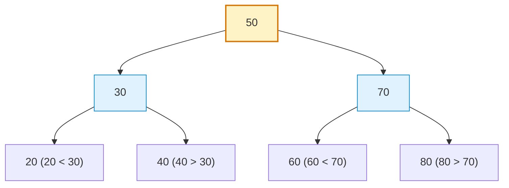
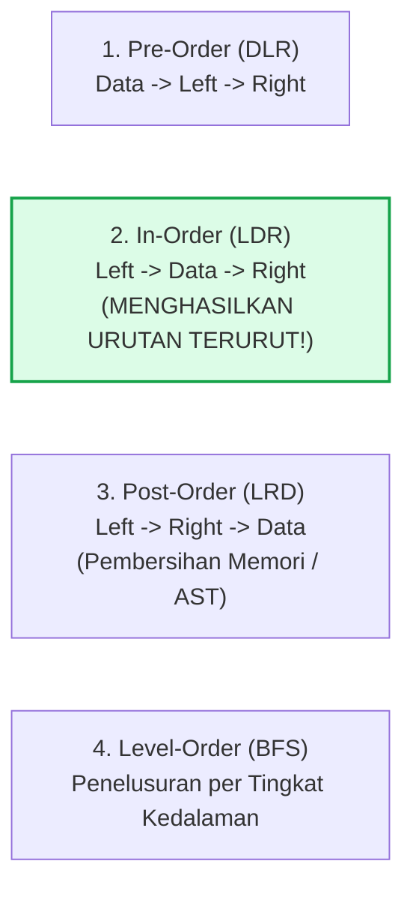

# Minggu 10: Binary Search Tree (BST) & Algoritma Traversal

::: tip CAPAIAN PEMBELAJARAN (SUB-CPMK 5)
- **CPMK Terkait:** CPMK0101 (Struktur Data Non-Linear), CPMK0106 (Analisis Kompleksitas)
- **CPL Terkait:** CPL01 (Pengetahuan Dasar), CPL03 (Problem Solving), CPL04 (Solusi Rekayasa)
- **Indikator:** Mahasiswa mampu mengimplementasikan properti dasar BST, operasi penyisipan (*Insert*), pencarian (*Search*), penghapusan simpul (*Delete Node: 3 skenario*), serta 4 teknik penelusuran (*PreOrder, InOrder, PostOrder, LevelOrder*).
:::

---

## 1. Properti Fundamental Binary Search Tree (BST)

**Binary Search Tree (BST)** adalah pohon biner dengan aturan pengurutan ketat (*ordering property*):
Untuk setiap simpul $N$:
1. Semua nilai di **Subtree Kiri** harus **lebih kecil** dari nilai $N$ ($L < N$).
2. Semua nilai di **Subtree Kanan** harus **lebih besar** dari nilai $N$ ($R > N$).
3. Tidak boleh ada nilai duplikat (atau ditangani dengan aturan khusus).



---

## 2. Empat Teknik Penelusuran Pohon (Tree Traversal)



---

## 3. Implementasi Lengkap BST di Golang

::: code-group
```go [bst.go]
package main

import (
    "cmp"
    "fmt"
)

type BSTNode[T cmp.Ordered] struct {
    Val   T
    Left  *BSTNode[T]
    Right *BSTNode[T]
}

type BST[T cmp.Ordered] struct {
    Root *BSTNode[T]
}

// 1. Insert Node (Rekursif)
func (tree *BST[T]) Insert(val T) {
    tree.Root = insertRec(tree.Root, val)
}

func insertRec[T cmp.Ordered](node *BSTNode[T], val T) *BSTNode[T] {
    if node == nil {
        return &BSTNode[T]{Val: val}
    }
    if val < node.Val {
        node.Left = insertRec(node.Left, val)
    } else if val > node.Val {
        node.Right = insertRec(node.Right, val)
    }
    return node
}

// 2. Search Node (O(log n) average)
func (tree *BST[T]) Search(val T) bool {
    curr := tree.Root
    for curr != nil {
        if val == curr.Val {
            return true
        } else if val < curr.Val {
            curr = curr.Left
        } else {
            curr = curr.Right
        }
    }
    return false
}

// 3. In-Order Traversal (L-D-R) -> Menghasilkan data terurut naik
func (tree *BST[T]) InOrder(node *BSTNode[T]) {
    if node != nil {
        tree.InOrder(node.Left)
        fmt.Printf("%v ", node.Val)
        tree.InOrder(node.Right)
    }
}

// 4. Delete Node (Menangani 3 Kasus: 0 anak, 1 anak, 2 anak)
func (tree *BST[T]) Delete(val T) {
    tree.Root = deleteRec(tree.Root, val)
}

func deleteRec[T cmp.Ordered](node *BSTNode[T], val T) *BSTNode[T] {
    if node == nil {
        return nil
    }
    if val < node.Val {
        node.Left = deleteRec(node.Left, val)
    } else if val > node.Val {
        node.Right = deleteRec(node.Right, val)
    } else {
        // Kasus 1 & 2: 0 atau 1 anak
        if node.Left == nil {
            return node.Right
        } else if node.Right == nil {
            return node.Left
        }
        // Kasus 3: 2 anak -> Ganti dengan In-Order Successor (terkecil di subtree kanan)
        minNode := findMin(node.Right)
        node.Val = minNode.Val
        node.Right = deleteRec(node.Right, minNode.Val)
    }
    return node
}

func findMin[T cmp.Ordered](node *BSTNode[T]) *BSTNode[T] {
    for node.Left != nil {
        node = node.Left
    }
    return node
}

func main() {
    bst := &BST[int]{}
    values := []int{50, 30, 70, 20, 40, 60, 80}
    for _, v := range values {
        bst.Insert(v)
    }

    fmt.Print("InOrder Traversal: ")
    bst.InOrder(bst.Root) // 20 30 40 50 60 70 80
    fmt.Println()

    fmt.Println("Cari angka 40:", bst.Search(40)) // true
    fmt.Println("Cari angka 99:", bst.Search(99)) // false

    bst.Delete(30)
    fmt.Print("Setelah Node 30 Dihapus: ")
    bst.InOrder(bst.Root) // 20 40 50 60 70 80
    fmt.Println()
}
```
:::

---

## 📝 Evaluasi & Latihan Mandiri (Sub-CPMK 5)

1. Mengapa Binary Search Tree dapat mengalami penurunan performa ke $O(n)$ saat data dimasukkan dalam keadaan sudah terurut? Bagaimana cara mengatasinya (*Self-Balancing AVL / Red-Black Tree*)?
2. Buatlah fungsi `LevelOrder(root *BSTNode[T])` menggunakan struktur data **Queue** untuk mencetak simpul tingkat demi tingkat (*Breadth-First Search*)!
