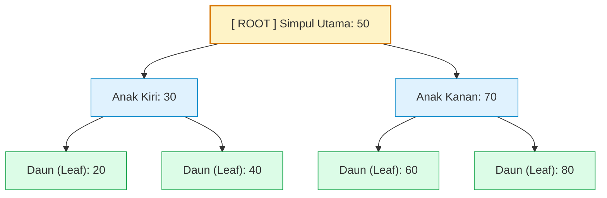

# Minggu 9: Struktur Data Non-Linear: Pohon Biner (Binary Tree)

::: tip CAPAIAN PEMBELAJARAN (SUB-CPMK 5)
- **CPMK Terkait:** CPMK0101 (Struktur Data Non-Linear), CPMK0106 (Analisis Kompleksitas)
- **CPL Terkait:** CPL01 (Pengetahuan Dasar), CPL04 (Solusi Rekayasa Komputasi)
- **Indikator:** Mahasiswa mampu menguraikan terminologi pohon hierarkis (*Root, Parent, Child, Leaf, Height, Depth*), mengklasifikasikan jenis-jenis Binary Tree (Full, Complete, Perfect, Balanced), serta merancang representasi struct `TreeNode` generik di Golang.
:::

---

## 1. Hakikat Struktur Data Pohon (Tree)

**Pohon (Tree)** adalah struktur data non-linear berhirarki yang terdiri atas simpul-simpul (**Nodes**) yang saling terhubung melalui cabang (**Edges**), tanpa membentuk siklus (*acyclic*).



### Terminologi Standar Pohon:
- **Root (Akar):** Simpul paling atas yang tidak memiliki orang tua (*parent*).
- **Parent / Child:** Hubungan simpul atas terhadap simpul di bawahnya.
- **Leaf (Daun / Simpul Eksternal):** Simpul yang tidak memiliki anak sama sekali (`Left == nil && Right == nil`).
- **Depth (Kedalaman):** Jumlah sisi dari Root menuju simpul tertentu.
- **Height (Tinggi):** Jumlah sisi maksimum dari simpul tertentu menuju daun terjauh.

---

## 2. Klasifikasi Pohon Biner (Binary Tree)

**Pohon Biner (*Binary Tree*)** adalah pohon di mana setiap simpul memiliki **maksimal 2 anak** (*Left Child* dan *Right Child*).

| Jenis Binary Tree | Karakteristik Formal |
| :--- | :--- |
| **Full Binary Tree** | Setiap simpul memiliki tepat **0 atau 2 anak** (tidak ada simpul beranak 1). |
| **Complete Binary Tree** | Semua level terisi penuh kecuali level terakhir, dan daun pada level terakhir merapat ke kiri. |
| **Perfect Binary Tree** | Semua simpul internal memiliki 2 anak dan semua daun berada pada level kedalaman yang sama ($N = 2^{h+1} - 1$). |
| **Balanced Binary Tree** | Selisih tinggi subtree kiri dan kanan pada setiap simpul tidak lebih dari 1 (misal: AVL Tree). |
| **Degenerate / Skewed Tree** | Setiap simpul hanya memiliki 1 anak (menyerupai Linked List dengan performa memburuk ke $O(n)$). |

---

## 3. Implementasi Generic TreeNode di Golang

::: code-group
```go [binary_tree.go]
package main

import (
    "fmt"
)

// Generic TreeNode
type TreeNode[T any] struct {
    Val   T
    Left  *TreeNode[T]
    Right *TreeNode[T]
}

func NewTreeNode[T any](val T) *TreeNode[T] {
    return &TreeNode[T]{Val: val}
}

// Menghitung Tinggi Pohon (Height) secara Rekursif
func MaxDepth[T any](root *TreeNode[T]) int {
    if root == nil {
        return 0
    }
    leftDepth := MaxDepth(root.Left)
    rightDepth := MaxDepth(root.Right)

    if leftDepth > rightDepth {
        return leftDepth + 1
    }
    return rightDepth + 1
}

// Menghitung Total Jumlah Simpul
func CountNodes[T any](root *TreeNode[T]) int {
    if root == nil {
        return 0
    }
    return 1 + CountNodes(root.Left) + CountNodes(root.Right)
}

func main() {
    // Membangun Pohon Biner Manual
    root := NewTreeNode("A (CEO)")
    root.Left = NewTreeNode("B (VP Tech)")
    root.Right = NewTreeNode("C (VP Finance)")
    root.Left.Left = NewTreeNode("D (Lead Dev)")
    root.Left.Right = NewTreeNode("E (QA Manager)")

    fmt.Println("Total Simpul dalam Pohon:", CountNodes(root)) // 5
    fmt.Println("Tinggi Pohon (Max Depth) :", MaxDepth(root))   // 3
}
```
:::

---

## 📝 Evaluasi & Latihan Mandiri (Sub-CPMK 5)

1. Buktikan secara matematis bahwa pada sebuah *Perfect Binary Tree* dengan tinggi $h$, jumlah total daun adalah $2^h$!
2. Buatlah fungsi Golang `IsLeaf(node *TreeNode[T]) bool` untuk memeriksa apakah sebuah simpul adalah simpul daun!
