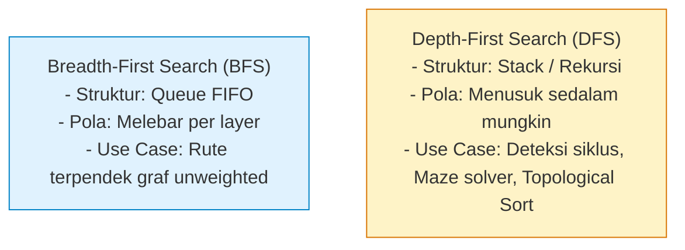

# Minggu 13: Algoritma Penelusuran Graf (BFS/DFS) & Rute Terpendek Dijkstra

::: tip CAPAIAN PEMBELAJARAN (SUB-CPMK 6)
- **CPMK Terkait:** CPMK0106 (Analisis Kompleksitas & Algoritma Graf)
- **CPL Terkait:** CPL01 (Pengetahuan Dasar), CPL03 (Problem Solving Dinamis), CPL04 (Solusi Rekayasa)
- **Indikator:** Mahasiswa mampu mengimplementasikan algoritma penelusuran Breadth-First Search (BFS) menggunakan Queue, Depth-First Search (DFS) menggunakan Rekursi/Stack, serta Algoritma Dijkstra menggunakan Min-Heap Priority Queue untuk mencari rute terpendek.
:::

---

## 1. Penelusuran Graf: BFS vs DFS



---

## 2. Algoritma Dijkstra (Shortest Path Finding)

Algoritma **Dijkstra** (ditemukan oleh Edsger W. Dijkstra) adalah algoritma *Greedy* untuk mencari lintasan terpendek dari satu simpul asal (*single-source shortest path*) ke semua simpul lain pada graf dengan bobot sisi non-negatif.

```mermaid
flowchart TD
    Init[Inisialisasi: Dist[Start]=0, Dist[Lain]=Inf] --> PushPQ[Push Start ke Min-Heap Priority Queue]
    PushPQ --> Loop{PQ Masih Ada Isi?}
    Loop -- Ya --> PopMin[Pop Simpul 'u' dengan Jarak Terkecil]
    PopMin --> Relax[Relaksasi Sisi u -> v:<br>Jika Dist[u] + w < Dist[v] Maka Dist[v] = Dist[u] + w]
    Relax --> PushV[Push v ke Min-Heap]
    PushV --> Loop
    Loop -- Selesai --> End([Daftar Jarak Terpendek Final Selesai])
    style Init fill:#e0f2fe,stroke:#0284c7;
    style Relax fill:#dcfce7,stroke:#16a34a;
```

---

## 3. Implementasi Lengkap Algoritma Dijkstra di Golang

::: code-group
```go [dijkstra.go]
package main

import (
    "container/heap"
    "fmt"
    "math"
)

type Item struct {
    node string
    dist int
}

// Implementasi Min-Heap untuk Priority Queue
type PriorityQueue []Item

func (pq PriorityQueue) Len() int           { return len(pq) }
func (pq PriorityQueue) Less(i, j int) bool { return pq[i].dist < pq[j].dist }
func (pq PriorityQueue) Swap(i, j int)      { pq[i], pq[j] = pq[j], pq[i] }
func (pq *PriorityQueue) Push(x any)        { *pq = append(*pq, x.(Item)) }
func (pq *PriorityQueue) Pop() any {
    old := *pq
    n := len(old)
    item := old[n-1]
    *pq = old[0 : n-1]
    return item
}

type GraphDijkstra struct {
    adj map[string][]struct {
        to, weight int
        node       string
    }
}

func Dijkstra(graph map[string]map[string]int, startNode string) map[string]int {
    dist := make(map[string]int)
    for node := range graph {
        dist[node] = math.MaxInt32
    }
    dist[startNode] = 0

    pq := &PriorityQueue{}
    heap.Init(pq)
    heap.Push(pq, Item{node: startNode, dist: 0})

    for pq.Len() > 0 {
        top := heap.Pop(pq).(Item)
        u := top.node
        d := top.dist

        if d > dist[u] {
            continue
        }

        for neighbor, weight := range graph[u] {
            if dist[u]+weight < dist[neighbor] {
                dist[neighbor] = dist[u] + weight
                heap.Push(pq, Item{node: neighbor, dist: dist[neighbor]})
            }
        }
    }
    return dist
}

func main() {
    peta := map[string]map[string]int{
        "Banda Aceh":  {"Jantho": 55, "Sigli": 110},
        "Jantho":      {"Banda Aceh": 55, "Sigli": 65},
        "Sigli":       {"Banda Aceh": 110, "Jantho": 65, "Bireuen": 105},
        "Bireuen":     {"Sigli": 105, "Lhokseumawe": 45},
        "Lhokseumawe": {"Bireuen": 45},
    }

    hasil := Dijkstra(peta, "Banda Aceh")
    fmt.Println("=== JARAK TERPENDEK DARI BANDA ACEH ===")
    for kota, jarak := range hasil {
        fmt.Printf("Ke %-12s : %d km\n", kota, jarak)
    }
}
```
:::

---

## 📝 Evaluasi & Latihan Mandiri (Sub-CPMK 6)

1. Mengapa Algoritma Dijkstra **gagal dan tidak dapat digunakan** jika graf memiliki bobot sisi bernilai negatif? Algoritma apa yang mampu menanganinya (*Bellman-Ford Algorithm*)?
2. Modifikasi kode Dijkstra di atas agar mampu mencatat dan mencetak seluruh urutan kota yang dilalui (*reconstruct shortest path*)!
