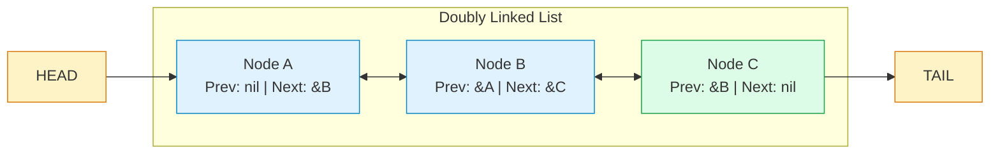
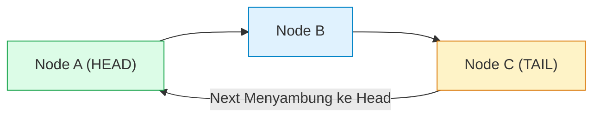

# Minggu 6: Linked List Lanjutan: Doubly, Circular & LRU Cache

::: tip CAPAIAN PEMBELAJARAN (SUB-CPMK 4)
- **CPMK Terkait:** CPMK0101 (Struktur Data Linear), CPMK0106 (Analisis Kompleksitas)
- **CPL Terkait:** CPL01 (Pengetahuan Dasar), CPL03 (Problem Solving), CPL04 (Solusi Rekayasa)
- **Indikator:** Mahasiswa mampu mengimplementasikan Doubly Linked List (*Prev & Next pointer*), Circular Linked List, algoritma deteksi siklus (*Floyd's Cycle Finding*), serta merekayasa sistem *Least Recently Used (LRU) Cache* tingkat industri.
:::

---

## 1. Arsitektur Doubly Linked List (Navigasi Dua Arah)

Pada **Doubly Linked List**, setiap Node memiliki dua pointer:
1. **`Next`:** Merujuk ke Node berikutnya.
2. **`Prev`:** Merujuk ke Node sebelumnya.

Keunggulan mutlak Doubly Linked List adalah kita dapat melakukan operasi navigasi maju dan mundur, serta menghapus sembarang node yang referensinya diketahui dalam waktu **`O(1)` murni** tanpa perlu mencari node pendahulunya (*predecessor*).



---

## 2. Circular Linked List & Deteksi Siklus (*Floyd's Algorithm*)

Pada **Circular Linked List**, pointer `Next` pada Node terakhir (**Tail**) tidak bernilai `nil`, melainkan menyambung kembali ke Node pertama (**Head**).



### Algoritma Kura-kura & Kelinci (Floyd's Tortoise and Hare)
Untuk mendeteksi apakah suatu linked list mengalami siklus/looping tanpa batas:
- Pointer **Slow (Kura-kura)** bergerak 1 langkah.
- Pointer **Fast (Kelinci)** bergerak 2 langkah.
- Jika ada siklus, `Fast` dan `Slow` **pasti akan bertemu** pada satu titik dalam waktu `O(n)`.

```go
func HasCycle[T comparable](head *Node[T]) bool {
    slow, fast := head, head
    for fast != nil && fast.Next != nil {
        slow = slow.Next
        fast = fast.Next.Next
        if slow == fast {
            return true // Siklus terdeteksi!
        }
    }
    return false
}
```

---

## 3. Studi Kasus Industri: Implementasi LRU (Least Recently Used) Cache

**LRU Cache** adalah komponen arsitektur vital pada sistem basis data (seperti Redis dan buffer pool MySQL) untuk menyimpan data paling sering diakses di RAM:
- Menggunakan **Hash Map** (`map[K]*Node`) untuk pencarian instan `O(1)`.
- Menggunakan **Doubly Linked List** untuk memelihara urutan frekuensi akses: node yang baru diakses dipindahkan ke paling depan (Head), sedangkan node yang paling jarang diakses di ujung ekor (Tail) akan dibuang (*evicted*) saat kapasitas penuh.

```mermaid
graph LR
    subgraph Hash Map (O(1) Lookup)
        M1["Key 'user:1' -> *Node A"]
        M2["Key 'user:2' -> *Node B"]
    end
    subgraph Doubly Linked List (Urutan Akses)
        Head["[ HEAD: Most Recent ]"] <--> NA["Node A ('user:1')"] <--> NB["Node B ('user:2')"] <--> Tail["[ TAIL: Least Recent ]"]
    end
    M1 -.-> NA
    M2 -.-> NB
    style Head fill:#dcfce7,stroke:#16a34a
    style Tail fill:#fee2e2,stroke:#dc2626
```

::: code-group
```go [lru_cache.go]
package main

import "fmt"

type DNode struct {
    key, val   int
    prev, next *DNode
}

type LRUCache struct {
    capacity   int
    cache      map[int]*DNode
    head, tail *DNode // Dummy Sentinel Nodes
}

func Constructor(capacity int) LRUCache {
    l := LRUCache{
        capacity: capacity,
        cache:    make(map[int]*DNode),
        head:     &DNode{},
        tail:     &DNode{},
    }
    l.head.next = l.tail
    l.tail.prev = l.head
    return l
}

func (this *LRUCache) remove(node *DNode) {
    node.prev.next = node.next
    node.next.prev = node.prev
}

func (this *LRUCache) insertHead(node *DNode) {
    node.next = this.head.next
    node.prev = this.head
    this.head.next.prev = node
    this.head.next = node
}

func (this *LRUCache) Get(key int) int {
    if node, ok := this.cache[key]; ok {
        this.remove(node)
        this.insertHead(node) // Promosikan ke paling depan
        return node.val
    }
    return -1
}

func (this *LRUCache) Put(key int, value int) {
    if node, ok := this.cache[key]; ok {
        this.remove(node)
        delete(this.cache, key)
    }
    if len(this.cache) == this.capacity {
        lru := this.tail.prev
        this.remove(lru)
        delete(this.cache, lru.key) // Evict node paling usang
    }
    newNode := &DNode{key: key, val: value}
    this.insertHead(newNode)
    this.cache[key] = newNode
}

func main() {
    lru := Constructor(2)
    lru.Put(1, 100)
    lru.Put(2, 200)
    fmt.Println("Get(1):", lru.Get(1)) // 100 (Node 1 menjadi Most Recent)

    lru.Put(3, 300)                    // Kapasitas penuh! Node 2 di-evict
    fmt.Println("Get(2):", lru.Get(2)) // -1 (Tidak ditemukan / Evicted)
    fmt.Println("Get(3):", lru.Get(3)) // 300
}
```
:::

---

## 📝 Evaluasi & Latihan Mandiri (Sub-CPMK 4)

1. Rancanglah sistem simulasi pemutar lagu (*Music Playlist*) dengan tombol **Next**, **Prev**, dan opsi **Repeat All (Circular Doubly Linked List)**!
2. Jelaskan mengapa *Dummy Sentinel Nodes* (Head & Tail buatan) sangat dianjurkan saat mengimplementasikan Doubly Linked List!
