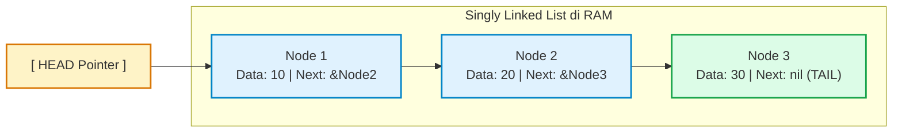
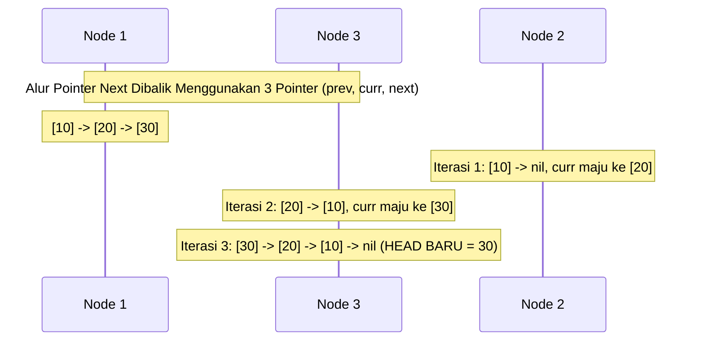

# Minggu 5: Struktur Data Linear: Singly Linked List & Node Chaining

::: tip CAPAIAN PEMBELAJARAN (SUB-CPMK 4)
- **CPMK Terkait:** CPMK0101 (Struktur Data Linear), CPMK0106 (Analisis Kompleksitas)
- **CPL Terkait:** CPL01 (Pengetahuan Dasar), CPL03 (Problem Solving), CPL04 (Solusi Rekayasa)
- **Indikator:** Mahasiswa mampu menguraikan konsep memori non-kontigu, merancang representasi struct `Node` dan pointer rantai `*Node`, mengimplementasikan operasi penyisipan, penghapusan, traversal, dan pembalikan rantai (*reversing list*), serta membandingkan performanya terhadap Array.
:::

---

## 1. Konsep Dasar Singly Linked List

**Linked List (Senarai Berantai)** adalah struktur data linear dinamis di mana elemen-elemen data (**Node**) tidak disimpan di lokasi memori yang bersebelahan secara fisik, melainkan saling terhubung melalui **Pointer**.

Setiap **Node** pada Singly Linked List terdiri atas dua bagian:
1. **Data Field (`Val`):** Menyimpan nilai aktual objek data.
2. **Next Pointer (`Next`):** Menyimpan alamat memori yang merujuk ke Node berikutnya (atau bernilai `nil` jika berada di ujung akhir).



---

## 2. Komparasi Head-to-Head: Array/Slice vs Linked List

| Operasi / Karakteristik | Array / Slice Dinamis | Singly Linked List |
| :--- | :--- | :--- |
| **Tata Letak Memori** | Blok memori kontigu bersebelahan. | Blok memori tersebar di Heap (*Non-contiguous*). |
| **Akses Elemen Acak ($A[i]$)** | **$O(1)$ (Sangat Cepat via rumus indeks)**. | **$O(n)$ (Harus traversal dari Head)**. |
| **Penyisipan di Awal (*Prepend*)** | $O(n)$ (Harus menggeser seluruh elemen). | **$O(1)$ (Hanya ubah pointer Head)**. |
| **Penyisipan di Akhir (*Append*)** | $O(1)$ amortized (bisa $O(n)$ jika reallocate).| **$O(1)$ jika punya pointer Tail** (atau $O(n)$). |
| **Penghapusan Elemen Depan** | $O(n)$ (atau $O(1)$ dengan pemotongan slice).| **$O(1)$ (Langsung Head = Head.Next)**. |
| **Efisiensi Memori (Overhead)** | Sangat hemat (Hanya data murni). | Ada beban tambahan memori 8 bytes untuk pointer `Next` di tiap node. |
| **CPU Cache Locality** | **Sangat Baik** (Data berdekatan di cache L1/L2). | Kurang optimal (Pointer dereferencing memicu *cache miss*). |

---

## 3. Implementasi Generic Singly Linked List di Golang

::: code-group
```go [singly_linked_list.go]
package main

import (
    "errors"
    "fmt"
)

// Definisi Node Generik
type Node[T comparable] struct {
    Val  T
    Next *Node[T]
}

// Definisi Singly Linked List Container
type SinglyLinkedList[T comparable] struct {
    Head *Node[T]
    Tail *Node[T]
    size int
}

func NewSinglyLinkedList[T comparable]() *SinglyLinkedList[T] {
    return &SinglyLinkedList[T]{}
}

// 1. Insert di Paling Depan (O(1))
func (list *SinglyLinkedList[T]) PushFront(val T) {
    newNode := &Node[T]{Val: val, Next: list.Head}
    list.Head = newNode
    if list.Tail == nil {
        list.Tail = newNode
    }
    list.size++
}

// 2. Insert di Paling Belakang (O(1) berkat pointer Tail)
func (list *SinglyLinkedList[T]) PushBack(val T) {
    newNode := &Node[T]{Val: val, Next: nil}
    if list.Head == nil {
        list.Head = newNode
        list.Tail = newNode
    } else {
        list.Tail.Next = newNode
        list.Tail = newNode
    }
    list.size++
}

// 3. Delete Elemen Terdepan (O(1))
func (list *SinglyLinkedList[T]) PopFront() (T, error) {
    if list.Head == nil {
        var zero T
        return zero, errors.New("list kosong")
    }
    val := list.Head.Val
    list.Head = list.Head.Next
    if list.Head == nil {
        list.Tail = nil
    }
    list.size--
    return val, nil
}

// 4. Reverse / Membalik Linked List (O(n) Time, O(1) Space)
func (list *SinglyLinkedList[T]) Reverse() {
    var prev *Node[T] = nil
    curr := list.Head
    list.Tail = list.Head

    for curr != nil {
        nextTemp := curr.Next
        curr.Next = prev
        prev = curr
        curr = nextTemp
    }
    list.Head = prev
}

// 5. Cetak Seluruh Node
func (list *SinglyLinkedList[T]) Display() {
    curr := list.Head
    fmt.Print("HEAD -> ")
    for curr != nil {
        fmt.Printf("[%v] -> ", curr.Val)
        curr = curr.Next
    }
    fmt.Println("nil")
}

func main() {
    list := NewSinglyLinkedList[int]()

    list.PushBack(10)
    list.PushBack(20)
    list.PushBack(30)
    list.PushFront(5)

    list.Display() // HEAD -> [5] -> [10] -> [20] -> [30] -> nil

    list.Reverse()
    fmt.Print("Setelah Reverse: ")
    list.Display() // HEAD -> [30] -> [20] -> [10] -> [5] -> nil
}
```
:::

---

## 4. Mekanisme Pembalikan Rantai (*In-Place Reverse List*)



---

## 📝 Evaluasi & Latihan Mandiri (Sub-CPMK 4)

1. Tuliskan fungsi `DeleteValue(target T)` untuk menghapus kemunculan pertama suatu nilai dari Singly Linked List!
2. Rancanglah fungsi untuk menemukan **Elemen Tengah (*Middle of Linked List*)** dalam satu kali penelusuran (*Fast & Slow Pointer Algorithm*)!
