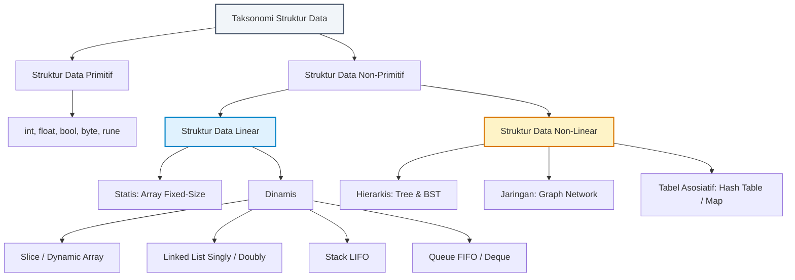
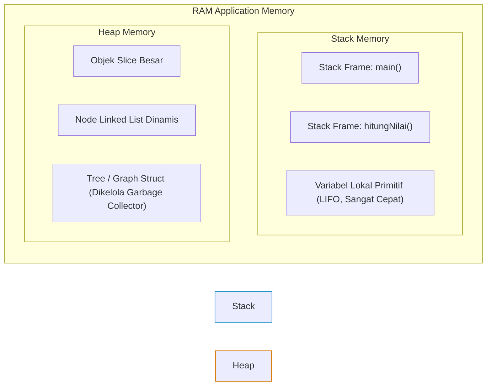

# Minggu 1: Pengantar Struktur Data, Memori Komputer & Analisis Kompleksitas

::: tip CAPAIAN PEMBELAJARAN (SUB-CPMK 1)
- **CPMK Terkait:** CPMK0101 (Konsep Dasar Struktur Data), CPMK0106 (Analisis Kompleksitas)
- **CPL Terkait:** CPL01 (Pengetahuan Dasar Informatika), CPL04 (Solusi Rekayasa Komputasi)
- **Indikator:** Mahasiswa mampu menguraikan taksonomi struktur data, memahami model alokasi memori sistem (*Stack vs Heap*), proses *Escape Analysis* di Golang, abstraksi tipe data (*ADT*), serta menganalisis efisiensi algoritma menggunakan notasi asimptotik *Big-O*.
:::

---

## 1. Hakikat dan Taksonomi Struktur Data

Dalam rekayasa perangkat lunak modern, data bukan sekadar angka atau teks acak, melainkan representasi entitas dunia nyata. **Struktur Data** adalah cara sistematis untuk mengatur, mengorganisasikan, mengelola, dan menyimpan data di dalam memori komputer sehingga operasi terhadap data tersebut (seperti pencarian, penyisipan, pengubahan, dan penghapusan) dapat dilakukan secara optimal dan efisien.



### Perbedaan Fundamental Linear vs Non-Linear

| Parameter Komparasi | Struktur Data Linear | Struktur Data Non-Linear |
| :--- | :--- | :--- |
| **Susunan Elemen** | Elemen tersusun berurutan secara sekuensial (satu dimensi). | Elemen tersusun bertingkat/bercabang (hierarki atau jaringan). |
| **Konektivitas Elemen** | Setiap elemen terhubung ke elemen tepat sebelum dan sesudahnya. | Satu elemen dapat terhubung ke banyak elemen lainnya. |
| **Traversal (Penelusuran)** | Dapat dijelajahi dalam satu kali lintasan (*single pass*). | Memerlukan penelusuran bercabang (*multi-pass*, DFS, BFS). |
| **Kompleksitas Memori** | Lebih sederhana dan ramah *CPU Cache Locality*. | Membutuhkan alokasi pointer berlebih (*pointer overhead*). |
| **Contoh Struktur** | Array, Slice, Linked List, Stack, Queue. | Binary Tree, Trie, AVL Tree, Graph, Heap. |

---

## 2. Arsitektur Memori Komputer: Stack vs Heap

Setiap variabel dan struktur data yang dialokasikan dalam aplikasi Golang ditempatkan di salah satu dari dua wilayah memori utama:



### Komparasi Mendalam Stack vs Heap

| Fitur / Karakteristik | Stack Memory | Heap Memory |
| :--- | :--- | :--- |
| **Mekanisme Alokasi** | Otomatis dialokasikan dan didealokasikan saat fungsi dipanggil (*Push*) dan selesai (*Pop*). | Dialokasikan secara dinamis saat runtime; didealokasikan oleh *Garbage Collector (GC)*. |
| **Kecepatan Akses** | **Sangat Cepat** (Instruksi CPU pointer register). | **Lebih Lambat** (Memerlukan dereferensi pointer dan penanganan fragmentasi). |
| **Batas Ukuran** | Terbatas (Ukuran stack awal goroutine di Go $\approx 2\text{ KB}$, dapat tumbuh dinamis). | Sangat besar (Dibatasi oleh kapasitas fisik RAM sistem). |
| **Siklus Hidup** | Terikat pada *scope* fungsi lokal (*lexical lifetime*). | Bertahan selama masih ada pointer aktif yang mereferensikannya. |

### Escape Analysis di Golang
Kompilator Golang menggunakan teknik canggih bernama **Escape Analysis** untuk menentukan apakah sebuah variabel cukup aman ditaruh di *Stack* atau harus "kabur" (*escape*) ke *Heap*:

```go
package main

type User struct {
    ID   int
    Name string
}

// Variabel 'u' escape ke Heap karena pointer-nya dikembalikan keluar dari fungsi
func CreateUserHeap(id int, name string) *User {
    u := User{ID: id, Name: name} // Escapes to heap!
    return &u
}

// Variabel 'u' tetap di Stack karena hanya dipakai lokal di dalam fungsi
func CreateUserStack(id int, name string) User {
    u := User{ID: id, Name: name} // Stays on stack
    return u
}
```

::: info UJI ESCAPE ANALYSIS DI TERMINAL
Anda dapat memverifikasi keputusan kompilator Go secara langsung dengan perintah:
```bash
go build -gcflags="-m -l" main.go
```
:::

---

## 3. Konsep Abstract Data Type (ADT) & Interface Go

**Abstract Data Type (ADT)** adalah model matematika untuk tipe data yang didefinisikan berdasarkan **perilaku eksternal (*behavior*)** dari sudut pandang pengguna, bukan berdasarkan rincian implementasi internalnya.

Di Golang, ADT diwujudkan secara elegan menggunakan **`interface`**:

```go
// Definisi ADT Container secara Abstrak
type Container[T any] interface {
    Push(item T)
    Pop() (T, bool)
    Peek() (T, bool)
    Size() int
    IsEmpty() bool
}
```

---

## 4. Analisis Kompleksitas Asimptotik (Notasi Big-O)

Notasi **Big-O ($O$)** menggambarkan batas atas (*upper bound*) dari laju pertumbuhan waktu eksekusi (*Time Complexity*) atau konsumsi memori (*Space Complexity*) suatu algoritma terhadap bertambahnya ukuran data masukan ($n$).

```mermaid
graph LR
    O1["O(1) - Konstan<br>(Akses Array, Push Stack)"] --> OlogN["O(log n) - Logaritmik<br>(Binary Search, BST)"]
    OlogN --> ON["O(n) - Linear<br>(Linear Search, Traversal)"]
    ON --> ONlogN["O(n log n) - Linearitmik<br>(Merge Sort, Quick Sort)"]
    ONlogN --> ON2["O(n²) - Kuadratik<br>(Bubble Sort, Nested Loop)"]
    ON2 --> O2N["O(2ⁿ) - Eksponensial<br>(Fibonacci Rekursif Naif)"]
    style O1 fill:#dcfce7,stroke:#16a34a;
    style OlogN fill:#dcfce7,stroke:#16a34a;
    style ON fill:#fef3c7,stroke:#d97706;
    style ONlogN fill:#fef3c7,stroke:#d97706;
    style ON2 fill:#fee2e2,stroke:#dc2626;
    style O2N fill:#fee2e2,stroke:#dc2626;
```



### Tabel Komparasi Waktu Eksekusi Berdasarkan Pertumbuhan Data ($n$)

| Notasi Big-O | $n = 10$ | $n = 100$ | $n = 1.000$ | $n = 1.000.000$ | Kategori Performa |
| :--- | :--- | :--- | :--- | :--- | :--- |
| **$O(1)$** | $1\text{ ns}$ | $1\text{ ns}$ | $1\text{ ns}$ | $1\text{ ns}$ | 🟢 Luar Biasa (*Ideal*) |
| **$O(\log n)$** | $3\text{ ns}$ | $7\text{ ns}$ | $10\text{ ns}$ | $20\text{ ns}$ | 🟢 Sangat Cepat |
| **$O(n)$** | $10\text{ ns}$ | $100\text{ ns}$ | $1\text{ }\mu\text{s}$ | $1\text{ ms}$ | 🟡 Cukup / Linear |
| **$O(n \log n)$** | $30\text{ ns}$ | $700\text{ ns}$ | $10\text{ }\mu\text{s}$ | $20\text{ ms}$ | 🟡 Efisien untuk Sorting |
| **$O(n^2)$** | $100\text{ ns}$ | $10\text{ }\mu\text{s}$ | $1\text{ ms}$ | $\approx 16.6\text{ menit}$ | 🔴 Lambat (Hindari untuk Big Data) |
| **$O(2^n)$** | $1\text{ }\mu\text{s}$ | $1.26 \times 10^{21}\text{ thn}$ | $\infty$ | $\infty$ | ⛔ Tidak Layak Komputasi |

---

## 📝 Evaluasi & Latihan Mandiri (Sub-CPMK 1)

1. **Analisis Memori:** Mengapa sebuah *Linked List* memiliki *memory overhead* yang lebih besar dibandingkan *Array* biasa untuk jumlah data integer yang sama?
2. **Escape Analysis:** Jelaskan mengapa mengembalikan pointer dari fungsi lokal di Golang tidak menyebabkan *dangling pointer* / *segmentation fault* seperti pada bahasa C!
3. **Analisis Big-O:** Tentukan *time complexity* dari potongan kode Golang berikut dalam notasi Big-O:
   ```go
   func Mystery(n int) int {
       total := 0
       for i := 1; i <= n; i *= 2 {
           for j := 0; j < n; j++ {
               total++
           }
       }
       return total
   }
   ```
