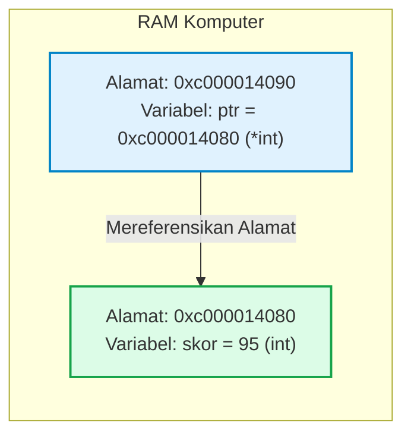
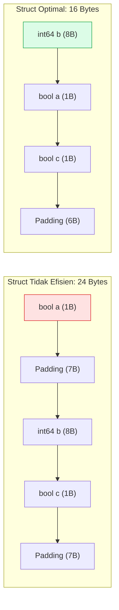

# Minggu 2: Memory Layout, Pointer, Struct & Slice Internals di Golang

::: tip CAPAIAN PEMBELAJARAN (SUB-CPMK 2)
- **CPMK Terkait:** CPMK0101 (Konsep Dasar Struktur Data)
- **CPL Terkait:** CPL01 (Pengetahuan Teori), CPL04 (Solusi Rekayasa Komputasi)
- **Indikator:** Mahasiswa mampu menguasai semantik pointer (`*` dan `&`), memahami tata letak memori struct (*memory alignment & padding*), membedakan *value receiver* vs *pointer receiver*, menguraikan struktur internal *Slice Header*, serta menerapkan fitur *Generics* Go 1.18+.
:::

---

## 1. Semantik Pointer di Golang: `*` dan `&`

Berbeda dengan bahasa C/C++ yang mengizinkan *pointer arithmetic* bebas (yang rawan menyebabkan *memory corruption*), Golang menyediakan **Safe Pointer**. Pointer di Go murni menyimpan **alamat memori (*memory address*)** dari suatu variabel.



### Dua Operator Utama Pointer:
1. **Operator `&` (*Address-of*):** Mengambil alamat heksadesimal tempat variabel disimpan di RAM.
2. **Operator `*` (*Dereference / Value-at-Address*):** Mengakses atau mengubah nilai aktual yang tersimpan di alamat yang ditunjuk oleh pointer.

::: code-group
```go [pointer_demo.go]
package main

import "fmt"

func main() {
    var skor int = 95
    var ptr *int = &skor // ptr menyimpan alamat dari variabel skor

    fmt.Printf("Nilai skor         : %d\n", skor)
    fmt.Printf("Alamat memori skor : %p\n", &skor)
    fmt.Printf("Isi variabel ptr   : %p\n", ptr)
    fmt.Printf("Nilai via deref *ptr: %d\n", *ptr)

    // Mengubah nilai langsung melalui dereferensi pointer
    *ptr = 100
    fmt.Printf("Nilai skor baru    : %d (Berubah melalui pointer!)\n", skor)
}
```
:::

---

## 2. Struct Memory Layout, Padding & Alignment

Kompilator mengalokasikan memori struct mengikuti aturan **Memory Alignment (Word Boundary)** CPU arsitektur 64-bit (8 bytes). Urutan penulisan field dalam `struct` memengaruhi total ukuran byte:



::: code-group
```go [struct_alignment.go]
package main

import (
    "fmt"
    "unsafe"
)

type InefficientStruct struct {
    Flag1 bool   // 1 byte  (+ 7 bytes padding)
    Data  int64  // 8 bytes
    Flag2 bool   // 1 byte  (+ 7 bytes padding)
} // Total = 24 bytes!

type OptimizedStruct struct {
    Data  int64  // 8 bytes
    Flag1 bool   // 1 byte
    Flag2 bool   // 1 byte  (+ 6 bytes padding)
} // Total = 16 bytes! (Hemat 33% memori RAM)

func main() {
    fmt.Printf("Ukuran InefficientStruct : %d bytes\n", unsafe.Sizeof(InefficientStruct{}))
    fmt.Printf("Ukuran OptimizedStruct   : %d bytes\n", unsafe.Sizeof(OptimizedStruct{}))
}
```
:::

---

## 3. Value Receiver vs Pointer Receiver

Dalam implementasi Method pada `struct` di Golang:

| Karakteristik | Value Receiver `func (u User)` | Pointer Receiver `func (u *User)` |
| :--- | :--- | :--- |
| **Salinan Memori** | Menggandakan seluruh isi struct (*shallow copy*). | Hanya mengirim pointer alamat memori (8 bytes). |
| **Mutasi Data** | Perubahan nilai **tidak memengaruhi** objek asli pemanggil. | Perubahan nilai **langsung mengubah** objek asli. |
| **Kinerja Memori** | Lebih lambat jika ukuran struct besar. | **Sangat Cepat & Efisien**. |
| **Rekomendasi Struktur Data**| Gunakan hanya untuk objek *read-only* kecil. | **Wajib digunakan untuk seluruh Struktur Data** (Stack, Queue, List, Tree). |

---

## 4. Anatomi Internal Slice Header di Golang

Di Golang, `slice` bukan array primitif, melainkan sebuah **Slice Header Struct** berukuran 24 bytes (pada arsitektur 64-bit) yang membungkus *underlying array*:

```mermaid
graph TD
    subgraph Slice Header (24 Bytes di Stack)
        Ptr["Data Pointer (*T): 8 Bytes"]
        Len["Length (len): 8 Bytes = 3"]
        Cap["Capacity (cap): 8 Bytes = 5"]
    end
    subgraph Underlying Array di Heap RAM
        A0["[0] 10"]
        A1["[1] 20"]
        A2["[2] 30"]
        A3["[3] Kosong (Kapasitas Tersedia)"]
        A4["[4] Kosong (Kapasitas Tersedia)"]
    end
    Ptr --> A0
    style Slice Header fill:#e0f2fe,stroke:#0284c7;
    style Underlying Array fill:#dcfce7,stroke:#16a34a;
```

### Algoritma Pertumbuhan Kapasitas Slice (*Slice Growth Algorithm*)
Ketika `append()` dipanggil dan melebihi `cap`:
- Jika `cap < 256`: Kapasitas baru berlipat ganda ($2 \times \text{cap}$).
- Jika `cap \ge 256`: Kapasitas bertumbuh secara bertahap dengan rumus $\text{cap}_{\text{baru}} = \text{cap} + (\text{cap} + 3 \times 256) / 4$.

---

## 5. Implementasi Generics (`[T any]`) Modern di Go

Sejak Go 1.18+, kita dapat membangun struktur data yang memiliki ketahanan tipe (*type-safe*) tanpa menggunakan `interface{}`:

```go
package main

import "fmt"

// Generic Box dapat menampung tipe data apa pun
type Box[T any] struct {
    Content T
}

func (b *Box[T]) SetContent(val T) {
    b.Content = val
}

func (b Box[T]) GetContent() T {
    return b.Content
}

func main() {
    intBox := Box[int]{Content: 100}
    strBox := Box[string]{Content: "Struktur Data UUI"}

    fmt.Println("Isi intBox:", intBox.GetContent())
    fmt.Println("Isi strBox:", strBox.GetContent())
}
```

---

## 📝 Evaluasi & Latihan Mandiri (Sub-CPMK 2)

1. Tuliskan kode program Go untuk mendemonstrasikan pertukaran nilai (*swap*) dua variabel menggunakan fungsi berparameter pointer!
2. Rancanglah sebuah struct `Mahasiswa` dan atur urutan field-nya agar menghasilkan ukuran memori paling optimal!
