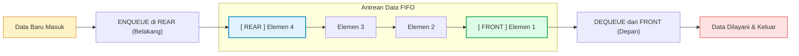

# Minggu 4: Struktur Data Linear: Queue (FIFO) & Sistem Antrean

::: tip CAPAIAN PEMBELAJARAN (SUB-CPMK 3)
- **CPMK Terkait:** CPMK0101 (Struktur Data Linear), CPMK0106 (Analisis Kompleksitas)
- **CPL Terkait:** CPL01 (Pengetahuan Dasar), CPL03 (Problem Solving), CPL04 (Solusi Rekayasa)
- **Indikator:** Mahasiswa mampu mengimplementasikan ADT Linear Queue, Circular Queue, dan Double-Ended Queue (Deque) di Golang, menganalisis solusi mengatasi *False Overflow*, serta merekayasa sistem antrean komputasi riil (*Job Dispatcher & Rate Limiting*).
:::

---

## 1. Prinsip Operasi FIFO (First-In First-Out)

**Queue (Antrean)** adalah struktur data linear yang bekerja dengan prinsip **FIFO (First-In, First-Out)**: elemen yang pertama kali dimasukkan akan menjadi elemen yang pertama kali dikeluarkan.

Queue mengelola dua penanda posisi:
- **`Front / Head`:** Ujung depan tempat elemen dikeluarkan (*Dequeue*).
- **`Rear / Tail`:** Ujung belakang tempat elemen baru disisipkan (*Enqueue*).



---

## 2. Masalah *False Overflow* pada Linear Queue & Solusi Circular Queue

Pada implementasi array/slice statis linear: saat elemen di-dequeue dari depan, ruang di depan menjadi kosong namun pointer `Rear` terus bergerak ke ujung belakang. Hal ini memicu kondisi **False Overflow** (antrean terlihat penuh padahal slot depan kosong).

Solusinya adalah **Circular Queue (Antrean Melingkar)** menggunakan operasi matematika modulo ($\%$):
$$Next Rear = (Rear + 1) \% Kapasitas$$
$$Next Front = (Front + 1) \% Kapasitas$$

```mermaid
graph TD
    subgraph Circular Buffer Array (Kapasitas = 6)
        C0["Indeks [0]: Elemen A"] --- C1["Indeks [1]: Elemen B (FRONT)"]
        C1 --- C2["Indeks [2]: Elemen C"]
        C2 --- C3["Indeks [3]: Elemen D (REAR)"]
        C3 --- C4["Indeks [4]: Kosong"]
        C4 --- C5["Indeks [5]: Kosong"]
        C5 --- C0
    end
    style C1 fill:#dcfce7,stroke:#16a34a,stroke-width:2px;
    style C3 fill:#e0f2fe,stroke:#0284c7,stroke-width:2px;
```

---

## 3. Implementasi Generic Circular Queue di Golang

::: code-group
```go [circular_queue.go]
package main

import (
    "errors"
    "fmt"
)

type CircularQueue[T any] struct {
    data     []T
    front    int
    rear     int
    size     int
    capacity int
}

func NewCircularQueue[T any](capacity int) *CircularQueue[T] {
    return &CircularQueue[T]{
        data:     make([]T, capacity),
        front:    0,
        rear:     -1,
        size:     0,
        capacity: capacity,
    }
}

func (q *CircularQueue[T]) Enqueue(item T) error {
    if q.IsFull() {
        return errors.New("queue overflow: antrean penuh")
    }
    q.rear = (q.rear + 1) % q.capacity
    q.data[q.rear] = item
    q.size++
    return nil
}

func (q *CircularQueue[T]) Dequeue() (T, error) {
    if q.IsEmpty() {
        var zero T
        return zero, errors.New("queue underflow: antrean kosong")
    }
    item := q.data[q.front]
    q.front = (q.front + 1) % q.capacity
    q.size--
    return item, nil
}

func (q *CircularQueue[T]) FrontItem() (T, error) {
    if q.IsEmpty() {
        var zero T
        return zero, errors.New("antrean kosong")
    }
    return q.data[q.front], nil
}

func (q *CircularQueue[T]) IsFull() bool {
    return q.size == q.capacity
}

func (q *CircularQueue[T]) IsEmpty() bool {
    return q.size == 0
}

func (q *CircularQueue[T]) Size() int {
    return q.size
}

func main() {
    q := NewCircularQueue[string](3)

    q.Enqueue("Nasabah 1 (Budi)")
    q.Enqueue("Nasabah 2 (Siti)")
    q.Enqueue("Nasabah 3 (Andi)")

    fmt.Println("Apakah antrean penuh?", q.IsFull()) // true

    dilayani, _ := q.Dequeue()
    fmt.Printf("Melayani: %s\n", dilayani)

    // Sekarang slot indeks 0 dapat digunakan kembali berkat Circular Buffer
    q.Enqueue("Nasabah 4 (Rudi)")
    fmt.Printf("Jumlah antrean saat ini: %d\n", q.Size())
}
```
:::

---

## 4. Studi Kasus Industri: Concurrency Channel Queue & Worker Pool

Di dunia industri *backend*, Golang memiliki struktur queue tingkat kernel yang sangat kuat: **Buffered Channel (`chan T`)**:

```go
package main

import (
    "fmt"
    "time"
)

func worker(id int, jobs <-chan int, results chan<- int) {
    for j := range jobs {
        fmt.Printf("[Worker %d] Memproses Tiket #%d...\n", id, j)
        time.Sleep(500 * time.Millisecond) // Simulasi kerja I/O
        results <- j * 2
    }
}

func main() {
    const numJobs = 5
    jobs := make(chan int, numJobs)       // Channel berfungsi sebagai FIFO Queue
    results := make(chan int, numJobs)

    // Membuka 3 Worker Goroutine yang mengonsumsi antrean secara paralel
    for w := 1; w <= 3; w++ {
        go worker(w, jobs, results)
    }

    // Mengirimkan tiket ke Queue
    for j := 1; j <= numJobs; j++ {
        jobs <- j
    }
    close(jobs)

    for a := 1; a <= numJobs; a++ {
        <-results
    }
    fmt.Println("Seluruh antrean tiket berhasil diproses!")
}
```

---

## 📝 Evaluasi & Latihan Mandiri (Sub-CPMK 3)

1. Rancanglah struktur **Double-Ended Queue (Deque)** di Golang yang mendukung operasi `PushFront`, `PushBack`, `PopFront`, dan `PopBack` dalam waktu `O(1)`.
2. Jelaskan perbedaan mendasar antara *Simple FIFO Queue* dan *Priority Queue* dalam konteks penjadwalan proses pada Sistem Operasi!
