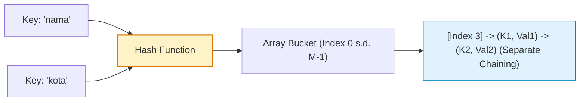

# Minggu 11: Algoritma Pencarian & Tabel Hash (Hash Table)

::: tip CAPAIAN PEMBELAJARAN (SUB-CPMK 5 & 6)
- **CPMK Terkait:** CPMK0101 (Struktur Data Asosiatif), CPMK0106 (Analisis Kompleksitas)
- **CPL Terkait:** CPL01 (Pengetahuan Dasar), CPL03 (Problem Solving), CPL04 (Solusi Rekayasa)
- **Indikator:** Mahasiswa mampu menganalisis algoritma pencarian lanjutan (Interpolation Search), memahami prinsip kerja fungsi Hash (*Hash Function, Load Factor*), teknik penanganan tabrakan (*Collision: Chaining vs Open Addressing*), serta arsitektur internal `map` Golang.
:::

---

## 1. Komparasi Algoritma Pencarian Data

| Algoritma Pencarian | Prasyarat Dataset | Best Case | Average Case | Worst Case | Skenario Ideal |
| :--- | :--- | :---: | :---: | :---: | :--- |
| **Linear Search** | Tidak perlu terurut. | `O(1)` | `O(n)` | `O(n)` | Dataset kecil / acak. |
| **Binary Search** | **Wajib terurut**. | `O(1)` | $O(log n)$ | $O(log n)$ | Array terurut statis. |
| **Interpolation Search**| **Terurut & terdistribusi seragam**. | `O(1)` | $O(\log log n)$| `O(n)` | Buku telepon, data nilai merata. |
| **Hash Table Lookup** | Menggunakan kunci hash (*Key-Value*). | **`O(1)`** | **`O(1)`** | `O(n)` | Database indexing, Cache. |

---

## 2. Arsitektur Hash Table & Resolusi Tabrakan (*Collision*)

**Hash Table** mengonversi *Key* (string/int) menjadi indeks numerik array melalui **Fungsi Hash (*Hash Function*)**:



### Dua Metode Penanganan Collision:
1. **Separate Chaining:** Setiap slot bucket memelihara sebuah Singly Linked List untuk menampung semua elemen yang memiliki indeks hash sama.
2. **Open Addressing:** Mencari slot kosong terdekat berikutnya jika slot utama sudah terisi (*Linear Probing, Quadratic Probing, Double Hashing*).

---

## 3. Implementasi Generic Hash Table (Separate Chaining) di Golang

::: code-group
```go [hash_table.go]
package main

import (
    "fmt"
    "hash/fnv"
)

const BUCKET_SIZE = 7

type HashNode struct {
    Key   string
    Value string
    Next  *HashNode
}

type HashTable struct {
    buckets [BUCKET_SIZE]*HashNode
}

// Fungsi Hash FNV-1a Standar
func (h *HashTable) hash(key string) int {
    hasher := fnv.New32a()
    hasher.Write([]byte(key))
    return int(hasher.Sum32()) % BUCKET_SIZE
}

// Insert / Update
func (h *HashTable) Set(key, value string) {
    index := h.hash(key)
    head := h.buckets[index]

    // Cek apakah key sudah ada (Update)
    curr := head
    for curr != nil {
        if curr.Key == key {
            curr.Value = value
            return
        }
        curr = curr.Next
    }

    // Insert di awal bucket (Chaining)
    newNode := &HashNode{Key: key, Value: value, Next: head}
    h.buckets[index] = newNode
}

// Search
func (h *HashTable) Get(key string) (string, bool) {
    index := h.hash(key)
    curr := h.buckets[index]
    for curr != nil {
        if curr.Key == key {
            return curr.Value, true
        }
        curr = curr.Next
    }
    return "", false
}

func main() {
    ht := &HashTable{}
    ht.Set("npm", "230101001")
    ht.Set("nama", "Cut Nyak Meutia")
    ht.Set("jurusan", "Informatika UUI")

    if val, ok := ht.Get("nama"); ok {
        fmt.Println("Nama Mahasiswa:", val) // Cut Nyak Meutia
    }
}
```
:::

---

## 📝 Evaluasi & Latihan Mandiri (Sub-CPMK 5 & 6)

1. Apa yang dimaksud dengan **Load Factor (α = n / k)** pada Hash Table dan kapan proses *Rehashing* (penggandaan ukuran tabel) wajib dieksekusi?
2. Tuliskan kode fungsi `Delete(key string)` pada struktur Hash Table di atas!
