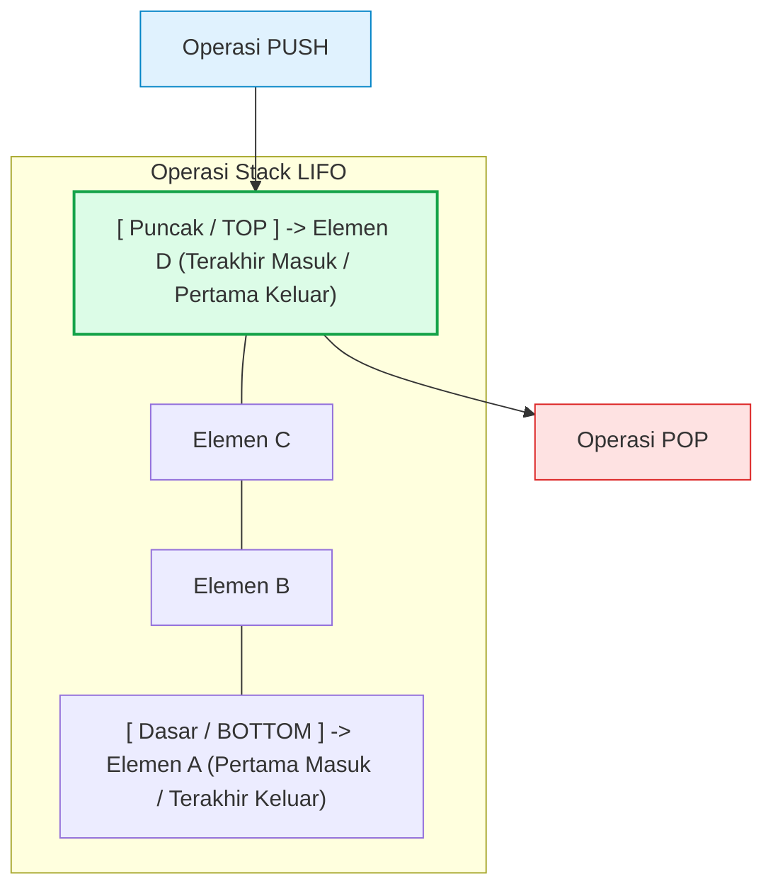
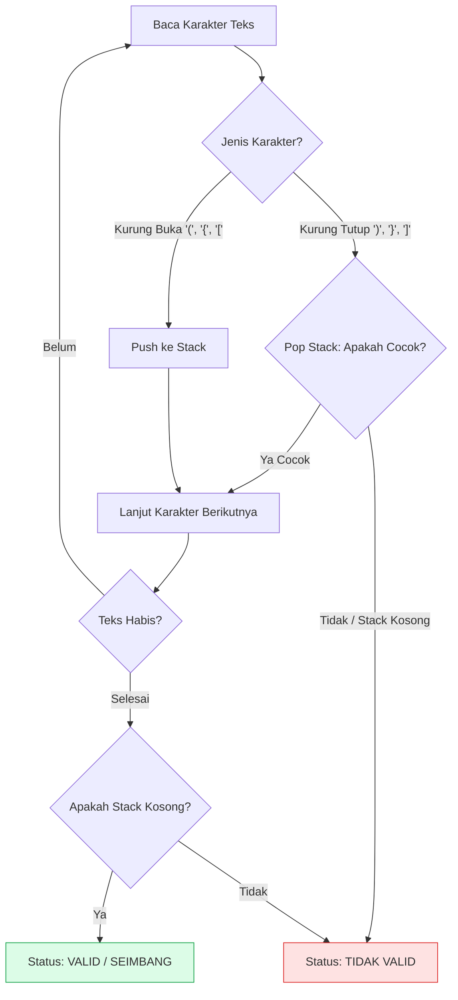
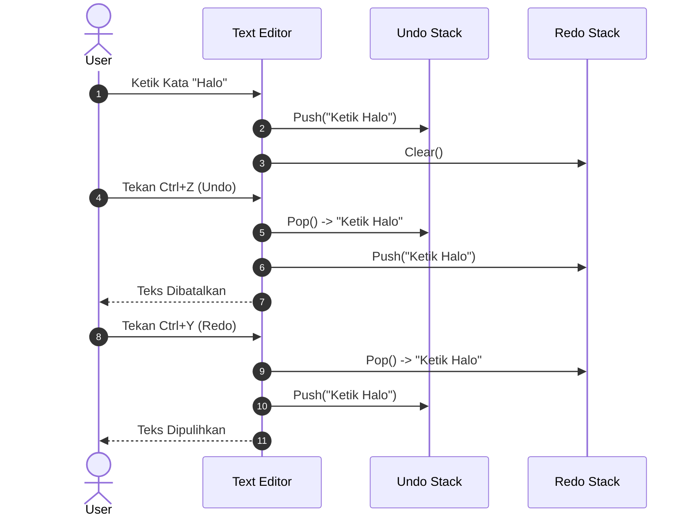

# Minggu 3: Struktur Data Linear: Stack (LIFO) & Analisis Penerapan

::: tip CAPAIAN PEMBELAJARAN (SUB-CPMK 3)
- **CPMK Terkait:** CPMK0101 (Struktur Data Linear), CPMK0106 (Analisis Kompleksitas)
- **CPL Terkait:** CPL01 (Pengetahuan Dasar), CPL03 (Problem Solving), CPL04 (Solusi Rekayasa)
- **Indikator:** Mahasiswa mampu mengimplementasikan ADT Stack berbasis *Generic Slice* dan *Pointer Node*, menganalisis seluruh operasi dasar dalam waktu `O(1)`, serta menyelesaikan kasus rekayasa nyata (*Balanced Parentheses*, Evaluasi Postfix RPN, dan Undo/Redo Engine).
:::

---

## 1. Prinsip Operasi LIFO (Last-In First-Out)

**Stack (Tumpukan)** adalah struktur data linear dengan batasan operasional khusus: penambahan elemen baru (*Push*) dan penghapusan elemen (*Pop*) hanya dapat dilakukan pada satu pintu ujung yang sama, yaitu **Top (Puncak)**.



### Operasi-Operasi Fundamental Stack

| Nama Operasi | Deskripsi Aksi | Time Complexity | Space Complexity |
| :--- | :--- | :---: | :---: |
| **`Push(item)`** | Menambahkan elemen baru ke atas puncak (Top). | `O(1)` amortized | `O(1)` |
| **`Pop()`** | Mengambil dan menghapus elemen dari puncak (Top). | `O(1)` | `O(1)` |
| **`Peek() / Top()`** | Melihat nilai elemen di puncak tanpa menghapusnya. | `O(1)` | `O(1)` |
| **`IsEmpty()`** | Memeriksa apakah stack tidak memiliki elemen. | `O(1)` | `O(1)` |
| **`Size()`** | Mengembalikan jumlah total elemen dalam stack. | `O(1)` | `O(1)` |

---

## 2. Implementasi Generic Stack di Golang

Berikut implementasi lengkap yang aman, konkuren, dan mendukung tipe data generik (`[T any]`):

::: code-group
```go [stack.go]
package main

import (
    "errors"
    "fmt"
    "sync"
)

// Generic Thread-Safe Stack
type Stack[T any] struct {
    items []T
    mu    sync.RWMutex
}

// Inisialisasi Stack baru
func NewStack[T any]() *Stack[T] {
    return &Stack[T]{
        items: make([]T, 0),
    }
}

// Push: Menambahkan elemen ke Top
func (s *Stack[T]) Push(item T) {
    s.mu.Lock()
    defer s.mu.Unlock()
    s.items = append(s.items, item)
}

// Pop: Mengeluarkan elemen dari Top
func (s *Stack[T]) Pop() (T, error) {
    s.mu.Lock()
    defer s.mu.Unlock()

    if len(s.items) == 0 {
        var zero T
        return zero, errors.New("stack underflow: tumpukan kosong")
    }

    lastIdx := len(s.items) - 1
    item := s.items[lastIdx]
    s.items = s.items[:lastIdx] // Pemotongan slice O(1)
    return item, nil
}

// Peek: Melihat elemen teratas tanpa menghapus
func (s *Stack[T]) Peek() (T, error) {
    s.mu.RLock()
    defer s.mu.RUnlock()

    if len(s.items) == 0 {
        var zero T
        return zero, errors.New("stack kosong")
    }
    return s.items[len(s.items)-1], nil
}

// IsEmpty: Mengecek kekosongan stack
func (s *Stack[T]) IsEmpty() bool {
    s.mu.RLock()
    defer s.mu.RUnlock()
    return len(s.items) == 0
}

// Size: Mengembalikan jumlah elemen
func (s *Stack[T]) Size() int {
    s.mu.RLock()
    defer s.mu.RUnlock()
    return len(s.items)
}
```
:::

---

## 3. Studi Kasus Industri 1: Pengecekan Kurung Seimbang (*Balanced Parentheses*)

Kompilator pemrograman (seperti parser Golang atau browser linter) menggunakan Stack untuk memvalidasi apakah pasangan tanda kurung `()`, `{}`, dan `[]` tertutup dengan benar dan seimbang:



::: code-group
```go [balanced_parentheses.go]
package main

import "fmt"

func IsBalanced(expr string) bool {
    stack := NewStack[rune]()
    matching := map[rune]rune{
        ')': '(',
        '}': '{',
        ']': '[',
    }

    for _, char := range expr {
        switch char {
        case '(', '{', '[':
            stack.Push(char)
        case ')', '}', ']':
            top, err := stack.Pop()
            if err != nil || top != matching[char] {
                return false
            }
        }
    }
    return stack.IsEmpty()
}

func main() {
    uji1 := "{ [ ( a + b ) * c ] - d }"
    uji2 := "{ [ ( a + b ] ) }"

    fmt.Printf("Ekspresi 1 : %s -> Valid: %t\n", uji1, IsBalanced(uji1))
    fmt.Printf("Ekspresi 2 : %s -> Valid: %t\n", uji2, IsBalanced(uji2))
}
```
:::

---

## 4. Studi Kasus Industri 2: Arsitektur Undo / Redo Engine

Aplikasi seperti Text Editor (VS Code), Photoshop, atau Microsoft Word mengelola dua stack terpisah: **Undo Stack** dan **Redo Stack**:



---

## 📝 Evaluasi & Latihan Mandiri (Sub-CPMK 3)

1. **Evaluasi Postfix (Reverse Polish Notation):** Buatlah program Golang menggunakan Stack untuk menghitung hasil ekspresi postfix: `"5 3 + 2 * 7 -"` ($((5+3) × 2) - 7 = 9$).
2. **Reverse String:** Tuliskan fungsi pembalik teks (*string reversal*) menggunakan struktur data Stack generik!
