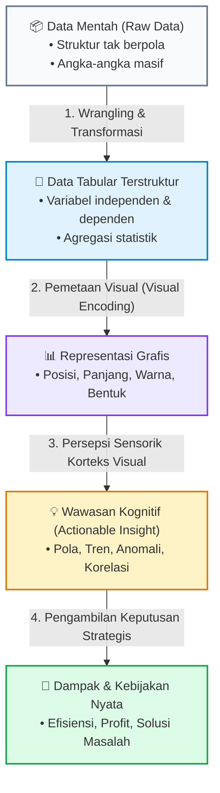
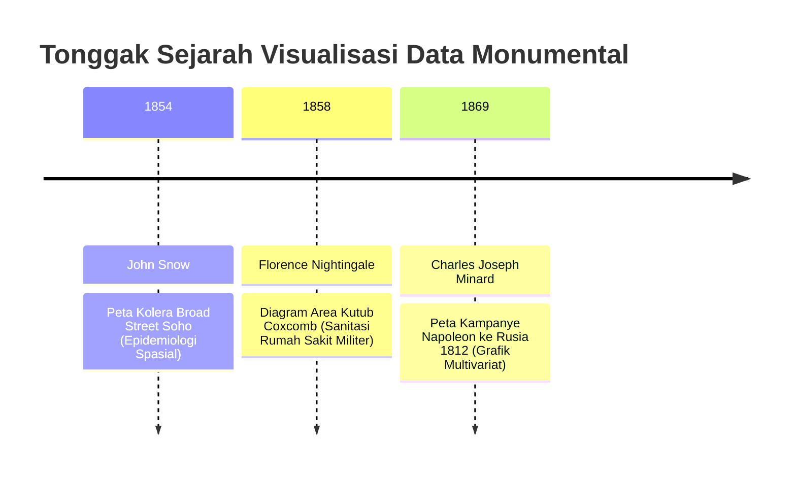
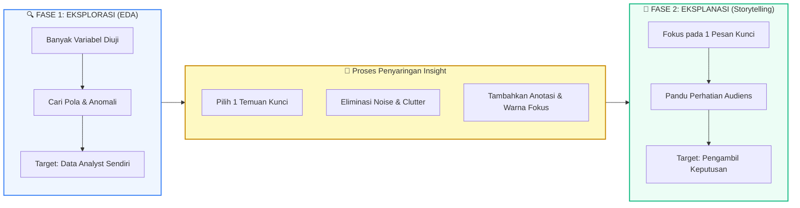

# 📘 Modul 01: Hakikat, Sejarah & Epistemologi Visualisasi Data

## 🎯 Capaian Pembelajaran (Sub-CPMK 1)
Setelah mempelajari modul ini, mahasiswa diharapkan mampu:
1. Menjelaskan definisi, landasan epistemologis, dan tujuan fundamental visualisasi data dalam memperkuat kognisi manusia (*amplify cognition*).
2. Mengklasifikasikan tipe data statistik (Skala Stevens: Nominal, Ordinal, Interval, Rasio) dan memahami implikasinya terhadap pemilihan representasi visual.
3. Menganalisis 3 tonggak sejarah visualisasi klasik yang mengubah peradaban manusia (John Snow, Florence Nightingale, Charles Joseph Minard).
4. Membedakan secara analitis antara paradigma *Exploratory Data Analysis (EDA)* dan *Explanatory Data Visualization*.
5. Menyiapkan lingkungan komputasi Python untuk visualisasi data dan mengimplementasikan perbandingan kode grafik eksploratif vs eksplanatif.

---

## 1. Hakikat, Definisi & Landasan Kognitif

Visualisasi data bukan sekadar kegiatan membuat ilustrasi grafis yang menarik (*decorative drawing*), melainkan **disiplin rekayasa komputasi yang mentranslasikan data abstrak menjadi representasi visual spasial untuk memperkuat kemampuan berpikir dan analisis manusia (*amplify cognition*)**.

> "The purpose of visualization is insight, not pictures."  
> — **Ben Shneiderman**, Pelopor Human-Computer Interaction

Secara epistemologis, mata dan korteks visual manusia bekerja secara paralel dengan kapasitas bandwidth transmisi informasi mencapai **20 megabit per detik**—jauh melampaui kemampuan otak saat membaca angka-angka tabular biner atau teks deskriptif yang diproses secara serial dan lambat.



### Model Kognisi Card, Mackinlay, & Shneiderman (1999)
Visualisasi memperkuat penalaran manusia melalui 6 mekanisme utama:
1. **Memperluas Memori Kerja (*Expanding Working Memory*):** Mengalihkan beban penyimpanan data dari otak ke layar (*external cognition*).
2. **Mengurangi Waktu Pencarian (*Reducing Search Time*):** Mengelompokkan data yang saling berhubungan pada lokasi spasial yang berdekatan.
3. **Meningkatkan Deteksi Pola (*Enhancing Pattern Recognition*):** Mengaktifkan pemrosesan pra-atentif visual untuk mendeteksi klaster dan pencilan secara instan.
4. **Mendukung Inferensi Persepsi (*Perceptual Inference*):** Hubungan spasial visual langsung diinterpretasikan tanpa komputasi mental yang rumit.
5. **Memfasilitasi Pemantauan Dinamis (*Monitoring Dynamic States*):** Melacak perubahan status sistem secara real-time pada dashboard.
6. **Menciptakan Manipulasi Interaktif (*Interactive Exploration*):** Memungkinkan pengujian hipotesis secara cepat melalui filter dan pergeseran fokus data.

---

## 2. Taksonomi Data & Skala Pengukuran Variabel (Skala Stevens)

Sebelum menentukan jenis grafik, praktisi visualisasi data wajib mengidentifikasi jenis skala pengukuran variabel data. Kesalahan dalam mengenali tipe data akan berujung pada representasi visual yang keliru atau menyesatkan (*misleading encoding*).

Berdasarkan taksonomi Stanley Smith Stevens (1946), data diklasifikasikan ke dalam 4 skala pengukuran:

| Skala Pengukuran | Karakteristik Matematis | Operasi yang Sah | Contoh dalam Dataset | Saluran Visual yang Tepat |
| :--- | :--- | :--- | :--- | :--- |
| **1. Nominal (Kategorikal)** | Hanya membedakan identitas atau label tanpa urutan intrinsik. | Equality ($=, \neq$), Modus, Frekuensi | Kategori Produk, Jenis Kelamin, Nama Provinsi, Status Pernikahan | Rona Warna (*Hue*), Bentuk Ikon (*Shape*), Posisi Spasial |
| **2. Ordinal** | Memiliki urutan peringkat (*ranking*), namun jarak antar peringkat tidak terukur pasti. | Perbandingan ($<, >$), Median, Persentil | Tingkat Kepuasan (Puas, Cukup, Buruk), Jenjang Pendidikan (SD, SMP, SMA, S1), Peringkat Kelas | Saturasi Warna (*Luminance*), Ukuran (*Size*), Urutan Posisi Batang |
| **3. Interval** | Memiliki urutan dan jarak yang pasti antar nilai, namun **tidak memiliki nilai nol mutlak** (nol bersifat arbitrer). | Penjumlahan, Pengurangan, Rata-rata ($+, -$) | Suhu Celcius/Fahrenheit, Tahun Kalender, Skor IQ, Jam dalam Sehari | Posisi pada Sumbu Terkalibrasi, Garis (*Line*), Panjang Relatif |
| **4. Rasio (Ratio)** | Memiliki urutan, jarak pasti, dan **memiliki nilai nol mutlak** (nol berarti tidak ada nilai). | Semua operasi aritmetika ($+, -, \times, \div$), Rasio | Pendapatan (Rp), Bobot (kg), Jarak (km), Jumlah Transaksi, Usia | Panjang Batang (*Bar Length*), Posisi pada Sumbu Umum (0-origin), Luas Area |

::: warning ⚠️ PERINGATAN KRITIS: Titik Nol pada Skala Rasio
Untuk data berskala **Rasio** yang direpresentasikan dengan diagram batang (*Bar Chart*), sumbu nilai **WAJIB dimulai dari angka nol (0)**. Memotong sumbu pada diagram batang (*truncated baseline*) akan memanipulasi rasio perbandingan visual dan melanggar integritas grafis!
:::

---

## 3. Tiga Tonggak Sejarah Visualisasi yang Mengubah Dunia

Kemampuan visualisasi data dalam menyelesaikan persoalan nyata telah terbukti sepanjang sejarah modern:



### A. Peta Kolera Broad Street karya Dr. John Snow (1854)
* **Konteks Masalah:** Wabah kolera melanda distrik Soho, London. Komunitas medis saat itu mempercayai teori *miasma* (penyakit menyebar lewat udara busuk).
* **Solusi Visual:** Dr. John Snow menandai setiap kasus kematian dengan garis batang hitam kecil pada peta jalanan distrik Soho, serta menandai lokasi 13 pompa air umum.
* **Hasil Temuan:** Kepadatan garis kematian terkonsentrasi sangat tinggi tepat di sekitar pompa air **Broad Street**. Setelah tuas pompa tersebut dilepas, penyebaran wabah terhenti seketika. Visualisasi ini melahirkan disiplin ilmu **Epidemiologi Spasial** dan analisis titik geografis (*Point Pattern Analysis*).

### B. Diagram Area Kutub (*Coxcomb*) karya Florence Nightingale (1858)
* **Konteks Masalah:** Ribuan tentara Inggris gugur selama Perang Krimea. Parlemen Inggris berasumsi bahwa prajurit gugur murni akibat luka di medan tempur.
* **Solusi Visual:** Nightingale merancang *Polar Area Diagram* (dikenal sebagai *Coxcomb Chart*). Setiap irisan lingkaran mewakili satu bulan, dengan luas area yang proporsional terhadap penyebab kematian:
  - **Area Biru Keabuan:** Kematian akibat penyakit menular yang dapat dicegah (*Zymotic Diseases* seperti tifus dan kolera).
  - **Area Merah:** Kematian akibat luka perang (*Wounds*).
  - **Area Hitam:** Kematian akibat penyebab lainnya.
* **Dampak:** Parlemen langsung menyadari bahwa kebersihan sanitasi yang buruk membunuh jauh lebih banyak tentara dibanding peluru musuh, mendorong reformasi total sistem sanitasi militer dan rumah sakit modern.

### C. Peta Kampanye Pasukan Napoleon karya Charles Joseph Minard (1869)
Edward Tufte menyebut karya Charles Joseph Minard sebagai *"the best statistical graphic ever drawn"*. Peta ini menggabungkan **6 dimensi variabel** secara simultan dalam satu bidang grafis 2D:
1. **Ukuran Pasukan:** Diwakili oleh ketebalan garis alur (mulai dari 422.000 tentara di perbatasan Polandia hingga tersisa hanya 10.000 prajurit saat kembali).
2. **Lokasi Geografis 2D:** Garis lintang (*latitude*) dan garis bujur (*longitude*) rute perjalanan.
3. **Arah Pergerakan:** Garis krem muda (pasukan bergerak maju menuju Moskow) dan garis hitam pekat (pasukan mundur melarikan diri).
4. **Suhu Udara Ekstrem:** Grafik temperatur di bawah peta yang menunjukkan cuaca beku hingga $-30^\circ\text{C}$ pada saat pasukan mundur.
5. **Waktu / Tanggal:** Tanggal-tanggal kritis saat penyeberangan sungai dan mundurnya pasukan.
6. **Topografi Sungai:** Titik-titik penyeberangan sungai beku seperti Sungai Berezina yang memakan ribuan korban jiwa.

---

## 4. Paradigma: Exploratory vs Explanatory Visualization

Dalam alur kerja analitik profesional, praktisi visualisasi data membedakan dua fase utama:



| Dimensi Pembeda | Visualisasi Eksploratif (*Exploratory*) | Visualisasi Eksplanatif (*Explanatory*) |
| :--- | :--- | :--- |
| **Tujuan Utama** | Mencari wawasan, hipotesis, korelasi tersembunyi, dan data outlier. | Mengomunikasikan temuan kunci spesifik dan mendorong aksi nyata. |
| **Audiens Sasaran** | Diri sendiri, sesama Data Scientist, peneliti teknis. | Manajemen eksekutif, klien bisnis, publik umum. |
| **Jumlah Grafik** | Puluhan hingga ratusan grafik cepat (*quick iterations*). | 1 hingga 3 grafik terkurasi dengan estetika tinggi (*polished*). |
| **Penggunaan Warna** | Palet default otomatis untuk membedakan semua kategori. | Palet monokrom/abu-abu netral dengan **1 warna aksen terang** sebagai penunjuk fokus. |
| **Anotasi & Teks** | Minimal (cukup label sumbu standar). | Lengkap (judul berisi wawasan, anotasi panah langsung ke titik data penting). |
| **Alat Utama** | Jupyter Notebook, Pandas plot, Seaborn pairplot. | Matplotlib OO kustom, Plotly, Streamlit, Infografis eksekutif. |

---

## 5. Menyiapkan Lingkungan Komputasi Python

Mata kuliah ini menggunakan ekosistem pustaka Data Science Python modern. Pastikan pustaka-pustaka berikut telah terinstal pada environment Python Anda:

```bash
# Instalasi pustaka inti visualisasi data
pip install numpy pandas matplotlib seaborn plotly folium scikit-learn statsmodels streamlit
```

### Verifikasi Lingkungan Komputasi:
```python
import sys
import numpy as np
import pandas as pd
import matplotlib
import seaborn as sns
import plotly

print(f"Python Version    : {sys.version.split()[0]}")
print(f"NumPy Version     : {np.__version__}")
print(f"Pandas Version    : {pd.__version__}")
print(f"Matplotlib Version: {matplotlib.__version__}")
print(f"Seaborn Version   : {sns.__version__}")
print(f"Plotly Version    : {plotly.__version__}")
```

---

## 6. Contoh Praktikum: Exploratory vs Explanatory Visual

Berikut adalah kode praktikum yang dapat langsung dijalankan untuk membandingkan secara nyata bagaimana grafik mentah eksploratif diubah menjadi grafik eksplanatif yang siap dipresentasikan kepada direksi perusahaan.

```python
import matplotlib.pyplot as plt
import pandas as pd
import numpy as np

# 1. Menyiapkan Dataset Penjualan Kuartalan (Simulasi Riil)
data_penjualan = pd.DataFrame({
    'Lini_Bisnis': ['Software Enterprise', 'Cloud Services', 'Hardware Server', 'IT Consulting', 'Cybersecurity'],
    'Target_Milyar': [120, 150, 90, 80, 110],
    'Realisasi_Milyar': [115, 185, 82, 75, 108]
})

# Hitung Persentase Pencapaian Target
data_penjualan['Pencapaian_Pct'] = (data_penjualan['Realisasi_Milyar'] / data_penjualan['Target_Milyar']) * 100
# Urutkan berdasarkan pencapaian tertinggi
data_penjualan = data_penjualan.sort_values(by='Pencapaian_Pct', ascending=True).reset_index(drop=True)

# -------------------------------------------------------------
# PENDEKATAN 1: GRAFIK EKSPLORATIF (Default Seaborn/Matplotlib)
# -------------------------------------------------------------
fig, ax1 = plt.subplots(figsize=(8, 4), dpi=150)
ax1.bar(data_penjualan['Lini_Bisnis'], data_penjualan['Realisasi_Milyar'], color='royalblue')
ax1.set_title("Realisasi Penjualan per Lini Bisnis (Exploratory)")
ax1.set_ylabel("Milyar Rupiah")
plt.xticks(rotation=30)
plt.tight_layout()
plt.show()

# -------------------------------------------------------------
# PENDEKATAN 2: GRAFIK EKSPLANATIF (Storytelling & Focus)
# -------------------------------------------------------------
fig, ax2 = plt.subplots(figsize=(10, 5), dpi=300)

# Atur warna: Abu-abu netral untuk semua bar, Merah/Biru menyala untuk bintang utama (Cloud Services)
warna_bar = ['#cbd5e1' if x != 'Cloud Services' else '#0284c7' for x in data_penjualan['Lini_Bisnis']]

y_pos = np.arange(len(data_penjualan))
bars = ax2.barh(y_pos, data_penjualan['Pencapaian_Pct'], color=warna_bar, height=0.6)

# Garis referensi target 100%
ax2.axvline(100, color='#64748b', linestyle='--', linewidth=1.2, alpha=0.8)
ax2.text(101, 0.2, 'Target Target (100%)', color='#64748b', fontsize=10, fontweight='bold')

# Kustomisasi Sumbu (Menghilangkan Non-Data Ink)
ax2.set_yticks(y_pos)
ax2.set_yticklabels(data_penjualan['Lini_Bisnis'], fontsize=11, fontweight='medium')
ax2.set_xlim(0, 140)
ax2.spines['top'].set_visible(False)
ax2.spines['right'].set_visible(False)
ax2.spines['bottom'].set_visible(False)
ax2.spines['left'].set_color('#cbd5e1')
ax2.xaxis.set_visible(False) # Sembunyikan sumbu X karena nilai sudah diberi label langsung

# Direct Labeling pada setiap batang
for bar, pct, real in zip(bars, data_penjualan['Pencapaian_Pct'], data_penjualan['Realisasi_Milyar']):
    font_weight = 'bold' if pct > 120 else 'normal'
    font_color = '#0284c7' if pct > 120 else '#334155'
    ax2.text(bar.get_width() + 2, bar.get_y() + bar.get_height()/2,
             f"{pct:.1f}% (Rp {real} M)",
             va='center', ha='left', fontsize=10.5, color=font_color, fontweight=font_weight)

# Judul Informatif yang Mengemukakan Kesimpulan Utama
ax2.set_title("Layanan Cloud Melampaui Target Penjualan Sebesar 123.3%", 
              fontsize=14, fontweight='bold', color='#0f172a', pad=20, loc='left')
ax2.text(0, len(data_penjualan) - 0.2, 
         "Divisi Cloud Services menjadi pendorong utama pertumbuhan Q3 dengan realisasi Rp 185 M.", 
         fontsize=10.5, color='#64748b', transform=ax2.transData)

plt.tight_layout()
plt.savefig('penjualan_eksplanatif.png', dpi=300, bbox_inches='tight')
plt.show()
```

---

## 7. Rangkuman & Latihan Mandiri

::: tip 💡 Rangkuman Konsep Kunci
1. Visualisasi data bertujuan memperkuat kognisi manusia (*amplify cognition*), bukan sekadar membuat gambar indah.
2. Identifikasi skala pengukuran (Nominal, Ordinal, Interval, Rasio) sebelum memilih jenis grafik. Jangan pernah memotong sumbu 0 pada grafik rasio (Bar Chart).
3. Transformasi dari eksplorasi ke eksplanasi menuntut eliminasi clutter, penataan hierarki, dan penggunaan warna aksen tunggal untuk mengarahkan audiens pada wawasan utama.
:::

### 📝 Tugas Praktikum 1 (Mandiri)
1. **Analisis Skala Pengukuran:** Tentukan skala pengukuran (Nominal, Ordinal, Interval, atau Rasio) untuk variabel-variabel berikut:
   - Suhu ruangan dalam derajat Fahrenheit.
   - Nomor Induk Mahasiswa (NIM).
   - Lama waktu tunggu layanan perbankan (dalam menit dan detik).
   - Tingkat kepuasan konsumen (Skala Likert 1-5).
   - Alamat IP komputer (`192.168.1.1`).
2. **Bedah Kasus Visualisasi Sejarah:** Tuliskan ulasan kritis 1 halaman mengenai peta Kolera John Snow. Mengapa representasi visual berbasis titik spasial (*dot map*) jauh lebih efektif meyakinkan otoritas kesehatan kota London dibandingkan tabel angka kematian per kelurahan?
3. **Hands-on Python:** Modifikasi kode contoh eksplanatif di atas dengan mengganti dataset menjadi data performa nilai mahasiswa per mata kuliah, dan berikan penekanan visual (*highlighting*) pada mata kuliah dengan tingkat kelulusan terendah.