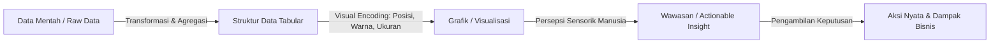

# 📘 Modul 01: Hakikat, Sejarah & Epistemologi Visualisasi Data

## 🎯 Capaian Pembelajaran (Sub-CPMK 1)
Setelah mempelajari modul ini, mahasiswa diharapkan mampu:
1. Menjelaskan definisi, tujuan fundamental, dan evolusi historis visualisasi data dalam sains komputasi.
2. Membedakan antara *Exploratory Data Analysis (EDA)* dan *Explanatory Data Visualization*.
3. Menganalisis peran visualisasi data dalam siklus hidup sains data (*Data Science Lifecycle*).
4. Mengidentifikasi contoh klasik visualisasi yang mengubah peradaban manusia.

---

## 1. Hakikat & Definisi Visualisasi Data

Visualisasi data bukan sekadar kegiatan menggambar grafik yang indah (*aesthetic drawing*), melainkan **representasi visual terstruktur dari data kuantitatif dan kualitatif untuk memperkuat kognisi manusia (*amplify cognition*)**.

> "The purpose of visualization is insight, not pictures."  
> — **Ben Shneiderman**, Pelopor Human-Computer Interaction

Secara epistemologis, otak manusia memproses informasi visual melalui korteks visual dengan kecepatan hingga **60.000 kali lebih cepat** dibandingkan memproses teks atau angka biner tabular. Visualisasi data bertindak sebagai jembatan kognitif antara kapasitas penyimpanan komputer yang masif dengan keterbatasan kapasitas memori kerja (*working memory*) manusia.

---

## 2. Tonggak Sejarah Visualisasi yang Mengubah Dunia

### A. Peta Kolera John Snow (1854) - Kelahiran Epidemiologi Spasial
Pada tahun 1854, wabah kolera melanda distrik Soho, London. Teori dominan saat itu menyatakan bahwa penyakit menyebar melalui udara kotor (*miasma*). Dr. John Snow menandai setiap kasus kematian kolera sebagai titik batang hitam pada peta jalanan London. 

Melalui visualisasi titik (*dot map*) ini, terlihat pola spasial yang jelas bahwa kasus kolera terkonsentrasi di sekitar pompa air umum di **Broad Street**. Ketika tuas pompa air tersebut dicabut, wabah kolera seketika terhenti.

### B. Diagram Area Kutub Florence Nightingale (1858) - Reformasi Medis Militer
Florence Nightingale, seorang perawat dan ahli statistik, merancang diagram area kutub (*coxcomb diagram*) untuk meyakinkan Parlemen Inggris bahwa mayoritas prajurit perang Krimea tewas bukan akibat luka tembak di medan perang, melainkan akibat penyakit menular di rumah sakit militer yang tidak higienis. Visualisasi ini memicu reformasi sanitasi rumah sakit di seluruh dunia.

### C. Peta Kampanye Napoleon ke Rusia karya Charles Joseph Minard (1869)
Edward Tufte menyebut karya Minard ini sebagai *"the best statistical graphic ever drawn"*. Peta ini menggabungkan **6 variabel dimensi** ke dalam satu tampilan 2D yang elegan:
1. Jumlah pasukan Napoleon (diwakili oleh ketebalan garis).
2. Jarak perjalanan dan posisi geografis 2D (garis lintang dan bujur).
3. Arah pergerakan pasukan (garis krem untuk maju, garis hitam untuk mundur).
4. Suhu udara ekstrem di bawah nol derajat saat musim dingin.
5. Lokasi sungai dan penyeberangan kunci.
6. Tanggal dan waktu mundurnya pasukan dari Moskow.

---

## 3. Paradigma: Eksplorasi vs Eksplanasi

Dalam alur kerja analitik data profesional, visualisasi terbagi menjadi dua paradigma utama:

| Dimensi Pembeda | Visualisasi Eksploratif (*Exploratory*) | Visualisasi Eksplanatif (*Explanatory*) |
| :--- | :--- | :--- |
| **Tujuan Utama** | Menemukan pola, anomali, korelasi, dan hipotesis baru (*Find Insights*). | Mengomunikasikan temuan kunci kepada audiens/pemangku kepentingan (*Share Story*). |
| **Target Audiens** | Analis data, Data Scientist, Peneliti mandiri. | Manajemen eksekutif, publik, klien, pembuat kebijakan. |
| **Karakteristik Data** | Berskala besar, multi-variat, belum terstruktur rapi. | Telah difilter, terfokus pada pesan utama, padat informasi. |
| **Interaktivitas** | Tinggi (filtering dinamis, zooming, drill-down). | Terarah (anotasi jelas, penekanan warna selektif). |
| **Alat Populer** | Jupyter Notebook, Pandas, Seaborn, Plotly. | Streamlit, Power BI, Infografis, Presentasi Eksekutif. |

---

## 4. Rangkuman & Latihan Mandiri

> [!TIP]
> **Prinsip Kunci:** Jangan pernah memulai visualisasi dari pemilihan jenis grafik (*chart type*). Mulailah dari pertanyaan bisnis atau wawasan apa yang ingin dijawab oleh data tersebut (*Question-First Approach*).

### 📝 Tugas Mandiri 1
1. Carilah 1 (satu) contoh visualisasi data di internet yang menurut Anda sangat informatif dan 1 (satu) contoh visualisasi yang menyesatkan (*misleading*).
2. Tuliskan analisis kritis 2 halaman mengenai:
   - Apa pesan utama yang disampaikan?
   - Mengapa grafik tersebut efektif atau justru membingungkan persepsi audiens?