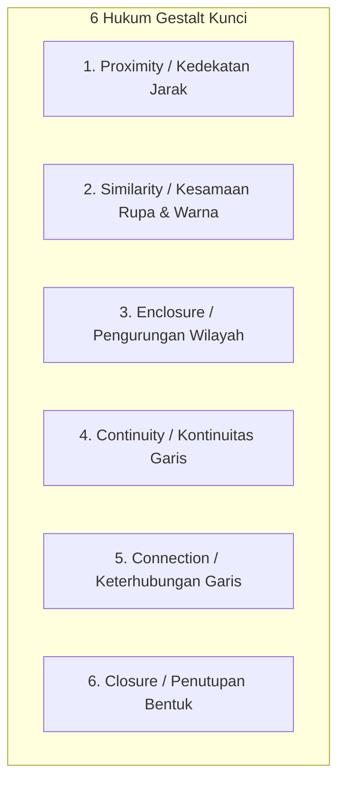

# 📘 Modul 02: Psikologi Persepsi Visual & Teori Gestalt

## 🎯 Capaian Pembelajaran (Sub-CPMK 1)
Setelah mempelajari modul ini, mahasiswa diharapkan mampu:
1. Memahami mekanisme persepsi visual manusia dan sistem memori kognitif.
2. Mengaplikasikan **Atribut Pra-atentif (*Pre-attentive Attributes*)** untuk mengarahkan fokus audiens dalam hitungan milidetik.
3. Menerapkan **6 Hukum Gestalt** dalam tata letak dan pengelompokan elemen visual data.
4. Memilih palet warna yang efektif dan ramah buta warna (*Colorblind Safe*).

---

## 1. Atribut Pra-atentif (Pre-attentive Attributes)

Pemrosesan pra-atentif adalah kemampuan bawah sadar otak manusia dalam memproses informasi visual secara instan (kurang dari **200-250 milidetik**) sebelum kesadaran aktif bekerja.

Jika visualisasi memanfaatkan atribut pra-atentif dengan tepat, audiens tidak perlu membaca angka satu per satu untuk menemukan titik anomali atau data penting.

### 4 Kategori Atribut Pra-atentif:
1. **Bentuk (*Form*):**
   - Panjang (*Length*) $	o$ sangat akurat untuk perbandingan kuantitatif (Bar Chart).
   - Lebar / Ketebalan (*Width*).
   - Ukuran / Luas (*Size / Area*).
   - Orientasi sudut (*Angle / Orientation*).
   - Bentuk ikon (*Shape*).
2. **Warna (*Color*):**
   - Rona (*Hue*): membedakan kategori kualitatif (misal: Kategori Produk A vs B).
   - Intensitas / Kejenuhan (*Saturation / Luminance*): menunjukkan besaran magnitudo angka kuantitatif.
3. **Posisi Spasial (*Spatial Position*):**
   - Posisi 2D pada sumbu X dan Y $	o$ atribut paling akurat dalam persepsi visual manusia.
4. **Gerakan (*Motion*):**
   - Kerlipan (*Flicker*) atau animasi pergeseran data.

---

## 2. Teori Psikologi Gestalt dalam Visualisasi Data

Prinsip Gestalt (berasal dari bahasa Jerman yang berarti *"bentuk utuh"*) menjelaskan bagaimana pikiran manusia secara otomatis mengelompokkan elemen-elemen terpisah menjadi satu kesatuan yang bermakna.

### Penjelasan & Penerapan dalam Grafik:
1. **Law of Proximity (Kedekatan):** Elemen-elemen yang diletakkan saling berdekatan akan dipersepsikan sebagai satu kelompok yang sama. *Penerapan:* Spasi antar grup bar pada grouped bar chart.
2. **Law of Similarity (Kesamaan):** Elemen dengan warna, ukuran, atau bentuk yang sama dianggap memiliki atribut data yang sama. *Penerapan:* Pewarnaan titik data pada scatter plot berdasarkan kategori kelas.
3. **Law of Enclosure (Pengurungan):** Elemen yang dilingkupi oleh kotak batas atau latar belakang abu-abu akan segera dipisahkan secara visual dari elemen lainnya. *Penerapan:* Memberi kotak highlight pada area resesi ekonomi di line chart.
4. **Law of Continuity (Kontinuitas):** Mata manusia secara alami mengikuti garis kontinu yang mulus daripada garis yang patah-patah. *Penerapan:* Garis tren pada line chart time series.
5. **Law of Connection (Keterhubungan):** Elemen yang dihubungkan oleh garis fisik memiliki relasi yang jauh lebih kuat dibanding elemen yang hanya dekat secara spasial. *Penerapan:* Node-link diagram jaringan.

---

## 3. Teori Warna & Aksesibilitas Visual

Warna adalah alat visual paling kuat namun paling sering disalahgunakan.

### 3 Jenis Palet Warna Baku:
1. **Palet Kualitatif / Kategorikal:** Menggunakan warna-warna dengan rona (*hue*) berbeda untuk data nominal tanpa urutan (misal: Biru, Hijau, Merah Bata).
2. **Palet Sekuensial (Sequential):** Menggunakan gradasi satu warna dari terang ke gelap untuk menunjukkan rentang angka kontinu dari rendah ke tinggi (misal: *Blues*, *Viridis*).
3. **Palet Divergen (Diverging):** Menggunakan dua warna kontras yang bertemu pada titik tengah netral (misal: data untung-rugi keuangan, temperatur anomali dingin-panas dengan palet *RdBu*).

> [!IMPORTANT]
> **Aksesibilitas Buta Warna (Colorblind Safety):**
> Sekitar 8% pria dan 0.5% wanita di dunia mengalami defisiensi penglihatan warna (terutama Deuteranopia dan Protanopia: buta warna merah-hijau). **Hindari menggunakan pasangan warna merah murni (#FF0000) dan hijau murni (#00FF00)** sebagai pembeda tunggal data positif dan negatif. Gunakan palet saintifik seperti **Viridis**, **Cividis**, atau pasangan **Biru-Oranye**.