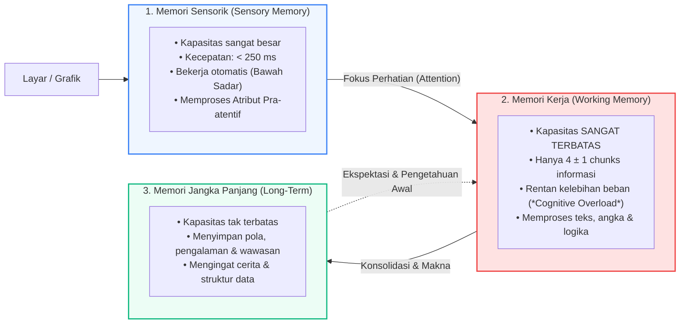
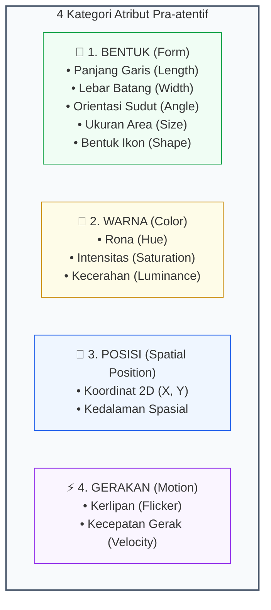
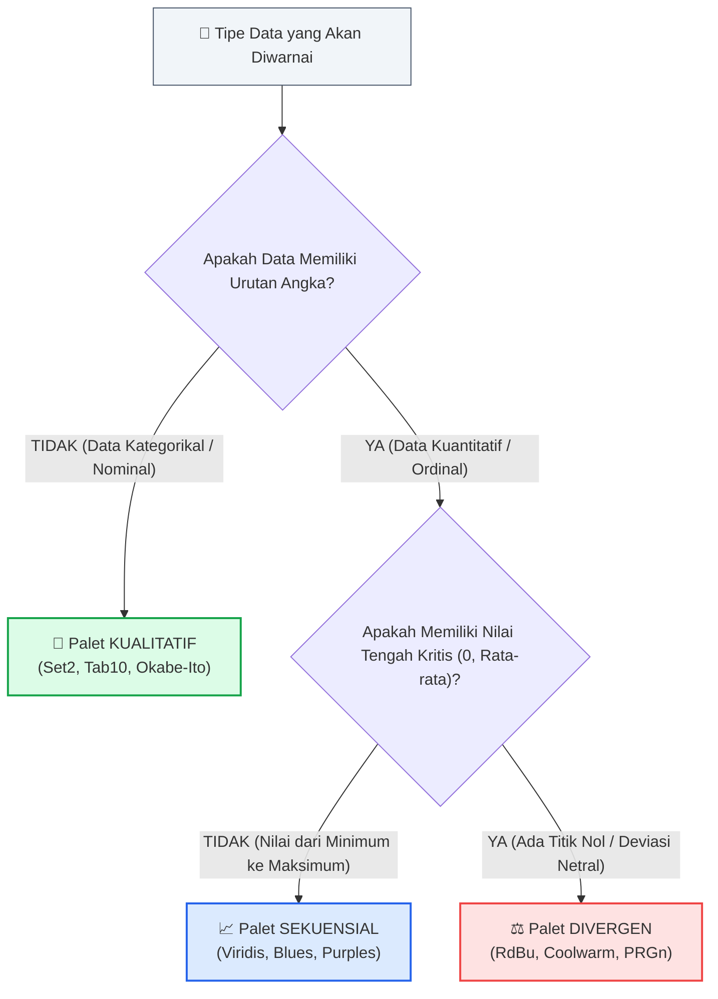

# 📘 Modul 02: Psikologi Persepsi Visual, Teori Gestalt & Ergonomi Warna

## 🎯 Capaian Pembelajaran (Sub-CPMK 1)
Setelah mempelajari modul ini, mahasiswa diharapkan mampu:
1. Memahami arsitektur pemrosesan kognitif manusia (Memori Sensorik, Memori Kerja, dan Memori Jangka Panjang) serta Teori Beban Kognitif (*Cognitive Load Theory*).
2. Mengaplikasikan **Atribut Pra-atentif (*Pre-attentive Attributes*)** untuk mengarahkan fokus visual audiens secara bawah sadar dalam waktu kurang dari 250 milidetik.
3. Menerapkan **6 Prinsip Gestalt** dalam pengelompokan dan penataan tata letak (*layout*) grafik data analitis.
4. Menerapkan prinsip ergonomi warna saintifik dan merancang visualisasi yang ramah bagi penyandang defisiensi penglihatan warna (*Colorblind Safe*).
5. Mengimplementasikan kode Python untuk membuktikan efek pra-atentif, prinsip Gestalt, dan palet warna aksesibel.

---

## 1. Arsitektur Pemrosesan Kognitif & Beban Kognitif

Untuk merancang visualisasi yang efektif, kita harus memahami bagaimana otak manusia mengolah stimulus visual dari layar komputer:



### Teori Beban Kognitif (*Cognitive Load Theory* - John Sweller)
Beban kognitif total yang dialami audiens saat membaca grafik terbagi menjadi 3 jenis:
1. **Intrinsic Load (Beban Hakiki):** Kompleksitas intrinsik dari data yang dianalisis (misal: volume data dan keterkaitan variabel). Hal ini tidak dapat dihilangkan, namun dapat diurai secara bertahap.
2. **Extraneous Load (Beban Eksternal yang Sia-sia):** Beban mental yang timbul akibat desain visual yang buruk, layout acak-acakan, legenda yang membingungkan, garis kisi-kisi (*gridlines*) tebal, atau chartjunk. **Tujuan desainer visualisasi adalah MENIADAKAN beban ini sepenuhnya!**
3. **Germane Load (Beban Konstruktif):** Beban mental yang digunakan audiens untuk menarik wawasan, menghubungkan pola, dan mengambil keputusan bisnis. **Tujuan desainer adalah MEMAKSIMALKAN alokasi energi otak untuk beban ini.**

---

## 2. Atribut Pra-atentif (Pre-attentive Attributes)

Pemrosesan pra-atentif adalah mekanisme persepsi visual spontan di mana otak mendeteksi perbedaan visual secara paralel sebelum kesadaran kognitif aktif bekerja (**waktu respon < 200–250 milidetik**).



### Tabel Efektivitas Atribut Pra-atentif Berdasarkan Tipe Data:

| Atribut Pra-atentif | Persepsi Kuantitatif (Angka/Besaran) | Persepsi Kualitatif (Kategori/Grup) | Contoh Tipe Grafik Terbaik |
| :--- | :---: | :---: | :--- |
| **Posisi Spasial (X, Y)** | ⭐⭐⭐⭐⭐ *(Paling Akurat)* | ⭐⭐⭐⭐⭐ *(Sangat Jelas)* | Scatter Plot, Dot Plot, Line Chart |
| **Panjang Batang (Length)** | ⭐⭐⭐⭐⭐ *(Sangat Akurat)* | ⭐⭐⭐ *(Cukup)* | Bar Chart, Bullet Chart |
| **Ukuran Area (Size/Area)** | ⭐⭐⭐ *(Kurang Akurat - Cenderung Undervalued)* | ⭐⭐⭐ *(Cukup)* | Bubble Chart, Treemap |
| **Rona Warna (Hue)** | ❌ *(Tidak Cocok untuk Angka)* | ⭐⭐⭐⭐⭐ *(Sangat Kuat untuk Kategori)* | Legend Warna Kategori, Scatter Hue |
| **Saturasi / Luminance** | ⭐⭐⭐⭐ *(Bagus untuk Intensitas)* | ⭐⭐ *(Membingungkan)* | Heatmap, Choropleth Map |
| **Bentuk Ikon (Shape)** | ❌ *(Tidak Bermakna Angka)* | ⭐⭐⭐⭐ *(Bagus untuk 3-5 Kategori)* | Marker Scatter (Bulat, Segitiga, Kotak) |
| **Kemiringan Sudut (Angle)**| ⭐⭐ *(Sulit Dibandingkan Presisi)* | ❌ *(Tidak Disarankan)* | Pie Chart, Donut Chart |

::: tip 💡 Aturan Emas Pra-atentif
Gunakan **maksimal satu atau dua atribut pra-atentif secara bersamaan** pada satu grafik. Jika Anda menggabungkan warna terang, ukuran besar, bentuk segitiga, dan garis tebal sekaligus pada banyak titik, efek pra-atentif akan hancur dan berubah menjadi kekacauan visual (*visual noise*).
:::

---

## 3. Teori Psikologi Gestalt dalam Tata Letak Visual

Teori Gestalt (dikembangkan oleh psikolog Max Wertheimer, Kurt Koffka, dan Wolfgang Köhler) menjelaskan prinsip-prinsip universal bagaimana pikiran manusia secara spontan mengorganisasikan elemen visual yang terpisah menjadi suatu struktur utuh yang terpadu.

| Prinsip Gestalt | Penjelasan Ilmiah | Penerapan pada Visualisasi Data |
| :--- | :--- | :--- |
| 🔍 **1. Law of Proximity** *(Kedekatan)* | Objek yang berdekatan secara spasial otomatis dikelompokkan bersama oleh otak. | Memberikan jarak spasi (*gap*) antar grup batang pada *grouped bar chart* agar audiens paham batas antar kategori. |
| 🎨 **2. Law of Similarity** *(Kesamaan)* | Objek yang berbagi atribut visual yang sama (warna, bentuk, ukuran) dianggap berasal dari kelas/status yang sama. | Menggunakan warna biru untuk semua transaksi sukses dan warna merah untuk transaksi gagal pada *scatter plot*. |
| 📦 **3. Law of Enclosure** *(Pengurungan Area)* | Objek yang berada di dalam satu batas fisik (kotak/arsir latar) dianggap satu wilayah analisis eksklusif. | Memberikan kotak blok transparan abu-abu untuk menyorot periode resesi ekonomi atau krisis pandemi pada grafik deret waktu. |
| 〰️ **4. Law of Continuity** *(Kontinuitas)* | Mata manusia cenderung mengikuti jalur garis yang halus dan kontinu dibanding garis patah bersudut tajam. | Menarik garis tren (*trendline*) yang menghubungkan titik data diskrit pada *line chart* untuk memandu persepsi arah perubahan. |
| 🔗 **5. Law of Connection** *(Keterhubungan Fisik)* | Garis fisik penghubung memiliki kekuatan asosiasi pengelompokan yang jauh lebih dominan dibanding kedekatan spasial atau kesamaan bentuk. | Diagram simpul jaringan (*Node-Link Network Graph*) dan grafik pohon hierarki (*Decision Tree Diagram*). |
| ⭕ **6. Law of Closure** *(Penutupan Bentuk)* | Otak manusia secara otomatis melengkapi ruang kosong untuk mempersepsikan bentuk geometris yang utuh dan stabil. | Grafik donat (*Donut Chart*) dan *contour plot* tetap dapat dikenali bentuknya tanpa memerlukan garis batas tepi tebal. |
| 🌓 **7. Figure-Ground** *(Latar Depan vs Belakang)* | Mata memisahkan elemen utama (objek analisis) dari kanvas latar belakang berdasarkan kontras kecerahan. | Menggunakan latar belakang putih/abu-abu terang netral agar elemen data berwarna terlihat menonjol tanpa distraksi. |

---

## 4. Teori Warna Saintifik & Aksesibilitas Buta Warna

Warna adalah alat komunikasi data yang sangat impresif, namun menjadi sumber kesalahan terbesar dalam visualisasi data jika digunakan tanpa pemahaman ilmiah.

### A. Tiga Tipe Palet Warna Baku:
1. **Palet Kualitatif (Kategorikal):** Digunakan untuk data nominal tanpa urutan hierarki. Menggunakan rona (*hue*) yang berbeda dengan tingkat kecerahan seimbang.
   - *Contoh:* Membedakan jenis produk, nama departemen, atau sistem operasi.
2. **Palet Sekuensial (Sequential):** Menggunakan satu gradasi rona warna dari terang (nilai rendah) ke gelap (nilai tinggi) atau sebaliknya.
   - *Contoh:* Kepadatan penduduk, jumlah penjualan, tingkat curah hujan.
3. **Palet Divergen (Diverging):** Menggunakan dua rona warna kontras yang bertemu pada titik tengah netral (biasanya putih, abu-abu, atau kuning pucat).
   - *Contoh:* Suhu di atas vs di bawah titik beku ($0^\circ\text{C}$), laba vs rugi keuangan, margin selisih elektoral.



### B. Aksesibilitas Buta Warna (*Color Vision Deficiency - CVD*)
Secara global, sekitar **8% pria dan 0.5% wanita** mengalami defisiensi penglihatan warna:
- **Deuteranopia & Protanopia:** Ketidakmampuan membedakan warna Merah dan Hijau (*Red-Green Colorblindness*).
- **Tritanopia:** Ketidakmampuan membedakan warna Biru dan Kuning.
- **Monochromacy:** Hanya melihat dalam gradasi monokrom grayscale.

::: danger 🚫 HINDARI: Pasangan Merah-Hijau Murni & Rainbow (Jet) Colormap
- **Jangan pernah** menggunakan kombinasi Merah (`#FF0000`) dan Hijau (`#00FF00`) sebagai satu-satunya indikator visual status baik vs buruk.
- **Jangan gunakan** colormap **Jet / Rainbow** pada heatmap karena gradasinya tidak seragam secara persepsi (*not perceptually uniform*) dan menciptakan ilusi batas semu yang tidak ada pada data.
- **Gunakan:** Palet saintifik terkalibrasi seperti **Viridis**, **Cividis**, **Magma**, **Plasma**, atau pasangan **Biru-Oranye**.
:::

---

## 5. Implementasi Kode Hands-on Python

Berikut adalah script Python mandiri untuk menguji efek pra-atentif, prinsip Gestalt, dan palet warna aksesibel:

```python
import matplotlib.pyplot as plt
import numpy as np
import seaborn as sns

# Atur DPI tinggi untuk visualisasi jernih
plt.rcParams['figure.dpi'] = 200

# ==============================================================================
# PRAKTIKUM 1: SIMULASI ATRIBUT PRA-ATENTIF (DETEKSI ANOMALI SEKETIKA)
# ==============================================================================
fig, axes = plt.subplots(1, 2, figsize=(12, 5))

# Generate Grid Titik Acak
np.random.seed(42)
x = np.repeat(np.arange(10), 10)
y = np.tile(np.arange(10), 10)

# Kiri: Tanpa Atribut Pra-atentif (Semua Titik Sama Abu-abu)
axes[0].scatter(x, y, color='#64748b', s=80, alpha=0.8)
axes[0].set_title("A. Tanpa Pra-atentif: Cari Titik Berbeda!", fontsize=11, fontweight='bold')
axes[0].axis('off')

# Kanan: Dengan Atribut Pra-atentif (Warna & Ukuran Menonjol pada Posisi ke-42)
colors = ['#cbd5e1'] * 100
sizes = [80] * 100
colors[42] = '#ef4444' # Merah Terang
sizes[42] = 220        # Ukuran Lebih Besar

axes[1].scatter(x, y, color=colors, s=sizes, alpha=0.9)
axes[1].set_title("B. Dengan Pra-atentif: Anomali Terdeteksi <200ms", fontsize=11, fontweight='bold')
axes[1].axis('off')

plt.suptitle("Demonstrasi Efek Pemrosesan Bawah Sadar (Pre-attentive Visual)", fontsize=13, fontweight='bold')
plt.tight_layout()
plt.show()

# ==============================================================================
# PRAKTIKUM 2: IMPLEMENTASI 4 HUKUM GESTALT PADA GRAFIK DATA
# ==============================================================================
fig, axes = plt.subplots(2, 2, figsize=(12, 9))

# 1. Proximity (Kedekatan)
kategori = ['Grup A1', 'Grup A2', 'Grup B1', 'Grup B2']
posisi = [1, 1.8, 3.5, 4.3] # Spasi lebar antara A dan B
nilai = [45, 52, 78, 85]
axes[0, 0].bar(posisi, nilai, width=0.6, color=['#0284c7', '#0284c7', '#0d9488', '#0d9488'])
axes[0, 0].set_title("1. Law of Proximity (Spasi Antar Subgrup)", fontweight='bold')
axes[0, 0].set_xticks([1.4, 3.9])
axes[0, 0].set_xticklabels(['Klaster Departemen A', 'Klaster Departemen B'])

# 2. Similarity (Kesamaan Warna/Bentuk)
np.random.seed(10)
x_sim = np.random.randn(30)
y_sim = np.random.randn(30)
kelas = ['Kategori X'] * 15 + ['Kategori Y'] * 15
axes[0, 1].scatter(x_sim[:15], y_sim[:15], color='#3b82f6', marker='o', s=100, label='Kategori X')
axes[0, 1].scatter(x_sim[15:], y_sim[15:], color='#f59e0b', marker='^', s=120, label='Kategori Y')
axes[0, 1].set_title("2. Law of Similarity (Warna & Marker Serupa)", fontweight='bold')
axes[0, 1].legend(frameon=False)

# 3. Enclosure (Pengurungan Area Sorotan)
bulan = np.arange(1, 13)
penjualan = [100, 105, 110, 80, 75, 82, 115, 120, 125, 130, 140, 150]
axes[1, 0].plot(bulan, penjualan, marker='o', color='#2563eb', linewidth=2)
# Tambahkan Enclosure kotak abu-abu untuk area krisis (Bulan 4-6)
axes[1, 0].axvspan(3.5, 6.5, color='#fee2e2', alpha=0.6, label='Fase Penurunan Q2')
axes[1, 0].set_title("3. Law of Enclosure (Area Krisis Berlatar Merah)", fontweight='bold')
axes[1, 0].set_xlabel("Bulan ke-")
axes[1, 0].legend(frameon=False)

# 4. Connection (Garis Penghubung Antar Node)
x_conn = [1, 2, 4, 5]
y_conn = [2, 4, 3, 5]
axes[1, 1].scatter(x_conn, y_conn, color='#7c3aed', s=150, zorder=5)
axes[1, 1].plot(x_conn, y_conn, color='#94a3b8', linestyle='-', linewidth=2, zorder=3)
for i, txt in enumerate(['A', 'B', 'C', 'D']):
    axes[1, 1].annotate(txt, (x_conn[i]-0.1, y_conn[i]+0.2), fontweight='bold', fontsize=12)
axes[1, 1].set_title("4. Law of Connection (Jalur Aliran Jaringan)", fontweight='bold')
axes[1, 1].set_xlim(0, 6)
axes[1, 1].set_ylim(1, 6)

for ax in axes.flat:
    ax.spines['top'].set_visible(False)
    ax.spines['right'].set_visible(False)

plt.tight_layout()
plt.show()

# ==============================================================================
# PRAKTIKUM 3: PALET RAMAH BUTA WARNA (VIRIDIS VS JET/ACCESSIBLE)
# ==============================================================================
data_matriks = np.random.randn(8, 8)

fig, (ax_cividis, ax_rdbu) = plt.subplots(1, 2, figsize=(11, 4.5))

# Palet Sekuensial Ramah Buta Warna (Cividis)
sns.heatmap(np.abs(data_matriks), cmap="cividis", annot=True, fmt=".1f", ax=ax_cividis, cbar_kws={'label': 'Intensitas'})
ax_cividis.set_title("Palet Sekuensial: Cividis (Colorblind Safe)", fontweight='bold')

# Palet Divergen Ramah Buta Warna (Coolwarm / RdBu)
sns.heatmap(data_matriks, cmap="coolwarm", center=0, annot=True, fmt=".1f", ax=ax_rdbu, cbar_kws={'label': 'Deviasi'})
ax_rdbu.set_title("Palet Divergen: Coolwarm (Pusat Netral 0)", fontweight='bold')

plt.tight_layout()
plt.show()
```

---

## 6. Rangkuman & Latihan Mandiri

::: tip 💡 Rangkuman Konsep Kunci
1. Memori kerja manusia sangat terbatas (hanya dapat menampung ~4 informasi simultan). Minimalkan beban eksternal (*Extraneous Load*) agar audiens fokus pada substansi data.
2. Manfaatkan atribut pra-atentif (posisi, panjang batang, dan warna aksen tunggal) untuk mengarahkan pandangan audiens dalam <250 milidetik.
3. Terapkan 6 Prinsip Gestalt (*Proximity, Similarity, Enclosure, Continuity, Connection, Closure*) untuk menyusun tata letak grafik yang intuitif.
4. Gunakan palet saintifik (*Viridis, Cividis, Okabe-Ito, Coolwarm*) dan hindari kombinasi Merah-Hijau murni demi aksesibilitas buta warna.
:::

### 📝 Tugas Praktikum 2 (Mandiri)
1. **Analisis Gestalt pada Dashboard Populer:** Ambil satu tangkapan layar dashboard analitik (misal: Google Analytics, AWS CloudWatch, atau Dashboard Kasus COVID-19). Identifikasi dan beri tanda di mana minimal 3 Prinsip Gestalt diaplikasikan pada tata letak dashboard tersebut.
2. **Audit Palet Warna:** Sebuah aplikasi finansial menggunakan lingkaran merah pekat untuk transaksi rugi dan lingkaran hijau pekat untuk transaksi untung.
   - Jelaskan mengapa desain ini melanggar etika aksesibilitas visual.
   - Berikan rekomendasi kode warna alternatif (Hex Code) yang ramah buta warna dan tetap memiliki konotasi positif/negatif yang jelas.
3. **Hands-on Python:** Buatlah sebuah visualisasi *line chart* penjualan bulanan selama 2 tahun (24 bulan) dengan Matplotlib. Terapkan prinsip **Law of Enclosure** untuk menyorot 3 bulan dengan performa laba tertinggi menggunakan kotak arsiran transparan, serta gunakan **Law of Continuity** dengan menambahkan garis rata-rata tahunan (*Moving Average*).