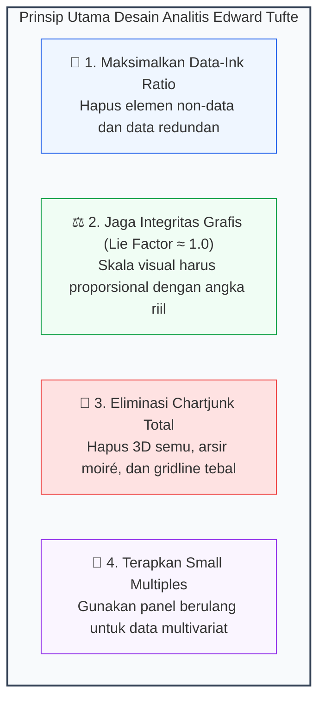
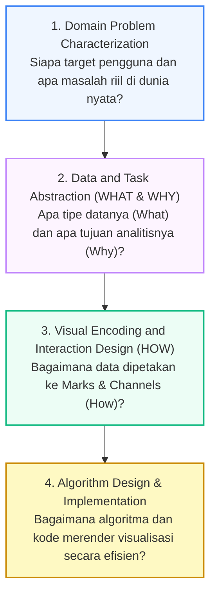
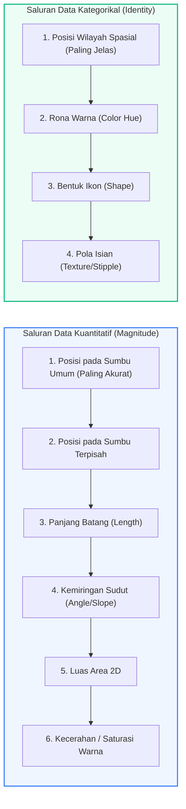

# 📘 Modul 03: Prinsip Desain Edward Tufte & Kerangka Kerja Tamara Munzner

## 🎯 Capaian Pembelajaran (Sub-CPMK 1)
Setelah mempelajari modul ini, mahasiswa diharapkan mampu:
1. Menghitung dan mengoptimalkan metrik **Data-Ink Ratio** serta mengidentifikasi dan mengeliminasi berbagai bentuk **Chartjunk**.
2. Mengkalkulasi nilai **Lie Factor** secara matematis untuk menjamin integritas grafis (*Graphical Integrity*).
3. Menganalisis dan merancang visualisasi menggunakan kerangka kerja bertingkat **Tamara Munzner (*Nested Model: What-Why-How*)**.
4. Menerapkan aturan ekspresifitas dan efektivitas (*Expressiveness & Effectiveness Principles*) dalam pemilihan tanda (*Marks*) dan saluran visual (*Channels*).
5. Mengimplementasikan teknik **Small Multiples** dan transformasi grafik bergaya minimalis Tufte menggunakan Python Matplotlib.

---

## 1. Fondasi Desain Analitis Edward Tufte

Profesor Edward R. Tufte (Universitas Yale) meletakkan standar filosofis dan etika tertinggi dalam visualisasi data kuantitatif melalui karyanya *The Visual Display of Quantitative Information* (1983).



### A. Data-Ink Ratio (Rasio Tinta Data)
Tufte mendefinisikan bahwa setiap tetes tinta pada kertas (atau piksel pada layar monitor) harus didedikasikan untuk menampilkan informasi substantif data.

::: info 📐 Formula Matematis: Data-Ink Ratio
$$\text{Data-Ink Ratio} = \frac{\text{Tinta / Piksel Data Kunci}}{\text{Total Tinta / Piksel Seluruh Grafik}} = 1.0 - \text{Proporsi Tinta Non-Data}$$

* **Nilai Ideal:** Mendekati **1.0** (hampir 100% piksel menyajikan informasi substansi data).
* **Rasio Rendah (< 0.5):** Menandakan grafik dipenuhi oleh dekorasi visual yang sia-sia (*clutter/chartjunk*).
:::

**Lima Aturan Tufte untuk Data-Ink:**
1. Di atas segalanya, tunjukkan data (*Above all else show the data*).
2. Maksimalkan rasio data-ink (*Maximize the data-ink ratio*).
3. Hapus tinta non-data (*Erase non-data-ink*).
4. Hapus tinta data yang redundan (*Erase redundant data-ink*).
5. Revisi dan lakukan perbaikan berulang (*Revise and edit*).

---

### B. Chartjunk (Sampah Visual)
*Chartjunk* adalah elemen visual dekoratif yang tidak mengandung informasi analitis namun membebani kapasitas kognisi audiens:
1. **Moiré Vibration:** Pola garis-garis arsir diagonal yang bergetar secara optik di mata audiens.
2. **Heavy Gridlines:** Garis-garis kisi sumbu yang terlalu tebal, gelap, atau rapat sehingga menutupi pola data utama.
3. **Pseudo-3D Perspective:** Memberi efek 3D (volume, bayangan, kedalaman) pada diagram 2D seperti diagram batang atau pie chart. Efek 3D mendistorsi sudut pandang dan membuat perbandingan angka menjadi bias.
4. **Cute Graphics & Ducks:** Gambar kartun latar belakang atau ikon dekoratif yang mendominasi bidang visual data.

---

### C. Lie Factor & Integritas Grafis
Visualisasi data harus merepresentasikan kebenaran angka secara geometris tanpa distorsi persepsi.

::: info 📐 Formula Matematis: Lie Factor
$$\text{Lie Factor} = \frac{\text{Besar Efek pada Grafik (\%)}}{\text{Besar Efek pada Data Riil (\%)}} = \frac{\left| \frac{\text{Ukuran Visual Akhir} - \text{Ukuran Visual Awal}}{\text{Ukuran Visual Awal}} \right|}{\left| \frac{\text{Nilai Data Akhir} - \text{Nilai Data Awal}}{\text{Nilai Data Awal}} \right|}$$
:::

| Nilai Lie Factor | Kategori Kejujuran Grafis | Implikasi Interpretasi |
| :---: | :--- | :--- |
| **0.95 – 1.05** | ✅ **Integritas Sempurna (Jujur)** | Perubahan visual proporsional secara eksak dengan perubahan angka riil data. |
| **> 1.05** | ⚠️ **Overstatement (Melebih-lebihkan)** | Grafik memperbesar impresi kenaikan/penurunan secara manipulatif. |
| **< 0.95** | ⚠️ **Understatement (Meremehkan)** | Grafik menyamarkan atau mengecilkan variasi perubahan data yang sebenarnya signifikan. |

---

## 2. Kerangka Kerja Bertingkat Tamara Munzner (What-Why-How)

Profesor Tamara Munzner (Universitas British Columbia) merumuskan kerangka kerja komprehensif 4 tingkat (*Nested Model*) untuk merancang dan memvalidasi visualisasi data analitis:



### Triad Munzner: WHAT – WHY – HOW

#### A. WHAT: Tipe Data & Struktur Dataset
- **Tipe Data Kunci:**
  - **Categorical (Nominal):** Kategori tanpa urutan (contoh: Nama Kota, Merek).
  - **Ordered (Ordinal):** Memiliki urutan peringkat tanpa skala pasti (contoh: Tingkat Pendidikan: Rendah, Sedang, Tinggi).
  - **Quantitative (Kuantitatif):** Nilai numerik kontinu atau diskrit yang dapat dihitung aritmetika.
- **Struktur Dataset:** Tables, Networks/Trees, Fields (Grid Spasial), Geometry (Shapefile/GeoJSON).

#### B. WHY: Tindakan & Target Analitis (*Task Abstraction*)
- **Actions:** *Discover* (mencari pola baru), *Present* (menyajikan insight), *Locate* (mencari titik tertentu), *Compare* (membandingkan antar entitas).
- **Targets:** *Trend* (arah perubahan waktu), *Outlier* (pencilan ekstrem), *Distribution* (bentuk sebaran data), *Correlation* (keterkaitan dua variabel).

#### C. HOW: Pemetaan Marks & Visual Channels
- **Marks (Tanda Geometris):** Titik (*Point/0D*), Garis (*Line/1D*), Area (*2D*), Volume (*3D*).
- **Channels (Saluran Pengontrol):** Posisi, Panjang, Sudut, Luas, Bentuk, Rona Warna, Kecerahan, Transparansi.



---

## 3. Implementasi Kode Hands-on Python

Berikut adalah script Python yang mengimplementasikan transformasi Before-After gaya Tufte, simulasi perhitungan Lie Factor numerik, dan teknik *Small Multiples*.

```python
import matplotlib.pyplot as plt
import numpy as np
import pandas as pd

# Atur DPI
plt.rcParams['figure.dpi'] = 200

# ==============================================================================
# PRAKTIKUM 1: TRANSFORMASI TUFTE (BEFORE VS AFTER: DATA-INK MAXIMIZATION)
# ==============================================================================
kategori = ['Server A', 'Server B', 'Server C', 'Server D', 'Server E']
latensi = [45, 62, 28, 85, 39] # Latensi dalam ms

fig, (ax_bad, ax_tufte) = plt.subplots(1, 2, figsize=(13, 5))

# ----------------- KIRI: GRAFIK BURUK (CHARTJUNK BERLEBIHAN) ------------------
ax_bad.bar(kategori, latensi, color='#ff9999', edgecolor='black', linewidth=2, hatch='//') # Moiré hatch
ax_bad.set_facecolor('#e0e0e0') # Background abu-abu gelap
ax_bad.grid(True, which='both', color='red', linestyle='-', linewidth=1.5) # Gridline tebal menutupi data
ax_bad.set_title("❌ BEFORE: Rendah Data-Ink & Penuh Chartjunk", fontsize=11, fontweight='bold', color='darkred')
ax_bad.set_ylabel("Waktu Respon (Milidetik)")

# ---------------- KANAN: GRAFIK TUFTE (DATA-INK RATIO TINGGI) ----------------
y_pos = np.arange(len(kategori))
# Urutkan kategori berdasarkan nilai terkecil ke terbesar
sorted_idx = np.argsort(latensi)
kat_sorted = [kategori[i] for i in sorted_idx]
lat_sorted = [latensi[i] for i in sorted_idx]

bars = ax_tufte.barh(y_pos, lat_sorted, color='#0284c7', height=0.55)

# Eliminasi semua Spines non-data
for spine in ['top', 'right', 'bottom', 'left']:
    ax_tufte.spines[spine].set_visible(False)

ax_tufte.set_yticks(y_pos)
ax_tufte.set_yticklabels(kat_sorted, fontsize=11, fontweight='medium', color='#1e293b')
ax_tufte.xaxis.set_visible(False) # Sembunyikan axis X karena direct labeling

# Direct Labeling pada ujung batang
for bar, val in zip(bars, lat_sorted):
    ax_tufte.text(val + 1.5, bar.get_y() + bar.get_height()/2, f"{val} ms",
                  va='center', ha='left', fontsize=10.5, color='#0284c7', fontweight='bold')

ax_tufte.set_title("✅ AFTER: Tufte Minimalist (Data-Ink Rasio ≈ 1.0)", fontsize=11, fontweight='bold', color='#0369a1', loc='left', pad=15)
ax_tufte.text(0, len(kategori)-0.1, "Server C memiliki performa latensi tercepat (28 ms).", fontsize=9.5, color='#64748b')

plt.tight_layout()
plt.show()

# ==============================================================================
# PRAKTIKUM 2: KALKULASI LIE FACTOR SECARA NUMERIK
# ==============================================================================
# Skenario: Laba naik dari 10 Milyar ke 20 Milyar (+100%).
# Namun grafik iklan membuat tinggi batang naik dari 2 cm menjadi 8 cm (+300%).
nilai_data_awal, nilai_data_akhir = 10.0, 20.0
tinggi_grafik_awal, tinggi_grafik_akhir = 2.0, 8.0

efek_data = (nilai_data_akhir - nilai_data_awal) / nilai_data_awal # 1.0 (100%)
efek_grafik = (tinggi_grafik_akhir - tinggi_grafik_awal) / tinggi_grafik_awal # 3.0 (300%)
lie_factor = efek_grafik / efek_data

print("="*50)
print("KALKULASI LIE FACTOR PADA GRAFIK IKLAN")
print(f"Perubahan Riil pada Data Tabular: {efek_data*100:.1f}%")
print(f"Perubahan Visual pada Grafik    : {efek_grafik*100:.1f}%")
print(f"Hasil Lie Factor               : {lie_factor:.2f}")
if lie_factor > 1.05:
    print("STATUS: ⚠️ GRAFIK MISLEADING (Melebih-lebihkan perubahan data)")
elif lie_factor < 0.95:
    print("STATUS: ⚠️ GRAFIK UNDERSTATED (Menyamarkan perubahan data)")
else:
    print("STATUS: ✅ GRAFIK JUJUR (Memenuhi Integritas Grafis)")
print("="*50)

# ==============================================================================
# PRAKTIKUM 3: IMPLEMENTASI SMALL MULTIPLES (TUFTE STYLE)
# ==============================================================================
# Simulasi Data Penjualan 4 Wilayah selama 12 Bulan
np.random.seed(42)
bulan = np.arange(1, 13)
wilayah_dict = {
    'Sumatera': 50 + np.cumsum(np.random.randn(12)*3),
    'Jawa': 120 + np.cumsum(np.random.randn(12)*4),
    'Kalimantan': 40 + np.cumsum(np.random.randn(12)*2),
    'Sulawesi': 30 + np.cumsum(np.random.randn(12)*2.5)
}

fig, axes = plt.subplots(2, 2, figsize=(10, 6), sharex=True, sharey=True)

for ax, (nama_wilayah, data_tren) in zip(axes.flat, wilayah_dict.items()):
    # Plot garis abu-abu latar belakang (untuk konteks wilayah lain)
    for _, other_data in wilayah_dict.items():
        ax.plot(bulan, other_data, color='#e2e8f0', linewidth=1.2, zorder=1)
    
    # Plot garis fokus wilayah aktif (Biru Tua)
    ax.plot(bulan, data_tren, color='#0284c7', linewidth=2.5, zorder=3)
    ax.scatter(bulan[-1], data_tren[-1], color='#0284c7', s=40, zorder=4)
    
    # Kustomisasi Minimalis Tufte
    ax.set_title(f"Wilayah {nama_wilayah}", fontsize=11, fontweight='bold', loc='left', color='#1e293b')
    ax.spines['top'].set_visible(False)
    ax.spines['right'].set_visible(False)
    ax.spines['left'].set_color('#cbd5e1')
    ax.spines['bottom'].set_color('#cbd5e1')
    ax.set_xticks([1, 3, 6, 9, 12])
    ax.set_xticklabels(['Jan', 'Mar', 'Jun', 'Sep', 'Des'])

plt.suptitle("Small Multiples: Perbandingan Tren Penjualan Regional 2024", fontsize=13, fontweight='bold', y=1.02)
plt.tight_layout()
plt.show()
```

---

## 4. Rangkuman & Latihan Mandiri

::: tip 💡 Rangkuman Konsep Kunci
1. **Data-Ink Ratio:** Hapus elemen non-data dan redundan untuk memastikan bahwa setiap piksel menyajikan informasi substansial.
2. **Lie Factor:** Jaga integritas grafis agar $0.95 \le \text{Lie Factor} \le 1.05$. Jangan pernah memotong sumbu atau memanipulasi proporsi 3D.
3. **Framework Munzner (What-Why-How):** Rancang pemetaan visual dengan mendahulukan tipe data (*What*), tujuan analitis (*Why*), dan saluran visual yang paling akurat (*How*).
4. **Small Multiples:** Gunakan kisi-kisi grafik multi-panel dengan skala sumbu yang seragam untuk membandingkan data multivariat tanpa tumpang tindih (*overplotting*).
:::

### 📝 Tugas Praktikum 3 (Mandiri)
1. **Perhitungan Lie Factor Mandiri:** Diberikan grafik laporan tahunan di mana angka anggaran naik dari Rp 50 Juta menjadi Rp 65 Juta (+30%). Namun luas lingkaran pada grafik membesar dari diameter 2 cm menjadi diameter 5 cm (Luas area membesar $+525\%$).
   - Hitung nilai Lie Factor grafik tersebut.
   - Buat kesimpulan apakah grafik tersebut termasuk *Misleading* atau objektif.
2. **Audit What-Why-How Tamara Munzner:** Pilihlah sebuah grafik dari publikasi portal data pemerintah (misal: BPS atau Satu Data Indonesia):
   - Uraikan aspek **What** (variabel dan tipe data).
   - Uraikan aspek **Why** (target analitis audiens).
   - Uraikan aspek **How** (tanda dan saluran visual yang digunakan, serta evaluasi apakah saluran tersebut berada pada hierarki akurasi tertinggi).
3. **Hands-on Python:** Buatlah visualisasi *Small Multiples* menggunakan dataset suhu harian 4 kota besar di Indonesia selama 30 hari, terapkan tema Tufte minimalis tanpa garis bingkai kotak (*borderless*).