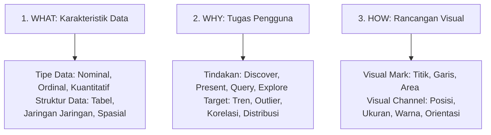

# 📘 Modul 03: Prinsip Desain Edward Tufte & Kerangka Kerja Tamara Munzner

## 🎯 Capaian Pembelajaran (Sub-CPMK 1)
Setelah mempelajari modul ini, mahasiswa diharapkan mampu:
1. Memahami dan mengkalkulasi metrik **Data-Ink Ratio** serta mengeliminasi **Chartjunk**.
2. Menghitung **Lie Factor** untuk menjamin integritas grafis (*Graphical Integrity*).
3. Menganalisis desain visualisasi menggunakan kerangka kerja bertingkat **Tamara Munzner (*What-Why-How Model*)**.
4. Menerapkan teknik *Small Multiples* untuk visualisasi data multivariat kompleks.

---

## 1. Prinsip Desain Analitis Edward Tufte

Edward Tufte (Profesor Emeritus Universitas Yale) meletakkan fondasi filosofis modern mengenai grafika kuantitatif melalui bukunya *The Visual Display of Quantitative Information*.

### A. Data-Ink Ratio (Rasio Tinta Data)
Tufte merumuskan bahwa setiap tetes tinta pada kertas (atau pixel pada layar komputer) harus digunakan untuk menampilkan informasi substantif data.

$$\text{Data-Ink Ratio} = \frac{\text{Tinta / Pixel Data Kunci}}{\text{Total Tinta / Pixel Seluruh Grafik}}$$

**Aturan Emas Tufte:**
- Maksimalkan rasio data-ink ($1.0$).
- Hapus tinta non-data (*erase non-data-ink*).
- Hapus tinta data yang berlebihan atau redundan (*erase redundant data-ink*).

### B. Eliminasi Chartjunk (Sampah Visual)
*Chartjunk* adalah elemen visual dekoratif yang tidak menambah nilai analisis data namun membebani kognisi audiens, seperti:
- Efek 3D semu pada diagram batang atau diagram lingkaran (*3D pseudo-perspective*).
- Pola arsir (*moiré vibration patterns*) yang memusingkan mata.
- Garis kisi-kisi (*gridlines*) yang terlalu tebal dan gelap.
- Gambar latar belakang kartun yang mengalihkan perhatian dari data.

### C. Lie Factor & Integritas Grafis
Visualisasi harus merepresentasikan proporsi angka yang jujur secara geometris.

$$\text{Lie Factor} = \frac{\text{Persentase Efek Ukuran pada Grafik}}{\text{Persentase Efek Riil pada Data Tabular}}$$

- $\text{Lie Factor} = 1.0 \implies$ Grafik sangat objektif dan akurat.
- $\text{Lie Factor} > 1.05 \implies$ Grafik melebih-lebihkan realitas data (*exaggeration*).
- $\text{Lie Factor} < 0.95 \implies$ Grafik meremehkan perubahan data riil (*understatement*).

---

## 2. Kerangka Kerja Tamara Munzner: Model What-Why-How

Tamara Munzner (Universitas British Columbia) merumuskan kerangka kerja sistematis untuk merancang visualisasi analitik melalui 3 pertanyaan mendasar:

### Hierarki Keefektifan Saluran Visual (Visual Channels) untuk Data Kuantitatif:
1. **Posisi pada Skala Umum (*Position on Common Scale*)** $	o$ *Tingkat Akurasi Tertinggi*
2. **Posisi pada Skala Tidak Sejajar (*Position on Unaligned Scale*)**
3. **Panjang Batang (*Length / 1D Size*)**
4. **Sudut & Kemiringan (*Angle / Slope*)**
5. **Luas Area 2D (*Area 2D*)**
6. **Kedalaman 3D (*Volume 3D*)** $	o$ *Tingkat Akurasi Rendah*
7. **Saturasi & Kecerahan Warna (*Color Luminance*)** $	o$ *Hanya untuk estimasi kasar*