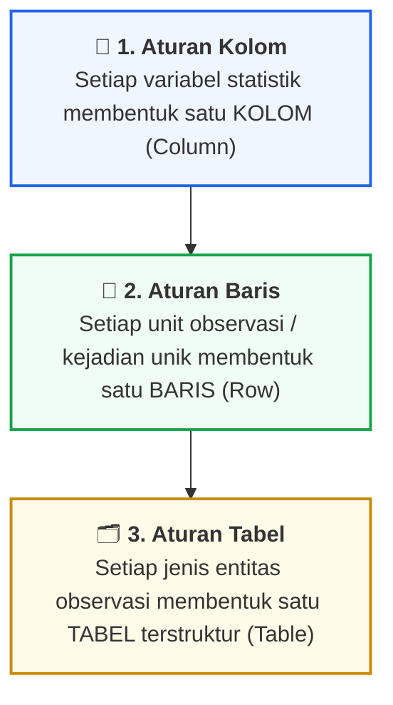
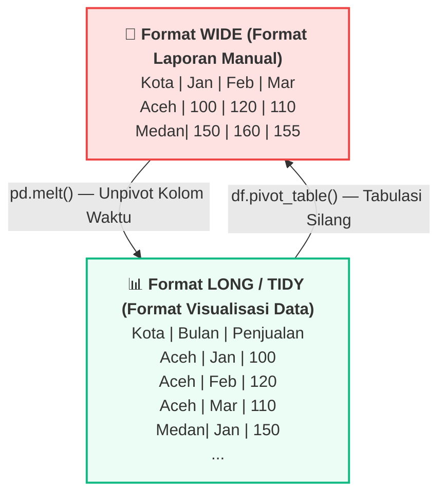
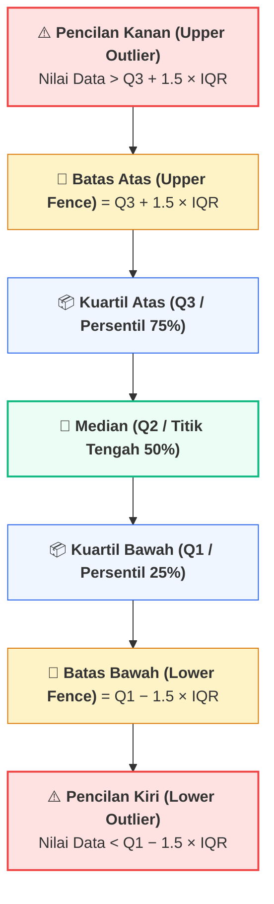

# 📘 Modul 04: Fondasi Data Wrangling & Exploratory Data Analysis (EDA) dengan Pandas

## 🎯 Capaian Pembelajaran (Sub-CPMK 2)
Setelah mempelajari modul ini, mahasiswa diharapkan mampu:
1. Memahami prinsip struktur data rapi (**Tidy Data**) dan membedakan antara format *Wide* dan *Long*.
2. Melakukan pembersihan data (*Data Cleaning*): penanganan nilai hilang (*Missing Values*), duplikasi data, dan perbaikan inkonsistensi tipe data menggunakan **Pandas**.
3. Mendeteksi dan menangani nilai pencilan (*Outliers*) menggunakan metode statistik **Z-Score** dan **Interquartile Range (IQR)**.
4. Melakukan manipulasi dan agregasi data tingkat lanjut dengan `groupby`, `pivot_table`, `melt`, dan `crosstab`.
5. Membangun alur kerja *Exploratory Data Analysis (EDA)* yang terstruktur dari dataset mentah hingga siap divisualisasikan.

---

## 1. Konsep Tidy Data & Format Tabular

Sebelum data dapat divisualisasikan dengan pustaka modern seperti Seaborn atau Plotly, data harus berada dalam format yang terstruktur. Dr. Hadley Wickham merumuskan 3 aturan baku **Tidy Data**:



### Perbedaan Format Wide vs Long (Tidy)



* **Format Wide:** Nilai waktu (Jan, Feb, Mar) dijadikan nama kolom terpisah. Format ini menyulitkan pemetaan visual terhadap variabel `hue` atau `color`.
* **Format Long (Tidy):** Variabel `Bulan` dan `Penjualan` berada dalam kolomnya masing-masing. Format ini adalah standar wajib dalam *Grammar of Graphics*.

---

## 2. Taksonomi Penanganan Missing Values & Outliers

### A. Klasifikasi Missing Values
1. **MCAR (Missing Completely at Random):** Data hilang murni karena kebetulan acak tanpa keterkaitan dengan variabel lain (misal: gangguan transmisi sensor acak). Aman untuk diimputasi mean/median atau di-drop jika jumlahnya sedikit (< 5%).
2. **MAR (Missing at Random):** Pola data hilang berkaitan dengan variabel lain yang teramati (misal: responden wanita cenderung tidak mengisi kolom berat badan). Imputasi berbasis grup (`groupby median`) sangat disarankan.
3. **MNAR (Missing Not at Random):** Data hilang berkaitan langsung dengan nilai variabel itu sendiri (misal: nasabah dengan utang macet sangat tinggi sengaja tidak mengisi kolom pendapatan). Membutuhkan pemodelan khusus atau penambahan flag biner `is_missing`.

---

### B. Deteksi Outlier: Metode Interquartile Range (IQR)
Metode Rentang Interkuartil (Tukey’s Fences) adalah teknik non-parametrik yang tangguh terhadap data yang tidak berdistribusi normal:

::: info 📐 Formula: Rentang Interkuartil (IQR) & Batas Tukey
> **`IQR = Q3 − Q1`**
>
> **`Batas Bawah (Lower Fence) = Q1 − (1.5 × IQR)`**
>
> **`Batas Atas (Upper Fence)  = Q3 + (1.5 × IQR)`**
>
> *Kriteria Outlier:* Titik data `x` dinyatakan sebagai pencilan jika **`x < Batas Bawah`** atau **`x > Batas Atas`**.
:::



---

## 3. Implementasi Kode Hands-on Python Pandas

Berikut adalah skrip lengkap dari dataset mentah simulasi transaksi e-commerce kotor hingga menjadi dataset siap visualisasi:

```python
import pandas as pd
import numpy as np

# ==============================================================================
# LANGKAH 1: MEMBUAT RAW DIRTY DATASET (SIMULASI RIIL)
# ==============================================================================
np.random.seed(42)
raw_data = {
    'Transaction_ID': [f'TRX-{1000+i}' for i in range(10)],
    'Customer_City': [' Banda Aceh ', 'Medan', 'banda aceh', 'Jakarta', 'Medan ', None, 'Jakarta', 'Surabaya', 'Banda Aceh', 'Medan'],
    'Order_Date': ['2024-01-15', '2024/01/16', '17-01-2024', '2024-01-18', '2024-01-19', '2024-01-20', '2024-01-21', '2024-01-22', '2024-01-23', '2024-01-24'],
    'Category': ['Electronics', 'Fashion', 'Electronics', 'Home', None, 'Fashion', 'Electronics', 'Home', 'Electronics', 'Fashion'],
    'Revenue_IDR': [15000000, 450000, 12000000, 850000, 500000000, 320000, None, 1200000, 18500000, 750000], # Terdapat Outlier 500 Juta & Missing
    'Quantity': [2, 1, 3, 2, 1, 1, 4, 2, 3, 1]
}

df_raw = pd.DataFrame(raw_data)
print("=== 1. DATASET MENTAH (RAW DIRTY DATA) ===")
print(df_raw)
print("\n" + "="*50 + "\n")

# ==============================================================================
# LANGKAH 2: DATA CLEANING & STANDARISASI STRING
# ==============================================================================
df_clean = df_raw.copy()

# A. Standardisasi Text: Strip spasi & ubah ke Title Case
df_clean['Customer_City'] = df_clean['Customer_City'].fillna('Unknown').str.strip().str.title()

# B. Parsing Tanggal Dinamis (Mixed Format)
df_clean['Order_Date'] = pd.to_datetime(df_clean['Order_Date'], format='mixed')
df_clean['Day_Name'] = df_clean['Order_Date'].dt.day_name()

# C. Penanganan Missing Values
# Imputasi Kategori dengan Nilai Modus atau 'Other'
df_clean['Category'] = df_clean['Category'].fillna('Other')
# Imputasi Revenue berdasarkan Median per Kategori
df_clean['Revenue_IDR'] = df_clean.groupby('Category')['Revenue_IDR'].transform(lambda x: x.fillna(x.median()))
# Jika masih ada NaN (misal kategori Other), isi dengan median global
df_clean['Revenue_IDR'] = df_clean['Revenue_IDR'].fillna(df_clean['Revenue_IDR'].median())

print("=== 2. DATASET SETELAH PEMBERSIHAN & IMPUTASI ===")
print(df_clean[['Customer_City', 'Order_Date', 'Day_Name', 'Category', 'Revenue_IDR']])
print("\n" + "="*50 + "\n")

# ==============================================================================
# LANGKAH 3: FUNGSI DETEKSI & PERLAKUAN OUTLIER DENGAN IQR
# ==============================================================================
def detect_outliers_iqr(df, column):
    Q1 = df[column].quantile(0.25)
    Q3 = df[column].quantile(0.75)
    IQR = Q3 - Q1
    lower_bound = Q1 - 1.5 * IQR
    upper_bound = Q3 + 1.5 * IQR
    
    outliers = df[(df[column] < lower_bound) | (df[column] > upper_bound)]
    print(f"Batas Bawah: Rp {lower_bound:,.0f} | Batas Atas: Rp {upper_bound:,.0f}")
    print(f"Ditemukan {len(outliers)} baris data pencilan (outlier):")
    return outliers, lower_bound, upper_bound

outliers, lb, ub = detect_outliers_iqr(df_clean, 'Revenue_IDR')
print(outliers[['Transaction_ID', 'Category', 'Revenue_IDR']])

# Capping Outlier (Winsorizing) ke batas atas agar tidak merusak skala visual
df_clean['Revenue_Capped'] = np.where(df_clean['Revenue_IDR'] > ub, ub, df_clean['Revenue_IDR'])
print("\n" + "="*50 + "\n")

# ==============================================================================
# LANGKAH 4: AGREGASI TINGKAT LANJUT (GROUPBY, PIVOT TABLE, & MELT)
# ==============================================================================

# A. GroupBy Multi-Agregasi
summary_category = df_clean.groupby('Category').agg(
    Total_Revenue=('Revenue_Capped', 'sum'),
    Rata_Rata_Revenue=('Revenue_Capped', 'mean'),
    Total_Qty=('Quantity', 'sum'),
    Jumlah_Transaksi=('Transaction_ID', 'count')
).reset_index()

print("=== 4A. RINGKASAN STATISTIK GROUPBY KATEGORI ===")
print(summary_category)
print("\n")

# B. Pivot Table: Matriks Wilayah vs Kategori
pivot_revenue = pd.pivot_table(
    df_clean, 
    values='Revenue_Capped', 
    index='Customer_City', 
    columns='Category', 
    aggfunc='sum', 
    fill_value=0
)
print("=== 4B. PIVOT TABLE (WIDE FORMAT) ===")
print(pivot_revenue)
print("\n")

# C. Unpivot (Melt) dari Wide kembali ke Long / Tidy Format untuk Visualisasi
df_long_tidy = pivot_revenue.reset_index().melt(
    id_vars='Customer_City',
    var_name='Category',
    value_name='Total_Revenue_IDR'
)
print("=== 4C. TIDY FORMAT SETELAH PD.MELT() ===")
print(df_long_tidy.head(6))
```

---

## 4. Rangkuman & Latihan Mandiri

::: tip 💡 Rangkuman Konsep Kunci
1. **Tidy Data:** Struktur data tabular terbaik untuk analisis dan visualisasi adalah *1 baris = 1 observasi*, *1 kolom = 1 variabel*.
2. **Pembersihan String:** Hapus spasi tak kasat mata (`str.strip()`) dan seragamkan kapitalisasi (`str.title()`) sebelum melakukan `groupby`.
3. **Penanganan Outlier:** Gunakan metode IQR (Q1 − 1.5×IQR s.d. Q3 + 1.5×IQR) untuk mendeteksi pencilan ekstrem, dan lakukan capping (*winsorizing*) atau filtering terisolasi.
4. **Reshaping:** Gunakan `pivot_table` untuk tabulasi silang laporan, dan gunakan `pd.melt()` untuk mengembalikan data ke format *Long* yang siap dipetakan ke sumbu grafik.
:::

### 📝 Tugas Praktikum 4 (Mandiri)
1. **Eksplorasi Dataset Riil:** Muat dataset bawaan Seaborn `df_titanic = sns.load_dataset('titanic')`:
   - Identifikasi persentase missing values pada setiap kolom menggunakan Pandas.
   - Lakukan imputasi pada kolom `age` menggunakan median usia berdasarkan kombinasi kelompok `sex` dan `pclass`.
   - Buat pivot table yang menampilkan tingkat keselamatan (*survival rate*) berdasarkan `class` dan `embark_town`.
2. **Transformasi Format Data:** Buat tabel manual berisi 5 nama mahasiswa dengan 3 kolom nilai: `Tugas1`, `Tugas2`, `Tugas3` (Format Wide). Transformasikan tabel tersebut menggunakan `pd.melt()` menjadi format Tidy dengan kolom `Nama_Mahasiswa`, `Jenis_Tugas`, dan `Nilai`.