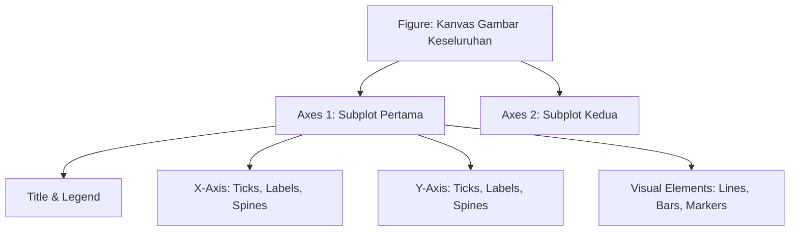

# 📘 Modul 05: Visualisasi Statis Fundamental dengan Matplotlib

## 🎯 Capaian Pembelajaran (Sub-CPMK 2)
Setelah mempelajari modul ini, mahasiswa diharapkan mampu:
1. Memahami arsitektur hierarki **Object-Oriented API** pada pustaka Matplotlib (`Figure`, `Axes`, `Axis`, `Spines`, `Ticks`).
2. Membuat visualisasi dasar: Line Plot, Bar Chart (Horizontal & Grouped), Scatter Plot, dan Histogram.
3. Mengatur tata letak multi-panel secara profesional menggunakan `plt.subplots()` dan `GridSpec`.
4. Menerapkan prinsip *Data-Ink Ratio* melalui kustomisasi tema, grid, batas kurva, dan anotasi teks.

---

## 1. Arsitektur Object-Oriented (OO) Matplotlib

Matplotlib memiliki dua antarmuka: antarmuka prosedural mirip MATLAB (`pyplot.plot()`) dan **Antarmuka Berorientasi Objek (OO Interface)**. Untuk visualisasi profesional berstandar industri, wajib menggunakan antarmuka OO.



---

## 2. Contoh Kode: Standar Publikasi HD dengan Matplotlib OO

```python
import matplotlib.pyplot as plt
import numpy as np

# Pengaturan Font & Resolusi Publikasi
plt.rcParams['font.sans-serif'] = 'Helvetica, Arial, DejaVu Sans'
plt.rcParams['font.size'] = 11
plt.rcParams['axes.edgecolor'] = '#cccccc'
plt.rcParams['axes.linewidth'] = 0.8

# Data Simulasi
kategori = ['Informatika', 'Sistem Informasi', 'Teknologi Informasi', 'Sains Data', 'Teknik Komputer']
mahasiswa_2023 = [120, 95, 80, 65, 50]
mahasiswa_2024 = [145, 110, 85, 90, 60]

x = np.arange(len(kategori))
width = 0.35

# Inisialisasi Figure dan Axes
fig, ax = plt.subplots(figsize=(10, 5.5), dpi=300)

# Plotting Grouped Bar Chart
rects1 = ax.bar(x - width/2, mahasiswa_2023, width, label='2023', color='#94a3b8', edgecolor='none')
rects2 = ax.bar(x + width/2, mahasiswa_2024, width, label='2024', color='#2563eb', edgecolor='none')

# Kustomisasi Sumbu & Label (Tufte Style)
ax.set_ylabel('Jumlah Mahasiswa Terdaftar', fontweight='medium')
ax.set_title('Pertumbuhan Penerimaan Mahasiswa Baru FST (2023 vs 2024)', fontsize=14, fontweight='bold', pad=15, loc='left')
ax.set_xticks(x)
ax.set_xticklabels(kategori)
ax.legend(frameon=False, loc='upper right')

# Menghilangkan Spines Atas & Kanan (Mengurangi Non-Data Ink)
ax.spines['top'].set_visible(False)
ax.spines['right'].set_visible(False)
ax.grid(axis='y', linestyle='--', alpha=0.4, color='#cbd5e1')
ax.set_axisbelow(True)

# Anotasi Langsung pada Batang Tertinggi
ax.annotate('Peningkatan Tertinggi (+38%)',
            xy=(3 + width/2, 90), xytext=(2.5, 120),
            arrowprops=dict(facecolor='#1e293b', arrowstyle='->', lw=1),
            fontweight='bold', color='#1e293b')

plt.tight_layout()
plt.savefig('pertumbuhan_mahasiswa.png', dpi=300, bbox_inches='tight')
plt.show()
```