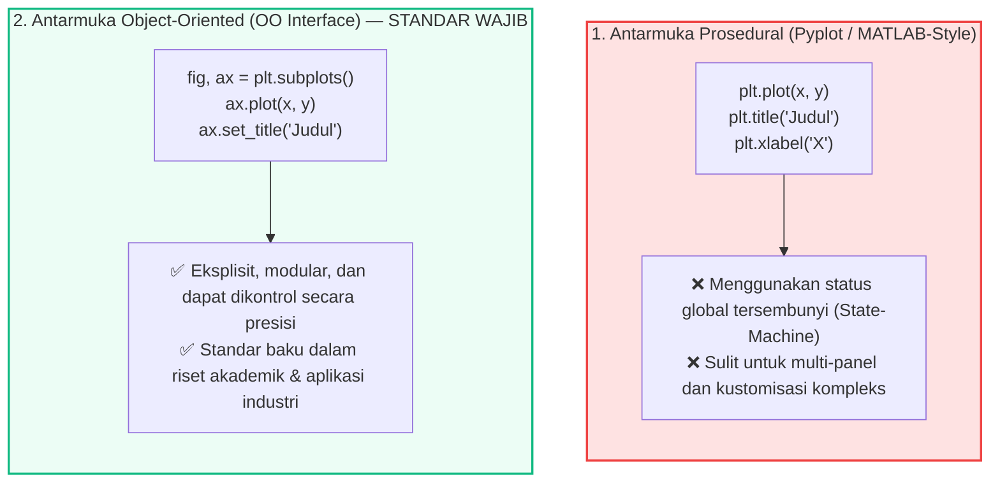
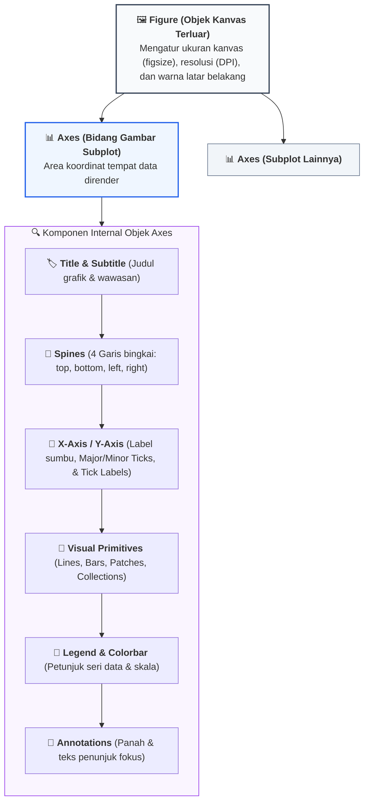
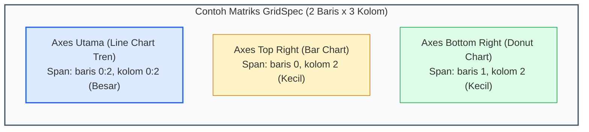

# 📘 Modul 05: Visualisasi Statis Fundamental dengan Matplotlib Object-Oriented

## 🎯 Capaian Pembelajaran (Sub-CPMK 2)
Setelah mempelajari modul ini, mahasiswa diharapkan mampu:
1. Memahami perbedaan mendasar antara antarmuka prosedural (`pyplot`) dan antarmuka berorientasi objek (**Object-Oriented API**) Matplotlib.
2. Menguasai hierarki anatomi grafis Matplotlib: `Figure`, `Axes`, `Axis`, `Spines`, `Ticks`, `Legends`, dan `Annotations`.
3. Membangun visualisasi multi-panel kompleks dan asimetris menggunakan `GridSpec` serta sumbu ganda (**Twin Axes**).
4. Menerapkan kustomisasi berstandar publikasi akademik (High-DPI, vector export, tipografi terstruktur, dan eliminasi non-data ink).
5. Mengimplementasikan script Python lengkap untuk membuat visualisasi analitis profesional siap terbit.

---

## 1. Arsitektur Object-Oriented (OO) Matplotlib

Matplotlib menyediakan dua pendekatan pemrograman visual:



### Anatomi Lengkap Objek Grafik Matplotlib



---

## 2. Tata Letak Asimetris dengan GridSpec & Twin Axes

Dalam dashboard analitis profesional, tata letak subplot sering kali tidak simetris (misalnya 1 grafik utama berukuran besar di sebelah kiri, dan 2 grafik ringkasan berukuran kecil di sebelah kanan). Matplotlib menyediakan modul `matplotlib.gridspec.GridSpec` untuk memecah kanvas menjadi matriks grid yang fleksibel.



---

## 3. Implementasi Kode Hands-on Python

Berikut adalah 3 skrip praktikum mandiri yang mendemonstrasikan standar publikasi akademik menggunakan antarmuka Berorientasi Objek (OO):

```python
import matplotlib.pyplot as plt
import matplotlib.gridspec as gridspec
import matplotlib.ticker as ticker
import numpy as np
import pandas as pd

# ==============================================================================
# PRAKTIKUM 1: PUBLICATION-READY LINE PLOT DENGAN CONFIDENCE INTERVAL
# ==============================================================================
# Simulasi Data Eksperimen Algoritma (50 Epochs)
np.random.seed(42)
epochs = np.arange(1, 51)
model_a_mean = 0.95 - 0.6 * np.exp(-epochs/10)
model_a_std = 0.03 * np.exp(-epochs/20) + 0.005 * np.random.rand(50)

model_b_mean = 0.88 - 0.5 * np.exp(-epochs/12)
model_b_std = 0.04 * np.exp(-epochs/20) + 0.005 * np.random.rand(50)

fig, ax = plt.subplots(figsize=(9, 5), dpi=300)

# Plot Garis Rata-rata Model A & Area Pita Kepercayaan (Shaded Confidence Band)
ax.plot(epochs, model_a_mean, label='Proposed Deep Learning Model', color='#2563eb', linewidth=2.2)
ax.fill_between(epochs, model_a_mean - model_a_std, model_a_mean + model_a_std, color='#2563eb', alpha=0.18)

# Plot Garis Model B (Baseline)
ax.plot(epochs, model_b_mean, label='Baseline Model (SVM)', color='#64748b', linewidth=1.8, linestyle='--')
ax.fill_between(epochs, model_b_mean - model_b_std, model_b_mean + model_b_std, color='#64748b', alpha=0.12)

# Kustomisasi Tufte & Typography
ax.set_title("Perbandingan Konvergensi Akurasi Model AI pada Data Pengujian", fontsize=12, fontweight='bold', pad=15, loc='left')
ax.set_xlabel("Epoch Pelatihan", fontsize=10.5, fontweight='medium')
ax.set_ylabel("Akurasi Pengujian (F1-Score)", fontsize=10.5, fontweight='medium')
ax.set_ylim(0.3, 1.02)
ax.set_xlim(1, 50)

# Menghilangkan Spines Atas dan Kanan
ax.spines['top'].set_visible(False)
ax.spines['right'].set_visible(False)
ax.spines['left'].set_color('#cbd5e1')
ax.spines['bottom'].set_color('#cbd5e1')
ax.grid(axis='y', linestyle=':', alpha=0.6, color='#cbd5e1')

# Anotasi Panah Melengkung pada Titik Konvergensi Puncak
ax.annotate('Akurasi Maksimum (94.8%)\ntercapai pada Epoch 45',
            xy=(45, model_a_mean[44]), xytext=(30, 0.72),
            arrowprops=dict(arrowstyle="->", connectionstyle="arc3,rad=-0.2", color='#1e293b', lw=1.2),
            fontsize=9.5, fontweight='bold', color='#1e293b',
            bbox=dict(boxstyle="round,pad=0.4", fc="#f8fafc", ec="#cbd5e1", lw=1))

ax.legend(frameon=False, loc='lower right', fontsize=10)
plt.tight_layout()
plt.savefig('akurasi_model_ieee.png', dpi=300, bbox_inches='tight')
plt.show()

# ==============================================================================
# PRAKTIKUM 2: DASHBOARD MULTI-PANEL ASIMETRIS MENGGUNAKAN GRIDSPEC
# ==============================================================================
fig = plt.figure(figsize=(13, 6), dpi=250)
gs = gridspec.GridSpec(2, 3, figure=fig, width_ratios=[1.8, 1, 1], height_ratios=[1, 1], wspace=0.35, hspace=0.4)

# 1. Panel Utama Kiri: Line Chart Tren Finansial (Span: 2 Baris x Kolom 0)
ax_main = fig.add_subplot(gs[:, 0])
bulan = ['Jan', 'Feb', 'Mar', 'Apr', 'Mei', 'Jun']
revenue = [120, 135, 128, 150, 175, 190]
ax_main.plot(bulan, revenue, marker='o', color='#0284c7', linewidth=2.5, markersize=7)
ax_main.set_title("Tren Pertumbuhan Pendapatan H1 (Juta Rp)", fontsize=11, fontweight='bold', loc='left')
ax_main.spines['top'].set_visible(False)
ax_main.spines['right'].set_visible(False)
ax_main.grid(axis='y', linestyle='--', alpha=0.5)

# 2. Panel Kanan Atas: Bar Chart Produk Terlaris (Span: Baris 0, Kolom 1:3)
ax_top_right = fig.add_subplot(gs[0, 1:])
produk = ['Server Cloud', 'Software ERP', 'Consulting']
penjualan_unit = [420, 310, 180]
ax_top_right.barh(produk, penjualan_unit, color='#3b82f6', height=0.55)
ax_top_right.set_title("Volume Penjualan Produk Teratas", fontsize=10.5, fontweight='bold', loc='left')
ax_top_right.spines['top'].set_visible(False)
ax_top_right.spines['right'].set_visible(False)

# 3. Panel Kanan Bawah 1: Histogram Distribusi Transaksi
ax_bot_1 = fig.add_subplot(gs[1, 1])
data_trx = np.random.exponential(scale=50, size=500)
ax_bot_1.hist(data_trx, bins=15, color='#0d9488', edgecolor='white')
ax_bot_1.set_title("Distribusi Nilai Transaksi", fontsize=10, fontweight='bold', loc='left')
ax_bot_1.spines['top'].set_visible(False)
ax_bot_1.spines['right'].set_visible(False)

# 4. Panel Kanan Bawah 2: Bar Chart Kepuasan Pelanggan
ax_bot_2 = fig.add_subplot(gs[1, 2])
skor = ['Sangat Puas', 'Puas', 'Cukup']
persen = [65, 28, 7]
ax_bot_2.bar(skor, persen, color=['#10b981', '#6ee7b7', '#fcd34d'], width=0.6)
ax_bot_2.set_title("Indeks Kepuasan (%)", fontsize=10, fontweight='bold', loc='left')
ax_bot_2.spines['top'].set_visible(False)
ax_bot_2.spines['right'].set_visible(False)

plt.suptitle("Dashboard Ringkasan Kinerja Bisnis Semester I - 2024", fontsize=13, fontweight='bold', y=0.98)
plt.show()

# ==============================================================================
# PRAKTIKUM 3: DUAL-AXIS (TWINX) CHART UNTUK 2 METRIK BEDA SKALA
# ==============================================================================
fig, ax1 = plt.subplots(figsize=(9, 4.5), dpi=200)

tahun = np.arange(2019, 2025)
volume_produksi = [1200, 1450, 1300, 1800, 2200, 2700] # Satuan: Ton
biaya_per_ton = [85, 82, 84, 75, 68, 62] # Satuan: Juta Rp/Ton (Skala Efisiensi)

# Sumbu 1 (Kiri): Volume Produksi (Bar Chart)
color1 = '#0284c7'
bars = ax1.bar(tahun - 0.15, volume_produksi, width=0.4, color=color1, alpha=0.85, label='Volume Produksi (Ton)')
ax1.set_xlabel('Tahun Fiskal', fontweight='medium')
ax1.set_ylabel('Volume Produksi (Ton)', color=color1, fontweight='bold')
ax1.tick_params(axis='y', labelcolor=color1)
ax1.spines['top'].set_visible(False)

# Sumbu 2 (Kanan): Biaya Unit (Line Chart dengan ax.twinx)
ax2 = ax1.twinx()
color2 = '#e11d48'
line = ax2.plot(tahun + 0.15, biaya_per_ton, color=color2, marker='s', linewidth=2.5, label='Biaya Produksi / Ton')
ax2.set_ylabel('Biaya Produksi (Juta Rp / Ton)', color=color2, fontweight='bold')
ax2.tick_params(axis='y', labelcolor=color2)
ax2.spines['top'].set_visible(False)

# Anotasi Kesimpulan
ax1.set_title("Peningkatan Kapasitas Pabrik Mendorong Efisiensi Biaya Unit (2019-2024)", 
              fontsize=11.5, fontweight='bold', pad=15, loc='left')

plt.tight_layout()
plt.show()
```

---

## 4. Rangkuman & Latihan Mandiri

::: tip 💡 Rangkuman Konsep Kunci
1. **Object-Oriented API (`fig, ax`):** Selalu gunakan antarmuka berorientasi objek untuk kontrol presisi terhadap setiap elemen hierarki visual.
2. **GridSpec:** Manfaatkan `GridSpec` untuk menyusun tata letak multi-panel asimetris yang dinamis dan proporsional.
3. **Penyusutan Non-Data Ink:** Hapus batas bingkai atas dan kanan (`spines['top'].set_visible(False)`) serta gunakan garis kisi tipis bermotif titik-titik (`linestyle=':'`).
4. **Format Ekspor:** Gunakan format vektor (`.svg` atau `.pdf`) untuk publikasi skripsi/jurnal akademik, dan `.png` resolusi tinggi (`dpi=300`) untuk presentasi slide.
:::

### 📝 Tugas Praktikum 5 (Mandiri)
1. **Implementasi Matplotlib OO Mandiri:** Buatlah sebuah visualisasi *Horizontal Grouped Bar Chart* yang membandingkan Tingkat Penyerapan Kerja Lulusan (Alumni) dari 5 Program Studi di Fakultas Sains dan Teknologi untuk Tahun 2023 vs 2024.
   - Wajib menggunakan antarmuka Berorientasi Objek (`fig, ax = plt.subplots()`).
   - Terapkan eliminasi spines non-data dan berikan *Direct Data Labeling* pada ujung setiap batang.
   - Tambahkan garis batas target kelulusan fakultas sebesar 85% menggunakan `ax.axvline()`.
2. **Eksplorasi GridSpec:** Buat dashboard 3-panel yang terdiri dari 1 grafik scatter plot korelasi di sisi atas dan 2 grafik histogram distribusi masing-masing variabel di sisi bawah menggunakan `GridSpec`.