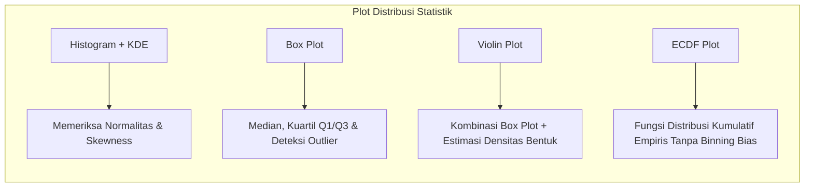

# 📘 Modul 06: Visualisasi Statistik & Distribusi Lanjut dengan Seaborn

## 🎯 Capaian Pembelajaran (Sub-CPMK 2)
Setelah mempelajari modul ini, mahasiswa diharapkan mampu:
1. Memahami keunggulan pustaka **Seaborn** dalam memodelkan estimasi statistik secara otomatis.
2. Memvisualisasikan distribusi univariat dan bivariat: Histogram, Kernel Density Estimation (KDE), ECDF Plot.
3. Membandingkan sebaran statistik multi-grup menggunakan Box Plot, Violin Plot, dan Stripplot.
4. Menerapkan `FacetGrid`, `catplot`, dan `displot` untuk analisis multi-kondisi.

---

## 1. Anatomi Plot Distribusi Kunci



---

## 2. Implementasi Python Seaborn

```python
import seaborn as sns
import matplotlib.pyplot as plt

# Set tema estetika Seaborn
sns.set_theme(style="ticks", palette="muted")
tips = sns.load_dataset("tips")

# 1. Multi-Plot Komparasi Distribusi: Boxen + Stripplot
fig, axes = plt.subplots(1, 2, figsize=(13, 5), dpi=300)

# Violin Plot dengan Titik Data Individu
sns.violinplot(data=tips, x="day", y="total_bill", hue="smoker", split=True,
               inner="quart", palette={"Yes": "#38bdf8", "No": "#f43f5e"}, ax=axes[0])
axes[0].set_title("Distribusi Total Tagihan (Violin Split by Smoker)", fontweight='bold')
axes[0].spines['top'].set_visible(False)
axes[0].spines['right'].set_visible(False)

# ECDF Plot Komparatif
sns.ecdfplot(data=tips, x="total_bill", hue="time", palette="crest", ax=axes[1])
axes[1].set_title("Empirical Cumulative Distribution Function (ECDF)", fontweight='bold')
axes[1].spines['top'].set_visible(False)
axes[1].spines['right'].set_visible(False)

plt.tight_layout()
plt.show()
```