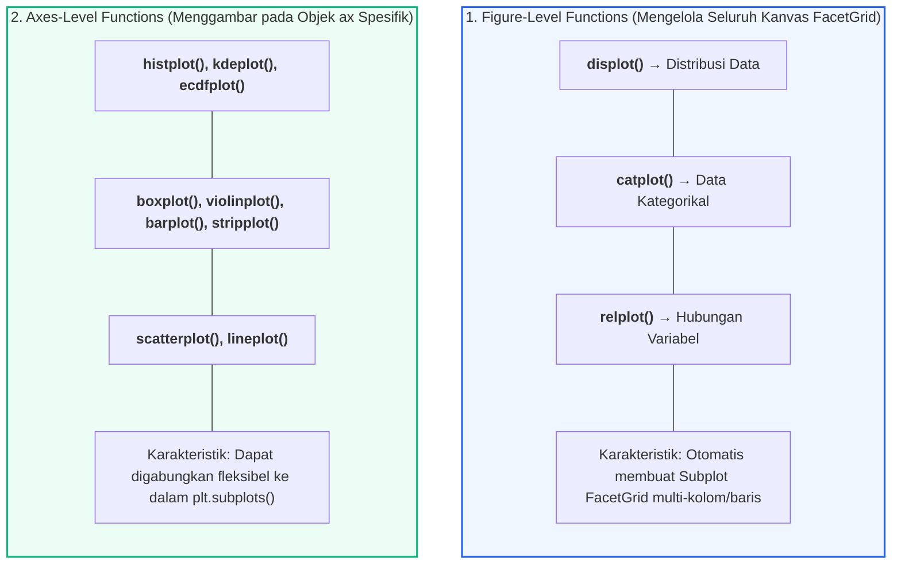
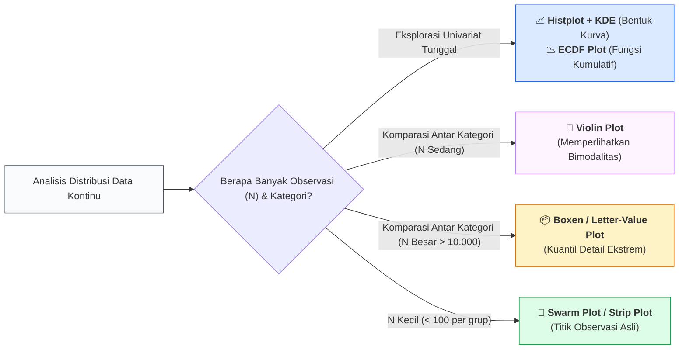

# 📘 Modul 06: Visualisasi Statistik & Distribusi Lanjut dengan Seaborn

## 🎯 Capaian Pembelajaran (Sub-CPMK 2)
Setelah mempelajari modul ini, mahasiswa diharapkan mampu:
1. Memahami arsitektur pustaka **Seaborn** serta membedakan antara fungsi tingkat figur (*Figure-level*) dan fungsi tingkat sumbu (*Axes-level*).
2. Memvisualisasikan dan menganalisis distribusi statistik univariat dan bivariat menggunakan **Histogram**, **Kernel Density Estimation (KDE)**, dan **ECDF Plot**.
3. Membandingkan sebaran data statistik multi-kategori menggunakan **Box Plot**, **Boxen Plot**, **Violin Plot**, dan **Swarm Plot**.
4. Melakukan analisis multi-kondisi (*Small Multiples*) menggunakan `FacetGrid` dan `catplot`.
5. Menginterpretasikan interval kepercayaan (*Bootstrap Confidence Intervals 95%*) pada estimasi statistik Seaborn.

---

## 1. Arsitektur Pustaka Seaborn: Figure-Level vs Axes-Level

Seaborn dibangun di atas Matplotlib dengan integrasi mendalam bersama struktur data Pandas DataFrame. Pustaka ini membagi fungsinya menjadi dua arsitektur utama:



---

## 2. Anatomi Plot Distribusi Statistik

Memilih grafik distribusi yang tepat sangat krusial untuk mendeteksi kecondongan (*skewness*), modalitas (unimodal vs bimodal), dan nilai pencilan:



### Perbandingan 4 Plot Distribusi Kunci:

| Tipe Grafik | Parameter Statistik yang Diwakili | Keunggulan Utama | Kelemahan / Batasan |
| :--- | :--- | :--- | :--- |
| **Histogram & KDE** | Estimasi densitas probabilitas, modus, *skewness*, *kurtosis*. | Sangat intuitif untuk melihat puncak distribusi. | Sensitif terhadap pemilihan lebar bin (*bin width*) dan parameter *bandwidth* ($h$). |
| **Box Plot (Tukey)** | Ringkasan 5 Angka (Min, $Q_1$, Median, $Q_3$, Max) & Outliers. | Ringkas, sangat efisien untuk membandingkan 10+ kategori sekaligus. | Menyembunyikan distribusi bimodal (data 2 puncak terlihat seperti seragam). |
| **Violin Plot** | Gabungan Boxplot + estimasi kontur kepadatan probabilitas (KDE). | Menampilkan bimodalitas dan variasi bentuk kepadatan data secara utuh. | Membutuhkan sampel yang cukup; parameter smoothing dapat menghasilkan ekor semu. |
| **ECDF Plot** | Nilai persentil kumulatif empiris dari 0% hingga 100%. | **Bebas 100% dari bias penentuan lebar bin** (*No binning artifacts*). | Kurang intuitif bagi audiens awam yang belum memahami konsep fungsi kumulatif. |

---

## 3. Implementasi Kode Hands-on Python Seaborn

Berikut adalah script Python yang mendemonstrasikan analisis distribusi komprehensif menggunakan dataset tips dan data transaksi e-commerce:

```python
import seaborn as sns
import matplotlib.pyplot as plt
import numpy as np
import pandas as pd

# Konfigurasi Tema Estetika Seaborn
sns.set_theme(style="ticks", palette="muted")
plt.rcParams['figure.dpi'] = 200

# Memuat Dataset Bawaan Seaborn
tips = sns.load_dataset("tips")

# ==============================================================================
# PRAKTIKUM 1: ANALISIS DISTRIBUSI UNIVARIAT (HISTOGRAM, KDE, & ECDF)
# ==============================================================================
fig, axes = plt.subplots(1, 2, figsize=(13, 5))

# Kiri: Histogram Berpadu Kurva KDE & Rug Plot
sns.histplot(data=tips, x="total_bill", kde=True, bins=20, color="#0284c7",
             line_kws={'linewidth': 2.5}, ax=axes[0])
sns.rugplot(data=tips, x="total_bill", color="#0f172a", height=0.08, ax=axes[0])
axes[0].set_title("A. Distribusi Frekuensi Total Tagihan (Hist + KDE + Rug)", fontsize=11, fontweight='bold')
axes[0].set_xlabel("Total Tagihan ($)")
axes[0].set_ylabel("Frekuensi")
axes[0].spines['top'].set_visible(False)
axes[0].spines['right'].set_visible(False)

# Kanan: ECDF Plot Komparatif Berdasarkan Waktu Makan (Lunch vs Dinner)
sns.ecdfplot(data=tips, x="total_bill", hue="time", palette={"Lunch": "#0d9488", "Dinner": "#e11d48"},
             linewidth=2.2, ax=axes[1])
axes[1].set_title("B. ECDF (Fungsi Distribusi Kumulatif Empiris)", fontsize=11, fontweight='bold')
axes[1].set_xlabel("Total Tagihan ($)")
axes[1].set_ylabel("Probabilitas Kumulatif")
axes[1].axhline(0.5, color='#94a3b8', linestyle=':', label='Median (50%)')
axes[1].spines['top'].set_visible(False)
axes[1].spines['right'].set_visible(False)

plt.tight_layout()
plt.show()

# ==============================================================================
# PRAKTIKUM 2: KOMPARASI KATEGORIKAL (SPLIT VIOLIN PLOT + STRIPPLOT)
# ==============================================================================
fig, ax = plt.subplots(figsize=(10, 5.5))

# Split Violin Plot untuk membandingkan perokok (Yes vs No) per Hari
sns.violinplot(data=tips, x="day", y="total_bill", hue="smoker", split=True,
               inner="quart", palette={"Yes": "#38bdf8", "No": "#fb7185"},
               cut=0, ax=ax)

# Menumpuk Strip Plot dengan jitter agar titik data asli terlihat (Gestalt Similarity)
sns.stripplot(data=tips, x="day", y="total_bill", hue="smoker", dodge=True,
              color="black", alpha=0.35, size=4, jitter=0.15, ax=ax)

# Merapikan Legenda agar tidak duplikat
handles, labels = ax.get_legend_handles_labels()
ax.legend(handles[:2], ["Perokok", "Bukan Perokok"], title="Status", frameon=False, loc="upper left")

ax.set_title("Komparasi Distribusi Pengeluaran Restoran Berdasarkan Hari & Status Merokok", 
             fontsize=12, fontweight='bold', pad=15, loc='left')
ax.set_xlabel("Hari Operasional Restoran")
ax.set_ylabel("Total Tagihan ($)")
ax.spines['top'].set_visible(False)
ax.spines['right'].set_visible(False)

plt.tight_layout()
plt.show()

# ==============================================================================
# PRAKTIKUM 3: ESTIMASI STATISTIK DENGAN INTERVAL KEPERCAYAAN 95% (BARPLOT)
# ==============================================================================
fig, ax = plt.subplots(figsize=(8, 4.5))

# Seaborn barplot otomatis menghitung Rata-rata dan 95% Bootstrap Confidence Interval
sns.barplot(data=tips, x="day", y="tip", hue="sex", palette="Blues",
            errorbar=('ci', 95), capsize=0.1, err_kws={'linewidth': 1.5, 'color': '#1e293b'}, ax=ax)

ax.set_title("Rata-Rata Tip Berdasarkan Hari & Gender (dengan 95% Confidence Interval)",
             fontsize=11, fontweight='bold', pad=15, loc='left')
ax.set_xlabel("Hari")
ax.set_ylabel("Rata-rata Tip ($)")
ax.legend(title="Gender", frameon=False)
ax.spines['top'].set_visible(False)
ax.spines['right'].set_visible(False)
ax.grid(axis='y', linestyle=':', alpha=0.6)

plt.tight_layout()
plt.show()
```

---

## 4. Rangkuman & Latihan Mandiri

::: tip 💡 Rangkuman Konsep Kunci
1. **Pembedaan Arsitektur:** Gunakan fungsi *Axes-level* (`histplot`, `boxplot`, `violinplot`) jika ingin menyatukannya dalam `plt.subplots()` berkustomisasi tinggi, dan gunakan *Figure-level* (`displot`, `catplot`) untuk eksplorasi cepat.
2. **Keunggulan ECDF:** Gunakan ECDF saat Anda ingin membandingkan kurva distribusi tanpa bias penentuan lebar bin (*bin width*).
3. **Kombinasi Violin + Stripplot:** Selalu pertimbangkan menambahkan titik data observasi nyata (*stripplot jitter*) di atas violin plot untuk memberikan transparansi penuh terhadap kepadatan sampel data.
4. **Bootstrap Error Bars:** Garis vertikal (*error bar*) pada `sns.barplot` merepresentasikan interval kepercayaan 95% hasil simulasi *resampling bootstrap*, bukan deviasi standar sampel.
:::

### 📝 Tugas Praktikum 6 (Mandiri)
1. **Analisis Komparatif Bimodalitas:** Muat dataset `penguins` dari Seaborn (`sns.load_dataset('penguins')`):
   - Buatlah perbandingan visual antara **Box Plot** dan **Violin Plot** untuk variabel `flipper_length_mm` berdasarkan `species`.
   - Analisis apakah terdapat spesies pinguin yang memiliki distribusi panjang sirip bimodal (dua puncak) dan jelaskan penyebab biologisnya.
2. **Visualisasi FacetGrid Multi-Panel:** Buatlah kisi-kisi grafik multi-panel menggunakan `sns.FacetGrid` atau `sns.displot` yang menampilkan distribusi `body_mass_g` pinguin dipisah berdasarkan kolom `island` dan diwarnai (*hue*) berdasarkan `sex`.