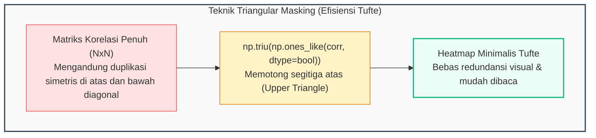
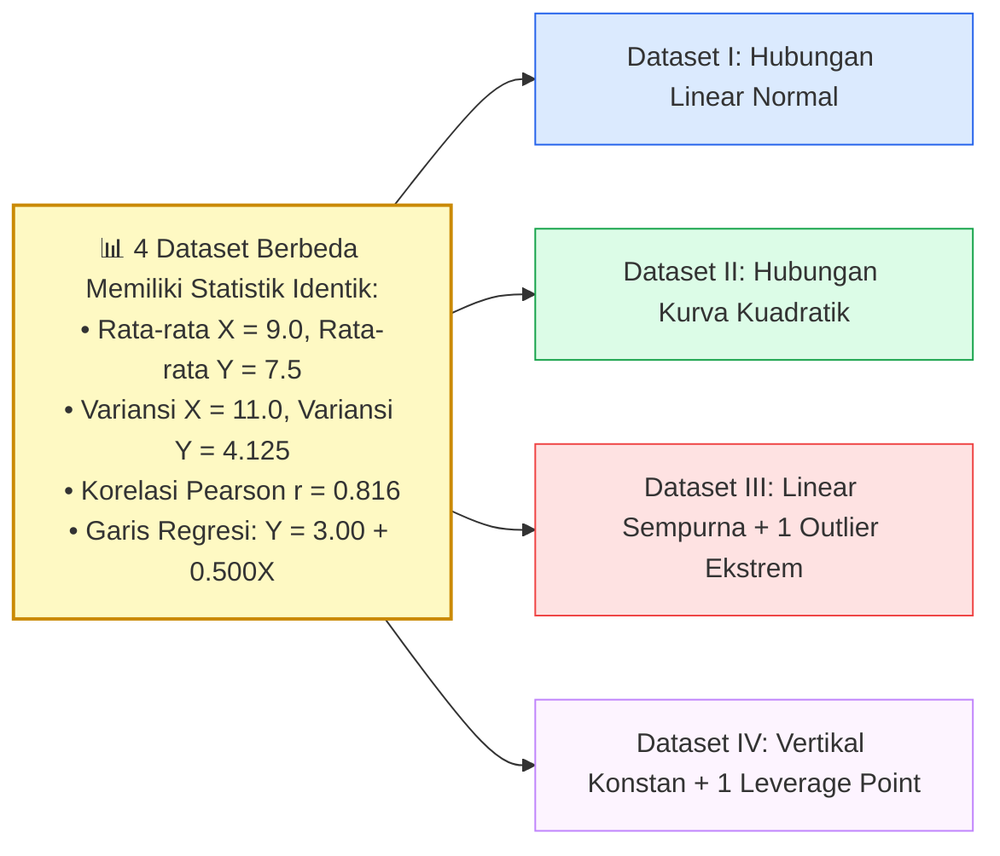

# 📘 Modul 07: Visualisasi Korelasi, Matriks & Multivariat

## 🎯 Capaian Pembelajaran (Sub-CPMK 2)
Setelah mempelajari modul ini, mahasiswa diharapkan mampu:
1. Menganalisis dan memvisualisasikan korelasi antar variabel menggunakan **Matriks Korelasi (*Correlation Heatmap*)** berarsitektur *Triangular Mask*.
2. Membangun visualisasi dimensi tinggi (4D/5D) menggunakan **Bubble Chart**, **Pair Plot**, dan **Parallel Coordinates Plot**.
3. Menyajikan struktur data hierarkis dan aliran proporsi menggunakan **Treemap** dan **Sankey Diagram**.
4. Memahami dan mengidentifikasi jebakan statistik analitis kritis: **Anscombe’s Quartet**, **Korelasi Semu (*Spurious Correlation*)**, dan **Paradoks Simpson (*Simpson’s Paradox*)**.
5. Mengimplementasikan script Python lengkap untuk analisis hubungan multivariat yang tangguh.

---

## 1. Analisis Korelasi & Matriks Multivariat

Korelasi mengukur kekuatan dan arah hubungan linear atau monotonik antara dua variabel acak:

$$\text{Pearson } r = \frac{\sum (x_i - \bar{x})(y_i - \bar{y})}{\sqrt{\sum (x_i - \bar{x})^2 \sum (y_i - \bar{y})^2}}$$

| Jenis Korelasi | Asumsi & Karakteristik Data | Kapan Digunakan? |
| :--- | :--- | :--- |
| **Pearson ($r$)** | Data numerik kontinu, berdistribusi normal, mengukur hubungan linear. | Analisis hubungan linear standar (misal: Tinggi vs Berat Badan). |
| **Spearman ($\rho$)** | Data ordinal atau kontinu, non-parametrik, mengukur hubungan monotonik. | Data memiliki outlier ekstrem atau hubungan bersifat kurva melengkung. |
| **Kendall ($\tau$)** | Berbasis pasangan data konkordan/diskordan (*rank-based*). | Sampel data kecil dengan banyak nilai peringkat yang sama (*ties*). |



---

## 2. Peringatan Ilmiah: Fenomena Anscombe's Quartet

Pada tahun 1973, ahli statistik Francis Anscombe merumuskan **Anscombe’s Quartet** untuk membuktikan bahwa **analisis statistik deskriptif numerik (mean, varians, korelasi) tanpa inspeksi visualisasi data adalah tindakan yang sangat berbahaya!**



---

## 3. Visualisasi Aliran & Hierarki: Treemap & Sankey

1. **Treemap:** Membagi ruang 2D menjadi persegi panjang bersarang di mana luas area merepresentasikan besaran volume data kuantitatif, dan warna menunjukkan metrik performa kedua.
2. **Sankey Diagram:** Menggambarkan aliran (*flow*) atau perpindahan kuantitas antar simpul tahapan proses bisnis (misal: dari Pengunjung Web $\to$ Masuk Keranjang $\to$ Checkout $\to$ Pembayaran Berhasil).

---

## 4. Implementasi Kode Hands-on Python

Berikut adalah 3 eksperimen Python mandiri yang mendemonstrasikan eksplorasi multivariat, pembuktian Anscombe's Quartet, dan visualisasi hierarki Treemap:

```python
import seaborn as sns
import matplotlib.pyplot as plt
import numpy as np
import pandas as pd
import plotly.express as px

plt.rcParams['figure.dpi'] = 200

# ==============================================================================
# PRAKTIKUM 1: HEATMAP KORELASI MULTIVARIAT BER-MASKING SEGITIGA
# ==============================================================================
# Memuat Dataset Penguins Bawaan Seaborn
df_penguins = sns.load_dataset('penguins').dropna()

# Hitung Matriks Korelasi Fitur Numerik
fitur_numerik = df_penguins.select_dtypes(include=[np.number])
matriks_korelasi = fitur_numerik.corr(method='pearson')

# Buat Mask untuk Menyembunyikan Segitiga Atas (Upper Triangle)
mask = np.triu(np.ones_like(matriks_korelasi, dtype=bool))

fig, ax = plt.subplots(figsize=(8, 6))

# Gambar Heatmap dengan Palet Divergen 'vlag' (Pusat Netral di 0)
sns.heatmap(
    matriks_korelasi, 
    mask=mask, 
    cmap='vlag', 
    vmin=-1.0, vmax=1.0, 
    annot=True, fmt='.2f', 
    square=True, 
    linewidths=1.5, 
    cbar_kws={"shrink": 0.8, "label": "Koefisien Korelasi Pearson (r)"},
    ax=ax
)

ax.set_title("Matriks Korelasi Morfologi Pinguin (Tufte Masked)", fontsize=12, fontweight='bold', pad=15, loc='left')
plt.tight_layout()
plt.show()

# ==============================================================================
# PRAKTIKUM 2: VISUALISASI EMPAT DATASET ANSCOMBE'S QUARTET
# ==============================================================================
df_anscombe = sns.load_dataset("anscombe")

fig, axes = plt.subplots(2, 2, figsize=(10, 8), sharex=True, sharey=True)
dataset_names = ['I', 'II', 'III', 'IV']

for ax, name in zip(axes.flat, dataset_names):
    data_subset = df_anscombe[df_anscombe['dataset'] == name]
    
    # Plot Titik Scatter dan Garis Regresi Linear OLS
    sns.regplot(data=data_subset, x="x", y="y", ci=None, 
                scatter_kws={'s': 70, 'color': '#0284c7', 'alpha': 0.9},
                line_kws={'color': '#ef4444', 'linewidth': 2}, ax=ax)
    
    # Kalkulasi Korelasi r
    r = data_subset['x'].corr(data_subset['y'])
    ax.set_title(f"Dataset {name} (r = {r:.3f})", fontsize=11, fontweight='bold')
    ax.spines['top'].set_visible(False)
    ax.spines['right'].set_visible(False)
    ax.grid(True, linestyle=':', alpha=0.5)

plt.suptitle("Anscombe's Quartet: Statistik Identik dengan Pola Data Bertolak Belakang", fontsize=13, fontweight='bold', y=0.98)
plt.tight_layout()
plt.show()

# ==============================================================================
# PRAKTIKUM 3: VISUALISASI HIERARKI MULTIVARIAT (TREEMAP DENGAN PLOTLY)
# ==============================================================================
# Dataset Pasar Global Gapminder
df_gapminder = px.data.gapminder().query("year == 2007")

fig_treemap = px.treemap(
    df_gapminder, 
    path=['continent', 'country'], 
    values='pop',
    color='lifeExp', 
    hover_data=['gdpPercap'],
    color_continuous_scale='RdYlGn',
    title='Struktur Hierarki Populasi & Angka Harapan Hidup Global Berdasarkan Benua (2007)'
)

fig_treemap.update_layout(
    margin=dict(t=50, l=10, r=10, b=10),
    font=dict(family="Arial, sans-serif", size=11)
)
# fig_treemap.show() # Jalankan di Jupyter / Browser
```

---

## 5. Rangkuman & Latihan Mandiri

::: tip 💡 Rangkuman Konsep Kunci
1. **Triangular Masking:** Selalu potong separuh matriks korelasi yang berulang (*redundant*) untuk memaksimalkan rasio data-ink.
2. **Pelajaran Anscombe's Quartet:** Jangan pernah mempercayai ringkasan angka statistik (mean, standard deviation, correlation) sebelum melihat visualisasi sebaran datanya.
3. **Korelasi vs Kausalitas:** Adanya korelasi kuat ($r \approx 1.0$) antara dua variabel tidak membuktikan adanya hubungan sebab-akibat (*correlation does not imply causation*).
4. **Treemap & Sankey:** Gunakan Treemap untuk hierarki bagian-ke-keseluruhan (*part-to-whole*), dan Sankey Diagram untuk aliran kuantitas multi-tahap.
:::

### 📝 Tugas Praktikum 7 (Mandiri)
1. **Analisis Paradoks Simpson:** Diberikan dataset riil penerimaan mahasiswa baru di mana secara agregat pria tampak memiliki tingkat penerimaan lebih tinggi dibanding wanita. Namun ketika data dipecah berdasarkan tingkat selektivitas jurusan, wanita memiliki tingkat penerimaan lebih tinggi di hampir semua jurusan.
   - Jelaskan konsep matematis mengapa fenomena *Simpson's Paradox* ini dapat terjadi.
   - Buatlah diagram *Scatter Plot* atau *Bar Chart* dengan Seaborn untuk memvisualisasikan pembalikan tren tersebut.
2. **Implementasi Parallel Coordinates:** Gunakan `plotly.express.parallel_coordinates` untuk memvisualisasikan fitur dimensi tinggi dari dataset `iris` atau `wine` (Scikit-Learn). Identifikasi fitur mana yang paling mampu memisahkan kelas target secara visual.